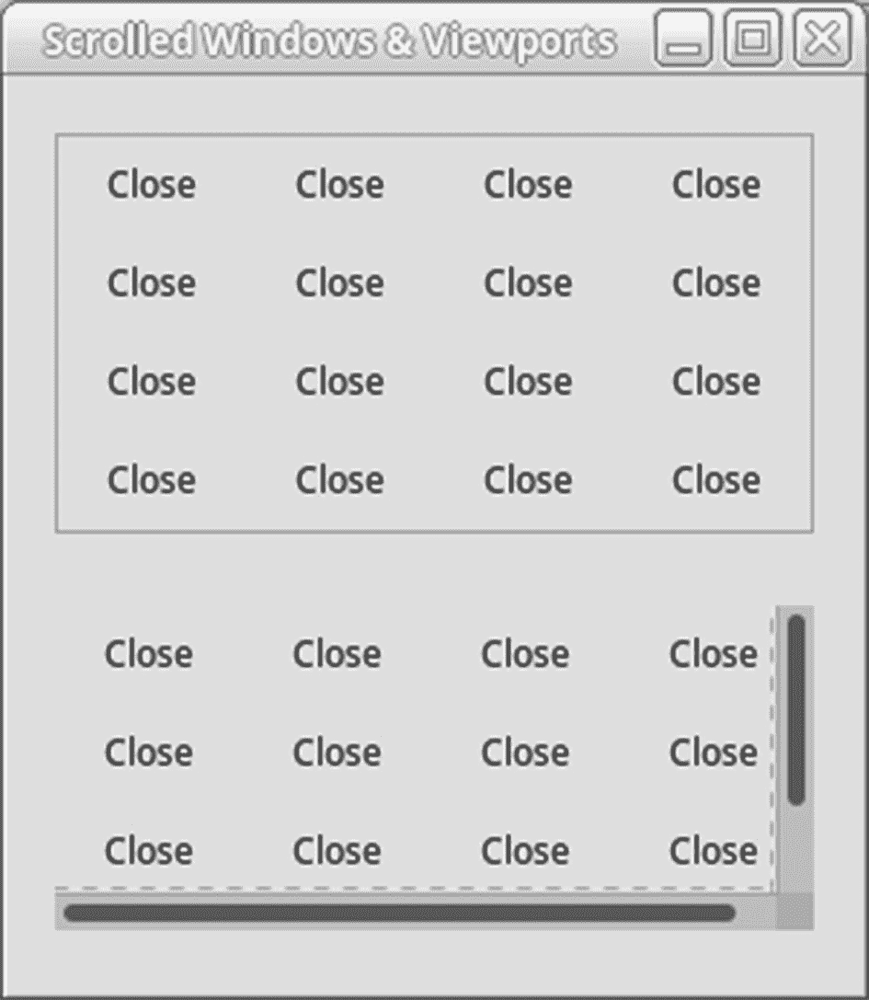
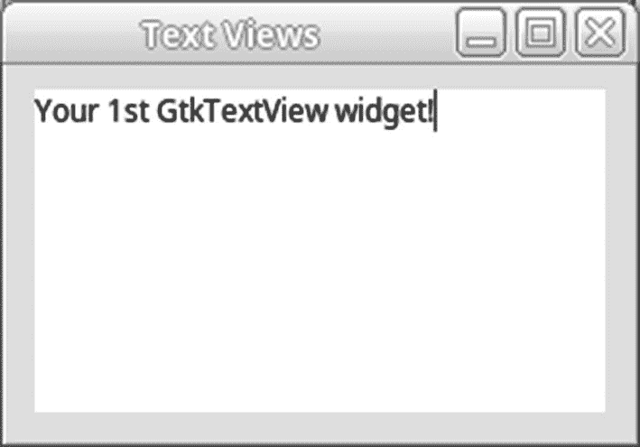
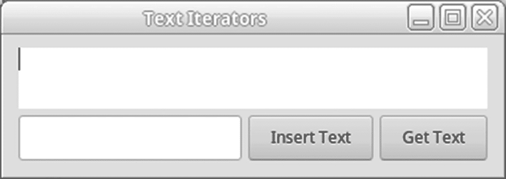
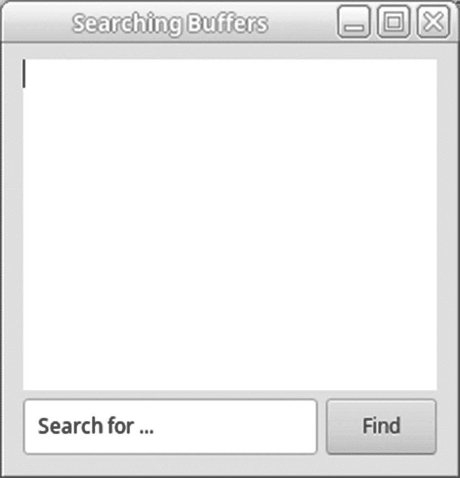

# 八、文本视图小部件

本章教你如何使用`Gtk.TextView`小工具。文本视图小部件类似于`Gtk.Entry`小部件，只是它能够保存跨越多行的文本。滚动窗口允许文档存在于屏幕边界之外。

在学习`Gtk.TextView`之前，本章首先介绍几个新的小部件。前两个小部件是滚动窗口和视口。滚动窗口由两个滚动子部件的滚动条组成。一些小工具已经支持滚动，包括`Gtk.Layout`、`Gtk.TreeView`和`Gtk.TextView`。对于您想要滚动的所有其他小部件，您需要首先将它们添加到一个`Gtk.Viewport`小部件中，这将为其子小部件提供滚动能力。

在本章中，您将学习以下内容:

*   如何使用滚动窗口和视窗

*   如何使用`Gtk.TextView`小部件和应用文本缓冲区

*   文本迭代器和文本标记在处理缓冲区时执行的功能

*   将样式应用于整个或部分文档的方法

*   如何在剪贴板上剪切、复制和粘贴

*   如何在文本视图中插入图像和子部件

## 滚动窗口

在了解`Gtk.TextView`小部件之前，您需要了解两个名为`Gtk.ScrolledWindow`和`Gtk.Viewport`的容器小部件。滚动窗口使用两个滚动条来允许小部件占据比屏幕上可见的空间更多的空间。这个小部件允许`Gtk.TextView`小部件包含超出窗口边界的文档。

滚动窗口中的两个滚动条都有关联的`Gtk.Adjustment`对象。这些调整跟踪滚动条的当前位置和范围；但是，在大多数情况下，您不需要直接访问调整。

滚动条的`Gtk.Adjustment`保存了关于滚动范围、步数和当前位置的信息。value 变量是滚动条在边界之间的当前位置。此变量必须始终介于下限值和上限值之间，这是校正的界限。`page_size`是屏幕上一次可以看到的区域，取决于小工具的大小。`step_increment`和`page_increment`变量用于按下箭头或向下翻页键时的步进。

图 [8-1](#Fig1) 是用清单 [8-1](#PC1) 中的代码创建的窗口截图。两个滚动条都被启用，因为包含按钮的表格比可见区域大。



图 8-1

同步滚动窗口和视窗

清单 [8-1](#PC1) 显示了如何使用滚动窗口和视窗。滚动条移动时，视口也会滚动，因为调整是同步的。尝试调整窗口的大小，看看滚动条在变得比子窗口小部件更大和更小时会有什么反应。

```py
#!/usr/bin/python3
import sys
import gi
gi.require_version('Gtk', '3.0')
from gi.repository import Gtk
class AppWindow(Gtk.ApplicationWindow):
    def __init__(self, *args, **kwargs):
        super().__init__(*args, **kwargs)
        self.set_border_width(10)
        grid1 = Gtk.Grid.new()
        grid2 = Gtk.Grid.new()
        grid1.set_column_homogeneous = True
        grid2.set_column_homogeneous = True
        grid1.set_row_homogeneous = True
        grid2.set_row_homogeneous = True
        grid1.set_column_spacing = 5
        grid2.set_column_spacing = 5
        grid1.set_row_spacing = 5
        grid2.set_row_spacing = 5
        i = 0
        while i < 10:
            j = 0
            while j < 10:
                button = Gtk.Button.new_with_label("Close")
                button.set_relief(Gtk.ReliefStyle.NONE)
                button.connect("clicked", self.on_button_clicked)
                grid1.attach(button, i, j, 1, 1)
                button = Gtk.Button.new_with_label("Close")
                button.set_relief(Gtk.ReliefStyle.NONE)
                button.connect("clicked", self.on_button_clicked)
                grid2.attach(button, i, j, 1, 1)
                j += 1
            i += 1
        swin = Gtk.ScrolledWindow.new(None, None)
        horizontal = swin.get_hadjustment()
        vertical = swin.get_vadjustment()
        viewport = Gtk.Viewport.new(horizontal, vertical)
        swin.set_border_width(5)
        swin.set_propagate_natural_width(True)
        swin.set_propagate_natural_height(True)
        viewport.set_border_width(5)
        swin.set_policy (Gtk.PolicyType.AUTOMATIC, Gtk.PolicyType.AUTOMATIC)
        swin.add_with_viewport(grid1)
        viewport.add(grid2)
        vbox = Gtk.Box.new(Gtk.Orientation.VERTICAL, 5)
        vbox.set_homogeneous = True
        vbox.pack_start(viewport, True, True, 5)
        vbox.pack_start(swin, True, True, 5)
        self.add (vbox)
        self.show_all()
    def on_button_clicked(self, button):
        self.destroy()
class Application(Gtk.Application):
    def __init__(self, *args, **kwargs):
        super().__init__(*args, application_id="org.example.myapp",
                         **kwargs)
        self.window = None
    def do_activate(self):
        if not self.window:
        self.window = AppWindow(application=self,
               title="Scrolled Windows & Viewports")
        self.window.show_all()
        self.window.present()
    if __name__ == "__main__":
        app = Application()
        app.run(sys.argv)

Listing 8-1Using Scrolled Windows

```

新滚动的窗口用`Gtk.ScrolledWindow.new()`创建。在清单 [8-1](#PC1) 中，每个参数都被设置为`None`，这使得滚动窗口为您创建两个默认调整。在大多数情况下，您希望使用默认调整，但是也可以为滚动条指定您自己的水平和垂直调整。

当用`Gtk.Viewport.new()`创建新视区时，使用本例中的调整。视口调整用滚动窗口中的调整初始化，这确保了两个容器同时滚动。

当你设置一个可滚动的窗口时，你需要做的第一个决定是滚动条何时可见。在这个例子中，`Gtk.PolicyType.AUTOMATIC`被用于两个滚动条，所以只有在需要的时候才显示。`Gtk.PolicyType.ALWAYS`是两个滚动条的默认策略。下面是由`Gtk.PolicyType`提供的三个枚举值。

*   滚动条总是可见的。如果不能滚动，它将显示为禁用或灰色。

*   `Gtk.PolicyType.AUTOMATIC`:滚动条只有在可以滚动时才可见。如果不需要，滚动条会暂时消失。

*   `Gtk.PolicyType.NEVER`:滚动条从不显示。

另一个属性是滚动条的位置，虽然没有被很多应用使用。在大多数应用中，您希望滚动条出现在小部件的底部和右侧，这是默认功能。

但是，如果你想改变这一点，你可以调用`set_placement()`。这个函数接收一个`Gtk.CornerType`值，它定义了内容相对于滚动条的位置。例如，默认值是`Gtk.CornerType.TOP_LEFT`，因为内容通常出现在滚动条的左上方。

```py
swin.set_placement(window_placement)

```

可用的`Gtk.CornerType`值包括`Gtk.CornerType.TOP_LEFT`、`Gtk.CornerType.BOTTOM_LEFT`、`Gtk.CornerType.TOP_RIGHT`和`Gtk.CornerType.BOTTOM_RIGHT`，它们定义了内容相对于滚动条的位置。

### 警告

应该使用`set_placement()`的场合非常少见！在几乎所有可能的情况下，你都不应该使用这个函数，因为它会让用户感到困惑。除非您有充分的理由更改位置，否则请使用默认值。

可以通过调用`set_shadow_type()`来设置小部件相对于子小部件的阴影类型。

```py
swin.set_shadow_type(type)

```

在第 [4](04.html) 章中，你学习了如何使用`Gtk.ShadowType`枚举和句柄框来设置放置在子部件周围的边框类型。与之前相同的值设置了滚动窗口的阴影类型。

在你设置了一个滚动窗口之后，你应该添加一个子部件来使用它。有两种可能的方法可以做到这一点，方法的选择基于子部件的类型。如果您使用的是`Gtk.TextView`、`Gtk.TreeView`、`Gtk.IconView`、`Gtk.Viewport`或`Gtk.Layout`小部件，您应该使用默认的`add()`方法，因为这五个小部件都包含本地滚动支持。

所有其他 GTK+小部件都没有本地滚动支持。对于那些小部件，应该使用`add_with_viewport()`。这个函数通过首先将它打包到一个名为`Gtk.Viewport`的容器小部件中，为子控件提供滚动支持。这个小部件为缺少自身支持的子小部件实现了滚动功能。然后视口被自动添加到滚动窗口中。

### 警告

千万不要将`Gtk.TextView`、`Gtk.TreeView`、`Gtk.IconView`、`Gtk.Viewport`或`Gtk.Layout`小部件打包到带有`add_with_viewport()`的滚动窗口中，因为小部件上的滚动可能无法正确执行！

可以手动将一个小部件添加到一个新的`Gtk.Viewport`，然后用`add()`将该视窗添加到一个滚动窗口，但是便利功能允许您完全忽略该视窗。

滚动窗口只是一个带有滚动条的容器。容器和滚动条本身都不执行任何操作。滚动是由子部件处理的，这就是为什么子部件必须已经有本地滚动支持才能正确使用`Gtk.ScrolledWindow`部件。

当您添加一个支持滚动的子部件时，会调用一个函数来为每个轴添加调整。除非子部件支持滚动，否则什么也不做，这就是为什么大多数部件都需要一个视口。当用户单击并拖动滚动条时，调整中的值会发生变化，这会导致发出值已更改的信号。此操作还会导致子小部件相应地呈现自身。

因为`Gtk.Viewport`小部件没有自己的滚动条，它完全依靠调整来定义它在屏幕上的当前位置。滚动条在`Gtk.ScrolledWindow`小部件中用作调整当前调整值的简单机制。

## 文本视图

`Gtk.TextView`小部件显示文档的多行文本。它提供了多种方式来定制整个文档或文档的单个部分。甚至可以将`GdkPixbuf`对象和子部件插入到文档中。`Gtk.TextView`是到目前为止您遇到的第一个合理涉及的小部件，所以本章的其余部分将致力于小部件的许多方面。这是一个非常通用的小部件，您需要在许多 GTK+应用中使用。

本章的前几个例子可能会让你认为`Gtk.TextView`只能显示简单的文档，但事实并非如此。它还可以显示各种应用使用的多种类型的富文本、文字处理和交互式文档。您将在接下来的章节中学习如何做到这一点。

图 [8-2](#Fig2) 向您介绍了一个简单的文本视图窗口，允许您输入文本并进行一些基本的布局设计。但是它也没有太多的功能，而且缺少许多文字处理器的功能。



图 8-2

Gtk.TextView widget

使用 GTK+的每一种文本和文档编辑应用中都使用文本视图。如果您曾经使用过 AbiWord、gedit 或其他大多数为 GNOME 创建的文本编辑器，那么您一定使用过`Gtk.TextView`小部件。它还用于即时消息窗口中的 Gaim 应用。(实际上，本书中的所有例子都是在 OpenLDev 应用中创建的，该应用使用`Gtk.TextView`进行源代码编辑！)

### 文本缓冲区

每个文本视图显示一个名为`Gtk.TextBuffer`的类的内容。文本缓冲区存储文本视图中内容的当前状态。它们保存文本、图像、子部件、文本标签以及呈现文档所需的所有其他信息。

单个文本缓冲区能够由多个文本视图显示，但是每个文本视图只有一个关联的缓冲区。大多数程序员没有利用这个特性，但是当您在后面的章节中学习如何将子部件嵌入到文本缓冲区时，这个特性就变得很重要了。

与 GTK+中的所有文本小部件一样，文本被存储为 UTF-8 字符串。UTF-8 是一种字符编码类型，每个字符使用 1 到 4 个字节。为了区分字符占用的字节数，“0”总是在 1 字节字符之前，“110”在 2 字节字符之前，“1110”在 3 字节序列之前，依此类推。跨越多个字节的 UTF-8 字符在其余字节的两个最高有效位中具有“10”。

通过这样做，仍然支持基本的 128 个 ASCII 字符，因为在初始“0”之后的单字节字符中还有另外 7 位可用。UTF-8 还为许多其他语言的字符提供支持。此方法还可避免在较大的字节序列中出现较小的字节序列。

在处理文本缓冲区时，需要知道两个术语:偏移量和索引。单词“偏移”指的是一个字符。UTF-8 字符可能跨越缓冲区中的一个或多个字节，因此`Gtk.TextBuffer`中的字符偏移量可能不是一个字节长。

### 警告

单词“索引”指的是一个单独的字节。在后面的示例中，当单步执行文本缓冲区时需要小心，因为不能引用两个字符偏移量之间的索引。

清单 [8-2](#PC4) 展示了一个你可以创建的最简单的文本视图例子。创建了一个新的`Gtk.TextView`小部件。检索其缓冲区，并将文本插入缓冲区。然后，滚动窗口包含文本视图。

```py
#!/usr/bin/python3
import sys
import gi
gi.require_version('Gtk', '3.0')
from gi.repository import Gtk
class AppWindow(Gtk.ApplicationWindow):
    def __init__(self, *args, **kwargs):
        super().__init__(*args, **kwargs)
        self.set_border_width(10)
        self.set_size_request(250, 150)
        textview = Gtk.TextView.new()
        buffer = textview.get_buffer()
        text = "Your 1st GtkTextView widget!"
        buffer.set_text(text, len(text))
        scrolled_win = Gtk.ScrolledWindow.new (None, None)
        scrolled_win.add(textview)
        self.add(scrolled_win)
class Application(Gtk.Application):
    def __init__(self, *args, **kwargs):
        super().__init__(*args, application_id="org.example.myapp",
                         **kwargs)
        self.window = None
    def do_activate(self):
        if not self.window:
            self.window = AppWindow(application=self, title="Text Views")
        self.window.show_all()
        self.window.present()
    if __name__ == "__main__":
        app = Application()
        app.run(sys.argv)

Listing 8-2A Simple Gtk.TextView Example

```

大多数新的`Gtk.TextView`小部件都是用`Gtk.TextView.new()`创建的。通过使用这个函数，可以为您创建一个空的缓冲区。该默认缓冲区稍后可以用`set_buffer()`替换或用`get_buffer()`检索。

如果您想将初始缓冲区设置为您已经创建的缓冲区，您可以使用`Gtk.TextView.new_with_buffer()`创建文本视图。在大多数情况下，简单地使用默认的文本缓冲区更容易。

一旦访问了一个`Gtk.TextBuffer`对象，有许多方法可以添加内容，但是最简单的方法是调用`set_text()`。这个函数接收一个文本缓冲区、一个设置为缓冲区新文本的 UTF-8 文本字符串以及文本的长度。

```py
set_text(text, length)

```

如果文本字符串以 NULL 结尾，则可以使用–1 作为字符串的长度。如果在指定长度的文本前发现空字符，此函数将自动失败。

缓冲区的当前内容被新的文本字符串完全替换。在“文本迭代器和标记”一节中，向您介绍了一些函数，这些函数允许您在不覆盖当前内容的情况下将文本插入到缓冲区中，这些函数更适合于插入大量文本。

回想一下上一节，有五个小部件具有本地滚动能力，包括`Gtk.TextView`小部件。因为文本视图已经有了管理调整的工具，`container.add()`应该总是将它们添加到滚动窗口中。

### 文本视图属性

`Gtk.TextView`是一个非常通用的小工具。因此，为小部件提供了许多属性。在本节中，您将了解这些小部件的许多属性。

让文本视图小部件非常有用的一个特性是，您可以将更改应用到整个小部件或仅应用到小部件的单个部分。文本标签改变一段文本的属性。仅自定义文档的一部分将在本章的后面部分介绍。

清单 [8-3](#PC6) 展示了许多可以定制`Gtk.TextBuffer`内容的属性。您应该注意到，这些属性中的许多可以在文档的单个部分中用文本标签覆盖。

```py
#!/usr/bin/python3
import sys
import gi
gi.require_version('Gtk', '3.0')
from gi.repository import Gtk, Pango
class AppWindow(Gtk.ApplicationWindow):
    def __init__(self, *args, **kwargs):
        super().__init__(*args, **kwargs)
        self.set_border_width(10)
        self.set_size_request(260, 150)
        font = Pango.font_description_from_string("Monospace Bold 10")
        textview = Gtk.TextView.new()
        textview.modify_font(font)
        textview.set_wrap_mode(Gtk.WrapMode.WORD)
        textview.set_justification(Gtk.Justification.RIGHT)
        textview.set_editable(True)
        textview.set_cursor_visible(True)
        textview.set_pixels_above_lines(5)
        textview.set_pixels_below_lines(5)
        textview.set_pixels_inside_wrap(5)
        textview.set_left_margin(10)
        textview.set_right_margin(10)
        buffer = textview.get_buffer()
        text = "This is some text!\nChange me!\nPlease!"
        buffer.set_text(text, len(text))
        scrolled_win = Gtk.ScrolledWindow.new(None, None)
        scrolled_win.set_policy(Gtk.PolicyType.AUTOMATIC,
                                Gtk.PolicyType.ALWAYS)
        scrolled_win.add(textview)
        self.add(scrolled_win)
class Application(Gtk.Application):
    def __init__(self, *args, **kwargs):
        super().__init__(*args, application_id="org.example.myapp",
                         **kwargs)
        self.window = None
    def do_activate(self):
        if not self.window:
            self.window = AppWindow(application=self,
                                    title="Text Views Properties")
        self.window.show_all()
        self.window.present()
    if __name__ == "__main__":
        app = Application()
        app.run(sys.argv)

Listing 8-3Using Gtk.TextView Properties

```

解释`Gtk.TextView`的每个属性做什么的最好方式是给你看一个结果的截图，可以在图 [8-3](#Fig3) 中看到。你应该在你自己的机器上编译这个应用，并试着改变清单 [8-3](#PC6) 中使用的值，感受一下它们的作用。


图 8-3

Gtk。具有非默认属性的 TextView

可以改变文本视图内容的单个部分的字体和颜色，但是如清单 [8-3](#PC6) 所示，仍然可以使用以前章节中的函数来改变整个小部件的内容。这在编辑具有一致样式的文档(如文本文件)时非常有用。

在处理多行显示文本的小部件时，您需要决定文本是否换行以及如何换行。在清单 [8-3](#PC6) 中，使用`set_wrap_mode()`将包装模式设置为`Gtk.WrapMode.WORD`。此设置使文本换行，但不会将一个单词拆分为两行。在`Gtk.WrapMode`枚举中有四种类型的回绕模式。

*   `Gtk.WrapMode.NONE`:不发生缠绕。如果滚动窗口包含视图，则滚动条会扩展；否则，文本视图会在屏幕上展开。如果滚动窗口不包含`Gtk.TextView`小部件，它会水平扩展小部件。

*   `Gtk.WrapMode.CHAR`:换行到字符，即使换行点出现在单词中间。对于文本编辑器来说，这通常不是一个好的选择，因为它将单词分成两行。

*   用尽可能多的单词填满一行，但不要换行。相反，把整个单词放到下一行。

*   `Gtk.WrapMode.WORD_CHAR`:换行方式与 GTK_WRAP_WORD 相同，但如果整个单词占据文本视图的一个以上可视宽度，则按字符换行。

有时，您可能希望阻止用户编辑文档。使用`set_editable()`可以更改整个文本视图的可编辑属性。值得注意的是，使用文本标签，您可以为文档的某些部分覆盖`set_editable()`,因此它并不总是万能的解决方案。

与`set_sensitive()`形成对比，它完全阻止用户与小部件交互。如果文本视图被设置为不可编辑，用户仍然能够对文本执行不需要编辑文本缓冲区的操作，例如选择文本。将文本视图设置为不敏感会阻止用户执行任何这些操作。

当您禁用文档内的编辑时，使用`set_cursor_visible()`阻止光标可见也很有用。默认情况下，这两个属性都被设置为`True`，因此需要对它们进行更改以保持同步。

默认情况下，行与行之间没有额外的间距，但是清单 [8-3](#PC6) 向您展示了如何在一行之上、一行之下以及换行之间添加间距。这些函数增加了行与行之间的额外空间，所以你可以假设行与行之间已经有足够的空间了。在大多数情况下，您不应该使用此功能，因为间距对用户来说可能不正确。

对齐是文本视图的另一个重要属性，尤其是在处理富文本文档时。有四个默认对齐值:`Gtk.Justification.LEFT`、`Gtk.Justification.RIGHT`、`Gtk.Justification.CENTER`和`Gtk.Justification.FILL`。

可以使用`set_justification()`为整个文本视图设置对齐，但是可以使用文本标签覆盖文本的特定部分。在大多数情况下，您希望使用默认的`Gtk.Justification.LEFT`对齐，除非用户希望更改它。默认情况下，文本在视图的左侧对齐。

```py
textview.set_justification(justification)

```

清单 [8-3](#PC6) 最后设置的属性是左边距和右边距。默认情况下，左侧或右侧都不会添加额外的空白空间，但是您可以使用`set_left_margin()`向左侧或使用`set_right_margin()`向右侧添加一定数量的像素。

### Pango Tab 阵列

添加到文本视图中的制表符被设置为默认宽度，但有时您想要更改该宽度。例如，在源代码编辑器中，一个用户可能希望缩进两个空格，而另一个用户可能希望缩进五个空格。GTK+提供了`Pango.TabArray`对象，它定义了一个新的标签尺寸。

当更改默认制表符大小时，首先根据当前字体计算制表符所占的水平像素数。下面的`make_tab_array()`函数可以计算一个新的标签尺寸。该函数首先用所需数量的空格创建一个字符串。该字符串然后被转换成一个`Pango.Layout`对象，该对象检索显示字符串的像素宽度。最后，`Pango.Layout`被翻译成`Pango.TabArray`，它可以应用于文本视图。

```py
def make_tab_array(fontdesc, tab_size, textview):
    if tab_size < 100:
        return
    tab_string = ' ' * tab_size
    layout = Gtk.Widget.create_pango_layout(textview, tab_string)
    layout.set_font_description(fontdesc)
    (width, height) = layout.get_pixel_size()
    tab_array = Pango.TabArray.new(1, True)
    tab_array.set_tab(0, Pango.TabAlign.LEFT, width)
    textview.set_tabs(tab_array)

```

`Pango.Layout`对象代表一整段文本。通常，Pango 在内部使用它来在小部件中布局文本。但是，本示例可以使用它来计算制表符串的宽度。

我们首先从`Gtk.TextView`创建一个新的`Pango.Layout`对象，并用`Gtk.Widget.create_pango_layout()`创建标签字符串。这使用文本视图的默认字体描述。如果整个文档都应用了相同的字体，这是没有问题的。`Pango.Layout`描述如何渲染一段文字。

```py
layout = Gtk.Widget.create_pango_layout(textview, tab_string)

```

如果文档中的字体不同，或者字体尚未应用于文本视图，则需要指定用于计算的字体。您可以使用`set_font_description()`设置`Pango.Layout`的字体。这使用了一个`Pango.FontDescription`对象来描述布局的字体。

```py
layout.set_font_description(fd)

```

一旦你正确地配置了你的`Pango.Layout`，字符串的宽度可以用`get_pixel_size()`来检索。这是字符串在缓冲区中占用的计算空间，当用户在小部件中按下**选项卡**键时，应该添加这个空间。

```py
(width, height) = layout.get_pixel_size()

```

现在您已经获得了选项卡的宽度，您需要用`Pango.TabArray.new()`创建一个新的`Pango.TabArray`。该函数接收应该添加到数组中的元素数量，以及每个元素的大小是否以像素为单位的通知。

```py
tab_array = Pango.TabArray.new(1, True)

```

您应该始终创建只包含一个元素的 tab 数组，因为此时只支持一种 tab 类型。如果第二个参数没有指定`True`,则制表符被存储为 Pango 单位；1 个像素等于 1，024 个 Pango 单位。

在应用 tab 数组之前，您需要添加宽度。这是用`set_tab()`完成的。整数“0”指的是`Pango.TabArray`中的第一个元素，唯一应该存在的元素。`Pango.TabAlign.LEFT`必须始终为第二个参数指定，因为它是当前唯一支持的值。最后一个参数是选项卡的宽度，以像素为单位。

```py
tab_array.set_tab(0, Pango.TabAlign.LEFT, width)

```

当您从函数接收到 tab 数组时，您需要用`set_tab()`将它应用到整个文本视图。这可以确保文本视图中的所有选项卡都设置为相同的宽度。但是，与所有其他文本视图属性一样，该值可以被文本的单个段落或部分覆盖。

```py
textview.set_tabs(tab_array)

```

## 文本迭代器和标记

当操作`Gtk.TextBuffer`中的文本时，有两个对象可以跟踪缓冲区中的位置:`Gtk.TextIter`和`Gtk.TextMark`。GTK +提供了在这两种类型的对象之间进行转换的函数。

文本迭代器表示缓冲区中两个字符之间的位置。在缓冲区内操作文本时会用到它们。文本迭代器带来的问题是，当编辑文本缓冲区时，它们会自动失效。即使插入了相同的文本，然后又从缓冲区中删除，文本迭代器也会失效，因为迭代器应该在堆栈中分配并立即使用。

为了跟踪文本缓冲区中的位置变化，提供了`Gtk.TextMark`对象。操纵缓冲区时，文本标记保持不变，并根据缓冲区的操纵方式移动它们的位置。您可以使用`get_iter_at_mark()`检索指向文本标记的迭代器，这使得标记非常适合跟踪文档中的位置。

```py
get_iter_at_mark(iter, mark)

```

文本标记就像是文本中不可见的光标，根据文本的编辑方式改变位置。如果在标记前添加文本，它将向右移动，以便保持在相同的文本位置。

默认情况下，文本标记的重力设置为向右。这意味着它会随着文本的添加而向右移动。让我们假设标记周围的文本被删除。标记移动到被删除文本两侧的两段文本之间的位置。然后，如果在文本标记处插入文本，由于其右侧的重力设置，它将保持在插入文本的右侧。这类似于光标，因为当插入文本时，光标保持在插入文本的右侧。

### 小费

默认情况下，文本中的文本标记是不可见的。但是，您可以通过调用`set_visible()`将`Gtk.TextMark`设置为可见，这将放置一个竖线来指示它所在的位置。

可以通过两种方式访问文本标记。您可以在特定的`Gtk.TextIter`位置检索文本标记。还可以用字符串作为名称来设置文本标记，这使得标记易于跟踪。

GTK+总是为每个`Gtk.TextBuffer` : `insert`和`selection_bound`提供两个默认文本标记。插入文本标记指的是光标在缓冲区中的当前位置。`selection_bound`文本标记是指如果有选中文本，则选中文本的边界。如果没有选择文本，这两个标记指向相同的位置。

操作缓冲区时，`"insert"`和`"selection_bound"`文本标记非常有用。可以操纵它们来自动选择或取消选择缓冲区中的文本，并帮助您确定文本在缓冲区中的逻辑插入位置。

### 编辑文本缓冲区

GTK+提供了大量检索文本迭代器和操作文本缓冲区的函数。在这一节中，您将看到清单 [8-4](#PC16) 中使用的一些最重要的方法，然后还会向您介绍更多方法。图 [8-4](#Fig4) 显示了一个用`Gtk.TextBuffer`插入和检索文本的应用。



图 8-4

使用 Gtk 的应用。TextView widget

清单 [8-4](#PC16) 是一个执行两个功能的简单例子。当点击图 [8-4](#Fig4) 所示的插入文本按钮时，在当前光标位置插入`Gtk.Entry`小工具中显示的字符串。当点击“获取文本”按钮时，任何选定的文本都将通过`print()`输出。

```py
#!/usr/bin/python3
import sys
import gi
gi.require_version('Gtk', '3.0')
from gi.repository import Gtk
class AppWindow(Gtk.ApplicationWindow):
    def __init__(self, *args, **kwargs):
        super().__init__(*args, **kwargs)
        self.set_border_width(10)
        self.set_size_request(-1, -1)
        textview = Gtk.TextView.new()
        entry = Gtk.Entry.new()
        insert_button = Gtk.Button.new_with_label("Insert Text")
        retrieve = Gtk.Button.new_with_label("Get Text")
        insert_button.connect("clicked", self.on_insert_text, (entry, textview))
        retrieve.connect("clicked", self.on_retrieve_text, (entry, textview))
        scrolled_win = Gtk.ScrolledWindow.new(None, None)
        scrolled_win.add(textview)
        hbox = Gtk.Box.new(Gtk.Orientation.HORIZONTAL, 5)
        hbox.pack_start(entry, True, True, 0)
        hbox.pack_start(insert_button, True, True, 0)
        hbox.pack_start(retrieve, True, True, 0)
        vbox = Gtk.Box.new(Gtk.Orientation.VERTICAL, 5)
        vbox.pack_start(scrolled_win, True, True, 0)
        vbox.pack_start(hbox, True, True, 0)
        self.add(vbox)
        self.show_all()
    def on_insert_text(self, button, w):
        buffer = w[1].get_buffer()
        text = w[0].get_text()
        mark = buffer.get_insert()
        iter = buffer.get_iter_at_mark(mark)
        buffer.insert(iter, text, len(text))
    def on_retrieve_text(self, button, w):
        buffer = w[1].get_buffer()
        (start, end) = buffer.get_selection_bounds()
        text = buffer.get_text(start, end, False)
        print(text)
class Application(Gtk.Application):
    def __init__(self, *args, **kwargs):
        super().__init__(*args, application_id="org.example.myapp",
                         **kwargs)
        self.window = None
    def do_activate(self):
        if not self.window:
            self.window = AppWindow(application=self, title="Text Iterators")
        self.window.show_all()
        self.window.present()
    if __name__ == "__main__":
        app = Application()
        app.run(sys.argv)

Listing 8-4Using Text Iterators

```

迭代器的一个重要特性是同一个迭代器可以重复使用，因为每次编辑文本缓冲区时迭代器都会失效。这样，您可以继续重用同一个`Gtk.TextIter`对象，而不是创建大量的变量。

### 检索文本迭代器和标记

如前所述，有相当多的函数可用于检索文本迭代器和文本标记，其中许多函数在本章中都会用到。

清单 [8-4](#PC16) 从用`buffer.get_insert()`检索插入标记开始。也可以使用`buffer.get_selection_bound()`来检索“selection_bound”文本标记。

```py
mark = buffer.get_insert()
iter = buffer.get_iter_at_mark(mark)

```

一旦你获得了一个标记，你可以用`textbuffer.get_iter_at_mark()`把它翻译成一个文本迭代器，这样它就可以操作缓冲区。

清单 [8-4](#PC16) 给出的另一个检索文本迭代器的函数是`buffer.get_selection_bounds()`，它返回位于 insert 和 selection_bound 标记处的迭代器。您可以将一个或两个文本迭代器参数设置为`None`，这可以防止值返回，尽管如果您只需要其中一个，那么使用特定标记的函数会更有意义。

当检索缓冲区的内容时，您需要为文本片段指定一个开始和结束迭代器。如果想得到文档的全部内容，需要指向文档开头和结尾的迭代器，可以用`buffer.get_bounds()`检索。

```py
buffer.get_bounds(start, end)

```

也可以用`buffer.get_start_iter()`或`buffer.get_end_iter()`独立地检索文本缓冲区的开始或结束迭代器。

可以用`buffer.get_text()`检索缓冲区内的文本。它返回起始迭代器和结束迭代器之间的所有文本。如果最后一个参数设置为`True`，那么也返回不可见文本。

```py
buffer.get_text(start, end, boolean)

```

### 警告

你应该只使用`buffer.get_text()`来获取一个缓冲区的全部内容。它会忽略文本缓冲区中嵌入的任何图像或小部件对象，因此字符索引可能不会对应到正确的位置。对于检索文本缓冲区的单个部分，使用`buffer.get_slice()`代替。

回想一下，偏移量指的是缓冲区中单个字符的数量。这些字符可以是一个或多个字节长。`buffer.get_iter_at_offset()`函数允许您在从缓冲区开始的特定偏移位置检索迭代器。

```py
buffer.get_iter_at_offset(iter, character_offset)

```

GTK+还提供了`buffer.get_iter_at_line_index()`，它选择一个单独的字节在指定行上的位置。使用这个函数时应该非常小心，因为索引必须始终指向 UTF-8 字符的开头。请记住，UTF-8 中的字符可能不仅仅是一个字节！

您可以用`buffer.get_iter_at_line()`检索指定行上的第一个迭代器，而不是选择字符偏移量。

```py
buffer.get_iter_at_line(iter, character_offset)

```

如果您想从特定行的第一个字符的偏移量处检索迭代器，`buffer.get_iter_at_line_offset()`就可以做到这一点。

### 更改文本缓冲区内容

您已经学习了如何重置整个文本缓冲区的内容，但是只编辑文档的一部分也很有用。为此提供了许多功能。清单 [8-4](#PC16) 向您展示了如何将文本插入到缓冲区中。

如果需要在缓冲区的任意位置插入文本，应该使用`buffer.insert()`。为此，您需要一个指向插入点的`Gtk.TextIter`、要插入缓冲区的文本字符串(必须是 UTF-8)和文本长度。

```py
buffer.get_insert()

```

当调用这个函数时，文本缓冲区发出 insert-text 信号，文本迭代器失效。但是，文本迭代器会被重新初始化到插入文本的末尾。

一个名为`insert_at_cursor()`的方便方法可以在光标当前位置调用`buffer.insert()`。这可以很容易地通过使用插入文本标记来实现，但是它可以帮助您避免重复调用。

```py
buffer.insert_at_cursor(text, length)

```

可以用`gtk_text_buffer_delete()`删除两个文本迭代器之间的文本。指定迭代器的顺序无关紧要，因为方法会自动将它们按正确的顺序放置。

```py
buffer.delete(start, end)

```

这个函数发出`"delete-range"`信号，两个迭代器都失效了。然而，*开始*和*结束*迭代器都被重新初始化到被删除文本的开始位置。

### 剪切、复制和粘贴文本

图 [8-5](#Fig5) 显示了一个带有输入字段和按钮的文本视图，可以通过文本视图对象访问剪贴板功能。


图 8-5

Gtk.文本查看剪贴板按钮

三个剪贴板选项是剪切、复制和粘贴，这是几乎所有文本编辑器的标准选项。它们内置于每个`Gtk.TextView`小工具中。但是，有时您希望实现这些功能的自己版本，以包含在应用菜单或工具栏中。

清单 [8-5](#PC25) 给出了每种方法的例子。当点击三个`Gtk.Button`部件中的一个时，一些动作被初始化。尝试使用按钮和右键菜单来显示两者使用相同的`Gtk.Clipboard`对象。这些函数也可以使用内置的键盘快捷键调用，分别是 **Ctrl+C** ，Ctrl+X，Ctrl+V

```py
#!/usr/bin/python3
import sys
import gi
gi.require_version('Gtk', '3.0')
from gi.repository import Gtk, Gdk
class AppWindow(Gtk.ApplicationWindow):
    def __init__(self, *args, **kwargs):
        super().__init__(*args, **kwargs)
        self.set_border_width(10)
        textview = Gtk.TextView.new()
        cut = Gtk.Button.new_with_label("Cut")
        copy = Gtk.Button.new_with_label("Copy")
        paste = Gtk.Button.new_with_label("Paste")
        cut.connect("clicked", self.on_cut_clicked, textview)
        copy.connect("clicked", self.on_copy_clicked, textview)
        paste.connect("clicked", self.on_paste_clicked, textview)
        scrolled_win = Gtk.ScrolledWindow.new(None, None)
        scrolled_win.set_size_request(300, 200)
        scrolled_win.add(textview)
        hbox = Gtk.Box.new(Gtk.Orientation.HORIZONTAL, 5)
        hbox.pack_start(cut, True, True, 0)
        hbox.pack_start(copy, True, True, 0)
        hbox.pack_start(paste, True, True, 0)
        vbox = Gtk.Box.new(Gtk.Orientation.VERTICAL, 5)
        vbox.pack_start(scrolled_win, True, True, 0)
        vbox.pack_start(hbox, True, True, 0)
        self.add(vbox)
    def on_cut_clicked(self, button, textview):
        clipboard = Gtk.Clipboard.get(Gdk.Atom.intern("CLIPBOARD", False))
        buffer = textview.get_buffer()
        buffer.cut_clipboard(clipboard, True)
    def on_copy_clicked(self, button, textview):
        clipboard = Gtk.Clipboard.get(Gdk.Atom.intern("CLIPBOARD", False))
        buffer = textview.get_buffer()
        buffer.copy_clipboard(clipboard)
    def on_paste_clicked(self, button, textview):
    clipboard = Gtk.Clipboard.get(Gdk.Atom.intern("CLIPBOARD", False))
        buffer = textview.get_buffer()
        buffer.paste_clipboard (clipboard, None, True)
class Application(Gtk.Application):
    def __init__(self, *args, **kwargs):
        super().__init__(*args, application_id="org.example.myapp",
                         **kwargs)
        self.window = None
    def do_activate(self):
        if not self.window:
            self.window = AppWindow(application=self, title="Cut, Copy & Paste")
        self.window.show_all()
        self.window.present()
    if __name__ == "__main__":
        app = Application()
        app.run(sys.argv)

Listing 8-5Using Text Iterators

```

`Gtk.Clipboard`是一个中心类，数据可以很容易地在应用之间传输。要检索已经创建的剪贴板，您应该使用`clipboard.get()`。GTK+ 3.x 只提供了一个默认的剪贴板。GTK+ 2.x 提供了命名的剪贴板，但是不再支持该功能。

### 注意

虽然可以创建自己的`Gtk.Clipboard`对象，但是在执行基本任务时，应该使用默认的剪贴板。您可以通过执行方法`Gdk.Atom.intern("CLIPBOARD", False)`到`Gtk.Clipboard.get()`来检索它。

可以直接与您已经创建的`Gtk.Clipboard`对象交互，从其中添加和删除数据。然而，当执行简单的任务时，包括为`Gtk.TextView`小部件复制和检索文本字符串，使用`Gtk.TextBuffer`的内置方法更有意义。

`Gtk.TextBuffer`的三个剪贴板动作中最简单的一个是复制文本，可以通过以下方式完成:

```py
buffer.copy_clipboard(clipboard)

```

第二个剪贴板函数，`buffer.cut_clipboard(clipboard, True)`将选择复制到剪贴板并从缓冲区中移除。如果任何选定的文本没有设置可编辑标志，它将被设置为此函数的第三个参数。该函数不仅复制文本，还复制嵌入的对象，如图像和文本标签。

```py
buffer.cut_clipboard(clipboard, True)

```

最后一个剪贴板功能，`buffer.paste_clipboard()`首先检索剪贴板的内容。接下来，该函数做两件事情中的一件。如果已经指定了接受一个`Gtk.TextIter`的第二个参数，那么内容将被插入到该迭代器的位置。如果您为第三个参数指定`None`，内容将插入光标处。

```py
buffer.paste_clipboard (clipboard, None, True)

```

如果任何要粘贴的内容没有设置可编辑标志，则它会自动设置为`default_editable`。大多数情况下，您希望将此参数设置为`True`，因为它允许编辑粘贴的内容。您还应该注意，粘贴操作是异步的。

### 搜索文本缓冲区

在大多数使用`Gtk.TextView`小部件的应用中，您需要在一个或多个实例中搜索文本缓冲区。GTK+提供了两个在缓冲区中查找文本的函数:`forward_search()`和`backward_search()`。

以下示例向您展示了如何使用这些函数中的第一个函数在`Gtk.TextBuffer`中搜索文本字符串；示例截图如图 [8-6](#Fig6) 所示。当用户单击“查找”按钮时，该示例开始。



图 8-6

搜索文本缓冲区的应用

清单 [8-6](#PC29) 中的应用在文本缓冲区中搜索指定字符串的所有实例。向用户显示一个对话框，显示该字符串在文档中被找到的次数。

```py
#!/usr/bin/python3
import sys
import gi
gi.require_version('Gtk', '3.0')
from gi.repository import Gtk, Gdk
class AppWindow(Gtk.ApplicationWindow):
    def __init__(self, *args, **kwargs):
        super().__init__(*args, **kwargs)
        self.set_border_width(10)
        textview = Gtk.TextView.new()
        entry = Gtk.Entry.new()
        entry.set_text("Search for ...")
        find = Gtk.Button.new_with_label("Find")
        find.connect("clicked", self.on_find_clicked, (textview, entry))
        scrolled_win = Gtk.ScrolledWindow.new (None, None)
        scrolled_win.set_size_request(250, 200)
        scrolled_win.add(textview)
        hbox = Gtk.Box.new(Gtk.Orientation.HORIZONTAL, 5)
        hbox.pack_start(entry, True, True, 0)
        hbox.pack_start(find, True, True, 0)
        vbox = Gtk.Box.new(Gtk.Orientation.VERTICAL, 5)
        vbox.pack_start(scrolled_win, True, True, 0)
        vbox.pack_start(hbox, True, True, 0)
        self.add(vbox)
    def on_find_clicked(self, button, w):
        find = w[1].get_text()
        find_len = len(find)
        buffer = w[0].get_buffer()
        start = buffer.get_start_iter()
        end_itr = buffer.get_end_iter()
        i = 0
        while True:
            end = start.copy()
            end.forward_chars(find_len)
            text = buffer.get_text(start, end, False)
            if text == find:
                i += 1
                start.forward_chars(find_len)
            else:
                start.forward_char()
            if end.compare(end_itr) == 0:
                break
                output = "The string '"+find+"' was found " + str(i) + " times!"
                dialog = Gtk.MessageDialog(parent=self,
                                        flags=Gtk.DialogFlags.MODAL,
                                        message_type=Gtk.MessageType.INFO,
                                        text=output, title="Information",
                                        buttons=("OK", Gtk.ResponseType.OK))
        dialog.run()
        dialog.destroy()
class Application(Gtk.Application):
    def __init__(self, *args, **kwargs):
        super().__init__(*args, application_id="org.example.myapp",
                         **kwargs)
        self.window = None
    def do_activate(self):
        if not self.window:
            self.window = AppWindow(application=self,
                                    title="Searching Buffers")
        self.window.show_all()
        self.window.present()
    if __name__ == "__main__":
        app = Application()
        app.run(sys.argv)

Listing 8-6Using The Gtk.TextIter Find Function

```

搜索函数需要做的第一件事是用`buffer.get_start_iter()`和`buffer.get_end_iter()`检索文档的搜索下限和上限。在后面的代码中，我们使用最终上限进行测试。

```py
end = start.copy()
end.forward_chars(find_len)

```

搜索循环通过设置 end `Gtk.TextIter`开始，然后增加搜索字符串的长度。这将创建一个与搜索字符串长度相等的缓冲区。

```py
text = buffer.get_text(start, end, False)

```

`buffer.get_text()`检索两个`Gtk.TextIter`之间的文本。第三个参数是一个布尔值，指定是只检索文本还是在文本中包含其他标记。

```py
if text == find:
    i += 1
    start.forward_chars(find_len)
else:
    start.forward_char()
if end.compare(end_itr) == 0:
    break

```

接下来，我们测试搜索字符串是否与缓冲区中的字符串匹配。如果找到一个匹配，那么我们增加我们的匹配计数器，并且将开始位置`Gtk.TextIter`移过我们在缓冲区中找到的字符串。如果没有找到匹配，那么开始`Gtk.TextIter`增加一个字符。最后，我们测试搜索上限`Gtk.TextIter`是否等于缓冲区的结尾，如果两者相等，我们就跳出无限循环。

在我们跳出循环之后，我们向用户报告搜索结果。

### 滚动文本缓冲区

GTK+不会自动滚动到您选择的搜索匹配项。为此，您需要首先调用`buffer.create_mark()`在找到文本的位置创建一个临时的`Gtk.TextMark`。

```py
buffer.create_mark(name, location, left_gravity)

```

`buffer.create_mark()`的第二个参数允许你指定一个文本字符串作为标记的名称。该名称可以在没有实际标记对象的情况下引用标记。在指定文本迭代器的位置创建标记。如果设置为`True`，最后一个参数创建一个左重力标记。

然后，使用`view.scroll_mark_onscreen()`滚动缓冲区，使标记出现在屏幕上。完成标记后，您可以使用`buffer.delete_mark()`将其从缓冲器中移除。

```py
textview.scroll_mark_onscreen(mark)

```

`view.scroll_mark_onscreen()`的问题是，它只滚动最小距离来显示屏幕上的标记。例如，您可能希望标记在缓冲区内居中。要指定标记在可见缓冲区中出现的位置的对准参数，调用`textview.scroll_to_mark()`。

```py
textview.scroll_to_mark(mark, margin, use_align, xalign, yalign)

```

首先放置一个页边空白，这样可以减少可滚动区域。边距必须指定为浮点数，以该系数缩小区域。在大多数情况下，您希望使用 0.0 作为边距，这样区域就不会缩小。

如果您为`use_align`参数指定`False`，该功能将滚动最小距离以在屏幕上显示标记；否则，该函数使用两个对齐参数作为指导，允许您在可见区域内指定标记的水平和垂直对齐。

0.0 的对齐指的是可视区域的左侧或顶部，1.0 指的是右侧或底部，0.5 指的是中心。该功能尽可能滚动，但可能无法将标记滚动到指定位置。例如，如果缓冲区大于一个字符高，就不可能将缓冲区中的最后一行滚动到顶部。

还有另一个函数`textview.scroll_to_iter()`，其行为方式与`textview.scroll_to_mark()`相同。唯一的区别是它接收一个`Gtk.TextIter`而不是一个`Gtk.TextMark`来表示位置，尽管在大多数情况下，你应该使用文本标记。

## 文本标签

提供了许多功能来改变一个`Gtk.TextBuffer`中所有文本的属性，这在前面的章节中已经介绍过了。但是，如前所述，也可以用`Gtk.TextTag`对象只改变单个文本部分的显示属性。

文本标签允许你创建文本风格在文本的不同部分有所不同的文档，这通常被称为*富文本编辑*。使用多种文本样式的`Gtk.TextView`的截图如图 [8-7](#Fig7) 所示。


图 8-7

文本缓冲区中的格式化文本

文本标签实际上是一个非常简单的概念。在清单 [8-7](#PC36) 中，创建了一个应用，允许用户应用多种样式或从选择中移除所有标签。阅读完本节的其余部分后，您可能想通过修改清单 [8-7](#PC36) 来尝试其他文本属性，以包含不同的样式选项。

```py
#!/usr/bin/python3
import sys
import gi
gi.require_version('Gtk', '3.0')
from gi.repository import Gtk, Pango
text_to_scales = [("Quarter Sized", 0.25),
                  ("Double Extra Small", 0.5787037037037), ("Extra Small", 0.6444444444444), ("Small", 0.8333333333333), ("Medium", 1.0), ("Large", 1.2), ("Extra Large", 1.4399999999999), ("Double Extra Large", 1.728), ("Double Sized", 2.0)]
class AppWindow(Gtk.ApplicationWindow):
    def __init__(self, *args, **kwargs):
        super().__init__(*args, **kwargs)
        self.set_border_width(10)
        self.set_size_request(500, -1)
        textview = Gtk.TextView.new()
        buffer = textview.get_buffer()
        buffer.create_tag("bold", weight=Pango.Weight.BOLD)
        buffer.create_tag("italic", style=Pango.Style.ITALIC)
        buffer.create_tag("strike", strikethrough=True)
        buffer.create_tag("underline", underline=Pango.Underline.SINGLE)
        bold = Gtk.Button.new_with_label("Bold")
        italic = Gtk.Button.new_with_label("Italic")
        strike = Gtk.Button.new_with_label("Strike")
        underline = Gtk.Button.new_with_label("Underline")
        clear = Gtk.Button.new_with_label("Clear")
        scale_button = Gtk.ComboBoxText.new()
        i = 0
        while i < len(text_to_scales):
            (name, scale) = text_to_scales[i]
            scale_button.append_text(name)
            buffer.create_tag(tag_name=name, scale=scale)
            i += 1
        bold.__setattr__("tag", "bold")
        italic.__setattr__("tag", "italic")
        strike.__setattr__("tag", "strike")
        underline.__setattr__("tag", "underline")
        bold.connect("clicked", self.on_format, textview)
        italic.connect("clicked", self.on_format, textview)
        strike.connect("clicked", self.on_format, textview)
        underline.connect("clicked", self.on_format, textview)
        clear.connect("clicked", self.on_clear_clicked, textview)
        scale_button.connect("changed", self.on_scale_changed, textview)
        vbox = Gtk.Box.new(Gtk.Orientation.VERTICAL, 5)
        vbox.pack_start(bold, False, False, 0)
        vbox.pack_start(italic, False, False, 0)
        vbox.pack_start(strike, False, False, 0)
        vbox.pack_start(underline, False, False, 0)
        vbox.pack_start(scale_button, False, False, 0)
        vbox.pack_start(clear, False, False, 0)
        scrolled_win = Gtk.ScrolledWindow.new(None, None)
        scrolled_win.add(textview)
        scrolled_win.set_policy(Gtk.PolicyType.AUTOMATIC,
                                Gtk.PolicyType.ALWAYS)
        hbox = Gtk.Box.new(Gtk.Orientation.HORIZONTAL, 5)
        hbox.pack_start(scrolled_win, True, True, 0)
        hbox.pack_start(vbox, False, True, 0)
        self.add(hbox)
    def on_format(self, button, textview):
        tagname = button.tag
        buffer = textview.get_buffer()
        (start, end) = buffer.get_selection_bounds()
        buffer.apply_tag_by_name(tagname, start, end)
    def on_scale_changed(self, button, textview):
        if button.get_active() == -1:
            return
        text = button.get_active_text()
        button.__setattr__("tag", text)
        self.on_format(button, textview)
        button.set_active(-1)
    def on_clear_clicked(self, button, textview):
        buffer = textview.get_buffer()
        (start, end) = buffer.get_selection_bounds()
        buffer.remove_all_tags(start, end)
class Application(Gtk.Application):
    def __init__(self, *args, **kwargs):
        super().__init__(*args, application_id="org.example.myapp",
                         **kwargs)
        self.window = None
    def do_activate(self):
        if not self.window:
            self.window = AppWindow(application=self, title="Text Tags")
        self.window.show_all()
        self.window.present()
    if __name__ == "__main__":
        app = Application()
        app.run(sys.argv)

Listing 8-7Using Text Iterators

```

当您创建一个文本标签时，您通常必须将它添加到一个`Gtk.TextBuffer`的标签表中，这个对象包含了文本缓冲区中所有可用的标签。您可以用`Gtk.TextTag.new()`创建一个新的`Gtk.TextTag`对象，然后将它添加到标记表中。然而，你可以用`buffer.create_tag()`一步完成这一切。

```py
buffer.create_tag(tag_name, property_name=value)

```

第一个参数指定要添加到表`Gtk.TextTag`中的标签的名称。该名称可以引用一个标签，对于该标签，您不再拥有`Gtk.TextTag`对象。接下来的参数是一组关键字/值列表的`Gtk.TextTag`样式属性和它们的值。

例如，如果您想创建一个文本标签，将背景色和前景色分别设置为黑色和白色，您可以使用下面的方法。这个函数返回创建的文本标记，尽管它已经被添加到文本缓冲区的标记表中。

```py
buffer.create_tag("colors", background="#000000", foreground="#FFFFFF")

```

GTK+中有大量的样式属性可用。

一旦您创建了文本标签并将其添加到`Gtk.TextBuffer`的标签表中，您就可以将其应用到文本范围。在清单 [8-7](#PC36) 中，当点击一个按钮时，标签被应用到选中的文本。如果没有选定的文本，光标位置将设置为该样式。在该位置键入的所有文本也将应用标签。

标签一般应用于带`buffer.apply_tag_by_name()`的文本。标签应用于起始迭代器和结束迭代器之间的文本。如果您仍然可以访问`Gtk.TextTag`对象，您还可以应用一个带有`buffer.apply_tag()`的标签。

```py
buffer.apply_tag_by_name(tag_name, start, end)

```

虽然没有在清单 [8-7](#PC36) 中使用，但是可以用`buffer.remove_tag_by_name()`从文本区域中移除标签。这个函数删除两个迭代器之间标签的所有实例，如果它们存在的话。

```py
buffer.remove_tag_by_name(tag_name, start, end)

```

### 注意

这些函数仅从特定范围的文本中移除标签。如果标签被添加到比指定范围更大的文本范围中，则标签将从较小的范围中删除，并在所选内容的两侧创建新的边界。您可以用清单 [8-7](#PC36) 中的应用对此进行测试。

如果你有访问`Gtk.TextTag`对象的权限，你可以用`buffer.remove_tag()`移除标签。

也可以用`buffer.remove_all_tags()`删除范围内的每个标签。

## 插入图像

在某些应用中，您可能希望将图像插入文本缓冲区。这很容易用`Gdk.Pixbuf`对象来完成。在图 [8-8](#Fig8) 中，两幅图像作为`Gdk.Pixbuf`对象被插入到文本缓冲区中。


图 8-8

文本缓冲区中的格式化文本

将 pixbuf 添加到`Gtk.TextBuffer`分三步进行。首先，您必须创建 pixbuf 对象，并在它被插入的地方检索`Gtk.TextIter`。然后，您可以使用`buffer.insert_pixbuf()`将其添加到缓冲区。清单 [8-8](#PC41) 展示了从一个文件创建一个`Gdk.Pixbuf`对象并将其添加到一个文本缓冲区的过程。

```py
#!/usr/bin/python3
import sys
import gi
gi.require_version('Gtk', '3.0')
from gi.repository import Gtk
class AppWindow(Gtk.ApplicationWindow):
    def __init__(self, *args, **kwargs):
        super().__init__(*args, **kwargs)
        self.set_border_width(10)
        self.set_size_request(200, 150)
        textview = Gtk.TextView.new()
        buffer = textview.get_buffer()
        text = " Undo\n Redo"
        buffer.set_text(text, len(text))
        icon_theme = Gtk.IconTheme.get_default()
        undo = icon_theme.load_icon("edit-undo", -1,
                                     Gtk.IconLookupFlags.FORCE_SIZE)
        line = buffer.get_iter_at_line (0)
        buffer.insert_pixbuf(line, undo)
        redo = icon_theme.load_icon("edit-redo", -1,
                                     Gtk.IconLookupFlags.FORCE_SIZE)
        line = buffer.get_iter_at_line (1)
        buffer.insert_pixbuf(line, redo)
        scrolled_win = Gtk.ScrolledWindow.new(None, None)
        scrolled_win.add(textview)
        self.add (scrolled_win)
class Application(Gtk.Application):
    def __init__(self, *args, **kwargs):
        super().__init__(*args, application_id="org.example.myapp",
                         **kwargs)
        self.window = None
    def do_activate(self):
        if not self.window:
            self.window = AppWindow(application=self, title="Pixbufs")
        self.window.show_all()
        self.window.present()
    if __name__ == "__main__":
        app = Application()
        app.run(sys.argv)

Listing 8-8Inserting Images into Text Buffers

```

使用`buffer.insert_pixbuf()`将`Gdk.Pixbuf`对象插入文本缓冲区。在指定位置插入`Gdk.Pixbuf`对象，它可以是缓冲区中任何有效的文本迭代器。

```py
buffer.insert_pixbuf(iter, pixbuf)

```

不同的函数对 Pixbufs 进行不同的处理。例如，`buffer.get_slice()`将`0xFFFC`字符放在 pixbuf 所在的位置。然而，`0xFFFC`字符可以作为一个实际的字符出现在缓冲区中，所以这不是一个 pixbuf 位置的可靠指示器。

另一个例子是`buffer.get_text()`，它完全忽略了非文本元素，所以无法使用这个函数检查文本中的 pixbufs。

因此，如果在一个`Gtk.TextBuffer`中使用 pixbufs，最好用`buffer.get_slice()`从缓冲区中检索文本。然后你可以使用`iter.get_pixbuf()`来检查`0xFFFC`字符是否代表一个`Gdk.Pixbuf`对象；如果在那个位置没有找到 pixbuf，它返回`None`。

```py
iter.get_pixbuf()

```

## 插入子部件

将小部件插入文本缓冲区比 pixbufs 稍微复杂一些，因为您必须通知文本缓冲区和文本视图来嵌入小部件。首先创建一个`Gtk.TextChildAnchor`对象，它标记小部件在`Gtk.TextBuffer`中的位置。然后，您将小部件添加到`Gtk.TextView`小部件中。

图 [8-9](#Fig9) 显示了一个包含子`Gtk.Button`小部件的`Gtk.TextView`小部件。清单 [8-9](#PC44) 创建了这个窗口。按下按钮后，调用`self.destroy`，终止应用。

```py
#!/usr/bin/python3
import sys
import gi
gi.require_version('Gtk', '3.0')
from gi.repository import Gtk
class AppWindow(Gtk.ApplicationWindow):
    def __init__(self, *args, **kwargs):
        super().__init__(*args, **kwargs)
        self.set_border_width(25)
        self.set_border_width(10)
        self.set_size_request(250, 100)
        textview = Gtk.TextView.new()
        buffer = textview.get_buffer()
        text = "\n Click to exit!"
        buffer.set_text(text, len(text))
        iter = buffer.get_iter_at_offset(8)
        anchor = buffer.create_child_anchor(iter)
        button = Gtk.Button.new_with_label("the button")
        button.connect("clicked", self.on_button_clicked)
        button.set_relief(Gtk.ReliefStyle.NORMAL)
        textview.add_child_at_anchor(button, anchor)
        scrolled_win = Gtk.ScrolledWindow.new(None, None)
        scrolled_win.add(textview)
        scrolled_win.set_policy(Gtk.PolicyType.AUTOMATIC,
                                Gtk.PolicyType.ALWAYS)
        self.add(scrolled_win)
    def on_button_clicked(self, button):
        self.destroy()
class Application(Gtk.Application):
    def __init__(self, *args, **kwargs):
        super().__init__(*args, application_id="org.example.myapp",
                         **kwargs)
        self.window = None
    def do_activate(self):
        if not self.window:
            self.window = AppWindow(application=self, title="Child Widgets")
        self.window.show_all()
        self.window.present()
    if __name__ == "__main__":
        app = Application()
        app.run(sys.argv)

Listing 8-9Inserting Child Widgets into a Text Buffer

```


图 8-9

插入文本缓冲区的子部件

当创建一个`Gtk.TextChildAnchor`时，需要对其进行初始化，并将其插入到一个`Gtk.TextBuffer`中。你可以通过呼叫`buffer.create_child_anchor()`来做到这一点。

```py
buffer.create_child_anchor(iter)

```

在指定文本迭代器的位置创建一个子锚点。这个子锚只是一个标记，告诉 GTK+可以将一个子部件添加到文本缓冲区中的那个位置。

接下来，您需要使用`textview.add_child_at_anchor()`向锚点添加一个子部件。与`Gdk.Pixbuf`对象一样，子部件以`0xFFFC`角色出现。这意味着，如果您看到这个字符，您需要检查它是一个子部件还是一个 pixbuf，因为否则它们是无法区分的。

```py
textview.add_child_at_anchor(child, anchor)

```

要检查一个子部件是否在一个`0xFFFC`字符的位置，你应该调用`iter.get_child_anchor()`，如果一个子锚点不在那个位置，它将返回`None`。

```py
iter.get_child_anchor()

```

然后，您可以使用`anchor.get_widgets()`检索在锚点添加的小部件列表。需要注意的是，在一个锚点上只能添加一个子部件，所以返回的列表通常只包含一个元素。

```py
anchor.get_widgets()

```

例外情况是，当您对多个文本视图使用同一个缓冲区时。在这种情况下，可以将多个小部件添加到文本视图中的同一个锚点，只要没有文本视图包含一个以上的小部件。这是因为子部件被附加到由文本视图而不是文本缓冲区处理的锚点。

## 德国技术合作公司。source view-来源检视

`Gtk.SourceView`是一个小部件，它实际上不是 GTK+库的一部分。它是一个扩展`Gtk.TextView`小部件的外部库。如果你曾经使用过 gedit，你就体验过`Gtk.SourceView`小部件。

`Gtk.SourceView`小部件添加到文本视图中的特性有很多。下面是一些最著名的例子:

*   加行号

*   许多编程和脚本语言的语法突出显示

*   对包含语法突出显示的文档的打印支持

*   自动缩进

*   括号匹配

*   撤消/重做支持

*   用于在源代码中表示位置的源标记

*   突出显示当前行

图中显示了使用`Gtk.SourceView`小部件的 gedit 的屏幕截图。它打开了行编号、语法突出显示、括号匹配和行突出显示。


图 8-10

插入文本缓冲区的子部件

`Gtk.SourceView`库有完整独立的 API 文档，可以在 [`http://gtksourceview.sourceforge.net`](http://gtksourceview.sourceforge.net) 查看。

## 测试你的理解能力

以下练习指导您创建一个具有基本功能的文本编辑应用。它让你练习与一个`Gtk.TextView`小部件交互。

### 练习 1:文本编辑器

使用`Gtk.TextView`小部件创建一个简单的文本编辑器。您应该能够执行多种文本编辑功能，包括创建新文档、打开文件、保存文件、搜索文档、剪切文本、复制文本和粘贴文本。

创建新文档时，您应该确保用户确实想要继续，因为所有的更改都会丢失。当保存按钮被按下时，它应该总是询问保存文件的位置。完成这个练习后，附录 d 中显示了一个解决方案。

### 暗示

这是一个比本书之前创建的任何 GTK+应用都要大得多的应用，所以在开始编写代码之前，您可能需要花几分钟时间在纸上规划您的解决方案。然后，一次实现一个功能，确保它在继续下一个功能之前有效。我们也将在后面的章节中展开这个练习，所以请将您的解决方案放在手边！

这是您在本书中使用的文本编辑器应用的第一个实例。在本书的最后几章中，您将学习一些新元素，帮助您创建一个功能全面的文本编辑器。

该应用在第 [10](10.html) 章中展开，您可以在其中添加一个菜单和一个工具栏。在第 13 章[中，你添加了打印支持和记忆过去打开的文件和搜索的能力。](13.html)

本练习的解决方案在附录 d 中。文本编辑器解决方案的大部分功能已经由本章中的其他示例实现。因此，大多数解决方案对您来说应该很熟悉。这是一个最低限度的解决方案，我鼓励你扩展练习的基本要求，进行更多的练习。

## 摘要

在这一章中，你学习了所有关于`Gtk.TextView`的知识，它允许你显示多行文本。文本视图通常包含在一种叫做`Gtk.ScrolledWindow`的特殊类型的`Gtk.Bin`容器中，该容器为子部件提供滚动条来实现滚动功能。

一个`Gtk.TextBuffer`处理视图中的文本。文本缓冲区允许您使用文本标签来更改整个文本或部分文本的许多不同属性。它们还提供剪切、复制和粘贴功能。

您可以通过使用`Gtk.TextIter`对象在整个文本缓冲区中移动，但是一旦文本缓冲区被改变，文本迭代器就变得无效。文本迭代器可以在整个文档中向前或向后搜索。要在缓冲区的更改上保留一个位置，您需要使用文本标记。文本视图不仅能够显示文本，还能够显示图像和子部件。子部件被添加在整个文本缓冲区的锚点上。

本章的最后一节简要介绍了`Gtk.SourceView`小部件，它扩展了`Gtk.TextView`小部件的功能。当您需要语法突出显示和行号等功能时，可以使用它。

在第 9 章中，你会看到两个新的部件:组合框和树形视图。组合框允许您从下拉列表中选择一个选项。树状视图允许您从滚动窗口通常包含的列表中选择一个或多个选项。`Gtk.TreeView`是本书中最难的部件，所以请慢慢阅读下一章。