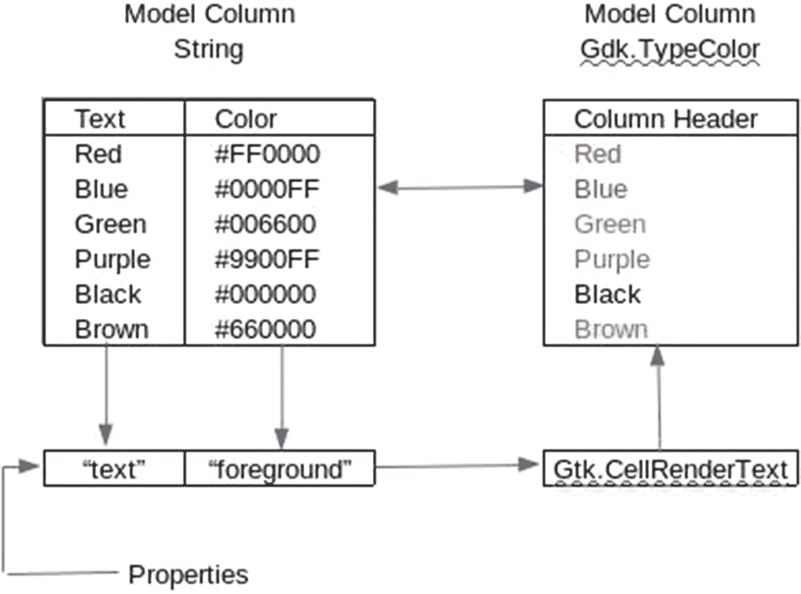
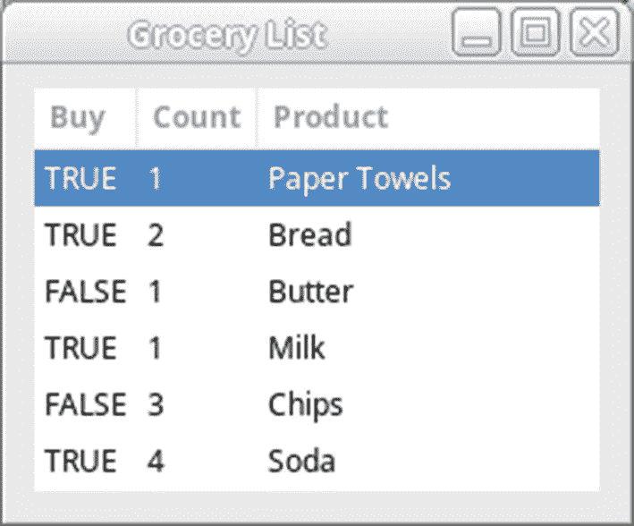
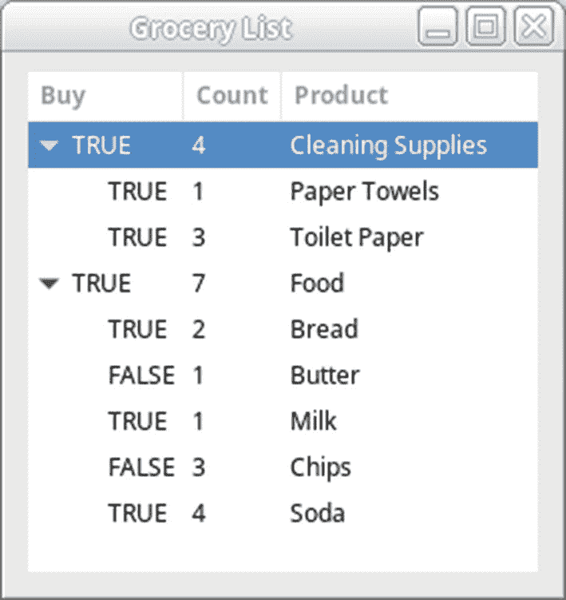
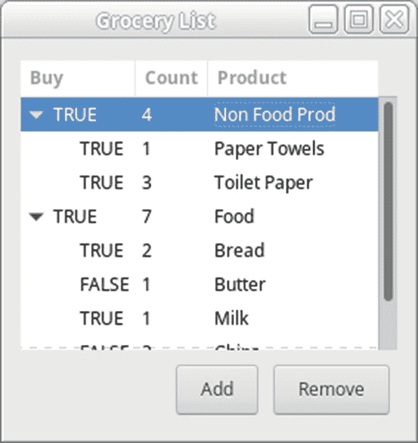
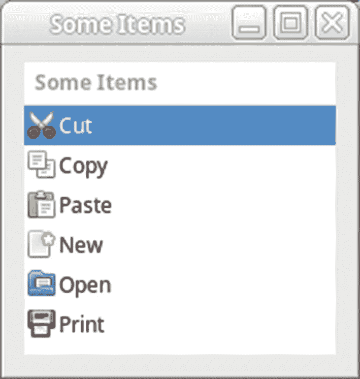
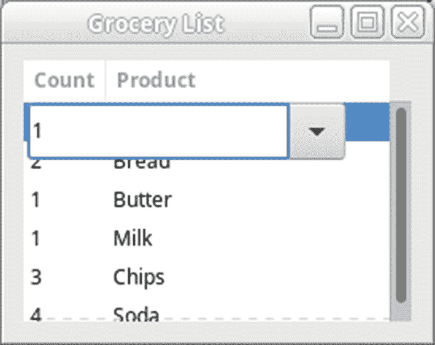
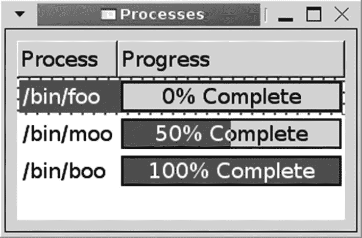
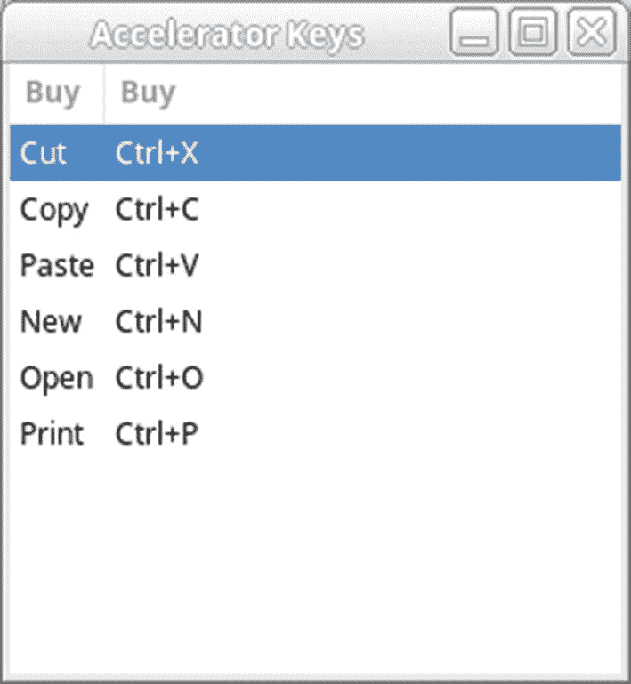

# 九、树形视图小部件

本章向您展示如何将`Gtk.ScrolledWindow`小部件与另一个强大的小部件`Gtk.TreeView`结合使用。树视图小部件可用于显示跨越一列或多列的列表或树中的数据。例如，一个`Gtk.TreeView`可以用来实现一个文件浏览器或者显示构建一个集成开发环境的输出。

`Gtk.TreeView`是一个复杂的小部件，因为它提供了多种多样的功能，所以请务必仔细阅读本章的每一节。然而，一旦你学会了这个强大的部件，你就能够在许多应用中应用它。

本章向您介绍了`Gtk.TreeView`提供的大量特性。本章提供的信息使您能够构建树形视图小部件来满足您的需求。具体来说，在本章中，您将学习以下内容。

*   用什么对象来创建一个`Gtk.TreeView`以及它的模型-视图-控制器设计如何使它独一无二

*   如何用`Gtk.TreeView`小部件创建列表和树形结构

*   何时使用`Gtk.TreePath`、`Gtk.TreeIter`或`Gtk.TreeRowReference`来引用`Gtk.TreeView`中的行

*   如何处理双击、单行选择和多行选择

*   如何创建可编辑的树视图单元格或使用单元格渲染器函数自定义单个单元格

*   可以嵌入到单元格中的小部件，包括切换按钮、像素缓冲器、微调按钮、组合框、进度条和键盘快捷键字符串

## 树视图的一部分

`Gtk.TreeView`小部件用于显示组织成列表或树的数据。视图中显示的数据被组织成列和行。用户能够使用鼠标或键盘在树形视图中选择一行或多行。使用`Gtk.TreeView`的 Nautilus 应用的截图如图 [9-1](#Fig1) 所示。


图 9-1

使用 Gtk。TreeView 部件

`Gtk.TreeView`是一个很难使用的小部件，更难理解，所以这一整章都致力于使用它。但是，一旦您理解了小部件的工作原理，您就能够将它应用到各种各样的应用中，因为几乎可以定制小部件显示给用户的方式的每个方面。

`Gtk.TreeView`的独特之处在于它遵循了通常被称为模型-视图-控制器(MVC)设计的设计概念。MVC 是一种信息和呈现方式完全相互独立的设计方法，类似于`Gtk.TextView`和`Gtk.TextBuffer`的关系。

### Gtk 树模型

数据本身存储在实现`Gtk.TreeModel`接口的类中。GTK+ 提供了四种内置的树模型类，但本章只介绍了`Gtk.ListStore`和`Gtk.TreeStore`。

`Gtk.TreeModel`接口提供了一套标准的方法来检索关于存储数据的一般信息。例如，它允许您获得树中的行数和某一行的子行数。`Gtk.TreeModel`还为您提供了一种检索存储在商店特定行中的数据的方法。

### 注意

模型、渲染器和列被称为对象，而不是小部件，即使它们是 GTK+ 库的一部分。这是一个重要的区别——因为它们不是从`Gtk.Widget`派生的，它们没有 GTK+ 小部件可用的相同的功能、属性和信号。

`Gtk.ListStore`允许你创建一个多列的元素列表。每一行都是根节点的子节点，因此只显示一层行。基本上，`Gtk.ListStore`是一个没有层次的树形结构。之所以提供它，是因为存在更快的算法来与没有任何子项的模型进行交互。

`Gtk.TreeStore`提供与`Gtk.ListStore`相同的功能，只是数据可以组织成多层树。GTK+ 也提供了一种创建您自己的定制模型类型的方法，但是这两种可用的类型在大多数情况下应该是合适的。

虽然`Gtk.ListStore`和`Gtk.TreeStore`应该适合大多数应用，但有时您可能需要实现自己的商店对象。例如，如果它需要保存大量的行，您应该创建一个更高效的新模型。在第 [12 章](12.html)中，你将学习如何创建从`GObject`派生的新类，这可以作为你开始派生一个实现`Gtk.TreeModel`接口的新类的指南。

创建树模型后，视图用于显示数据。通过分离树视图及其模型，您能够在多个视图中显示同一组数据。这些视图可以是彼此的精确副本，或者数据可以以不同的方式显示。对模型进行修改时，所有视图都会同时更新。

### 小费

虽然在多个树视图中显示同一组数据可能不会立即带来好处，但是可以考虑使用文件浏览器。如果您需要在多个文件浏览器中显示同一组文件，对每个视图使用相同的模型将节省内存，并使您的程序运行得更快。当您想要为文件浏览器提供多个显示选项时，这也很有用。在显示模式之间切换时，您不需要改变数据本身。

模型由包含相同数据类型的列和保存每组数据的行组成。每个模型列可以保存一种类型的数据。不应将树模型列与树视图列相混淆，树视图列由单个标题组成，但可以用来自多个模型列的数据来呈现。例如，树列可以显示一个文本字符串，该字符串具有由用户不可见的模型列定义的前景色。图 [9-2](#Fig2) 说明了模型列和树列的区别。


图 9-2

模型和树列之间的关系

模型中的每一行都包含对应于每个模型列的一段数据。在图 [9-2](#Fig2) 中，每一行包含一个文本字符串和一个`Gdk.Color`值。这两个值用于在树列中用相应的颜色显示文本。在本章的后面，你将学习如何用代码实现这一点。现在，您应该简单地理解这两种类型的列之间的区别以及它们之间的关系。

新的列表和树存储是用许多列创建的，每一列都由现有的`GObject.TYPE`定义。通常，您只需要使用那些已经在`GLib`中实现的。例如，如果你想显示文本，你可以使用`GObject.TYPE_STRING`、`GObject.TYPE_BOOLEAN`和一些数字类型，如`GObject.TYPE_INT`。

### 小费

因为可以用`GObject.TYPE_POINTER`存储任意数据类型，所以可以使用一个或多个树模型列来简单地存储关于每一行的信息。当有大量行时，您只需要小心，因为内存使用量会迅速增加。您还必须自己负责释放指针。

### Gtk。TreeViewColumn 和 Gtk。单元格渲染器

如前所述，树形视图显示一个或多个`Gtk.TreeViewColumn`对象。树列由组织成一列的标题和数据单元格组成。每个树视图列还包含一个或多个可见的数据列。例如，在文件浏览器中，树视图列可能包含一列图像和一列文件名。

`Gtk.TreeViewColumn`小部件的头部包含一个标题，描述下面的单元格中保存了什么数据。如果使列可排序，则当单击其中一个列标题时，将对行进行排序。

树状视图列实际上不会向屏幕呈现任何内容。这是通过从`Gtk.CellRenderer`派生的对象来完成的。单元渲染器被打包到树视图列中，类似于将小部件添加到水平框中。每个树视图列可以包含一个或多个单元渲染器，用于渲染数据。例如，在文件浏览器中，图像列将使用

`Gtk.CellRendererPixbuf`和带`Gtk.CellRendererText`的文件名。这方面的一个例子如图 [9-1](#Fig1) 所示。

每个单元格呈现器负责呈现一列单元格，树视图中的每一行都有一个单元格。它从第一行开始，呈现其单元格，然后向下进行到下一行，直到呈现整列或部分列。

在 GTK+ 3 中`g_object_set()`功能不再可用。因此，您必须向渲染器添加属性。列属性对应树模型列，并与单元渲染器属性相关联，如图 [9-3](#Fig3) 所示。这些属性在呈现时应用于每个单元格。



图 9-3

应用单元格渲染器属性

在图 [9-3](#Fig3) 中，有两个树模型列，类型分别为`GObject.TYPE_STRING`和`Gdk.RGBA`。这些应用于`Gtk.CellRendererText`的文本和前景属性，并用于相应地渲染树视图列。

更改单元渲染器属性的另一种方法是定义单元数据函数。在呈现树视图之前，将为树视图中的每一行调用此函数。这允许您自定义每个单元格的呈现方式，而不需要将数据存储在树模型中。例如，单元格数据函数可用于定义要显示的浮点数的小数位数。单元数据函数在本章的“单元数据方法”一节中有详细介绍。

本章还介绍了用于显示文本(字符串、数字和布尔值)、切换按钮、微调按钮、进度条、像素缓冲区、组合框和键盘快捷键的单元格渲染器。此外，您可以创建自定义的单元格渲染器类型，但这通常是不需要的，因为 GTK+ 现在提供了如此广泛的类型。

这一节已经教了你使用`Gtk.TreeView`小部件需要什么对象，它们做什么，以及它们如何相互关联。现在您已经对`Gtk.TreeView`小部件有了基本的了解，下一节有一个简单的`Gtk.ListStore`树模型的例子。

## 使用 Gtk。列表存储

回想一下上一节，`Gtk.TreeModel`只是一个由数据存储实现的接口，比如`Gtk.ListStore`。`Gtk.ListStore`用于创建行之间没有层次关系的数据列表。

在本节中，实现了一个简单的杂货列表应用，它包含三列，所有列都使用`Gtk.CellRendererText`。图 [9-4](#Fig4) 是这个应用的截图。第一列是显示`True`或`False`的布尔值，用于定义是否应该购买该产品。

### 小费

您通常不希望将布尔值显示为文本，因为如果有许多布尔列，用户将无法管理。相反，您希望使用切换按钮。您将在后面的章节中学习如何使用`Gtk.CellRendererToggle`来完成这项工作。布尔值通常也用作列属性来定义单元格渲染器属性。


图 9-4

使用 Gtk 的树视图小部件。列表存储树模型

清单 [9-1](#PC1) 创建了一个`Gtk.ListStore`对象，它显示了一份食品清单。除了显示产品，列表商店还显示是否购买产品以及购买多少。

在本章的其余部分，这个杂货列表应用被用于许多示例。因此，一些函数的内容如果出现在前面的例子中，以后可能会被排除。此外，为了让事情有条理，在每个示例中，`setup_tree_view()`用于设置列和呈现器。每个例子的完整代码清单可以在 [`www.gtkbook.com`](http://www.gtkbook.com) 下载。

```py
#!/usr/bin/python3
import sys
import gi
gi.require_version('Gtk', '3.0')
from gi.repository import Gtk, GObject

BUY_IT = 0
QUANTITY = 1
PRODUCT = 2

GroceryItem = (( True, 1, "Paper Towels" ),
               ( True, 2, "Bread" ),
               ( False, 1, "Butter" ),
               ( True, 1, "Milk" ),
               ( False, 3, "Chips" ),
               ( True, 4, "Soda" ))

class AppWindow(Gtk.ApplicationWindow):

    def __init__(self, *args, **kwargs):
        super().__init__(*args, **kwargs)
        self.set_border_width(10)
        self.set_size_request(250, 175)
        treeview = Gtk.TreeView.new()
        self.setup_tree_view(treeview)
        store = Gtk.ListStore.new((GObject.TYPE_BOOLEAN,
                               GObject.TYPE_INT,
                               GObject.TYPE_STRING))
        for row in GroceryItem:
            iter = store.append(None)
            store.set(iter, BUY_IT, row[BUY_IT], QUANTITY,
                      row[QUANTITY], PRODUCT, row[PRODUCT])
        treeview.set_model(store)
        scrolled_win = Gtk.ScrolledWindow.new(None, None)
        scrolled_win.set_policy(Gtk.PolicyType.AUTOMATIC,
                                Gtk.PolicyType.AUTOMATIC)
        scrolled_win.add(treeview)
        self.add(scrolled_win)
    def setup_tree_view(self, treeview):
        renderer = Gtk.CellRendererText.new()
        column = Gtk.TreeViewColumn("Buy", renderer, text=BUY_IT)
        treeview.append_column(column)
        renderer = Gtk.CellRendererText.new()
        column = Gtk.TreeViewColumn("Count", renderer, text=QUANTITY)
        treeview.append_column(column)
        renderer = Gtk.CellRendererText.new()
        column = Gtk.TreeViewColumn("Product", renderer, text=PRODUCT)
        treeview.append_column(column)

class Application(Gtk.Application):
    def __init__(self, *args, **kwargs):
        super().__init__(*args, application_id="org.example.myapp",
                         **kwargs)
        self.window = None
    def do_activate(self):
        if not self.window:
            self.window = AppWindow(application=self, title="Grocery List")
        self.window.show_all()
        self.window.present()
    if __name__ == "__main__":
        app = Application()
        app.run(sys.argv)

Listing 9-1Using a Gtk.FontSelectionDialog

```

### 创建树视图

创建`Gtk.TreeView`小部件是这个过程中最简单的部分。你只需要调用`Gtk.TreeView.new()`。用`treeview.set_model(store)`初始化后，树形模型可以很容易地应用到`Gtk.TreeView`上。

在 GTK+ 3 出现之前，有一些函数可以隐藏/取消隐藏`Gtk.TreeViewColumn`的列标题。这些函数在 GTK+ 3 中已经被否决了，现在所有的列标题都是可见的。

对于某些树视图，标题提供了比列标题更多的功能。在可排序的树模型中，单击列标题可以根据相应列中保存的数据启动所有行的排序。如果适用，它还会直观地指示列的排序顺序。如果用户需要标题来对树视图行进行排序，则不应隐藏标题。

作为一名 GTK+ 开发人员，您应该非常小心地改变视觉属性。用户可以选择适合他们需求的主题，并且您可以通过改变小部件的显示方式来使您的应用不可用。

### 渲染器和列

在创建了`Gtk.TreeView`之后，您需要向视图中添加一个或多个列，这样它才能发挥作用。每个`Gtk.TreeViewColumn`由一个标题和至少一个单元格渲染器组成，标题显示其内容的简短描述。树状视图列实际上不呈现任何内容。树视图列包含一个或多个用于在屏幕上绘制数据的单元渲染器。

所有的单元格渲染器都是从`Gtk.CellRenderer`类派生的，在本章中被称为对象，因为`Gtk.CellRenderer`是直接从`GObject`派生的，而不是从`Gtk.Widget`派生的。每个单元格渲染器都包含许多属性，这些属性决定了数据在单元格中的绘制方式。

`Gtk.CellRenderer`类为所有衍生渲染器提供了公共属性，包括背景颜色、大小参数、对齐、可见性、敏感度和填充。在附录 a 中可以找到`Gtk.CellRenderer`属性的完整列表。它还提供了编辑取消和编辑开始信号，允许您在自定义单元渲染器中实现编辑。

在清单 [9-1](#PC1) 中，向您介绍了`Gtk.CellRendererText`，它能够将字符串、数字和布尔值呈现为文本。文本单元格渲染器用`Gtk.CellRendererText.new()`初始化。

`Gtk.CellRendererText`提供了许多附加属性，这些属性决定了每个单元格是如何呈现的。您应该始终设置 text 属性，它是显示在单元格中的字符串。其余的属性类似于文本标签使用的属性。

包含了大量的属性，这些属性决定了每一行是如何呈现的。在下面的例子中使用了`renderer.foreground-rgba()`将渲染器中每段文本的前景色设置为橙色。一些属性也有相应的 set 属性，如果您想使用这个值，必须将它设置为`True`。例如，您应该将前景设置为`True`以使更改生效。

```py
renderer.props.foreground-rgba = Gdk.RGBA(red=1.0, green=0.65, blue=0.0,
                                          alpha=1.0)

```

创建单元格渲染器后，需要将其添加到`Gtk.TreeViewColumn`中。如果您只想让列显示一个单元格渲染器，可以使用`Gtk.TreeViewColumn()`创建树视图列。在下面的代码中，创建了一个标题为“Buy”的树视图列和一个具有一个属性的渲染器。当`Gtk.ListStore`被填充时，该属性被称为`BUY_IT`(值为 0)。

```py
column = Gtk.TreeViewColumn("Buy", renderer, text=BUY_IT)

```

前面的函数接受在列标题、单元格渲染器和属性列表中显示的字符串。每个属性都包含一个字符串，该字符串引用渲染器属性和树视图列号。需要认识的重要一点是，提供给`Gtk.TreeViewColumn()`的列号指的是树模型列，它可能与树视图使用的树模型列或单元渲染器的数量不同。

在 Python 3 中，`Gtk.TreeViewColumn()`很难实现。这不仅是一种方便的方法，也是创建`Gtk.TreeViewColumn()`的首选方法。下面的代码片段是在 Python 3 中创建一个`Gtk.TreeViewColumn()`并分配至少一个属性的正确方法。

```py
renderer = Gtk.CellRendererText.new()
column = Gtk.TreeViewColumn("Buy", renderer, text=BUY_IT)
treeview.append_column(column)

```

如果要向树视图列添加多个渲染器，需要打包每个渲染器并单独设置其属性。例如，在文件管理器中，您可能希望在同一列中包含文本和图像渲染器。但是，如果每一列只需要一个单元格渲染器，那么使用`Gtk.TreeViewColumn()`是最简单的。

### 注意

如果您希望某个属性(比如前景色)在列中的每一行都设置为相同的值，那么您应该使用`renderer.foreground-rgba()`将该属性直接应用到单元格渲染器。但是，如果该属性因行而异，则应该将其作为给定渲染器的列的属性添加。

在您完成了树视图列的设置后，需要用`treeview.append_column(column)`将其添加到树视图中。也可以用`treeview.insert_column(column)`将列添加到树形视图的任意位置，或者用`treeview.remove_column(column)`将列从视图中删除。

### 创建 Gtk。列表存储

现在已经用所需的单元渲染器设置了树视图列，所以是时候创建渲染器和树视图之间的树模型了。对于清单 [9-1](#PC1) 中的例子，我们使用了`Gtk.ListStore`，这样项目就会显示为一个元素列表。

使用`Gtk.ListStore.new()`创建新的列表存储。该函数接受列数和每列保存的数据类型。在清单 [9-1](#PC1) 中，列表存储有三列，分别存储布尔、整数和字符串数据类型。

```py
Gtk.ListStore.new((GObject.TYPE_BOOLEAN, GObject.TYPE_INT,
                   GObject.TYPE_STRING))

```

在 Python 3 中，列类型参数形成一个元组。它不仅告诉方法列的类型，还告诉方法列的数量。

在创建列表存储之后，您需要添加带有`store.append(None)`的行，这样它才有用。这个方法向列表存储追加一个新行，迭代器被设置为指向新行。在这一章的后面你会学到更多关于树迭代器的知识。现在，知道它指向新的树视图行就足够了。

```py
iter = store.append(None)
store.set(iter, BUY_IT, row[BUY_IT], QUANTITY, row[QUANTITY],
          PRODUCT, row[PRODUCT])

```

接下来，我们需要设置哪一列和哪些值将被加载数据。这是通过`store.set()`方法完成的。使用此方法可以设置一行或多行。前面的示例从左到右在该行的每一列中存储值，但是该列可以按任何顺序列出，因为我们还指定了加载值的列号。

### 注意

`Gtk.CellRendererText`自动将布尔值和数字转换成可在屏幕上显示的文本字符串。因此，应用于文本属性列的数据类型不必是文本本身，而只需与在初始化`Gtk.ListStore`期间定义的列表存储列类型一致。

向列表存储中添加行还有多个其他函数，包括`store.prepend()`和`store.insert()`。可用函数的完整列表可以在`Gtk.ListStore` API 文档中找到。

除了添加行，还可以用`store.remove()`删除行。该函数删除`Gtk.TreeIter`引用的行。删除行后，迭代器指向列表存储中的下一行，函数返回`True`。如果刚刚删除了最后一行，迭代器就无效了，函数返回`False`。

```py
store.remove(iter)

```

此外，还提供了`store.clear()`，它可用于从列表存储中删除所有行。留给您的是一个不包含任何数据的`Gtk.ListStore`。

创建列表存储后，需要调用`treeview.set_model()`将其添加到树视图中。通过调用此方法，树模型的引用计数增加 1。

## 使用 Gtk。TreeStore

还有一种称为`Gtk.TreeStore`的内置树模型，它将行组织成多级树结构。也可以用一个`Gtk.TreeStore`树模型实现一个列表，但是不推荐这样做，因为当对象假设行可能有一个或多个子对象时，会增加一些开销。

图 9-5 显示了一个示例树存储，它包含两个根元素，每个元素都有自己的子元素。通过单击带有子项的行左侧的扩展器，可以显示或隐藏其子项。这类似于`Gtk.Expander`小部件提供的功能。



图 9-5

使用 Gtk 的树视图小部件。TreeStore 树模型

用`Gtk.TreeStore`而不是`Gtk.ListStore`实现的`Gtk.TreeView`之间的唯一区别在于商店的创建。对于这两个模型，添加列和渲染器的方式是相同的，因为列是视图的一部分，而不是模型的一部分。执行清单 [9-2](#PC8) 将产生如图 [9-5](#Fig5) 所示的对话框。

```py
#!/usr/bin/python3
import sys
import gi
gi.require_version('Gtk', '3.0')
from gi.repository import Gtk, GObject

BUY_IT = 0
QUANTITY = 1
PRODUCT = 2

PRODUCT_CATEGORY = 0
PRODUCT_CHILD = 1

GroceryItem = (( PRODUCT_CATEGORY, True, 0, "Cleaning Supplies"),
               ( PRODUCT_CHILD, True, 1, "Paper Towels" ),
               ( PRODUCT_CHILD, True, 3, "Toilet Paper" ),
               ( PRODUCT_CATEGORY, True, 0, "Food"),
               ( PRODUCT_CHILD, True, 2, "Bread" ),
               ( PRODUCT_CHILD, False, 1, "Butter" ),
               ( PRODUCT_CHILD, True, 1, "Milk" ),
               ( PRODUCT_CHILD, False, 3, "Chips" ),
               ( PRODUCT_CHILD, True, 4, "Soda" ))
class AppWindow(Gtk.ApplicationWindow):
    def __init__(self, *args, **kwargs):
        super().__init__(*args, **kwargs)
        self.set_border_width(10)
        self.set_size_request(275, 270)
        treeview = Gtk.TreeView.new()
        self.setup_tree_view(treeview)
        store = Gtk.TreeStore.new((GObject.TYPE_BOOLEAN,
                               GObject.TYPE_INT,
                               GObject.TYPE_STRING))
        iter = None
        i = 0
        for row in GroceryItem:
            (ptype, buy, quant, prod) = row
            if ptype == PRODUCT_CATEGORY:
                j = i + 1
                (ptype1, buy1, quant1, prod1) = GroceryItem[j]
                while j < len(GroceryItem) and ptype1 == PRODUCT_CHILD:
                    if buy1:
                        quant += quant1
                    j += 1;
                    if j < len(GroceryItem):
                        (ptype1, buy1, quant1, prod1) = GroceryItem[j] iter = store.append(None)
                store.set(iter, BUY_IT, buy, QUANTITY, quant, PRODUCT, prod)
            else:
                child = store.append(iter)
                store.set(child, BUY_IT, buy, QUANTITY, quant, PRODUCT, prod)
            i += 1
        treeview.set_model(store)
        treeview.expand_all()
        scrolled_win = Gtk.ScrolledWindow.new(None, None)
        scrolled_win.set_policy(Gtk.PolicyType.AUTOMATIC,
                                Gtk.PolicyType.AUTOMATIC)
        scrolled_win.add(treeview)
        self.add(scrolled_win)
    def setup_tree_view(self, treeview):
        renderer = Gtk.CellRendererText.new()
        column = Gtk.TreeViewColumn("Buy", renderer, text=BUY_IT)
        treeview.append_column(column)
        renderer = Gtk.CellRendererText.new()
        column = Gtk.TreeViewColumn("Count", renderer, text=QUANTITY)
        treeview.append_column(column)
        renderer = Gtk.CellRendererText.new()
        column = Gtk.TreeViewColumn("Product", renderer, text=PRODUCT)
        treeview.append_column(column)

class Application(Gtk.Application):

    def __init__(self, *args, **kwargs):
        super().__init__(*args, application_id="org.example.myapp",
                         **kwargs)
        self.window = None
    def do_activate(self):
        if not self.window:
            self.window = AppWindow(application=self, title="Grocery List")
        self.window.show_all()
        self.window.present()
    if __name__ == "__main__":
        app = Application()
        app.run(sys.argv)

Listing 9-2Creating a Gtk.TreeStore

```

树存储用`Gtk.TreeStore.new()`初始化，它接受与`Gtk.ListStore.new()`相同的参数。列类型参数形成一个元组。它不仅告诉方法列的类型，还告诉方法列的数量。

向树存储添加行与向列表存储添加行略有不同。使用`store.append()`向树存储添加行，它接受一个迭代器或`None`。迭代器应该指向新行的父行。该方法返回一个迭代器，当函数返回时，该迭代器指向插入的行，第二个。

```py
iter = store.append(None)

```

在前面对`store.append()`的调用中，通过将`None`作为父迭代器传递，一个根元素被追加到列表中。该方法返回的`iter`树迭代器被设置为新行的位置。

在随后对`store.append()`的第二次调用中，该行被添加为 iter 的子行。接下来，当方法返回时，子树迭代器被设置为树存储中新行的当前位置。

```py
child = store.append(iter)

```

与列表存储一样，有许多方法可用于向树存储添加行。这些包括`store.insert()`、`store.prepend()`和`store.insert_before()`等等。要获得完整的方法列表，您应该参考`Gtk.TreeStore` API 文档。

向树存储中添加一行后，它只是一个没有数据的空行。要向行中添加数据，调用`store.set()`。该功能的工作方式与`store.set()`相同。它接受树存储、指向行位置的树迭代器和列数据对列表。这些列号对应于设置单元渲染器属性时使用的列号。

```py
store.set(child, BUY_IT, buy, QUANTITY, quant, PRODUCT, prod)

```

除了向树存储中添加行之外，还可以用`store.remove()`删除它们。该函数删除由`Gtk.TreeIter`引用的行。删除行后，`iter`指向树存储中的下一行，函数返回`True`。如果您删除的行是树存储中的最后一行，迭代器将失效，函数将返回`False`。

```py
store.remove(iter)

```

此外，还提供了`store.clear()`，它可用于从树存储中移除所有行。留给您的是一个不包含任何数据的`Gtk.TreeStore`。

在清单 [9-2](#PC8) 中，`treeview.expand_all()`被调用来展开所有的行。这是一个递归函数，可以扩展每一个可能的行，尽管它只影响具有父子行关系的树模型。此外，您可以使用`treeview.collapse_all()`折叠所有的行。默认情况下，所有行都是折叠的。

## 引用行

有三个对象可用于引用树模型中的特定行；各有各的独特优势。他们是`Gtk.TreePath`、`Gtk.TreeIter`和`Gtk.TreeRowReference`。在下面几节中，您将了解每个对象的工作原理以及如何在您自己的程序中使用它们。

### 树状路径

例如，如果您看到的是字符串 3:7:5，那么您将从第四个根元素开始(回想一下，索引从零开始，因此元素 3 实际上是该级别中的第四个元素)。接下来，您将继续处理该根元素的第八个子元素。这一排是那个孩子的第六个孩子。

为了形象地说明这一点，图 [9-6](#Fig6) 显示了在图 [9-5](#Fig5) 中创建的树形视图，其中标注了树路径。每个根元素仅被称为一个元素，即 0 和 1。第一个根元素有两个子元素，称为 0:0 和 0:1。



图 9-6

使用 Gtk 的树视图的树路径。TreeStore

提供了两个函数，允许您在路径和它的等价字符串之间来回转换:`treepath.to_string()`和`Gtk.TreePath.new_from_string()`。除非您试图保存树视图的状态，否则通常不必直接处理字符串路径，但是使用它有助于理解树路径的工作方式。

清单 9-3 给出了一个使用树路径的简短例子。它首先创建一个指向面包产品行的新路径。接下来，`treepath.up()`在路径中向上移动一级。当您将路径转换回字符串时，您会看到结果输出为 1，指向食物行。

```py
treepath = Gtk.TreePath.new_from_string("1:0")
treepath.up(path)
str = treepath.to_string(path)
print(str)

Listing 9-3Converting Between Paths and Strings

```

### 小费

如果您需要获得一个树迭代器，并且只有可用的路径字符串，您可以将字符串转换成一个`Gtk.TreePath`然后转换成一个`Gtk.TreeIter`。然而，更好的解决方案是用`treemodel.get_iter_from_string()`跳过中间步骤，将树路径字符串直接转换成树迭代器。

除了`treepath.up()`之外，还有其他的功能可以让你浏览一个树形模型。您可以使用`treepath.down()`移动到子行，使用`treepath.next()`或`treepath.prev()`移动到同一级别的下一行或上一行。当您移动到前一行或父行时，如果不成功，将返回`False`。

有时，您可能需要一个整数列表而不是字符串形式的树路径。`treepath.get_indices()`函数返回组成路径字符串的整数。

```py
treepath.get_indices(path)

```

当在树模型中添加或删除一行时，树路径可能会出现问题。该路径可能会指向树中的另一行，或者更糟，指向一个不再存在的行！例如，如果一个树路径指向树的最后一个元素，而您删除了该行，那么它现在指向树的界限之外。要解决这个问题，您可以将树路径转换为树行引用。

### 树行引用

对象用于观察树模型的变化。在内部，它们连接到“行插入”、“行删除”和“行重新排序”信号，根据变化更新存储的路径。

从现有的`Gtk.TreeModel`和`Gtk.TreePath`中用`Gtk.TreeRowReference.new()`创建新的树行引用。复制到行引用中的树路径会随着模型中发生的变化而更新。

```py
treerowref.new(model, path)

```

当您需要检索路径时，您可以使用`treerowref.get_path()`，如果该行不再存在于模型中，它将返回`None`。树行引用能够基于树模型中的更改更新树路径，但是如果您从与树路径的行相同的级别中移除所有元素，则树路径将不再有指向的行。

您应该知道，当在树模型中添加、删除或排序行时，树行引用确实会增加一点处理开销，因为引用必须处理这些操作发出的所有信号。对于大多数应用来说，这种开销无关紧要，因为没有足够的行让用户注意到。但是，如果您的应用包含大量的行，您应该明智地使用树行引用。

### 树迭代器

GTK+ 提供了`Gtk.TreeIter`对象，可以用来引用`Gtk.TreeModel`中的特定行。这些迭代器由模型内部使用，这意味着您永远不应该直接改变树迭代器的内容。

您已经看到了`Gtk.TreeIter`的多个实例，从中可以看出树迭代器的使用方式与`Gtk.TreeIter`类似。树迭代器用于树模型的操作。然而，树路径用于以提供人类可读界面的方式指向树模型中的行。树行引用可用于确保树路径在树模型的整个变化中调整它们指向的位置。

GTK+ 提供了许多内置方法来对树迭代器执行操作。通常，迭代器用于向模型添加行，设置行的内容，以及检索模型的内容。在图 [9-1](#Fig1) 和图 [9-2](#Fig2) 中，使用树迭代器向`Gtk.ListStore`和`Gtk.TreeStore`模型添加行，然后设置每行的初始内容。

`Gtk.TreeModel`提供了许多`iter_*()`方法，可以用来移动迭代器和检索关于它们的信息。例如，要移动到下一个迭代器位置，您可以使用`treemodel.iter_next()`，如果操作成功，它将返回`True`。可用函数的完整列表可以在`Gtk.TreeModel` API 文档中找到。

使用`treemodel.get_path()`和`treemodel.get_iter()`很容易在树迭代器和树路径之间转换。树路径或迭代器必须有效，这些函数才能正常工作。清单 [9-4](#PC16) 给出了一个如何在`Gtk.TreeIter`和`Gtk.TreePath`之间转换的简短示例。

```py
path = treemodel.get_path(model, iter)
iter = treemodel.get_iter(model, path)

Listing 9-4Converting Between Paths and Iterators

```

清单 [9-4](#PC16) ，`treemodel.get_path()`中的第一个方法将一个有效的树迭代器转换成一个树路径。该路径随后被发送到`treemodel.get_iter()`，后者将其转换回迭代器。注意，第二个方法接受两个参数。

`Gtk.TreeIter`提出的一个问题是，不保证迭代器在一个模型被编辑后存在。这并不是在所有情况下都成立，你可以使用`treemodel.get_flags()`来检查`Gtk.TreeModelFlags.ITERS_PERSIST`标志，默认情况下`Gtk.ListStore`和`Gtk.TreeStore`的标志是打开的。如果设置了这个标志，只要行存在，树迭代器总是有效的。

```py
treemodel.get_flags()

```

即使迭代器被设置为持久化，存储树迭代器对象也不是一个好主意，因为它们是由树模型内部使用的。相反，您应该使用树行引用来随时跟踪行，因为树模型改变时引用不会失效。

## 添加行和处理选择

到目前为止，给出的两个例子都是在启动过程中定义树模型的。内容在最初设置后不会改变。在这个部分中，食品杂货列表应用被扩展为允许用户添加和删除产品。在介绍这个例子之前，您将学习如何处理单选和多选。

### 单项选择

每个树形视图的选择信息由一个`Gtk.TreeSelection`对象保存。可以用`treeview.get_selection()`检索这个对象。每个`Gtk.TreeView`都会自动为您创建一个`Gtk.TreeSelection`对象，因此您无需创建自己的树选择。

### 警告

`Gtk.TreeSelection`提供一个信号“changed”，当选择改变时发出。使用这种信号时要小心，因为它并不总是可靠的。当用户选择一个已经选定的行而没有发生任何更改时，可以发出该消息。因此，最好使用`Gtk.TreeView`提供的信号进行选择处理，这在附录 b 中。

树状视图支持多种类型的选择。您可以使用`treeselection.set_mode()`改变选择类型。选择类型由`Gtk.SelectionMode`枚举定义，它包括以下值。

*   `Gtk.SelectionMode.NONE`:禁止用户选择任何行。

*   `Gtk.SelectionMode.SINGLE`:用户最多可以选择一行，也有可能不选择任何一行。默认情况下，树选择用`Gtk.SelectionMode.SINGLE`初始化。

*   `Gtk.SelectionMode.BROWSE`:用户可以选择一行。在极少数情况下，可能没有选定的行。该选项实际上禁止用户取消选择某一行，除非将选择移动到另一行。

*   `Gtk.SelectionMode.MULTIPLE`:用户可以选择任意行数。用户能够使用 Ctrl 和 Shift 键来选择附加元素或元素范围。

如果您将选择类型定义为`Gtk.SelectionMode.SINGLE`或`Gtk.SelectionMode.BROWSE`，您可以确保只选择一行。对于只有一个选择的树视图，您可以使用`treeselection.get_selected()`来检索选中的行。

```py
treeselection.get_selected(model, iter)

```

`treeselection.get_selected()`方法可用于检索与`Gtk.TreeSelection`对象相关联的树模型和指向所选行的树迭代器。如果模型和迭代器设置成功，则返回`True`。该功能在选择模式为`Gtk.SelectionMode.MULTIPLE`时不起作用！

如果没有选择行，树迭代器被设置为`None`，函数返回`False`。因此，`treeselection.get_selected()`也可以作为一个测试来检查是否有一个选中的行。

### 多重选择

如果您的树选择允许选择多行(`Gtk.SelectionMode.MULTIPLE`)，那么您有两个选项来处理选择，为每一行调用一个函数或以 Python 列表的形式检索所有选择的行。您的第一个选择是用`treeselection.selected_foreach()`为每个选中的行调用一个函数。

```py
treeselection.selected_foreach(selected, foreach_func, None)

```

这个函数允许您为每个选中的行调用`selected_foreach_func()`，传递一个可选的数据参数。在前面的示例中，`None`被传递给了函数。该函数必须是 Python 函数或方法，如清单 [9-5](#PC20) 所示。清单 [9-5](#PC20) 中的函数检索产品字符串并将其打印到屏幕上。

```py
foreach_func(model, path, iter, data)
    (text,) = model.get(iter, PRODUCT)
    print ("Selected Product: %s" % text)

Listing 9-5Selected for-each Function

```

### 注意

您不应该在`foreach_func`实现中修改树模型或选择！如果这样做，GTK+ 会给用户带来严重的错误，因为可能会导致无效的树路径和迭代器。

还要注意方法`model.get()`总是返回一个元组，即使你只要求一个单独的列。

使用树选择`foreach_func`函数的一个问题是，您不能从函数内部操纵选择。为了解决这个问题，更好的解决方案是使用`treeselection.get_selected_rows()`，它返回一个包含`Gtk.TreePath`对象的 Python 列表，每个对象指向一个选定的行。

```py
treeselection.get_selected_rows(model)

```

然后，您可以对列表中的每一行执行一些操作。然而，你需要小心。如果您需要编辑列表中的树模型，您需要首先将所有的树路径转换为树行引用，以便它们在整个操作期间继续有效。

如果您想手动遍历所有的行，您也可以使用`treeselection.count_selected_rows()`，它返回当前选择的行数。

### 添加新行

现在您已经了解了选择，是时候添加向列表中添加新产品的功能了。

与之前的杂货列表应用相比，本例中唯一的区别如图 [9-7](#Fig7) 所示，图中显示了在树形视图的底部添加了添加和删除按钮。此外，选择模式已更改为允许用户一次选择多行。


图 9-7

编辑杂货清单中的商品

清单 [9-6](#PC22) 是用户点击添加按钮时运行的回调函数的实现。它向用户呈现一个`Gtk.Dialog`，要求用户选择一个类别，输入产品名称和要购买的产品数量，并选择是否购买该产品。

如果所有字段都有效，该行将被添加到所选类别下。此外，如果用户指定应该购买该产品，则该数量将被添加到该类别的总数量中。

```py
#!/usr/bin/python3
import sys
import gi
gi.require_version('Gtk', '3.0')
from gi.repository import Gtk, GObject

BUY_IT = 0
QUANTITY = 1
PRODUCT = 2

PRODUCT_CATEGORY = 0
PRODUCT_CHILD = 1

GroceryItem = (( PRODUCT_CATEGORY, True, 0, "Cleaning Supplies"), ( PRODUCT_CHILD, True, 1, "Paper Towels" ),
               ( PRODUCT_CHILD, True, 3, "Toilet Paper" ), ( PRODUCT_CATEGORY, True, 0, "Food"), ( PRODUCT_CHILD, True, 2, "Bread" ),
               ( PRODUCT_CHILD, False, 1, "Butter" ),
               ( PRODUCT_CHILD, True, 1, "Milk" ),
               ( PRODUCT_CHILD, False, 3, "Chips" ),
               ( PRODUCT_CHILD, True, 4, "Soda" ))
class AddDialog(Gtk.Dialog):

    def __init__(self, *args, **kwargs):
        super().__init__(*args, **kwargs)
        parent = kwargs['parent']
        # set up buttons
        self.add_button("Add", Gtk.ResponseType.OK)
        self.add_button("Cancel", Gtk.ResponseType.CANCEL)
        # set up dialog widgets
        combobox = Gtk.ComboBoxText.new()
        entry = Gtk.Entry.new()
        spin = Gtk.SpinButton.new_with_range(0, 100, 1)
        check = Gtk.CheckButton.new_with_mnemonic("_Buy the Product")
        spin.set_digits(0)
        # Add all of the categories to the combo box. for row in GroceryItem:
            (ptype, buy, quant, prod) = row
            if ptype == PRODUCT_CATEGORY:
                combobox.append_text(prod)
        # create a grid
        grid = Gtk.Grid.new()
        grid.set_row_spacing (5)
        grid.set_column_spacing(5)
        # fill out the grid
        grid.attach(Gtk.Label.new("Category:"), 0, 0, 1, 1)
        grid.attach(Gtk.Label.new("Product:"), 0, 1, 1, 1)
        grid.attach(Gtk.Label.new("Quantity:"), 0, 2, 1, 1)
        grid.attach(combobox, 1, 0, 1, 1)
        grid.attach(entry, 1, 1, 1, 1)
        grid.attach(spin, 1, 2, 1, 1)
        grid.attach(check, 1, 3, 1, 1)
        self.get_content_area().pack_start(grid, True, True, 5) self.show_all()

        # run the dialog and check the results
        if self.run() != Gtk.ResponseType.OK:
            self.destroy()
            return
        quantity = spin.get_value()
        product = entry.get_text()
        category = combobox.get_active_text()
        buy = check.get_active()
        if product == "" or category == None:
            print("All of the fields were not correctly filled out!")
            return
        model = parent.get_treeview().get_model();
        iter = model.get_iter_from_string("0")
        # Retrieve an iterator pointing to the selected category. while iter:
            (name,) = model.get(iter, PRODUCT)
            if name == None or name.lower() == category.lower():
                break
            iter = model.iter_next(iter)
        #
        #
        # Convert the category iterator to a path so that it  # will not become invalid and add the new product as a child of the category.

        path = model.get_path(iter)

        child = model.append(iter)
        model.set(child, BUY_IT, buy, QUANTITY, quantity, PRODUCT, product)
        # Add the quantity to the running total if it is to be purchased. if buy:
            iter = model.get_iter(path)
            (i,) = model.get(iter, QUANTITY) i += quantity
            model.set(iter, QUANTITY, i)
        self.destroy()
class AppWindow(Gtk.ApplicationWindow):

    def __init__(self, *args, **kwargs):
        super().__init__(*args, **kwargs)
        self.set_border_width(10)
        self.set_size_request(275, 270)
        self.treeview = Gtk.TreeView.new()
        self.setup_tree_view(self.treeview)
        store = Gtk.TreeStore.new((GObject.TYPE_BOOLEAN,
                               GObject.TYPE_INT,
                               GObject.TYPE_STRING))
        iter = None
        i = 0
        for row in GroceryItem:
            (ptype, buy, quant, prod) = row
            if ptype == PRODUCT_CATEGORY:
                j = i + 1
                (ptype1, buy1, quant1, prod1) = GroceryItem[j]
                while j < len(GroceryItem) and ptype1 == PRODUCT_CHILD:
                    if buy1:
                        quant += quant1
                    j += 1;
                    if j < len(GroceryItem):
                        (ptype1, buy1, quant1, prod1) = GroceryItem[j] iter = store.append(None)
                store.set(iter, BUY_IT, buy, QUANTITY, quant, PRODUCT, prod)
            else:
                child = store.append(iter)
                store.set(child, BUY_IT, buy, QUANTITY, quant, PRODUCT, prod)
            i += 1
        self.treeview.set_model(store)
        self.treeview.expand_all()
        scrolled_win = Gtk.ScrolledWindow.new(None, None)
        scrolled_win.set_policy(Gtk.PolicyType.AUTOMATIC,
                                Gtk.PolicyType.AUTOMATIC)
        scrolled_win.add(self.treeview)
        button_add = Gtk.Button.new_with_label("Add")
        button_add.connect("clicked", self.on_add_button_clicked, self)
        button_remove = Gtk.Button.new_with_label("Remove")
        hbox = Gtk.Box(orientation=Gtk.Orientation.HORIZONTAL, spacing=0)
        hbox.pack_end(button_remove, False, True, 5)
        hbox.pack_end(button_add, False, True, 5)
        vbox = Gtk.Box(orientation=Gtk.Orientation.VERTICAL, spacing=0)
        vbox.pack_end(hbox, False, True, 5)
        vbox.pack_end(scrolled_win, True, True, 5)
        self.add(vbox)

    def setup_tree_view(self, treeview):
        renderer = Gtk.CellRendererText.new()
        column = Gtk.TreeViewColumn("Buy", renderer, text=BUY_IT)
        self.treeview.append_column(column)
        renderer = Gtk.CellRendererText.new()
        column = Gtk.TreeViewColumn("Count", renderer, text=QUANTITY)
        treeview.append_column(column)
        renderer = Gtk.CellRendererText.new()
        column = Gtk.TreeViewColumn("Product", renderer, text=PRODUCT)
        treeview.append_column(column)

    def on_add_button_clicked(self, button, parent):
        dialog = AddDialog(title="Add a Product", parent=parent,
                             flags=Gtk.DialogFlags.MODAL)

    def get_treeview(self):
        return self.treeview

class Application(Gtk.Application):

    def __init__(self, *args, **kwargs):
        super().__init__(*args, application_id="org.example.myapp",
                         **kwargs)
        self.window = None

    def do_activate(self):
        if not self.window:
            self.window = AppWindow(application=self, title="Grocery List")
        self.window.show_all()
        self.window.present()
    if __name__ == "__main__":
        app = Application()
        app.run(sys.argv)

Listing 9-6Adding a New Product

```

#### 检索行数据

检索存储在树模型行中的值与添加行非常相似。在清单[中，9-6](#PC22) `model.get_iter_from_string()`首先用于检索指向树视图中第一行的树迭代器。这对应于第一类。

接下来，`model.iter_next()`用于遍历所有根级别的行。对于每个根级别的行，运行以下代码。首先，用`model.get()`检索产品名称。这个函数的工作方式类似于`treestore.set()`，它接受一个`Gtk.TreeModel`，一个指向一行的迭代器，以及一个或多个列号的列表。即使您提供单个列作为参数，此方法也总是返回一个元组。

```py
(name,) = model.get(iter, PRODUCT)
if name.lower() == category.lower():
    break

```

然后将当前产品与选择的类别名称进行比较。如果两个字符串匹配，则循环退出，因为找到了正确的类别。`iter`变量现在指向所选择的类别。

#### 添加新行

向树模型添加新行的方式与启动时最初添加的方式相同。在下面的代码中，指向所选类别的`Gtk.TreeIter`首先被转换成一个树路径，因为当树存储被更改时，它就失效了。请注意，它不必转换为树行引用，因为它的位置可能不会改变。

```py
path = model.get_path(iter)
child = model.append(iter)
model.set(child, BUY_IT, buy, QUANTITY, quantity, PRODUCT, product)

```

接下来，一个新行被附加上`treestore.append()`，其中`iter`是父行。使用用户在对话框中输入的数据，用`treestore.set()`填充该行。

#### 组合框

清单 [9-6](#PC22) 引入了一个名为`Gtk.ComboBox`的新部件。

`Gtk.ComboBox`是一个允许用户从下拉列表中选择选项的小工具。

组合框以正常状态显示选定的选项。组合框有两种不同的使用方式，这取决于您使用什么方法来实例化小部件，要么使用自定义的`Gtk.TreeModel`要么使用只有一列字符串的默认模型。

在清单 [9-6](#PC22) 中，用`Gtk.ComboBoxText.new()`创建了一个新的`Gtk.ComboBox`，它创建了一个专门的组合框，只包含一列字符串。这只是一个方便的方法，因为组合框的下拉列表是用一个`Gtk.TreeModel`在内部处理的。这使您可以通过以下方法轻松地附加和预置选项以及插入新选项。

```py
combobox.append_text(text)
combobox.prepend_text(text)
combobox.insert_text(position, text)

```

第一个函数`combobox.get_active_text()`返回一个引用当前行索引的整数，如果没有选择，则返回-1。这可以转换成一个字符串，然后转换成一个`Gtk.TreePath`。另外，`combobox.get_active_iter()`检索指向所选行的迭代器，如果设置了迭代器，则返回`True`。

#### 删除多行

下一步是添加从列表中删除产品的功能。由于我们添加了选择多行的功能，代码也必须能够删除多行。

清单 [9-7](#PC26) 实现了两种方法。第一个方法`remove_row()`是为每一个选中的行调用的，如果它不是一个类别，则删除该行。如果被删除的行将被购买，其数量将从类别的运行总数中删除。第二个函数`remove_products()`是单击 Remove 按钮时运行的方法。

```py
    def remove_row(self, ref, model):
        # Convert the tree row reference to a path and retrieve the iterator. path = ref.get_path()
        iter = model.get_iter(path)
        # Only remove the row if it is not a root row.
        parent = model.iter_parent(iter)
        if parent:
            (buy, quantity) = model.get(iter, BUY_IT, QUANTITY)
            (pnum,) = model.get(parent, QUANTITY)
            if (buy):
                pnum -= quantity
                model.set(parent, QUANTITY, pnum)
            iter = model.get_iter(path)
            model.remove(iter)

    def remove_products(self, button, treeview):
        selection = treeview.get_selection()
        model = treeview.get_model()
        rows = selection.get_selected_rows(model)
        # Create tree row references to all of the selected rows. references = []
        for data in rows:
            ref = Gtk.TreeRowReference.new(model, data)
            references.append(ref)
        for ref in references:
            self.remove_row(ref, model)

Listing 9-7Removing One or More Products

```

当按下 Remove 按钮时，调用`remove_products()`方法。这个函数首先调用`selection.get_selected_rows()`来检索指向所选行的树路径的 Python 列表。因为应用正在改变行，所以路径列表被转换为行引用列表。这确保了所有的树路径保持有效。

将路径转换为树行引用后，通过 Python `for`语句迭代列表，并为每个条目调用`remove_row()`方法。在`remove_row()`中，一个新的函数用于检查该行是否是一个类别。

如果选择的行是一个类别，我们知道它是一个根元素，没有父元素。因此，下面的`model.iter_parent()`调用执行两个任务。首先，如果没有设置父迭代器，这个方法返回`False`，类别行不被删除。如果该行有一个父行，这意味着它是一个产品，父迭代器将被设置并在函数中使用。

```py
parent = model.iter_parent(iter)

```

其次，该函数检索关于所选产品及其父类别的信息。如果产品被设置为购买，其数量将从按类别显示的产品总数中减去。因为更改这些数据会使迭代器失效，所以路径被转换成迭代器，并且行被从树模型中删除。

### 处理双击

双击由`Gtk.TreeView`的行激活信号处理。当用户双击一行时，当用户在不可编辑的行上按空格键、Shift+ 空格键、Return 或 Enter 时，或者当您调用`treeview.row_activated()`时，都会发出信号。

```py
def row_activated(self, treeview, path, column, data):
    model = treeview.get_model()
    if model.get_iter(path))
        # Handle the selection ...

Listing 9-8Editing a Clicked Row

```

在清单 [9-8](#PC28) 中，当用户激活树视图中的一行时，回调方法`row_activated()`被调用。使用`treemodel.get_iter()`从树路径对象中检索激活的行。从那里，您可以自由地使用您到目前为止所学的任何函数/方法来检索或更改行的内容。

## 可编辑文本呈现器

允许用户编辑树形视图的内容将非常有用。这可以通过显示一个包含`Gtk.Entry`的对话框来实现，用户可以在其中编辑单元格的内容。然而，GTK+ 提供了一种更简单的方法来编辑文本组件，它通过使用`Gtk.CellRendererText`的编辑信号集成到树单元中。

当用户单击选定行中标记为可编辑的单元格时，一个`Gtk.Entry`将被放置在包含该单元格当前内容的单元格中。正在编辑的单元格示例如图 [9-8](#Fig8) 所示。



图 9-8

可编辑的单元格

在用户按下 **Enter** 键或者将焦点从文本条目上移开之后，编辑过的小部件就会发出。您需要连接到该信号，并在信号发出后应用更改。清单 [9-9](#PC29) 向您展示了如何创建`Gtk.ListStore`杂货清单应用，其中产品列是可编辑的。

```py
    def set_up_treeview(self, treeview):
        renderer = Gtk.CellRenderer.Text.new()
        column = Gtk.TreeViewColumn.new_with_attributes("Buy", renderer, "text", BUY_IT)
        treeview.append_column(column)
        renderer = Gtk.CellRendererText.new()
        column = Gtk.TreeViewColumn.new_with_attributes("Count", renderer, "text", QUANTITY)

        treeview.append_column(column)

        # Set up the third column in the tree view to be editable. renderer = Gtk.CellRendererText.new() renderer.set_property("editable", True) renderer.connect("edited", self.cell_edited, treeview)
        column = Gtk.TreeViewColumn.new_with_attributes("Product", renderer, "text", PRODUCT)

        treeview.append_column(column)

    def cell_edited(self, renderer, path, new_text, treeview):Tree View Widget
        if len(new_text) > 0:
            model = treeview.get_model()
            iter = model.get_iter_from_string(path)
            if iter:
                model.set(iter, PRODUCT, new_text)

Listing 9-9Editing a Cell’s Text

```

创建可编辑的`Gtk.CellRendererText`单元格是一个非常简单的过程。您需要做的第一件事是将文本呈现器的 editable 和 editable-set 属性设置为`True`。

```py
renderer.set_property("editable", True)

```

请记住，设置 editable 属性会将其应用于渲染器绘制的整列数据。如果要逐行指定单元格是否可编辑，应该将其作为列的属性添加。

接下来你需要做的是将单元格渲染器连接到由`Gtk.CellRendererText`提供的编辑过的信号。这个信号的回调函数接收单元格渲染器、一个指向被编辑行的`Gtk.TreePath`字符串和用户输入的新文本。当用户在编辑单元格时按下 **Enter** 键或将焦点从单元格的`Gtk.Entry`移开时，会发出该信号。

编辑过的信号是必需的，因为更改不会自动应用到单元格。这允许您过滤掉无效的条目。例如，在清单 [9-9](#PC29) 中，当新字符串为空时，不会应用新文本。

```py
iter = model.get_iter_from_string(path)
if iter:
    model.set(iter, PRODUCT, new_text)

```

一旦您准备好应用文本，您就可以用`model.get_iter_from_string()`将`Gtk.TreePath`字符串直接转换成`Gtk.TreeIter`。如果迭代器设置成功，这个函数返回`True`，这意味着路径字符串指向一个有效的行。

### 警告

您总是希望检查路径是否有效，即使它是由 GTK+ 提供的，因为自回调函数初始化以来，该行有可能已经被移除或移动。

在检索到`Gtk.TreeIter`之后，您可以使用`model.set()`将新的文本字符串应用到列中。在清单 [9-9](#PC29) 中，`new_text`被应用于`Gtk.ListStore`的产品列。

## 单元格数据方法

如果需要在每个单元格呈现到屏幕上之前对其进行进一步定制，可以使用单元格数据方法。它们允许你修改每个细胞的属性。例如，您可以根据单元格的内容设置前景色，或者限制显示的浮点数的小数位数。它还可以用来设置在运行时计算的属性。

图 [9-9](#Fig9) 创建了一个颜色列表，显示了一个应用，它使用单元格数据函数根据`Gtk.CellRendererText`的文本属性设置每个单元格的背景颜色。


图 9-9

清单 [9-10](#PC32) 的截图

### 警告

如果您的树模型中有大量的行，请确保不要使用单元数据函数。单元格数据函数会在呈现列之前处理列中的每个单元格，因此它们会显著降低包含许多行的树模型的速度。

在清单 [9-10](#PC32) 中，单元格数据函数用于将背景颜色设置为单元格存储的颜色字符串的值。每个单元格的前景色也被设置为白色，尽管这也可以用`model.set()`应用于整个渲染器。这个应用显示了 256 种网页安全色的列表。

```py
#!/usr/bin/python3

import sys
import gi
gi.require_version('Gtk', '3.0')
from gi.repository import Gtk, Gdk, GObject

clr = ( "00", "33", "66", "99", "CC", "FF" )
COLOR = 0

class AppWindow(Gtk.ApplicationWindow):

    def __init__(self, *args, **kwargs):
        super().__init__(*args, **kwargs)
        self.set_border_width(10)
        self.set_size_request(250, 175)
        treeview = Gtk.TreeView.new()
        self.setup_tree_view(treeview)
        store = Gtk.ListStore.new((GObject.TYPE_STRING,
                                   GObject.TYPE_STRING, GObject.TYPE_STRING))
        for var1 in clr:
            for var2 in clr:
                for var3 in clr:
                    color = "#" + var1 + var2 + var3
                    iter = store.append()
                    store.set(iter, (COLOR,), (color,))
        treeview.set_model(store)
        scrolled_win = Gtk.ScrolledWindow.new(None, None)
        scrolled_win.set_policy(Gtk.PolicyType.AUTOMATIC,
                                Gtk.PolicyType.AUTOMATIC)
        scrolled_win.add(treeview)
        self.add(scrolled_win)

    def setup_tree_view(self, treeview):
        renderer = Gtk.CellRendererText.new()
        column = Gtk.TreeViewColumn.new()
        column.pack_start(renderer, True)
        column.add_attribute(renderer, "text", COLOR)
        column.set_title("Standard Colors")
        treeview.append_column(column)
        column.set_cell_data_func(renderer, self.cell_data_func, None)

    def cell_data_func(self, column, renderer, model, iter, data):
        # Get the color string stored by the column and make it the
        # foreground color
        (text,) = model.get(iter, COLOR)
        renderer.props.foreground_rgba = Gdk.RGBA(red=1.0, green=1.0,
                                                  blue=1.0, alpha=1.0)
        red = int(text[1:3], 16) / 255
        green = int(text[3:5], 16) / 255 blue = int(text[5:7], 16) / 255
        renderer.props.background_rgba = Gdk.RGBA(red=red, green=green,
                                                  blue=blue, alpha=1.0)
        renderer.props.text = text

class Application(Gtk.Application):

    def __init__(self, *args, **kwargs):
        super().__init__(*args, application_id="org.example.myapp", **kwargs)
        self.window = None

    def do_activate(self):
        if not self.window:
            self.window = AppWindow(application=self, title="Color List")
        self.window.show_all()
        self.window.present()

if __name__ == "__main__":
    app = Application()
    app.run(sys.argv)

Listing 9-10Using Cell Data Functions

```

另一个有用的单元格数据函数的例子是当您使用浮点数时，您需要控制显示的小数位数。事实上，当您在本章的“微调按钮渲染器”一节中学习微调按钮单元格渲染器时，会用到该示例。

一旦设置了单元格数据函数，就需要通过调用`column.set_cell_data_func()`将其连接到特定的列。此函数的最后两个参数允许您提供传递给单元格数据函数的数据，以及一个被调用来销毁数据的附加函数。如果不需要，您可以将这两个参数都设置为`None`。

```py
column.set_cell_data_func(renderer, self.cell_data_func, None)

```

如果您已经添加了一个单元格数据函数到您现在想要删除的列，您应该调用设置为`None`的`column.set_cell_data_func()`函数参数。

如前所述，只有在明确需要微调数据呈现时，才应该使用单元格数据函数。在大多数情况下，您希望使用附加的列属性或`column.property_set()`来改变属性，这取决于设置的范围。根据经验，单元格数据函数应该仅用于应用不能用列属性处理的设置，或者不能为每个单元格设置。

## 单元渲染器

到目前为止，您只学习了一种类型的单元格渲染器，`Gtk.CellRendererText`。这个渲染器允许您将字符串、数字和布尔值显示为文本。您可以使用单元格渲染器属性和单元格数据函数自定义文本的显示方式，并允许用户对其进行编辑。

GTK+ 提供了大量的单元格渲染器，可以显示除文本之外的其他类型的小部件。这些是切换按钮、图像、旋转按钮、组合框、进度条和加速器，它们都在本章中介绍。

### 切换按钮渲染器

用`Gtk.CellRendererText`将布尔值显示为“真”或“假”有点俗气，而且每行都要占用大量宝贵的空间，尤其是当有很多可见的布尔列时。您可能会想，如果可以显示布尔值的复选按钮而不是文本字符串，那该多好。事实证明你可以——在一种叫做`Gtk.CellRendererToggle`的单元格渲染器的帮助下。

默认情况下，切换按钮单元格渲染器被绘制为复选按钮，如图 [9-10](#Fig10) 所示。您还可以将切换按钮呈现器设置为单选按钮，但是您需要自己管理单选按钮的功能。


图 9-10

切换按钮渲染器

与可编辑文本呈现器一样，您必须手动应用用户执行的更改；否则，按钮不会在屏幕上直观地切换。因此，`Gtk.CellRendererToggle`提供了切换信号，当用户按下检查按钮时会发出该信号。清单 [9-11](#PC34) 展示了杂货清单应用的切换回调函数。在这个版本的应用中，BUY_IT 列用`Gtk.CellRendererToggle`呈现。

```py
def buy_it_toggled(renderer, path, treeview):
        model = treeview.get_model()
        iter = model.get_iter_from_string(path)
        if iter:
            (value,) = model.get(iter, BUY_IT)
            model.set_row(iter, (!value, None))

Listing 9-11Using Cell Data Functions

```

使用`Gtk.CellRendererToggle.new()`创建切换单元渲染器。创建切换单元格渲染器后，您希望将其可激活属性设置为`True`,以便可以切换它；否则，用户将无法切换按钮(如果您只想显示设置，但不允许对其进行编辑，这可能很有用)。`column.property_set()`可以用来将这个设置应用到每一个单元格。

接下来，active 属性应该作为列属性而不是文本添加，这是由`Gtk.CellRendererText`使用的。该属性被设置为`True`或`False`，这取决于切换按钮的期望状态。

然后，您应该将`Gtk.CellRendererToggle`单元格渲染器连接到切换信号的回调函数。清单 [9-11](#PC34) 给出了切换信号的回调函数示例。这个回调函数接收单元格渲染器和一个指向包含切换按钮的行的`Gtk.TreePath`字符串。

在回调函数中，您需要手动切换切换按钮显示的当前值，如下面两行代码所示。触发信号的发射只告诉你用户想要按钮被触发；它不会为您执行操作。

```py
(value,) = model.get(iter, BUY_IT)
model.set_row(iter, (!value, None))

```

要切换值，您可以使用`model.get()`来检索单元格存储的当前值。由于单元格存储的是布尔值，您可以将新值设置为与`model.set_row()`中的当前值相反。

如前所述，`Gtk.CellRendererToggle`还允许您将切换呈现为单选按钮。这可以通过用`renderer.set_radio()`改变 radio 属性来初始设置为渲染器。

```py
renderer.set_radio(radio)

```

你需要意识到将 radio 设置为`True`唯一改变的是切换按钮的渲染！您必须通过切换回调函数手动实现单选按钮的功能。这包括激活新的切换按钮和去激活先前选择的切换按钮。

### pixbuf 渲染器

以`GdkPixbuf`对象的形式添加图像作为`Gtk.TreeView`中的一列是`Gtk.CellRendererPixbuf`提供的一个非常有用的特性。pixbuf 渲染器的一个例子如图 [9-11](#Fig11) 所示，其中每个项目的左边都有一个小图标。



图 9-11

pixbuf 渲染器

在前面的章节中，你已经学习了几乎所有将`GdkPixbuf`图片添加到树视图的必要知识，但是清单 [9-12](#PC37) 给出了一个简单的例子来指导你。在大多数情况下，不需要为 pixbufs 创建单独的列标题，因此清单 [9-12](#PC37) 向您展示了如何在一列中包含多个渲染器。Pixbuf 单元渲染器在树视图实现类型中非常有用，例如文件系统浏览器。

```py
def set_up_treeview(self, treeview):
    column = Gtk.TreeViewColumn.new()
    column.set_resizable(True)
    column.set_title("Some Items")
    renderer = Gtk.CellRendererPixbuf.new()
    # it is important to pack the renderer BEFORE adding attributes!! column.pack_start(renderer, False) column.add_attribute(renderer, "pixbuf", ICON)
    renderer = Gtk.CellRendererText.new()
    # it is important to pack the renderer BEFORE adding attributes!! column.pack_start(renderer, True) column.add_attribute(renderer, "text", ICON_NAME) treeview.append_column(column)

Listing 9-12GdkPixbuf Cell Renderers

```

用`Gtk.CellRendererPixbuf.new()`创建新的`Gtk.CellRendererPixbuf`对象。然后，您希望将渲染器添加到列中。由于我们的列中有多个渲染器`Gtk.CellRendererPixbuf.new()`，您可以使用`column.pack_start()`将渲染器添加到列中。在添加属性之前，将渲染器打包到列中非常重要。如果不这样做，渲染器将失效，您将收到运行时警告，并且列中不会显示任何数据。

接下来，您需要为`Gtk.CellRendererPixbuf`的列添加属性。在清单 [9-12](#PC37) 中，使用了 pixbuf 属性，这样我们就可以从文件中加载一个自定义图标。然而，pixbufs 并不是`Gtk.CellRendererPixbuf`支持的唯一图像类型。

如果您正在使用`Gtk.TreeStore`，当行被展开和收缩时，显示不同的 pixbuf 是有用的。为此，可以为 pixbuf-expander-open 和 pixbuf-expander-closed 指定两个`GdkPixbuf`对象。例如，您可能希望在行展开时显示一个打开的文件夹，在行收缩时显示一个关闭的文件夹。

当您创建树模型时，您需要使用一个名为`GdkPixbuf.Pixbuf`的新类型，它在每个模型列中存储`GdkPixbuf`对象。每当您向树模型列添加一个`GdkPixbuf`时，它的引用计数就会增加 1。

### 微调按钮渲染器

在第 [5](05.html) 章中，你学习了如何使用`Gtk.SpinButton`小部件。虽然`Gtk.CellRendererText`可以显示数字，但更好的选择是使用`Gtk.CellRendererSpin`。当要编辑内容时，不显示`Gtk.Entry`，而是使用`Gtk.SpinButton`。图 [9-12](#Fig12) 显示了一个用`Gtk.CellRendererSpin`渲染的正在编辑的单元格的例子。


图 9-12

微调按钮渲染器

您会注意到图 [9-12](#Fig12) 中第一列的浮点数显示了多个小数位。您可以设置微调按钮中显示的小数位数，但不能设置显示的文本。要减少或消除小数位数，您应该使用单元格数据函数。清单 [9-13](#PC38) 中显示了一个隐藏小数位的单元格数据函数的示例。

```py
def cell_edited(self, renderer, path, new_text, treeview):

    # Retrieve the current value stored by the spin button renderer's adjustme adjustment = renderer.get_property("adjustment")
    value = "%.0f" % adjustment.get_value() model = treeview.get_model()
    iter = model.get_iter_from_string(path) if iter:
        model.set(iter, QUANTITY, value)

Listing 9-13Cell Data Function for Floating-Point Numbers

```

回想一下，如果您想使用`Gtk.CellRendererText`或另一个派生的渲染器指定一列中浮点数显示的小数位数，您需要使用单元格数据函数。在清单 [9-13](#PC38) 中，显示了一个样本单元格数据函数，它读入当前浮点数并强制渲染器不显示小数位。这是必要的，因为`Gtk.CellRendererSpin`将数字存储为浮点数。

`Gtk.CellRendererSpin`兼容整数和浮点数，因为它的参数存储在`Gtk.Adjustment`中。清单 [9-13](#PC38) 是杂货清单应用的一个实现，其中数量列用`Gtk.CellRendererSpin`呈现。

```py
def setup_tree_view(self, renderer, column, adj):
    adj = Gtk.Adjustment.new(0.0, 0.0, 100.0, 1.0, 2.0, 2.0)
    renderer = Gtk.CellRendererSpin(editable=True, adjustment=adj, digits=0)
    column = Gtk.TreeViewColumn("Count", renderer, text=QUANTITY)
    treeview.append_column(column)
    renderer.connect("edited", self.cell_edited, treeview)

    # Add a cell renderer for the PRODUCT column

Listing 9-14Spin Button Cell Renderers

```

用`Gtk.CellRendererSpin()`创建新的`Gtk.CellRendererSpin`对象。创建渲染器时，应设置对象的 editable、adjustment 和 digits 属性，如下所示。

```py
Gtk.CellRendererSpin(editable=True, adjustment=adj, digits=0)

```

`Gtk.CellRendererSpin`提供三种属性:调整、爬升率、位数。它们存储在一个`Gtk.Adjustment`中，分别定义了微调按钮的属性、按下箭头按钮时的加速度以及微调按钮中显示的小数位数。默认情况下，爬升率和显示的小数位数都设置为零。

设置单元格渲染器后，您应该将编辑后的信号连接到单元格渲染器，该渲染器用于将用户选择的新值应用到单元格。通常不需要过滤该值，因为调整已经限制了单元格允许的值。回调函数在用户按下回车键或从正在编辑的单元格的旋转按钮上移开焦点后运行。

在清单 [9-14](#PC39) 中的`cell_edited()`回调方法中，您需要首先检索微调按钮渲染器的调整，因为它存储了将要显示的新值。然后，可以将这个新值应用于给定的单元格。

### 注意

虽然编辑过的`Gtk.CellRendererText`信号仍接收到`new_text`参数，但不应使用。参数不存储数值调节钮值的文本版本。此外，`model.set()`中使用的替换当前值的值必须以浮点数的形式提供，因此不管其内容如何，字符串都是不可接受的。

您可以使用`renderer.get_property("adjustment")`检索调整值，将其应用到适当的列。如果 QUANTITY 列用于显示浮点数(`GObject.TYPE_FLOAT`)，则可以使用当前状态的返回类型。我们选择将浮点值转换为字符串值。

当创建树模型时，列的类型必须是`GObject.TYPE_FLOAT`，即使您想要存储一个整数。您应该使用单元格数据函数来限制每个单元格显示的小数位数。

### 组合框渲染器

`Gtk.CellRendererCombo`为您刚刚了解的小部件`Gtk.ComboBox`提供单元格渲染器。组合框单元格渲染器很有用，因为它们允许您向用户呈现多个预定义的选项。`Gtk.CellRendererCombo`以类似于`Gtk.CellRendererText`的方式呈现文本，但是在编辑时不显示`Gtk.Entry`小部件，而是向用户呈现一个`Gtk.ComboBox`小部件。正在编辑的`Gtk.CellRendererCombo`单元格示例如图 [9-13](#Fig13) 所示。



图 9-13

组合框单元格渲染器

要使用`Gtk.CellRendererCombo`，您需要为列中的每个单元格创建一个`Gtk.TreeModel`。在清单 [9-15](#PC41) 中，清单 [9-1](#PC1) 中的杂货清单应用的数量列用`Gtk.CellRendererCombo`呈现。

```py
def setup_tree_view(self, treeview):
    # Create a GtkListStore that will be used for the combo box
    renderer. model = Gtk.ListStore.new((GObject.TYPE_STRING,
                              GObject.TYPE_STRING))
    iter = model.append()
    model.set(iter, 0, "None")
    iter = model.append()
    model.set(iter, 0, "One")
    iter = model.append()
    model.set(iter, 0, "Half a Dozen")
    iter = model.append()
    model.set(iter, 0, "Dozen")
    iter = model.append()
    model.set(iter, 0, "Two Dozen")
    # Create the GtkCellRendererCombo and add the tree model. Then, add the
    # renderer to a new column and add the column to the GtkTreeView.
    renderer = Gtk.CellRendererCombo(text_column=0, editable=True,
                                      has_entry=True, model=model)
    column = Gtk.TreeViewColumn("Count", renderer, text=QUANTITY)
    treeview.append_column(column)
    renderer.connect("edited", self.cell_edited, treeview)
    renderer = Gtk.CellRendererText.new()
    column = Gtk.TreeViewColumn("Product", renderer, text=PRODUCT)
    treeview.append_column(column)

def cell_edited(self, renderer, path, new_text, treeview):
    # Make sure the text is not empty. If not, apply it to the tree view
    cell. if new_text != "":
        model = treeview.get_model()
        iter = model.get_iter_from_string(path)
        if iter:
            model.set(iter, QUANTITY, new_text)

Listing 9-15Combo Box Cell Renderers

```

用`Gtk.CellRendererCombo()`创建新的组合框单元渲染器。`Gtk.CellRendererCombo`除了从`Gtk.CellRendererText`继承的属性之外，还有三个属性:`"has_entry"`、`"model"`和`"text_column"`。

```py
renderer = Gtk.CellRendererCombo(text_column=0, editable=True,
                                         has_entry=True, model=model)

```

您需要设置的第一个属性是`"text_column"`，它指的是单元格渲染器中显示的组合框树模型中的列。这必须是`Gtk.CellRendererText`支持的类型，如`GObject.TYPE_STRING`、`GObject.TYPE_INT`或`GObject.TYPE_BOOLEAN`。model 属性是一个用作组合框内容的`Gtk.TreeModel`。您还必须将 editable 属性设置为`True`，以便可以编辑单元格内容。

最后，有一个名为`Gtk.ComboBoxEntry`的小部件，它像普通的组合框一样为用户提供选择，但它也使用一个`Gtk.Entry`小部件来允许用户输入自定义字符串，而不是选择现有选项。要允许组合框单元格渲染器的这一功能，必须将 has-entry 属性设置为`True`。这在默认情况下是打开的，这意味着您必须关闭它，以将选择限制在那些出现在`Gtk.CellRendererCombo`的树模型中的选项。

与从`Gtk.CellRendererText`派生的其他单元渲染器一样，您希望使用文本字段作为列属性，并在创建树视图的模型时设置其初始文本。然后，您可以使用编辑过的信号将文本应用到树模型。在清单 [9-15](#PC41) 中，只有当“new_text”字符串不为空时才会应用更改，因为用户也可以自由输入自由格式的文本。

### 进度条呈现器

另一种单元格渲染器是`Gtk.CellRendererProgress`，它实现了`Gtk.ProgressBar`小部件。虽然进度条支持脉冲，`Gtk.CellRendererProgress`只允许你设置进度条的当前值。图 [9-14](#Fig14) 显示了一个`Gtk.TreeView`小部件，它在第二列有一个进度条单元格渲染器，显示文本反馈。



图 9-14

进度条单元渲染器

进度条单元格渲染器是另一个在程序中实现的简单功能。您可以使用`Gtk.CellRendererProgress()`创建新的`Gtk.CellRendererProgress`对象。`Gtk.CellRendererProgress`提供了两个属性:`"text"`和`"value"`。进度条状态由`"value"`属性定义，该属性是一个 0 到 100 之间的整数。值 0 表示一个空的进度条，100 表示一个完整的进度条。由于它被存储为一个整数，对应于进度条值的树模型列应该具有类型`GObject.TYPE_INT`。

`Gtk.CellRendererProgress`提供的第二个属性是文本。这个属性是一个绘制在进度条顶部的字符串。在某些情况下，可以忽略该属性，但是向用户提供有关进程进度的更多信息通常是个好主意。可能的进度条字符串的例子有“67%完成”、“80 个文件中的 3 个已处理”、“正在安装 foo”。。."，等等。

在某些情况下,`Gtk.CellRendererProgress`是一个有用的单元格渲染器，但是在部署时应该小心。您应该避免在一行中使用多个进度条，因为这样做可能会让用户感到困惑，并且会占用大量的水平空间。此外，包含许多行的树视图显得杂乱无章。在许多情况下，用户最好使用文本单元格渲染器，而不是进度条单元格渲染器。

但是，在某些情况下，`Gtk.CellRendererProgress`是一个很好的选择。例如，如果您的应用必须同时管理多个下载，进度条单元格渲染器是一种简单的方法，可以为每个下载的进度提供一致的反馈。

### 键盘快捷键渲染器

GTK+ 2.10 引入了一种叫做`Gtk.CellRendererAccel`的新型单元格渲染器，它显示键盘快捷键的文本表示。图 [9-15](#Fig15) 显示了一个加速器单元渲染器的例子。



图 9-15

加速器单元渲染器

清单 [9-16](#PC43) 创建了一个动作列表以及它们的键盘快捷键。这种类型的树视图可用于允许用户编辑应用的加速器。加速器显示为文本，因为渲染器是从`Gtk.CellRendererText`派生的。

要编辑加速器，用户需要单击一次单元格。然后单元格显示一个字符串，要求输入一个密钥。新的按键代码将与任何掩码键(如 Ctrl 和 Shift)一起添加到单元格中。基本上，按下的第一个键盘快捷键由单元格显示。

```py
#!/usr/bin/python3

import sys
import gi
gi.require_version('Gtk', '3.0')
from gi.repository import Gtk, Gdk, GObject

ACTION = 0
MASK = 1
VALUE = 2

list = [( "Cut", Gdk.ModifierType.CONTROL_MASK, Gdk.KEY_X ), ( "Copy", Gdk.ModifierType.CONTROL_MASK, Gdk.KEY_C ), ( "Paste", Gdk.ModifierType.CONTROL_MASK, Gdk.KEY_V ), ( "New", Gdk.ModifierType.CONTROL_MASK, Gdk.KEY_N ), ( "Open", Gdk.ModifierType.CONTROL_MASK, Gdk.KEY_O ), ( "Print", Gdk.ModifierType.CONTROL_MASK, Gdk.KEY_P )]

class AppWindow(Gtk.ApplicationWindow):

    def __init__(self, *args, **kwargs):
        super().__init__(*args, **kwargs)
        self.set_size_request(250, 250)
        treeview = Gtk.TreeView.new()
        self.setup_tree_view(treeview)
        store = Gtk.ListStore(GObject.TYPE_STRING,
                              GObject.TYPE_INT, GObject.TYPE_UINT)
        for row in list:
            (action, mask, value) = row
            iter = store.append(None)
            store.set(iter, ACTION, action, MASK, mask, VALUE, value)
        treeview.set_model(store)
          scrolled_win = Gtk.ScrolledWindow.new(None, None)
          scrolled_win.set_policy(Gtk.PolicyType.AUTOMATIC,
                                  Gtk.PolicyType.AUTOMATIC)
        scrolled_win.add(treeview)
        self.add(scrolled_win)
    def setup_tree_view(self, treeview):
        renderer = Gtk.CellRendererAccel()
        column = Gtk.TreeViewColumn("Action", renderer, text=ACTION)
        treeview.append_column(column)
        renderer = Gtk.CellRendererAccel(accel_mode=Gtk.CellRendererAccelMode.GTK, editable=True)
        column = Gtk.TreeViewColumn("Key", renderer, accel_mods=MASK, accel_key=VALUE)
        treeview.append_column(column)
        renderer.connect("accel_edited", self.accel_edited, treeview)
    def accel_edited(self, renderer, path, accel_key, mask, hardware_keycode, treeview):
        model = treeview.get_model()
        iter = model.get_iter_from_string(path)
        if iter:
                model.set(iter, MASK, mask, VALUE, accel_key)

class Application(Gtk.Application):

    def __init__(self, *args, **kwargs):
        super().__init__(*args, application_id="org.example.myapp",
                         **kwargs)
        self.window = None

    def do_activate(self):
        if not self.window:
            self.window = AppWindow(application=self, title="Accelerator Keys")
        self.window.show_all()
        self.window.present()
    if __name__ == "__main__":
        app = Application()
        app.run(sys.argv)

Listing 9-16Combo Box Cell Renderers

```

您可以使用`Gtk.CellRendererAccel()`创建新的`Gtk.CellRendererAccel`对象。`Gtk.CellRendererAccel`提供了以下四个可以通过`renderer.get()`访问的属性。

*   `Gdk.ModifierType.SHIFT_MASK`:Shift 键。

*   `Gdk.ModifierType.CONTROL_MASK`:Ctrl 键。

*   `Gdk.ModifierType.MOD_MASK`、`Gdk.ModifierType.MOD2_MASK`、`Gdk.ModifierType.MOD3_MASK`、`Gdk.ModifierType.MOD4_MASK`、`Gdk.ModifierType.MOD5_MASK`:第一个修饰符通常代表 Alt 键，但是这些是基于你的 X 服务器对这些键的映射来解释的。它们也可以对应于 Meta、Super 或 Hyper 键。

*   在 2.10 中引入，这允许你显式地声明超级修饰符。此修饰符可能不是在所有系统上都可用！

*   在 2.10 中引入，这允许你显式地声明超级修饰符。此修饰符可能不是在所有系统上都可用！

*   `Gdk.ModifierType.META_MODIFIER`:在 2.10 中引入，这允许你显式地声明**元**修饰符。此修饰符可能不是在所有系统上都可用！

在大多数情况下，您希望使用`Gtk.CellRendererAccel`将修改器遮罩(acel-mods)和快捷键键值(accel-key)设置为树视图列的两个属性。在这种情况下，修改器遮罩的类型为`GObject.TYPE_INT`，加速器键值为`GObject.TYPE_UINT`。因此，在设置修饰符掩码列的内容时，您需要确保将`Gdk.ModifierType`的值转换为 int。

```py
store = Gtk.ListStore(GObject.TYPE_STRING, GObject.TYPE_INT, GObject.TYPE_UINT)

```

`Gtk.CellRendererAccel`提供两种信号。第一个是`accel-cleared`，允许您在用户删除当前值时重置加速器。在大多数情况下，您不需要这样做，除非您有一个默认值，您希望加速器恢复到这个值。

更重要的是，`accel-edited`允许您应用用户对键盘快捷键所做的更改，只要您将 editable 属性设置为`True`。回调函数接收一个指向相关行的路径字符串，以及快捷键代码、掩码和硬件键码。在回调函数中，您可以使用`store.set()`应用更改，就像您对任何其他可编辑类型的单元格所做的那样。

## 测试你的理解能力

在练习 1 中，您有机会练习使用`Gtk.TreeView`小部件以及多种类型的单元渲染器。这对您来说是一个非常重要的尝试，因为您需要在许多应用中使用`Gtk.TreeView`小部件。和往常一样，当你完成后，你可以在附录 d 中找到一个可能的解决方案。

### 练习 1:文件浏览器

到目前为止，您可能已经受够了杂货清单应用，所以让我们尝试一些不同的东西。在本练习中，使用`Gtk.TreeView`小部件创建一个文件浏览器。您应该将`Gtk.ListStore`用于文件浏览器，并允许用户浏览文件系统。

文件浏览器应该显示图像来区分目录和文件。图片可在 [`www.gtkbook.com`](http://www.gtkbook.com) 的可下载源代码中找到。您还可以使用 Python 目录工具函数来检索目录内容。双击一个目录应该会把你移动到那个位置。

## 摘要

在本章中，您学习了如何使用`Gtk.TreeView`小部件。这个小部件允许你分别用`Gtk.ListStore`和`Gtk.TreeStore`显示数据的列表和树形结构。您还了解了树视图、树模型、列和单元渲染器之间的关系，以及如何使用每个对象。

接下来，您了解了可用于引用树视图中行的对象类型。这些包括树迭代器、路径和行引用。这些对象中的每一个都有自己的优点和缺点。树迭代器可以直接用于模型，但是当树模型改变时，它们就失效了。树路径很容易理解，因为它们有相关的人类可读的字符串，但是如果树模型被改变，它们可能不指向同一行。最后，树行引用是有用的，因为只要行存在，它们就保持有效，即使模型发生了变化。

接下来，您学习了如何处理一行或多行的选择。对于多行选择，您可以使用一个`for-each`函数，或者您可以获得所选行的 Python 列表。处理选择时一个有用的信号是`Gtk.TreeView`的行激活信号，它允许你处理双击。

之后，您学习了如何使用`Gtk.CellRendererText`的已编辑信号创建可编辑单元格，该信号显示一个`Gtk.Entry`以允许用户编辑单元格中的内容。单元格数据函数也可以连接到列。这些单元格数据函数允许您在将每个单元格呈现到屏幕之前对其进行定制。

最后，您了解了许多单元格渲染器，这些渲染器允许您显示切换按钮、像素缓冲区、微调按钮、组合框、进度条和键盘快捷键字符串。还向您介绍了`Gtk.ComboBox`小部件。

恭喜你！您现在已经熟悉了 GTK+ 提供的最难也是最通用的小部件之一。在下一章中，您将学习如何创建菜单、工具栏和弹出菜单。您还将学习如何使用用户界面(UI)文件自动创建菜单。