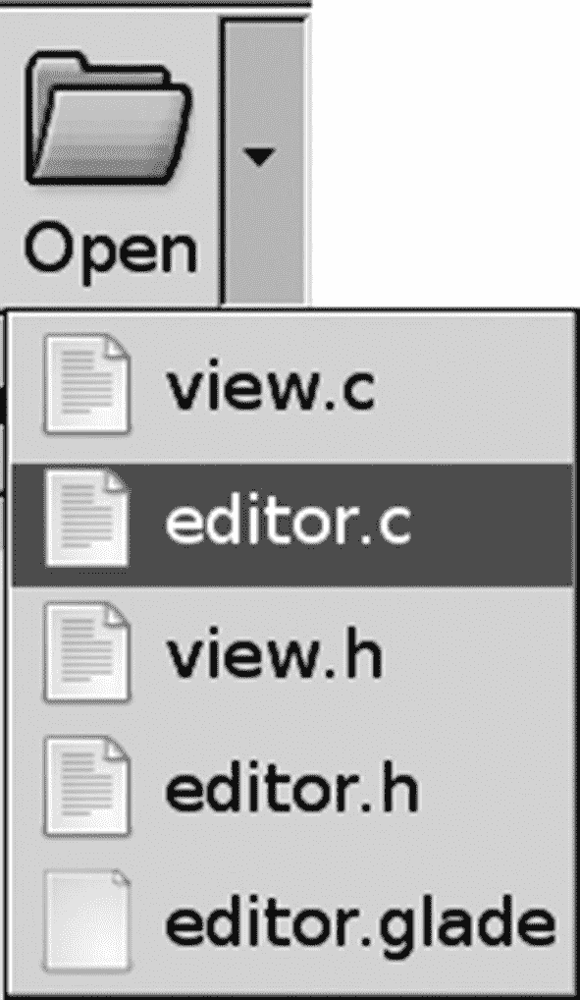

# 十、菜单和工具栏

本章教你如何创建弹出菜单、菜单栏和工具栏。您从手动创建每一个开始，这样您就了解了小部件是如何构造的。这让你对菜单和工具栏所依赖的所有概念有一个牢固的理解。

在理解了每个小部件之后，会向您介绍`Gtk.Builder`，它允许您通过定制的 XML 文件动态创建菜单和工具栏。加载每个用户界面文件，并将每个元素应用于相应的 action 对象，该对象告诉项目如何显示以及如何操作。

在本章中，您将学习以下内容。

*   如何创建弹出菜单、菜单栏和工具栏

*   如何将键盘快捷键应用于菜单项

*   什么是`Gtk.StatusBar`小部件，以及如何使用它向用户提供关于菜单项的更多信息

*   GTK+提供了哪些类型的菜单项和工具栏项

*   如何用 UI 文件动态创建菜单和工具栏

*   如何使用`Gtk.IconFactory`创建自定义库存项目

## 弹出式菜单

本章从学习如何创建弹出式菜单开始。弹出菜单是一个`Gtk.Menu`窗口小部件，当鼠标右键悬停在某些窗口小部件上时显示给用户。一些小工具，比如`Gtk.Entry`和`Gtk.TextView`，已经默认内置了弹出菜单。

如果你想改变一个默认提供弹出菜单的小部件的弹出菜单，你应该在弹出回调函数中编辑提供的`Gtk.Menu`小部件。例如，`Gtk.Entry`和`Gtk.TextView`都有一个 populate-popup 信号，它接收将要显示的`Gtk.Menu`。在向用户显示之前，您可以以任何您认为合适的方式编辑该菜单。

### 创建弹出菜单

对于大多数小部件，您需要创建自己的弹出菜单。在本节中，您将学习如何为一个`Gtk.ProgressBar`小部件提供一个弹出菜单。我们要实现的弹出菜单如图 [10-1](#Fig1) 所示。


图 10-1

包含三个菜单项的简单弹出菜单

三个弹出菜单项使进度条跳动，将其设置为 100%完成，然后清除它。在清单 [10-1](#PC1) 中，一个事件框包含了进度条。因为`Gtk.ProgressBar`和`Gtk.Label`一样，不能自己检测 GDK 事件，我们需要使用事件盒来捕捉`button-press-event`信号。

```py
#!/usr/bin/python3

import sys
import gi
gi.require_version('Gtk', '3.0')
from gi.repository import Gtk, Gdk

class AppWindow(Gtk.ApplicationWindow):

    def __init__(self, *args, **kwargs):
        super().__init__(*args, **kwargs)
        self.set_border_width(10)
        self.set_size_request(250, -1)
        # Create all of the necessary widgets and initialize the pop-up menu.  menu = Gtk.Menu.new()
        eventbox = Gtk.EventBox.new()
        progress = Gtk.ProgressBar.new() progress.set_text("Nothing Yet Happened")
        progress.set_show_text(True) self.create_popup_menu(menu, progress)
        progress.set_pulse_step(0.05) eventbox.set_above_child(False)
        eventbox.connect("button_press_event", self.button_press_event, menu) eventbox.add(progress)
        self.add(eventbox)
        eventbox.set_events(Gdk.EventMask.BUTTON_PRESS_MASK)
        eventbox.realize()

    def create_popup_menu(self, menu, progress):
        pulse = Gtk.MenuItem.new_with_label("Pulse Progress")
        fill = Gtk.MenuItem.new_with_label("Set as Complete")
        clear = Gtk.MenuItem.new_with_label("Clear Progress")
        separator = Gtk.SeparatorMenuItem.new()
        pulse.connect("activate", self.pulse_activated, progress)
        fill.connect("activate", self.fill_activated, progress)
        clear.connect("activate", self.clear_activated, progress)
        menu.append(pulse)
        menu.append(separator)
        menu.append(fill)
        menu.append(clear)
        menu.attach_to_widget(progress, None)
        menu.show_all()

    def button_press_event(self, eventbox, event, menu):
        pass

    def pulse_activated(self, item, progress):
        pass

    def fill_activated(self, item, progress):
        pass

    def clear_activated(self, item, progress):
        pass

class Application(Gtk.Application):

    def __init__(self, *args, **kwargs):
        super().__init__(*args, application_id="org.example.myapp",
                         **kwargs)
        self.window = None

    def do_activate(self):
        if not self.window:
            self.window = AppWindow(application=self, title="Pop-up Menus")
        self.window.show_all()
        self.window.present()
    if __name__ == "__main__":
        app = Application()
        app.run(sys.argv)

Listing 10-1Simple Pop-up Menu

```

在大多数情况下，您希望使用`button-press-event`来检测用户希望弹出菜单何时显示。这允许您检查是否单击了鼠标右键。如果点击了鼠标右键，`Gdk.EventButton`的按钮成员等于 3。

不过，`Gtk.Widget`也提供了`popup-menu`信号，当用户按下内置的按键加速器激活弹出菜单时，该信号被激活。大多数用户使用鼠标来激活弹出菜单，所以这在 GTK+应用中通常不是一个因素。然而，如果您也想处理这个信号，您应该创建第三个函数来显示由两个回调函数调用的弹出菜单。

用`Gtk.Menu.new()`创建新菜单。菜单初始化时没有初始内容，所以下一步是创建菜单项。

在本节中，我们将介绍两种类型的菜单项。第一个是所有其他类型菜单项的基类，`Gtk.MenuItem`。为`Gtk.MenuItem`提供了三种初始化功能:`Gtk.MenuItem.new()`、`Gtk.MenuItem.new_with_label()`和`Gtk.MenuItem.new_with_mnemonic()`。

```py
pulse = Gtk.MenuItem.new_with_label("Pulse Progress")

```

大多数情况下，你不需要使用`Gtk.MenuItem.new()`，因为一个没有内容的菜单项没有多大用处。如果您使用该函数来初始化菜单项，您必须用代码构造菜单的每个方面，而不是让 GTK+来处理细节。

### 注意

菜单项助记符和键盘快捷键不是一回事。当菜单具有焦点时，当用户按下 **Alt** 和适当的字母数字键时，助记符激活菜单项。键盘快捷键是一种自定义的组合键，当按下该组合键时会运行回调函数。在下一节中，您将了解菜单的键盘快捷键。

另一种类型的基本菜单项是`Gtk.SeparatorMenuItem`，它在其位置放置一个通用分隔符。您可以使用`Gtk.SeparatorMenuItem.new()`创建一个新的分隔符菜单项。

在设计菜单结构时，分隔符非常重要，因为它们将菜单项组织成组，这样用户就可以很容易地找到合适的菜单项。例如，在“文件”菜单中，菜单项通常被组织成打开文件、保存文件、打印文件和关闭应用的组。很少会出现许多菜单项之间没有分隔符的情况(例如，最近显示的文件列表可能没有分隔符)。在大多数情况下，您应该将相似的菜单项组合在一起，并在相邻的组之间放置一个分隔符。

在创建菜单项之后，您需要将每个菜单项连接到激活信号，该信号在用户选择该项时发出。或者，您可以使用 activate-item 信号，该信号也会在显示给定菜单项的子菜单时发出。除非菜单项扩展为子菜单，否则这两者之间没有明显的区别。

每个 activate 和 activate-item 回调函数都接收启动动作的`Gtk.MenuItem`小部件和您需要传递给该函数的任何数据。在清单 [10-2](#PC5) 中，提供了三个菜单项回调函数来脉动进度条，填充到 100%完成，并清除所有进度。

现在您已经创建了所有的菜单项，您需要将它们添加到菜单中。`Gtk.Menu`派生自`Gtk.MenuShell`，是一个抽象基类，包含并显示子菜单和菜单项。菜单项可以通过`menu.append()`添加到菜单外壳中。该函数将每个项目附加到菜单外壳的末尾。

```py
menu.append(pulse)

```

此外，您可以使用`menu.prepend()`或`menu.insert()`分别在菜单的开头添加菜单项或将其插入任意位置。`menu.insert()`接受的位置从零开始。

在将`Gtk.Menu`的所有子控件设置为可见后，您应该调用`menu.attach_to_widget()`以便弹出菜单与特定的小部件相关联。该函数接受弹出菜单和它所附加的小部件。

```py
menu.attach_to_widget(progress, None)

```

`menu.attach_to_widget()`的最后一个参数接受一个`Gtk.MenuDetachFunc`，它可以在菜单脱离小部件时调用一个特定的函数。

### 弹出菜单回调方法

在创建了必要的小部件之后，您需要处理`button-press-event`信号，如清单 [10-2](#PC5) 所示。在本例中，每当鼠标右键单击进度条时，都会显示弹出菜单。

```py
#!/usr/bin/python3

import sys
import gi
gi.require_version('Gtk', '3.0')
from gi.repository import Gtk, Gdk

class AppWindow(Gtk.ApplicationWindow):

    def __init__(self, *args, **kwargs):
        super().__init__(*args, **kwargs)
        self.set_border_width(10)
        self.set_size_request(250, -1)
        # Create all of the necessary widgets and initialize the pop-up
        menu. menu = Gtk.Menu.new()
        eventbox = Gtk.EventBox.new() progress =
        Gtk.ProgressBar.new()
        progress.set_text("Nothing Yet Happened")
        progress.set_show_text(True) self.create_popup_menu(menu, progress)
        progress.set_pulse_step(0.05) eventbox.set_above_child(False)
        eventbox.connect("button_press_event", self.button_press_event, menu) eventbox.add(progress)
        self.add(eventbox)
        eventbox.set_events(Gdk.EventMask.BUTTON_PRESS_MASK) eventbox.realize()

    def create_popup_menu(self, menu, progress):
        pulse = Gtk.MenuItem.new_with_label("Pulse Progress")
        fill = Gtk.MenuItem.new_with_label("Set as Complete")
        clear = Gtk.MenuItem.new_with_label("Clear Progress")
        separator = Gtk.SeparatorMenuItem.new()
        pulse.connect("activate", self.pulse_activated, progress)
        fill.connect("activate", self.fill_activated, progress)
        clear.connect("activate", self.clear_activated, progress)
        menu.append(pulse)
        menu.append(separator)
        menu.append(fill)
        menu.append(clear)
        menu.attach_to_widget(progress, None)
        menu.show_all()

    def button_press_event(self, eventbox, event, menu):
        if event.button == 3 and event.type == Gdk.EventType.BUTTON_PRESS: menu.popup(None, None, None, None, event.button, event.time) return True

        return False

    def pulse_activated(self, item, progress):
        progress.pulse()
        progress.set_text("Pulse!")

    def fill_activated(self, item, progress):
        progress.set_fraction(1.0)
        progress.set_text("One Hundred Percent")

    def clear_activated(self, item, progress):
        progress.set_fraction(0.0)
        progress.set_text("Reset to Zero")

class Application(Gtk.Application):

    def __init__(self, *args, **kwargs):
        super().__init__(*args, application_id="org.example.myapp",
                         **kwargs)
        self.window = None

    def do_activate(self):
        if not self.window:
            self.window = AppWindow(application=self, title="Pop-up Menus")
        self.window.show_all()
        self.window.present()
    if __name__ == "__main__":
        app = Application()
        app.run(sys.argv)

Listing 10-2Callback Functions for the Simple Pop-up Menu

```

在清单 [10-2](#PC5) 中的`button-press-event`回调函数中，可以使用`menu.popup()`在屏幕上显示菜单。

```py
menu.popup(parent_menu_shell, parent_menu_item, func, func_data, button, event_time)

```

在清单 [10-2](#PC5) 中，除了被点击导致事件的鼠标按钮(事件➤按钮)和事件发生的时间(event.time)之外，所有参数都被设置为`None`。如果弹出菜单是由按钮之外的其他东西激活的，您应该为 button 参数提供 0。

### 注意

如果该操作是由弹出菜单信号调用的，则事件时间将不可用。那样的话，可以用`Gtk.get_current_event_time()`。该函数返回当前事件的时间戳，如果没有最近的事件，则返回`Gdk.CURRENT_TIME`。

通常，`parent_menu_shell`、`parent_menu_item`、`func`和`func_data`被设置为`None`，因为它们在菜单是菜单栏结构的一部分时使用。`parent_menu_shell`小部件是包含导致弹出初始化的项目的菜单外壳。或者，您可以提供`parent_menu_item`，它是导致弹出初始化的菜单项。

`Gtk.MenuPositionFunc`是一个决定在屏幕上的什么位置绘制菜单的功能。它接受`func_data`作为可选的最后一个参数。这些参数在应用中不经常使用，因此可以安全地设置为`None`。在我们的例子中，弹出菜单已经与进度条相关联，所以它被绘制在正确的位置。

## 键盘快捷键

创建菜单时，最重要的事情之一就是设置键盘快捷键。键盘快捷键是由一个快捷键和一个或多个修饰键组成的组合键，如 **Ctrl** 或 **Shift** 。当用户按下组合键时，会发出相应的信号。

清单 [10-3](#PC7) 是进度条弹出菜单应用的扩展，它为菜单项添加了键盘快捷键。当用户按 Ctrl+P 时，进度条是脉冲式的，用 Ctrl+F 填充，用 Ctrl+C 清除。

```py
#!/usr/bin/python3

import sys
import gi
gi.require_version('Gtk', '3.0')
from gi.repository import Gtk, Gdk

class AppWindow(Gtk.ApplicationWindow):

    def __init__(self, *args, **kwargs):
        super().__init__(*args, **kwargs)
        self.set_border_width(10)
        self.set_size_request(250, -1)
        # Create all of the necessary widgets and initialize the pop-up menu. menu = Gtk.Menu.new()
        eventbox = Gtk.EventBox.new() progress = Gtk.ProgressBar.new() progress.set_text("Nothing Yet Happened") progress.set_show_text(True) self.create_popup_menu(menu, progress) progress.set_pulse_step(0.05) eventbox.set_above_child(False)
        eventbox.connect("button_press_event", self.button_press_event, menu) eventbox.add(progress)
        self.add(eventbox)
        eventbox.set_events(Gdk.EventMask.BUTTON_PRESS_MASK)
        eventbox.realize()

    def create_popup_menu(self, menu, progress):
        group = Gtk.AccelGroup.new()
        self.add_accel_group(group)
        menu.set_accel_group(group)
        pulse = Gtk.MenuItem.new_with_label("Pulse Progress")
        fill = Gtk.MenuItem.new_with_label("Set as Complete")
        clear = Gtk.MenuItem.new_with_label("Clear Progress")
        separator = Gtk.SeparatorMenuItem.new()
        # Add the necessary keyboard accelerators.
        pulse.add_accelerator("activate", group, Gdk.KEY_P, Gdk.ModifierType.CONTROL, Gtk.AccelFlags.VISIBLE)
        fill.add_accelerator("activate", group, Gdk.KEY_F, Gdk.ModifierType.CONTROL, Gtk.AccelFlags.VISIBLE)
        clear.add_accelerator("activate", group, Gdk.KEY_C, Gdk.ModifierType.CONTROL, Gtk.AccelFlags.VISIBLE)
        pulse.connect("activate", self.pulse_activated, progress)
        fill.connect("activate", self.fill_activated, progress)
        clear.connect("activate", self.clear_activated, progress)
        menu.append(pulse)
        menu.append(separator)
        menu.append(fill)
        menu.append(clear)
        menu.attach_to_widget(progress, None)
        menu.show_all()

    def button_press_event(self, eventbox, event, menu):
        if event.button == 3 and event.type == Gdk.EventType.BUTTON_PRESS: menu.popup(None, None, None, None, event.button, event.time) return True
        return False

    def pulse_activated(self, item, progress):
        progress.pulse()
        progress.set_text("Pulse!")

    def fill_activated(self, item, progress):
        progress.set_fraction(1.0)
        progress.set_text("One Hundred Percent")

    def clear_activated(self, item, progress):
        progress.set_fraction(0.0)
        progress.set_text("Reset to Zero")

class Application(Gtk.Application):

    def __init__(self, *args, **kwargs):
        super().__init__(*args, application_id="org.example.myapp",
                         **kwargs)
        self.window = None

    def do_activate(self):
        if not self.window:
            self.window = AppWindow(application=self, title="Pop-up Menus")
        self.window.show_all()
        self.window.present()
    if __name__ == "__main__":
        app = Application()
        app.run(sys.argv)

Listing 10-3Adding Accelerators to Menu Items

```

键盘快捷键存储为`Gtk.AccelGroup`的一个实例。要在您的应用中实现加速器，您需要用`Gtk.AccelGroup.new()`创建一个新的加速器组。该加速器组必须添加到菜单出现的`Gtk.Window`中才能生效。它还必须与任何利用其加速器的菜单相关联。在清单 [10-3](#PC7) 中，这是在用`self.add_accel_group()`和`menu.set_accel_group()`创建`Gtk.AccelGroup`之后立即执行的。

可以用`Gtk.AccelMap`手动创建键盘快捷键，但是在大多数情况下，`widget.add_accelerator()`提供了所有必要的功能。这种方法存在的唯一问题是，用户不能在运行时更改用该函数创建的键盘快捷键。

```py
widget.add_accelerator(signal_name, group, accel_key, mods, flags)

```

要向小部件添加加速器，可以使用`widget.add_accelerator()`，当用户按下组合键时，它会在小部件上发出由 signal_name 指定的信号。您需要为该功能指定您的快捷键组，如前所述，它必须与窗口和菜单相关联。

一个加速键和一个或多个修饰键形成完整的组合键。PyGObject API 参考中提供了可用快捷键的列表。所有可用关键字的定义都可以包含在 import GDK 语句中。

修饰符由`Gdk.ModifierType`枚举指定。最常用的修饰键是`Gdk.ModifierType.SHIFT_MASK`、`Gdk.ModifierType.CONTROL_MASK`和`Gdk.ModifierType.MOD1_MASK`，分别对应 Shift、Ctrl 和 Alt 键。

### 小费

当处理键码时，您需要小心，因为在某些情况下，您可能需要为同一个动作提供多个键。例如，如果你想抓住数字 **1** 键，你需要注意`Gdk.KEY_1`和`Gdk.KEY_KP_1`——它们对应于键盘顶部的 **1** 键和数字小键盘上的 **1** 键。

`widget.add_accelerator()`的最后一个参数是加速器标志。由`Gtk.AccelFlags`枚举定义了三个标志。如果设置了`Gtk.AccelFlags.VISIBLE`，则在标签中可以看到加速器。`Gtk.AccelFlags.LOCKED`防止用户修改加速器。`Gtk.AccelFlags.MASK`为小工具加速器设置两个标志。

## 状态栏提示

通常放置在主窗口的底部，`Gtk.Statusbar`窗口小部件可以给用户关于应用正在运行的更多信息。状态栏对于菜单也非常有用，因为您可以向用户提供更多关于鼠标光标所悬停的菜单项功能的信息。状态栏截图如图 [10-2](#Fig2) 所示。


图 10-2

带有状态栏提示的弹出式菜单

### 状态栏小部件

虽然状态栏一次只能显示一条消息，但是小部件实际上存储了一堆消息。当前显示的消息在栈顶。从堆栈中弹出消息时，会显示上一条消息。如果从顶部弹出一条消息后，堆栈上没有剩余的字符串，则状态栏上不会显示任何消息。

用`Gtk.Ststusbar.new()`创建新的状态栏小部件。这将创建一个新的带有空消息堆栈的`Gtk.Statusbar`小部件。在能够在新状态栏的堆栈中添加或删除消息之前，必须用`statusbar.get_context_id()`检索上下文标识符。

```py
id = statusbar.get_context_id(description)

```

上下文标识符是与上下文描述字符串相关联的唯一无符号整数。该标识符用于特定类型的所有消息，这允许您对堆栈上的消息进行分类。

例如，如果您的状态栏包含超链接和 IP 地址，您可以从字符串“URL”和“IP”创建两个上下文标识符。当您将消息推入堆栈或从堆栈弹出消息时，您必须指定一个上下文标识符。这允许应用的不同部分在状态栏消息堆栈中推送和弹出消息，而不会相互影响。

### 小费

对不同类别的消息使用不同的上下文标识符是很重要的。如果应用的一部分试图给用户一个消息，而另一部分试图删除自己的消息，你不希望错误的消息从堆栈中弹出！

在您生成上下文标识符之后，您可以使用`statusbar.push()`将一条消息添加到状态栏的栈顶。该函数返回刚刚添加的字符串的唯一消息标识符。这个标识符可以在以后用于从堆栈中移除消息，而不管它在什么位置。

```py
statusbar.push(context_id, message)

```

有两种方法可以从堆栈中删除消息。如果您想从特定上下文 ID 的堆栈顶部删除一条消息，您可以使用`statusbar.pop()`。该函数删除状态栏堆栈中上下文标识符为`context_id`的最高消息。

```py
statusbar.pop(context_id)

```

也可以用`statusbar.remove()`从状态栏的消息堆栈中删除特定的消息。为此，您必须提供消息的上下文标识符和想要删除的消息的消息标识符，这是在添加消息时由`statusbar.push()`返回的。

```py
statusbar.remove(context_id, message_id)

```

### 菜单项信息

状态栏的一个有用的作用是给用户更多关于鼠标光标当前悬停的菜单项的信息。图 [10-2](#Fig2) 显示了这样一个例子，这是清单 [10-4](#PC13) 中的进度条弹出菜单应用的截图。

要实现状态栏提示，你应该将你的每个菜单项连接到`Gtk.Widget`的`"enter-notify-event"`和`"leave-notify-event"`信号。清单 [10-4](#PC13) 显示了你已经知道的进度条弹出菜单应用，除了当鼠标光标移动到一个菜单项上时状态栏提示被提供。

```py
#!/usr/bin/python3

import sys
import gi
gi.require_version('Gtk', '3.0')
from gi.repository import Gtk, Gdk

class AppMenuItem(Gtk.MenuItem):

    def __init__(self, *args, **kwargs):
        super().__init__(*args, **kwargs)

    def __setattr__(self, name, value):
        self.__dict__[name] = value

    def __getattr__(self, name):
        return self.__dict__[name]

class AppWindow(Gtk.ApplicationWindow):

    def __init__(self, *args, **kwargs):
        super().__init__(*args, **kwargs)
        self.set_border_width(10)
        self.set_size_request(250, -1)
        # Create all of the necessary widgets and initialize the pop-up menu. menu = Gtk.Menu.new()
        eventbox = Gtk.EventBox.new() progress = Gtk.ProgressBar.new()
        progress.set_text("Nothing Yet Happened")
        progress.set_show_text(True)
        statusbar = Gtk.Statusbar.new()
        self.create_popup_menu(menu, progress, statusbar)
        progress.set_pulse_step(0.05)
        eventbox.set_above_child(False)
        eventbox.connect("button_press_event", self.button_press_event, menu)
        eventbox.add(progress)
        vbox = Gtk.Box.new(orientation=Gtk.Orientation.VERTICAL, spacing=0)
        vbox.pack_start(eventbox, False, True, 0)
        vbox.pack_start(statusbar, False, True, 0)
        self.add(vbox)
        eventbox.set_events(Gdk.EventMask.BUTTON_PRESS_MASK)
        eventbox.realize()

    def create_popup_menu(self, menu, progress, statusbar):
        pulse = AppMenuItem(label="Pulse Progress")
        fill = AppMenuItem(label="Set as Complete")
        clear = AppMenuItem(label="Clear Progress")
        separator = Gtk.SeparatorMenuItem.new()
        pulse.connect("activate", self.pulse_activated, progress)
        fill.connect("activate", self.fill_activated, progress)
        clear.connect("activate", self.clear_activated, progress)
        Connect signals to each menu item for status bar messages. pulse.connect("enter-notify-event", self.statusbar_hint, statusbar) pulse.connect("leave-notify-event", self.statusbar_hint, statusbar) fill.connect("enter-notify-event", self.statusbar_hint, statusbar) fill.connect("leave-notify-event", self.statusbar_hint, statusbar) clear.connect("enter-notify-event", self.statusbar_hint, statusbar) clear.connect("leave-notify-event", self.statusbar_hint, statusbar) pulse.__setattr__("menuhint", "Pulse the progress bar one step.") fill.__setattr__("menuhint", "Set the progress bar to 100%.") clear.__setattr__("menuhint", "Clear the progress bar to 0%.") menu.append(pulse)
        menu.append(separator)
        menu.append(fill)
        menu.append(clear)
        menu.attach_to_widget(progress, None) menu.show_all()

    def button_press_event(self, eventbox, event, menu):
        if event.button == 3 and event.type == Gdk.EventType.BUTTON_PRESS: menu.popup(None, None, None, None, event.button, event.time) return True
        return False

    def pulse_activated(self, item, progress):
        progress.pulse()
        progress.set_text("Pulse!")

    def fill_activated(self, item, progress):
        progress.set_fraction(1.0)
        progress.set_text("One Hundred Percent")

    def clear_activated(self, item, progress): progress.set_fraction(0.0) progress.set_text("Reset to Zero")

    def statusbar_hint(self, menuitem, event, statusbar): id = statusbar.get_context_id("MenuItemHints")
        if event.type == Gdk.EventType.ENTER_NOTIFY:
            hint = menuitem.__getattr__("menuhint")
            id = statusbar.push(id, hint)
        elif event.type == Gdk.EventType.LEAVE_NOTIFY:
            statusbar.pop(id)
        return False

class Application(Gtk.Application):

    def __init__(self, *args, **kwargs):
        super().__init__(*args, application_id="org.example.myapp",
                         **kwargs)
        self.window = None

    def do_activate(self):
        if not self.window:
            self.window = AppWindow(application=self, title="Pop-up Menus")
        self.window.show_all()
        self.window.present()
    if __name__ == "__main__":
        app = Application()
        app.run(sys.argv)

Listing 10-4Displaying More Information About a Menu Item

```

当实现状态栏提示时，你首先需要弄清楚什么信号是必要的。我们希望能够在鼠标光标移动到菜单项上时向状态栏添加一条消息，并在鼠标光标离开时删除它。从这个描述来看，使用“进入-通知-事件”和“离开-通知-事件”是一个很好的解决方案。

由于 Python 3 的 GTK+ 3 接口没有在 GTK+对象上实现`get_data()`和`set_data()`方法，我们需要子类化`Gtk.MenuItem`类来实现相应的 Python 3 属性。这种方法也被用在本书的其他例子中。

使用这两个信号的一个优点是我们只需要一个回调函数，因为每个函数的原型都接收一个`Gdk.EventProximity`对象。从这个物体中，我们可以分辨出`Gdk.EventType.ENTER_NOTIFY`和`Gdk.EventType.LEAVE_NOTIFY`事件。你想从回调函数中返回`False`，因为你不想阻止 GTK+处理事件；您只想增强它发出时所执行的内容。

在`statusbar_hint()`回调方法中，您应该首先检索菜单项消息的上下文标识符。您可以使用任何您想要的字符串，只要您的应用记得使用了什么。清单 [10-4](#PC13) 描述了所有添加到状态栏的菜单项消息。如果应用的其他部分使用状态栏，使用不同的上下文标识符将不会影响菜单项提示。

```py
id = statusbar.get_context_id("MenuItemHints")

```

如果事件类型为`Gdk.EventType.ENTER_NOTIFY`，则需要向用户显示消息。在`create_popup_menu()`方法中，一个数据参数被添加到每个名为`"menuhint"`的菜单项中。这是对菜单项功能的更深入的描述，显示给用户。

```py
hint = menuitem.__getattr__("menuhint")
statusbar.push(id, hint)

```

然后，使用`statusbar.push()`，可以将消息添加到状态栏的`"MenuItemHints"`上下文标识符下。该消息被放在堆栈的顶部并显示给用户。您可能想考虑在调用这个方法之后处理所有的 GTK+事件，因为用户界面应该立即反映这些变化。

但是，如果事件类型是`Gdk.EventType.LEAVE_NOTIFY`，您需要删除使用相同上下文标识符添加的最后一个菜单项消息。最近的消息可以用`statusbar.pop()`从堆栈中删除。

## 菜单项

到目前为止，您已经了解了显示标签和分隔符菜单项的平面菜单。也可以向现有菜单项添加子菜单。GTK+还提供了许多其他的`Gtk.MenuItem`对象。图 [10-3](#Fig3) 显示了一个弹出菜单，其中包含一个子菜单以及图像、检查和单选菜单项。


图 10-3

图像、检查和单选菜单项

### 子菜单

GTK+中的子菜单不是由单独类型的菜单项小部件创建的，而是通过调用`menuitem.set_submenu()`创建的。该方法调用`menu.attach_to_widget()`将子菜单附加到菜单项，并在菜单项旁边放置一个箭头，表示它现在有子菜单。如果菜单项已经有子菜单，它将被给定的`Gtk.Menu`小部件替换。

```py
menuitem.set_submenu(submenu)

```

如果你有一个非常具体的选项列表，会使原本组织有序的菜单结构变得混乱，那么子菜单非常有用。使用子菜单时，您可以使用由`Gtk.MenuItem`小部件提供的“activate-item”信号，该信号在菜单项显示其子菜单时发出。

除了`Gtk.MenuItem`和菜单项分隔符，还有另外三种类型的菜单项对象:图像、复选、单选菜单项；这些将在本节的剩余部分中介绍。

### 图像菜单项

### 警告

从 GTK+ 3.1 开始，`Gtk.ImageMenuItem`类就被弃用了。不要在新代码中使用它，注意它可能会在 GTK+的新版本中完全消失。

`Gtk.ImageMenuItem`与其父类`Gtk.MenuItem`非常相似，除了它在菜单项标签的左边显示了一个小图像。为创建新的图像菜单项提供了四个功能。

第一个函数`imagemenuitem.new()`创建了一个新的`Gtk.ImageMenuItem`对象，它有一个空标签，没有关联的图像。您可以使用图像菜单项的 image 属性来设置菜单项显示的图像。

```py
Gtk.ImageMenuItem.new()

```

此外，您可以使用`Gtk.ImageMenuItem.new_from_stock()`从纸张标识符创建新的图像菜单项。这个函数使用与 stock_id 相关联的标签和图像创建`Gtk.ImageMenuItem`。该函数接受股票标识符字符串。

```py
Gtk.ImageMenuItem.new_from_stock(stockid, accel_group)

```

该函数的第二个参数接受一个加速器组，它被设置为库存项目的默认加速器。如果你想像我们在清单 [10-3](#PC7) 中所做的那样为菜单项手动设置键盘快捷键，你可以为这个参数指定`None`。

同样，您可以使用`Gtk.ImageMenuItem.new_with_label()`创建一个新的`Gtk.ImageMenuItem`，最初只有一个标签。稍后，您可以使用 image 属性添加一个图像小部件。GTK+还提供了方法`imagemenuitem.set_image()`，允许您编辑小部件的图像属性。

```py
Gtk.ImageMenuItem.new_with_label(label)

```

另外，GTK+提供了`Gtk.ImageMenuItem.new_with_mnemonic()`，它创建了一个带有助记标签的图像菜单项。与前面的方法一样，您必须在创建菜单项后设置 image 属性。

### 检查菜单项

`Gtk.CheckMenuItem`允许您创建一个菜单项，根据其布尔活动属性是`True`还是`False`，在标签旁边显示一个复选符号。这将允许用户查看选项是被激活还是被停用。

与`Gtk.MenuItem`一样，提供了三个初始化功能。

`Gtk.CheckMenuItem.new()`、`Gtk.CheckItem.new_with_label()`和`Gtk.CheckMenuItem.new_with_mnemonic()`。这些函数分别创建一个没有标签、有初始标签或有助记标签的`Gtk.CheckMenuItem`。

```py
Gtk.CheckMenuItem.new()
Gtk.CheckMenuItem.new_with_label(label)
Gtk.CheckMenuItem.new_with_mnemonic(label)

```

如前所述，check 菜单项的当前状态由小部件的 active 属性保存。GTK+提供了`checkmenuitem.set_active()`和`checkmenuitem.get_active()`两个函数来设置和检索有效值。

与所有的 check button 小部件一样，您可以使用“toggled”信号，当用户切换菜单项的状态时会发出该信号。GTK+负责更新 check 按钮的状态，所以这个信号只是允许您更新应用以反映更改后的值。

`Gtk.CheckMenuItem`还提供了`checkmenuitem.set_inconsistent()`，改变菜单项的不一致属性。当设置为`True`时，检查菜单项显示第三种“中间”状态，既不是活动状态也不是非活动状态。这可以向用户显示必须做出尚未设置的选择，或者对选择的不同部分设置和取消设置属性。

### 单选菜单项

`Gtk.RadioMenuItem`是从`Gtk.CheckMenuItem`派生出来的一个 widget。通过将 check 菜单项的 draw-as-radio 属性设置为`True`，它被呈现为单选按钮而不是复选按钮。单选菜单项的工作方式与普通单选按钮相同。

第一个单选按钮应该使用下列函数之一创建。您可以将单选按钮组设置为`None`，因为必需的元素是通过引用第一个元素添加到组中的。这些函数分别创建一个空菜单项、一个带标签的菜单项和一个带助记符的菜单项。

```py
Gtk.RadioMenuItem.new(group)
Gtk.RadioMenuItem.new_with_label(group, text)
Gtk.RadioMenuItem.new_with_mnemonic(group, text)

```

所有其他单选菜单项都应该使用以下三个函数之一创建，这三个函数将它添加到与 group 关联的单选按钮组中。这些函数分别创建一个空菜单项、一个带标签的菜单项和一个带助记符的菜单项。

```py
Gtk.RadioMenuItem.new_from_widget(group)
Gtk.RadioMenuItem.new_from_widget_with_label(group, text)
Gtk.RadioMenuItem.new_from_widget_with_mnemonic(group, text)

```

## 菜单栏

`Gtk.MenuBar`是一个将多个弹出菜单组织成水平或垂直行的小部件。每个根元素都是一个`Gtk.MenuItem`，它会向下弹出一个子菜单。一个`Gtk.MenuBar`的实例通常显示在主应用窗口的顶部，以提供对应用所提供功能的访问。菜单栏示例如图 [10-4](#Fig4) 所示。


图 10-4

有三个菜单的菜单栏

在清单 [10-5](#PC23) 中，创建了一个带有三个菜单的`Gtk.MenuBar`小部件:文件、编辑和帮助。每个菜单实际上都是一个带有子菜单的`Gtk.MenuItem`。然后，许多菜单项被添加到每个子菜单中。

```py
#!/usr/bin/python3

import sys
import gi
gi.require_version('Gtk', '3.0')
from gi.repository import Gtk

class AppWindow(Gtk.ApplicationWindow):

    def __init__(self, *args, **kwargs):
        super().__init__(*args, **kwargs)
        self.set_size_request(250, -1)
        menubar = Gtk.MenuBar.new()
        file = Gtk.MenuItem.new_with_label("File")
        edit = Gtk.MenuItem.new_with_label("Edit")
        help = Gtk.MenuItem.new_with_label("Help")
        filemenu = Gtk.Menu.new()
        editmenu = Gtk.Menu.new()
        helpmenu = Gtk.Menu.new()
        file.set_submenu(filemenu)
        edit.set_submenu(editmenu)
        help.set_submenu(helpmenu)
        menubar.append(file)
        menubar.append(edit)
        menubar.append(help)
        # Create the File menu content.
        new = Gtk.MenuItem.new_with_label("New")
        open = Gtk.MenuItem.new_with_label("Open")
        filemenu.append(new)
        filemenu.append(open)
        # Create the Edit menu content.
        cut = Gtk.MenuItem.new_with_label("Cut")
        copy = Gtk.MenuItem.new_with_label("Copy")
        paste = Gtk.MenuItem.new_with_label("Paste")
        editmenu.append(cut)
        editmenu.append(copy)
        editmenu.append(paste)
        # Create the Help menu content.
        contents = Gtk.MenuItem.new_with_label("Help")
        about = Gtk.MenuItem.new_with_label("About")
        helpmenu.append(contents)
        helpmenu.append(about)
    self.add(menubar)

class Application(Gtk.Application):

    def __init__(self, *args, **kwargs):
        super().__init__(*args, application_id="org.example.myapp",
                         **kwargs)
        self.window = None
    def do_activate(self):
        if not self.window:
            self.window = AppWindow(application=self, title="Menu Bars")
        self.window.show_all()
        self.window.present()
    if __name__ == "__main__":
        app = Application()
        app.run(sys.argv)

Listing 10-5Creating Groups of Menus

```

使用`Gtk.MenuBar.new()`创建新的`Gtk.MenuBar`小部件。这将创建一个空的菜单外壳，您可以在其中添加内容。

创建菜单栏后，可以用`menubar.set_pack_direction()`定义菜单栏项目的打包方向。`pack_direction`属性的值由`Gtk.PackDirection`枚举定义，包括`Gtk.PackDirection.LTR`、`Gtk.PackDirection.RTL`、`Gtk.PackDirection.TTB`或`Gtk.PackDirection.BTT`。它们分别从左到右、从右到左、从上到下或从下到上打包菜单项。默认情况下，子部件从左到右打包。

`Gtk.MenuBar`还提供了另一个名为`child-pack-direction`的属性，该属性设置菜单栏子菜单的菜单项打包的方向。换句话说，它控制子菜单项的打包方式。这个属性的值也由`Gtk.PackDirection`枚举定义。

菜单栏中的每个子项实际上都是一个`Gtk.MenuItem`小部件。因为`Gtk.MenuBar`是从`Gtk.MenuShell`派生的，所以您可以使用`menuitem.append()`方法向栏中添加一个项目，如下行所示。

```py
menubar.append(file)

```

您也可以使用`file.prepend()`或`file.insert()`将项目添加到菜单栏的开头或任意位置。

接下来您需要调用`file.set_submenu()`来向每个根菜单项添加一个子菜单。每个子菜单都是一个`Gtk.Menu`小部件，创建方式与弹出菜单相同。然后，GTK+会在必要时向用户显示子菜单。

```py
file.set_submenu(filemenu)

```

## 工具栏

一个`Gtk.Toolbar`是一种容器，它在水平或垂直的行中保存了许多小部件。这意味着可以很容易地定制大量的小部件。通常，工具栏包含可以显示图像和文本字符串的工具按钮。然而，工具栏实际上可以容纳任何类型的小部件。图 [10-5](#Fig5) 中显示了一个包含四个工具按钮和一个分隔符的工具栏。


图 10-5

显示图像和文本的工具栏

在清单 [10-6](#PC26) 中，创建了一个简单的工具栏，在水平行中显示五个工具项。每个工具栏项都显示一个图标和一个描述该项目的用途的标签。工具栏还被设置为显示一个箭头，该箭头提供对菜单中不适合的工具栏项目的访问。

在本例中，工具栏为`Gtk.Entry`小部件提供剪切、复制、粘贴和全选功能。`AppWindow()`方法创建工具栏，将其打包在`Gtk.Entry`之上。然后它调用`create_toolbar()`，用工具项填充工具栏并连接必要的信号。

```py
#!/usr/bin/python3

import sys
import gi
gi.require_version('Gtk', '3.0')
from gi.repository import Gtk

class AppWindow(Gtk.ApplicationWindow):

    def __init__(self, *args, **kwargs):
        super().__init__(*args, **kwargs)
        vbox = Gtk.Box(orientation=Gtk.Orientation.VERTICAL, spacing=0)
        toolbar = Gtk.Toolbar.new()
        entry = Gtk.Entry.new()
        vbox.pack_start(toolbar, True, False, 0)
        vbox.pack_start(entry, True, False, 0)
        self.create_toolbar(toolbar, entry)
        self.add(vbox)
        self.set_size_request(310, 75)

    def create_toolbar(self, toolbar, entry): icon_theme = Gtk.IconTheme.get_default()
        icon = icon_theme.load_icon("edit-cut", -1,
                                    Gtk.IconLookupFlags.FORCE_SIZE)
        image = Gtk.Image.new_from_pixbuf(icon)
        cut = Gtk.ToolButton.new(image, "Cut")
        icon = icon_theme.load_icon("edit-copy", -1,
        Gtk.IconLookupFlags.FORCE_SIZE)
        image = Gtk.Image.new_from_pixbuf(icon)
        copy = Gtk.ToolButton.new(image, "Copy")
        icon = icon_theme.load_icon("edit-paste", -1,
                                    Gtk.IconLookupFlags.FORCE_SIZE)
        image = Gtk.Image.new_from_pixbuf(icon)
        paste = Gtk.ToolButton.new(image, "Paste")
        icon = icon_theme.load_icon("edit-select-all", -1, Gtk.IconLookupFlags.FORCE_SIZE)
        image = Gtk.Image.new_from_pixbuf(icon)
        selectall = Gtk.ToolButton.new(image, "Select All")
        separator = Gtk.SeparatorToolItem.new()
        toolbar.set_show_arrow(True)
        toolbar.set_style(Gtk.ToolbarStyle.BOTH)
        toolbar.insert(cut, 0)
        toolbar.insert(copy, 1)
        toolbar.insert(paste, 2)
        toolbar.insert(separator, 3)
        toolbar.insert(selectall, 4)
        cut.connect("clicked", self.cut_clipboard, entry)
        copy.connect("clicked", self.copy_clipboard, entry)
        paste.connect("clicked", self.paste_clipboard, entry)
        selectall.connect("clicked", self.select_all, entry)

    def cut_clipboard(self, button, entry):
        entry.cut_clipboard()

    def copy_clipboard(self, button, entry):
        entry.copy_clipboard()

    def paste_clipboard(self, button, entry):
        entry.paste_clipboard()

    def select_all(self, button, entry):
        entry.select_region(0, -1)

class Application(Gtk.Application):

    def __init__(self, *args, **kwargs):
        super().__init__(*args, application_id="org.example.myapp",
                         **kwargs)
        self.window = None
    def do_activate(self):
        if not self.window:
            self.window = AppWindow(application=self, title="Toolbar")
        self.window.show_all()
        self.window.present()
    if __name__ == "__main__":
        app = Application()
        app.run(sys.argv)

Listing 10-6Creating a Gtk.Toolbar Widget

```

用`Gtk.Toolbar.new()`创建新的工具栏，它在清单 [10-6](#PC26) 中显示的`create_toolbar()`函数之前被调用。这将创建一个空的`Gtk.Toolbar`小部件，您可以在其中添加工具按钮。

`Gtk.Toolbar`提供了许多属性，用于定制它的显示方式和与用户的交互方式，包括方向、按钮样式以及访问不适合工具栏的项目的能力。

如果因为没有足够的空间而无法在工具栏上显示所有的工具栏项目，那么如果您将`toolbar.set_show_arrow()`设置为`True`，则会出现一个溢出菜单。如果所有项目都可以显示在工具栏上，箭头就会隐藏起来。

```py
toolbar.set_show_arrow(boolean)

```

另一个`Gtk.Toolbar`属性是显示所有菜单项的样式，它是用`toolbar.set_style()`设置的。你应该注意到这个属性可能会被主题覆盖，所以你应该通过调用`toolbar.unset_style()`来提供使用默认样式的选项。有四种工具栏样式，由`Gtk.ToolbarStyle`枚举定义。

*   `Gtk.ToolbarStyle.ICONS`:仅显示工具栏中每个工具按钮的图标。

*   `Gtk.ToolbarStyle.TEXT`:如何只为工具栏中的每个工具按钮添加标签。

*   `Gtk.ToolbarStyle.BOTH`:显示每个工具按钮的图标和标签，图标位于标签上方。

*   `Gtk.ToolbarStyle.BOTH_HORIZ`:显示每个工具按钮的图标和标签，图标在标签的左边。仅当工具项目的“`is-important"`属性设置为`True`时，工具项目的标签文本才会显示。

工具栏的另一个重要属性是可以用`toolbar.set_orientation()`设置的方向。由`Gtk.Orientation`枚举定义了两个可能的值，`Gtk.Orientation.HORIZONTAL`和`Gtk.Orientation.VERTICAL`，它们可以使工具栏水平(默认)或垂直。

## 工具栏项目

清单 [10-6](#PC26) 介绍了三种重要的工具项类型:`Gtk.ToolItem`、`Gtk.ToolButton`和`Gtk.SeparatorToolItem`。所有的工具按钮都是从`Gtk.ToolItem`类中派生出来的，该类保存了所有工具项使用的基本属性。

如果你使用的是`Gtk.ToolbarStyle.BOTH_HORIZ`风格，那么`Gtk.ToolItem`中安装的一个基本属性就是`"is-important"`设置。如果该属性设置为`True`，工具栏项目的标签文本仅针对该样式显示。

与菜单一样，分隔符工具项由`Gtk.SeparatorToolItem`提供，并由`Gtk.SeparatorToolItem.new()`创建。分隔符工具项有一个 draw 属性，当设置为`True`时会绘制一个分隔符。如果您将 draw 设置为`False`，它会在没有任何可视分隔符的位置放置填充。

### 小费

如果您将一个`Gtk.SeparatorToolItem`的扩展属性设置为`True`并将它的绘制属性设置为`False`，您将强制分隔符之后的所有工具项到工具栏的末尾。

大多数工具栏项目都属于`Gtk.ToolButton`类型。`Gtk.ToolButton`只提供了一个初始化方法`Gtk.ToolButton.new()`，因为从 GTK+ 3.1 开始，所有其他的初始化方法都被弃用了。`Gtk.ToolButton.new()`可以创建一个带有自定义图标和标签的`Gtk.ToolButton`。这些属性中的每一个都可以设置为`None`。

```py
Gtk.ToolButton.new(icon, label)

```

使用`toolbutton.set_label()`和`toolbutton.set_icon_widget()`可以在初始化后手动设置标签和图标。这些函数提供对工具按钮的标签和图标小部件属性的访问。

此外，您可以定义自己的小部件来代替带有`toolbutton.set_label_widget()`的工具按钮的默认`Gtk.Label`小部件。这允许您在工具按钮中嵌入任意的小部件，比如一个条目或组合框。如果该属性设置为`None`，则使用默认标签。

```py
toolbutton.set_label_widget(label_widget)

```

创建工具栏项目后，可以用`toolbar.insert()`将每个`Gtk.ToolItem`插入工具栏。

```py
toolbar.insert(item, pos)

```

`toolbar.insert()`的第二个参数接受将项目插入工具栏的位置。工具按钮位置从零开始索引。负位置会将该项追加到工具栏的末尾。

### 切换工具按钮

`Gtk.ToggleToolButton`衍生自`Gtk.ToolButton`，因此只实现初始化和切换能力。切换工具按钮以工具栏项目的形式提供了`Gtk.ToggleButton`小部件的功能。它允许用户查看选项是已设置还是未设置。

切换工具按钮是当活动属性设置为`True`时保持按下状态的工具按钮。当切换按钮的状态改变时，您可以使用切换信号来接收通知。

只有一种方法可以创建新的`Gtk.ToggleToolButton`。这是用`Gtk.ToggleToolButton.new()`实现的，它创建了一个空的工具按钮。然后你可以使用`Gtk.ToolButton`提供的方法来添加标签和图片。

```py
Gtk.ToggleToolButton.new()

```

### 单选工具按钮

`Gtk.RadioToolButton`是从`Gtk.ToggleToolButton`派生出来的，所以继承了“active”属性和“toggled”信号。因此，小部件只需要为您提供一种方法来创建新的单选工具按钮，并将它们添加到单选按钮组中。

应该用`Gtk.RadioToolButton.new()`创建一个单选工具按钮，其中单选组设置为`None`。这将为单选工具按钮创建一个默认的初始单选按钮组。

```py
Gtk.RadioToolButton.new(group)

```

`Gtk.RadioToolButton`继承了`Gtk.ToolButton`的函数，后者提供了一些函数和属性，可以在必要时设置单选按钮的标签。

所有必需的元素都应该用`Gtk.RadioToolButton.from_widget()`创建。将“组”设置为第一个单选按钮会将所有必需的项目添加到同一组中。

```py
Gtk.RadioToolButton.new_from_widget(group)

```

`Gtk.RadioToolButton`提供了一个属性 group，它是属于单选按钮组的另一个单选工具按钮。这允许您将所有单选按钮链接在一起，以便一次只能选择一个。

### 菜单工具按钮

从`Gtk.ToggleToolButton`派生而来的`Gtk.MenuToolButton`，允许你在工具按钮上附加一个菜单。小部件在图像和标签旁边放置一个箭头，提供对相关菜单的访问。例如，您可以使用`Gtk.MenuToolButton`将最近打开的文件列表添加到工具栏按钮中。图 [10-6](#Fig6) 是用于此目的的菜单工具按钮的截图。



图 10-6

显示最近打开的文件的菜单工具按钮

清单 [10-7](#PC34) 向你展示了如何实现一个菜单工具按钮。实际的工具按钮的创建方式与任何其他`Gtk.ToolButton`类似，只是多了一个将菜单附加到`Gtk.MenuToolButton`小部件的步骤。

```py
recent = Gtk.Menu.new()
# Add a number of menu items where each corresponds to one recent file. icon_theme = Gtk.IconTheme.get_default()
icon = icon_theme.load_icon("document-open", -1,
Gtk.IconLookupFlags.FORCE_SIZE)

image = Gtk.Image.new_from_pixbuf(icon)
open = Gtk.MenuToolButton.new(image, "Open")
open.set_menu(recent)

Listing 10-7Using Gtk.MenuToolButton

```

在清单 [10-7](#PC34) 中，菜单工具按钮是用一个图像和一个标签`Gtk.MenuToolButton.new(image, label)`创建的。如果您想在以后使用`Gtk.ToolButton`属性设置它们，您可以将这些参数中的任何一个设置为`None`。

```py
Gtk.MenuToolButton.new(image, label)

```

使`Gtk.MenuToolButton`与众不同的是，工具按钮右边的箭头为用户提供了访问菜单的途径。工具按钮的菜单是用`menutoolbutton.set_menu()`设置的，或者通过将菜单属性设置为一个`Gtk.Menu`小部件来设置。单击箭头时，会向用户显示此菜单。

## 动态菜单创建

### 注意

在 GTK+ 3.1 中不推荐使用`Gtk.UIManager`，所以 UI 文件的创建和加载不包含在本节中。相反，新的`Gtk.Builder`类及其相关的 XML 文件被包含在内。`Gtk.Builder`是一个更强大、更灵活的系统，用于管理外部用户界面描述和操作。它还提供了附加功能，并减少了创建和管理用户界面所需的工作量。

虽然可以手动创建每个菜单和工具栏项，但这样做会占用大量空间，并导致您不得不单调地编写不必要的代码。为了自动创建菜单和工具栏，GTK+允许您从 XML 文件动态创建菜单。

类可以创建许多用户界面对象，包括菜单、菜单栏、弹出菜单、整个对话框、主窗口等等。本节集中讨论不同类型的菜单，但是你应该记住`Gtk.Builder`可以构建许多其他类型的用户界面对象。

### 创建 XML 文件

用户界面文件以 XML 格式构造。所有的内容都必须包含在<interface>和</interface>标签之间。您可以创建的一种动态 UI 是带有

<menu>tag shown in Listing</menu>

[10-8](#PC36).

```py
<?xml version="1.0" encoding="UTF-8"?>
<interface>
  <menu id="menubar">
    <submenu>
      <attribute name="label">File</attribute>
    </submenu>
    <submenu>
      <attribute name="label">Edit</attribute>
    </submenu>
    <submenu>
      <attribute name="label">Choices</attribute>
    </submenu>
    <submenu>
      <attribute name="label">Help</attribute>
    </submenu>
  </menu>
</interface>

Listing 10-8Menu UI File

```

每个菜单和项目标记都应该有一个与之关联的唯一 ID，这样您就可以从代码中直接访问该项。虽然不是必需的，但您应该始终将 name 属性添加到每个菜单和项目中。name 属性可以访问实际的小部件。

每个

<menu>可以有任意数量的<item>子节点。根据正常的 XML 规则，这两个标签都必须关闭。如果一个标签没有结束标签(例如，

<menu>)，您必须在标签的末尾加上一个正斜杠字符(`/`)，这样解析器就知道标签已经结束了。</menu>

每个

<menu>和<item>标签也可以有其他子标签，比如

<section>和<attribute>标签。

<section>标签组织了<item>标签。<attribute>标签用于描述

<menu>和<item>标签(即添加属性)。</item></menu></attribute></item> </section></attribute> </section></item> </menu>

<attribute>标签有多种用途，但是所有<item>标签共有的一个用途是包含标签属性。该属性提供了在<item>上可见的标签字符串。在这种情况下，与一个`Gtk.MenuItem`标签属性相对应的<item>标签指定了出现在菜单项中的字符串。</item></item></item></attribute>

与每个<item>标签一起出现的另一个<attribute>标签是 action 属性。该标签指定了点击<item>时要采取的动作。指定的动作与`Gtk.Application`和`Gtk.ApplicationWindow`类(或它们的子类)紧密相关。每个动作的目标指定哪个类实例——`Gtk.ApplicationWindow`或`Gtk.Application`—创建了`Gio.SimpleAction`,并将其连接到同一个类实例中的方法来处理动作。您可以将<attribute>动作标签视为一种信号名称，它是要处理的真实信号的别名。</attribute></item></attribute></item>

action 属性适用于除顶级小部件和分隔符之外的所有元素。当加载 UI 文件将一个`Gtk.Action`对象关联到每个元素时，`Gtk.Builder`使用动作属性。`Gtk.Action`保存有关如何绘制该项以及当该项被激活时应该调用什么回调方法(如果有的话)的信息。

分隔符可以放在带有<separator>标签的菜单中。您不需要为分隔符提供名称或动作信息，因为添加了一个通用的`Gtk.SeparatorMenuItem`。</separator>

除了菜单栏，您还可以在带有<toolbar>标签的 UI 文件中创建工具栏，如清单 [10-9](#PC37) 所示。</toolbar>

```py
<?xml version='1.0' encoding='utf-8' ?>
<interface>
<requires lib='gtk+' version='3.4'/>
<object class="GtkToolbar" id="toolbar">
  <property name="visible">True</property>
  <property name="can_focus">False</property>
  <child>
    <object class="GtkToolButton" id="toolbutton_new">
      <property name="visible">True</property> <property name="can_focus">False</property>
      <property name="tooltip_text" translatable="yes">New Standard</property> <property name="action_name">app.newstandard</property>
      <property name="icon_name">document-new</property>
    </object>
    <packing>
    <property name="expand">False</property> <property name="homogeneous">True</property>
    </packing>
  </child>
  <child>
    <object class="GtkToolButton" id="toolbutton_quit"> <property name="visible">True</property> <property name="can_focus">False</property>
      <property name="tooltip_text" translatable="yes">Quit</property> <property name="action_name">app.quit</property>
      <property name="icon_name">application-exit</property> </object>
      <packing>
        <property name="expand">False</property>
        <property name="homogeneous">True</property>
      </packing>
</child>
</object>
</interface>

Listing 10-9Toolbar UI File

```

每个工具栏可以包含任意数量的<toolitem>元素。工具项目以与菜单项相同的方式指定，带有一个动作(`"action"`)和一个 ID。您可以在不同的 UI 文件中使用元素的 ID，但是如果工具栏和菜单栏位于同一个文件中，就不应该使用相同的名称。</toolitem>

但是，您可以并且应该对多个元素使用相同的操作。这导致每个元素以相同的方式绘制，并连接到相同的回调方法。这样做的好处是，您只需要为每个项目类型定义一个`Gtk.Action`。例如，对于清单 [10-8](#PC36) 到 [10-10](#PC38) 中的 UI 文件中的 Cut 元素，使用了相同的操作。

### 小费

虽然工具栏、菜单栏和弹出菜单被分割成单独的 UI 文件，但是您可以在一个文件中包含任意数量的这些小部件。唯一的要求是整个文件内容包含在<interface>和</interface>标签之间。

除了工具栏和菜单栏，还可以在 UI 文件中定义弹出菜单，如清单 [10-10](#PC38) 所示。注意清单 [10-8](#PC36) ，清单 [10-9](#PC37) ，清单 [10-10](#PC38) 中有重复的动作。重复动作允许您只定义一个`Gtk.Action`对象，而不是为动作的每个实例定义单独的对象。

```py
<?xml version='1.0' encoding='utf-8' ?>
<interface>
  <menu id="app-menu">
    <section>
        <item>
            <attribute name="label">About</attribute> <attribute name="action">app.about</attribute>
        </item>
        <item>
            <attribute name="label">Quit</attribute> <attribute name="action">app.quit</attribute>
        </item>
    </section>
  </menu>
</interface>

Listing 10-10Pop-up UI File

```

UI 文件支持的最后一种顶级小部件是弹出菜单，由<popup>标记表示。因为弹出菜单和普通菜单是一回事，所以您仍然可以使用元素作为子元素。</popup>

### 正在加载 XML 文件

创建 UI 文件后，需要将它们加载到应用中，并检索必要的小部件。为此，您需要利用由`Gtk.ActionGroup`和`Gtk.Builder`提供的功能。

`Gtk.ActionGroup`是一组项目，包括名称、股票标识符、标签、键盘快捷键、工具提示和回调方法。可以将每个动作的名称设置为 UI 文件中的动作参数，以将其与 UI 元素相关联。

是一个允许你动态加载一个或多个用户界面定义的类。它会根据相关的动作组自动创建一个加速器组，并允许您根据 UI 文件中的“ID”参数引用小部件。

在清单 [10-11](#PC39) 中，`Gtk.UIManager`从清单 [10-10](#PC38) 中的 UI 文件中加载菜单栏和工具栏。结果应用如图 [10-7](#Fig7) 所示。


图 10-7

动态加载的菜单栏和工具栏

应用中的每个菜单项和工具项都连接到空的回调方法，因为这个示例只是为了向您展示如何从 UI 定义中动态加载菜单和工具栏。在本章末尾的两个练习中，您将使用实际内容实现回调方法。

```py
#!/usr/bin/python3

import sys
import gi
gi.require_version('Gtk', '3.0')
from gi.repository import Gtk

class AppWindow(Gtk.ApplicationWindow):

    def __init__(self, *args, **kwargs):
        super().__init__(*args, **kwargs)

    def change_label(self):
        pass

    def maximize(self):
        pass

    def about(self):
        pass

    def quit(self):
        self.destroy()

    def newstandard(self):
        pass

class Application(Gtk.Application):

    def __init__(self, *args, **kwargs):
        super().__init__(*args, application_id="org.example.myapp",
                         **kwargs)
        self.window = None

    def do_activate(self):
        if not self.window:
            self.window = AppWindow(application=self, title="Hello World!")
            builder = Gtk.Builder()
            builder.add_from_file("./Menu_XML_File.ui")
            builder.add_from_file("./Toolbar_UI_File.xml")
            builder.connect_signals(self.window)
            self.set_menubar(builder.get_object("menubar"))
            self.window.add(builder.get_object("toolbar"))
        self.window.present()
    if __name__ == "__main__":
        app = Application()
        app.run(sys.argv)

Listing 10-11Loading a Menu with Gtk.Builder

```

## 测试你的理解能力

下面两个练习概述了你在本章中学到的菜单和工具栏。

除了完成它们之外，您可能想用默认情况下不支持弹出式菜单的其他小部件来创建弹出式菜单的示例。此外，在完成这两个练习后，您应该通过创建自己的股票图标来扩展它们，这些图标用于替换默认项目。

### 练习 1:工具栏

在第 8 章[中，您使用`Gtk.TextView`小部件创建了一个简单的文本编辑器。在本练习中，扩展该应用并提供一个操作工具栏，而不是一个充满`Gtk.Button`小部件的垂直框。](08.html)

尽管手动创建工具栏是可能的，但在大多数应用中，您希望利用`Gtk.Builder`方法来创建工具栏。因此，在本练习中使用该方法。你也应该用`Gtk.IconFactory`创建自己的。

通常，应用将工具栏作为句柄框的子控件来提供是有利的。为您的文本编辑器执行此操作，将工具栏放置在文本视图上方。此外，设置工具栏，使文本描述符显示在每个工具按钮的下方。

第一个练习教你如何构建自己的工具栏。它还向您展示了如何使用`Gtk.HandleBox`容器。在下一个练习中，您将使用菜单栏重新实现文本编辑器应用。

### 练习 2:菜单栏

在本练习中，实现与练习 1 相同的应用，只是这次使用菜单栏。你应该继续使用`Gtk.Builder`，但是菜单不需要包含在`Gtk.HandleBox`中。

由于菜单项的工具提示不会自动显示，请使用状态栏来提供每个菜单项的更多信息。菜单栏应该包含两个菜单:文件和编辑。您还应该在文件菜单中提供一个退出菜单项。

## 摘要

在本章中，您学习了创建菜单、工具栏和菜单栏的两种方法。第一种方法是手动方法，这种方法更加困难，但是可以向您介绍所有必要的小部件。

第一个例子向您展示了如何使用基本菜单项来实现进度条的弹出菜单。这个例子被扩展为使用`Gtk.Statusbar`小部件向用户提供键盘快捷键和更多信息。您还了解了子菜单以及图像、切换和单选菜单项。

下一节将向您展示如何使用带有子菜单的菜单项来实现带有`Gtk.MenuShell`的菜单栏。该菜单栏可以水平或垂直、向前或向后显示。

工具栏只是水平或垂直的按钮列表。每个按钮包含一个图标和标签文本。您了解了另外三种工具栏按钮:切换按钮、单选按钮和带有补充菜单的工具按钮。

然后，经过大量艰苦的工作，你学会了如何创建动态可加载菜单。每个菜单或工具栏都保存在一个 UI 定义文件中，该文件由`Gtk.Builder`类加载。构建器将每个对象与适当的动作相关联，并根据 UI 定义创建小部件。

最后，您学习了如何创建自己的自定义图标。创建自己的图标是必要的，因为动作数组需要一个标识符来给动作添加图标。

在下一章中，我们将暂时放下编码，用 Glade 用户界面构建器来介绍图形用户界面的设计。这个应用创建用户界面 XML 文件，可以在应用启动时动态加载。然后，您将学习如何用`Gtk.Builder`以编程方式处理这些文件。</item> </menu>