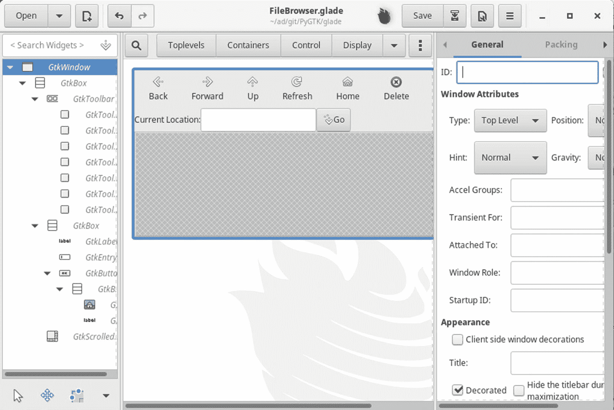
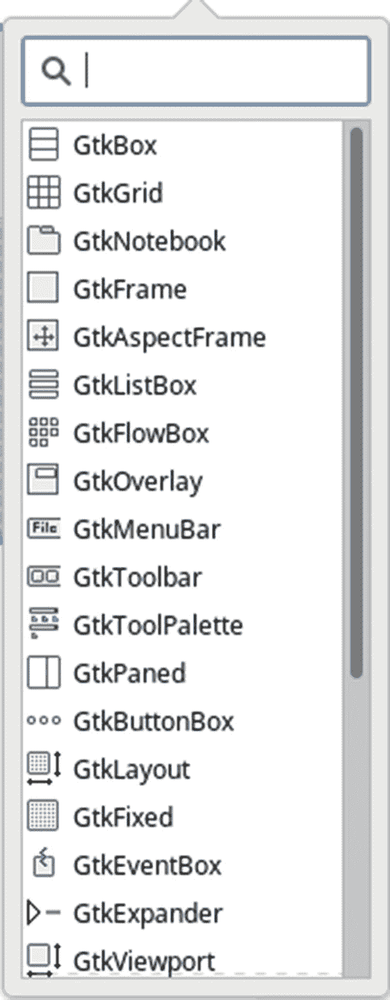
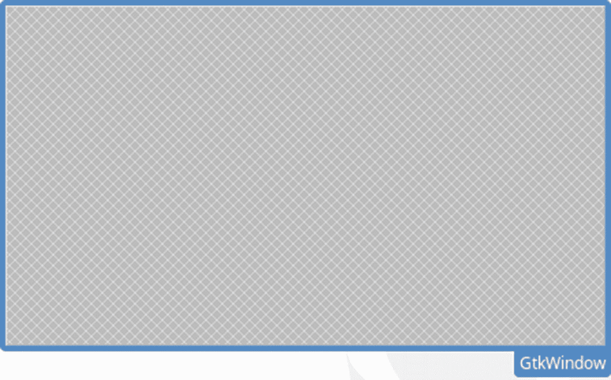
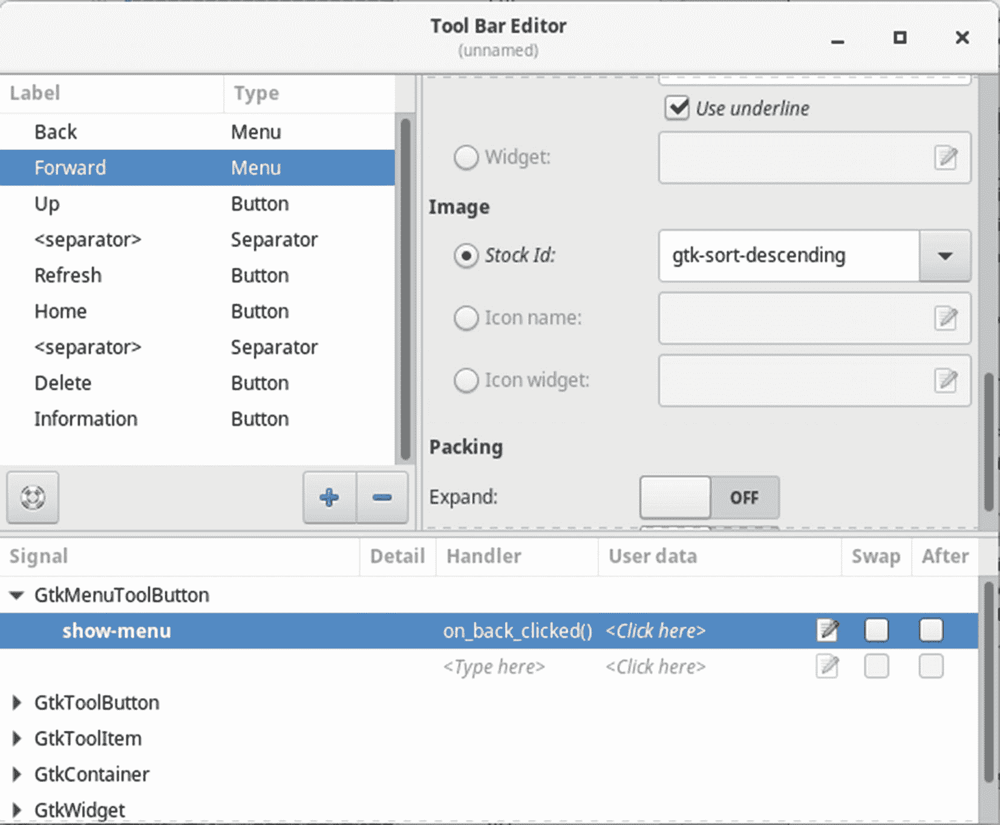
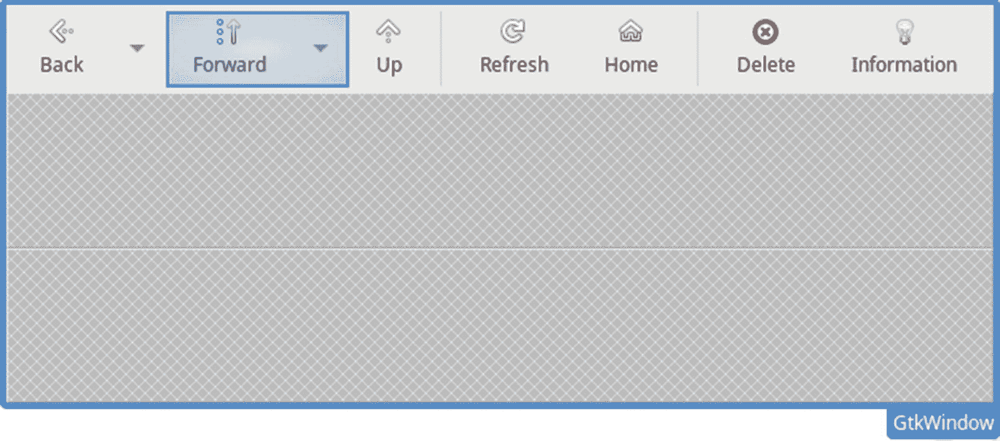
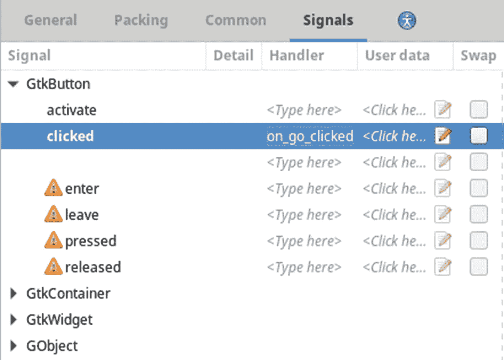

# 十一、动态用户界面

到目前为止，您已经学习了大量关于 GTK+及其支持库的知识，并且能够创建相当复杂的应用。然而，手动编写所有代码来创建和配置这些应用的小部件和行为会很快变得乏味。

Glade 用户界面构建器允许您以图形方式设计用户界面，从而消除了您编写所有代码的需要。它支持 GTK+小部件库以及 GNOME 库中的各种小部件。用户界面保存为 XML 文件，可以动态构建应用的用户界面。

本章的最后一部分介绍了`Gtk.Builder`，一个可以动态加载 XML 文件的库。创建所有必要的小部件，并允许您连接 Glade 中定义的任何信号。

### 注意

本章介绍了撰写本文时的 Glade 用户界面。将来这种情况可能会改变，但任何改变都应该是从本章提供的说明开始的简单过渡。

在本章中，您将学习以下内容。

*   设计图形用户界面(GUI)时应该记住的问题

*   如何用 Glade 设计定制的图形用户界面

*   如何用`Gtk.Builder`动态加载 Glade 用户界面

## 用户界面设计

在这一章中，你将学习如何使用 Glade 3 和`Gtk.Builder`来实现动态用户界面。然而，谨慎的做法是首先学习一些在设计图形用户界面时应该记住的概念。这些概念可以帮助你在将来避免让用户困惑和沮丧。

你还必须意识到，虽然你知道如何使用你的应用，因为你设计了它，但你需要尽可能地帮助用户理解它。无论用户是专家还是新手，每个用户都应该能够以最短的学习曲线使用您的应用。也就是说，下面的部分包括许多提示和设计决策，可以帮助您实现这种直观性。它们还提高了应用的可维护性。

### 了解你的用户

设计用户界面时，最重要的是考虑你的受众。他们是否都有处理手头任务的经验，还是有些人比其他人需要更多的帮助？你能模仿他们已经熟悉的用户界面来设计你的用户界面吗，或者这是一个全新的东西？

最大的可能错误之一是对用户的技能水平做出轻率的概括。您可能认为您布局应用的方式是有意义的，但那是因为您设计了它。你应该把自己放在用户的位置上，理解他们对如何使用你的应用没有预先的了解。

为了避免混淆，请花时间研究类似的应用，注意哪些设计决策似乎是成功的，哪些会导致问题。例如，如果你正在创建一个在 GNOME 桌面环境中使用的应用，你应该检查一下 GNOME 人机界面指南`(` [`http://developer.gnome.org`](http://developer.gnome.org) `)`，它可以帮助你设计一个用于其他兼容应用的设计。

设计用户界面时要考虑的另一件事是可访问性。用户可能有视力问题，这可能会阻止他们使用应用。Accessibility Toolkit 为 GTK+应用提供了许多工具，使它们与屏幕阅读器兼容。GTK+也非常依赖于主题，这就是为什么你应该尽可能避免设置字体，或者为用户提供改变字体的方法。

设计用户界面时，语言是另一个需要考虑的因素。首先，你应该总是使用用户熟悉的行话。例如，您可以在工程应用中自由使用数学术语，但不应该在 web 浏览器中这样做。

许多应用在流行时会被翻译成其他语言，如果您使用在其他文化中可能具有攻击性的词语或图像，这可能会引起问题。

### 保持设计简单

一旦你了解了你的受众，设计一个有效的用户界面就变得简单多了，但是如果界面太难或者太混乱，你仍然会遇到问题。总是试图将屏幕上的窗口小部件减少到一个合理的数量。

例如，如果您需要向用户提供许多选择，但只能选择一个，您可能会尝试使用许多单选按钮。然而，一个更好的解决方案可能是使用一个`Gtk.ComboBox`，这可以显著减少所需的小部件数量。

对于分组相似的选项组来说,`Gtk.Notebook`容器非常有用，否则会使一个巨大的页面变得混乱。在许多应用中，这个小部件将相互关联或依赖的小部件组合到一个首选项对话框中。

菜单布局也是另一个有问题的领域，因为它并不总是以合理的方式完成。如果可能，您应该使用标准菜单，如文件、编辑、查看、帮助、格式和窗口。这些菜单对于有计算经验的用户来说是熟悉的，也是用户所期望的。因此，这些菜单也应该包含标准项目。例如，文件菜单应该包含用于操作文件、打印和退出应用的项目。如果您不确定在哪里放置特定的菜单项，您应该研究一下其他应用是如何布局它们的菜单项的。

重复性的工作，或者那些用户经常执行的工作，应该总是变得快速和简单。有多种方法可以做到这一点。最重要的是为许多操作提供键盘快捷键——在键盘上按 Ctrl+O 比单击文件菜单和打开菜单项要快得多。

### 注意

只要有可能，你应该总是使用标准的键盘快捷键，比如 Ctrl+X 用于剪切，Ctrl+N 用于创建新的东西。这大大缩短了应用用户的初始学习曲线。事实上，一些键盘快捷键已经内置在许多小部件中，例如 Ctrl+X 用于剪切文本小部件中的选择。

你的用户可能需要一段时间来习惯键盘快捷键，这就是为什么工具栏对于重复选项也非常有用。但是，你需要在工具栏上放置太少和太多的项目之间找到一个平衡点。杂乱的工具栏会让用户感到害怕和困惑，但是项目太少的工具栏是没有用的。如果你的工具栏上有大量用户想要的项目，那么允许用户自己定制工具栏是有意义的。

### 始终保持一致

在设计图形用户界面时，一致性非常重要，GTK+使这变得非常容易。首先，GTK+提供了许多库存物品，在可能的情况下，应该总是优先使用国产物品。用户将已经熟悉股票项目的图标，并知道如何使用它们。

### 警告

如果使用不当，库存物品会非常危险。你不应该使用一个库存项目来完成一个它原本不打算做的动作。例如，你不应该仅仅因为 GTK 股票删除图标看起来像一个“减号”就把它用于减法运算图标由用户的主题定义；他们可能不总是像你想象的那样。

说到主题，你应该尽可能依靠主题提供的设置。这有助于您创建一致的外观——不仅在整个应用中，而且在整个桌面环境中。由于主题应用于整个桌面上的所有应用，因此您的应用与用户运行的大多数其他应用是一致的。

在少数情况下，你确实需要偏离用户主题提供的默认值，你应该总是给用户一个方法来改变设置或者仅仅使用系统默认值。这在处理字体和颜色时尤其重要，因为您的更改可能会使您的应用无法用于某些主题。

一致性的另一个好处是用户可以更快地学会如何使用你的应用。用户只需要学习一个设计，而不是许多。如果你的应用和补充对话框没有使用一致的布局，那么每个新窗口都会给用户带来一次全新的体验。

### 让用户了解情况

如果应用长时间没有响应，用户会很快失去兴趣。大多数计算机用户都习惯了一两个 bug，但是如果你的应用正在处理信息并且长时间没有响应，用户可能会放弃。

为了避免这种情况，有两种可能的解决方案。首先是让你的应用更有效率。但是，如果您的应用没有问题，或者没有办法让它更有效，您应该使用进度条。进度条告诉用户您的应用仍在工作。只要确保更新你的进度条！如果您不知道这个过程需要多长时间，另一个选择是脉动进度条，并提供消息来更新用户的进程进度。

另外，请记住第[章 3](03.html) 中的以下循环。

```py
while Gtk.events_pending():
    Gtk.main_iteration()

```

这个循环确保用户界面得到更新，即使处理器正忙于处理另一个任务。如果在 CPU 密集型过程中不更新用户界面，应用可能会在完成之前对用户没有响应！

您还应该在执行操作时向用户提供反馈。如果正在保存文档，您应该将其标记为未修改，或者在状态栏中显示一条消息。如果您在执行某个动作时没有向用户提供反馈，则可以认为该动作没有被执行。

消息对话框是提供反馈的一种非常有用的方式，但是它们应该只在必要的时候使用。如果消息对话框出现得太频繁，用户会感到沮丧，这就是为什么只有严重错误和警告才应该这样报告。

### 我们都会犯错

不管你是专家还是新手，我们都会犯错。正因为如此，你应该永远原谅你的用户。毕竟，每个人都曾按下过错误的按钮，导致大量工作的丢失。在设计合理的应用中，这种情况永远不会发生。

对于用户不容易撤销的基本操作，您应该提供撤销操作的能力。例如，这些基本操作可能包括从我们的杂货列表应用中删除一个项目，或者在文本视图中移动文本。

对于无法撤消的操作，您应该始终提供一个确认对话框。它应该明确声明这个操作不能撤销，并询问用户是否要继续。例如，您应该始终询问用户，当有未保存更改的文档时，是否应该关闭应用。人们已经使用软件很多年了，并且已经开始期待一个确认对话框来处理不能撤销的操作。

## Glade 用户界面生成器

决定 GUI 工具包成败的一个因素是它能否快速部署应用。虽然用户界面对应用的成功极其重要，但它不应该是开发过程中最耗费精力的方面。

Glade 是一个工具，允许您快速有效地设计图形用户界面，以便您可以转移到代码的其他方面。用户界面被保存为 XML 文件，该文件描述了小部件的结构、每个小部件的属性以及与每个小部件相关联的任何信号处理程序。`Gtk.Builder`然后可以加载用户界面文件，以便在应用加载时动态构建它。这允许您从美学角度改变用户界面，而无需重新编译应用。

### 注意

Glade 的旧版本允许您生成源代码，而不是将用户界面保存在 XML 文件中。不推荐使用此方法，因为当您想要更改用户界面时很难管理它。因此，您应该遵循本章提供的方法。

你需要从一开始就意识到什么是 Glade，什么不是。Glade 设计应用的用户界面，设置与代码中实现的回调方法相关联的信号，并处理常见的小部件属性。然而，Glade 不是代码编辑器或集成开发环境。它输出的文件必须由您的应用加载，并且您必须在代码中实现所有回调方法。Glade 只是为了简化初始化应用的图形用户界面和连接信号的过程。

### 小费

本书中使用的 Glade 3.22.1 版本现在允许集成开发环境(如 Anjuta)将其嵌入到用户界面中。这些 ide 为部署 GTK+应用提供了一个完整的、自始至终的解决方案。

Glade 的另一个优点是，由于用户界面存储为 XML 文件，它们独立于语言。任何封装了`Gtk.Builder`提供的功能的语言都可以加载用户界面。这意味着无论您选择哪种编程语言，都可以使用相同的图形用户界面设计器。

在继续本章的其余部分之前，您应该从操作系统的包管理器安装 Glade 和用于`Gtk.Builder`的开发包。或者，您可以从`glade.` [`gnome.org`](http://gnome.org) 下载并编译源代码。

此外，在阅读本章的其余部分时，您应该确保遵循并创建这个应用。这为您提供了一个学习 Glade 3 应用的机会，因此您可以在这本书的指导下尽可能多地进行实践。

### Glade 界面

当您第一次启动 Glade 时，您会看到一个包含三个窗格的主窗口:主窗口树视图、小部件调色板和小部件属性编辑器。图 [11-1](#Fig1) 是 Glade 应用主窗口的屏幕截图，其中有一个从`FileBrowser.glade`打开的项目。



图 11-1

Glade 主窗口

主树视图窗口有助于 Glade 项目管理。主窗口标题栏显示当前打开的项目列表，允许您在它们之间切换。左窗格还包括小部件树视图，它显示了具有焦点的项目的小部件包含。

小部件树视图显示了项目中的父子容器关系。可以有多个顶级小部件。然而，在图 [11-1 中](#Fig1)窗口是`FileBrowser.glade`的唯一顶层小部件。

此窗格是您指定项目选项、保存项目和加载现有项目的地方。此窗口中的弹出式菜单还提供了许多其他选项，可以帮助您处理项目，如撤销和重做操作。

### 注意

如果您决定使用 Glade 2 而不是 Glade 3，请确保经常保存。在 Glade 的旧版本中没有实现撤销和重做支持，如果您因为一次错误的鼠标点击而意外地覆盖了一个小时的工作，那将是非常令人沮丧的！

当您启动 Glade 3 时，显示的中间窗格有用于从小部件面板中选择小部件的按钮，该面板列出了所有可用于设计应用的小部件。图 [11-2](#Fig2) 中显示了其中一个小工具调色板的屏幕截图。



图 11-2

Glade widget 调色盘

默认情况下，可以显示五种类别的小部件:顶级小部件、容器、用于控制的小部件、显示小部件以及复合和贬值小部件。您不应该在新的应用中使用 GTK+废弃列表中的任何小部件，因为它们已经过时，可能会在未来的版本中被删除。

除了默认类别的小部件之外，您可能会发现包含其他小部件库的其他类别。这些包括为 GNOME 库或其他自定义小部件库添加的小部件。

通过视图菜单，您可以更改小部件面板的布局。图 [11-2](#Fig2) 显示了一个设置为显示图标和文本的组件面板。但是，根据您最喜欢的样式，您可以只显示文本或图标。

要向小部件布局窗格添加新的顶级小部件，只需在 Toplevels 部分单击所需小部件的图标。然后会显示一个新的顶级小部件，并将其添加到左窗格的小部件树中。要添加非顶级小部件，您需要首先单击所需小部件的图标，然后在应该放置小部件的位置单击鼠标。您必须单击容器小部件中的空单元格，以便将非顶级小部件插入到用户界面中。

### 创建窗口

在本章中，你将使用 Glade 和`Gtk.Builder`创建一个简单的文件浏览器应用。首先，您可以通过单击主 Glade 窗口顶部的 new project 按钮来创建一个新项目，或者使用应用加载时为您创建的空白项目。如果您稍后返回本教程，您可以通过单击主 Glade 窗口顶部的 open 按钮来打开一个现有的项目。

拥有一个空白项目后，您可以通过单击 Toplevels 小部件面板中的窗口图标来创建一个新的顶级`Gtk.Window`。在新窗口中，您会看到小部件内部的网格图案，如图 [11-3](#Fig3) 所示。该模式指定了一个区域，可以在该区域将子部件添加到容器中。从小部件面板中选择一个非顶级小部件后，必须单击此区域将小部件添加到容器中。按照此方法添加所有非顶级小部件。



图 11-3

默认的 Gtk。窗口小部件

创建顶层窗口后，您会注意到小部件属性窗格的内容发生了变化，如图 [11-4](#Fig4) 所示。在这个面板中，您可以自定义 Glade 支持的每个小部件的所有属性。

### 注意

虽然 Glade 允许您编辑许多小部件属性，但有些操作只需在代码中执行。因此，你不应该把 Glade 看作是你在本书中学到的所有东西的替代品。在大多数应用中，您仍然在进行大量的 GTK+开发。

图 [11-4](#Fig4) 中显示的微件属性窗口有各种选项的完整列表。该窗格分为几个部分，这些部分对特定于当前所选小部件类型的基本选项进行了分类。例如，`Gtk.Window`小部件允许您指定窗口的类型、标题、调整大小的能力、默认大小等等。


图 11-4

小部件属性窗格

ID 字段被滚动到图 [11-4](#Fig4) 中滚动窗口的边界之外，为小部件提供了一个唯一的名称。Glade 会自动为每个小部件指定一个名称，这个名称对于当前项目来说是唯一的，但是这些都是通用名称。如果您计划从应用中引用一个小部件，您应该给它一个有意义的 ID。当您必须加载三个名为 treeview1、treeview2 和 treeview3 的`Gtk.TreeView3`小部件时，这很容易让人感到困惑！

“打包”选项卡提供了关于微件如何对其父微件的大小变化做出反应的基本信息，如扩展和填充。通用属性是由`Gtk.Widget`提供的，并且对所有小部件都可用。例如，您可以在该选项卡中提供尺寸请求。

### 注意

第一次使用 Glade 时，打包选项有点不直观，因为属性是由子容器而不是父容器设置的。例如，`Gtk.Box`的子容器的打包选项在子容器本身的打包选项卡中提供，而不是在父容器中。

信号选项卡允许您为通过`Gtk.Builder`连接的每个微件定义信号。最后，由残障符号指定的“辅助功能”选项卡提供了用于辅助功能支持的选项。

正如您在本书的第一个例子中回忆的那样，空的`Gtk.Window`小部件除了演示如何创建之外没有任何用处。由于文件浏览器需要将多个小部件打包到这个应用的主窗口中，下一步是添加一个垂直的盒子容器。从面板中选择 Box 小部件，并在窗口的网格图案内单击，将一个`Gtk.Box`小部件插入到窗口中。然后，您可以使用属性窗格来调整框的方向(垂直或水平)以及`Gtk.Box`包含的窗格数量。图 [11-5](#Fig5) 显示了`Gtk.Box`属性所需的调整。


图 11-5

默认的 Gtk。窗口小部件

默认情况下，创建三个单元格来存放子部件，但是您可以将它更改为大于零的任意数量的项目。默认的三是我们需要多少个子部件。

默认情况下，`Gtk.Box`的方向是垂直的，但如果需要，您可以将方向改为水平。

### 注意

如果您不确定容器将容纳多少个小部件，请不要担心。您可以在微件属性窗格的常规选项卡中添加或移除单元格。然后，您可以在打包选项卡下更改小部件在框中的位置。在由`Gtk.Builder`构建之后，您仍然可以用您的代码编辑用户界面！

添加垂直框后，您会看到三个单独的空容器网格；请注意属性窗格和小部件树视图窗格中的变化。对于这些网格，我们将添加一个工具栏、一个地址栏和一个树形视图。

### 添加工具栏

旧的 handle box 小部件早就被弃用了，因为它原本要包含的大多数小部件已经得到了增强，可以动态隐藏它们的内容。`Gtk.Toolbar`是以这种方式增强的小部件之一。这意味着我们可以直接将工具栏添加到之前添加到主窗口的垂直`Gtk.Box`中。

添加工具栏小部件时，它仅作为一条细条出现在垂直框的顶部窗格中。这是因为它还不包含任何按钮。向工具栏添加按钮的方法并不明显。要在工具栏上添加按钮，右键单击 Gtk。Glade 树视图窗格中的工具栏条目和一个标有“编辑”的弹出菜单...出现，然后显示图 [11-6](#Fig6) 中的对话框。



图 11-6

工具栏编辑器

工具栏编辑器允许您向工具栏添加任何受支持类型的项目。要添加新项目，您只需点击“添加”按钮。这将在编辑器对话框中显示一个窗格，您可以在其中修改新按钮的属性。这里要小心，因为你的 Glade 版本可能会显示使用股票按钮的选项。股票项目都已被否决，所以你必须创建自己的自定义按钮。

添加新的工具按钮后，下一步是通过从类型组合框中选择一个选项来选择小部件的类型。组合框中包含的工具栏项类型是包含图像和标签的通用工具按钮、切换按钮、单选按钮、菜单工具按钮、工具项和分隔符。当您选择新类型时，对话框会立即发生变化，允许您编辑所选类型的属性。

例如，在图 [11-6](#Fig6) 中，选择的工具按钮属于`Gtk.MenuToolButton`类型。每个工具栏项都提供了一个选项，当工具栏是水平还是垂直时，它应该是可见的。这允许您在工具栏为垂直方向时隐藏工具栏项目，而在工具栏为水平方向时向用户显示。

菜单工具按钮还允许您选择要在工具项目中显示的标签和图像。根据您选择的选项，图像可以是库存图像、现有图像文件或自定义图标主题的标识符。

在工具栏编辑器的底部，您会看到一个树形视图，允许您将信号连接到每个工具按钮。Glade 提供了许多命名的回调方法供您选择，这些方法基于信号名和您给工具栏项的名称。您还可以输入自己的自定义回调方法名。可以通过`Gtk.Builder`指定要传递给每个方法函数的数据，因此通常可以将“用户数据”参数留空。在图 [11-6](#Fig6) 中，一个名为`on_back_clicked()`的回调方法被连接到`Gtk.MenuToolButton`的`"clicked"`信号上。

当您用`Gtk.Builder`加载用户界面时，您有两种选择来连接 Glade 文件中定义的回调方法和代码中的回调方法。如果您想要手动连接每个回调方法，您可以任意命名信号处理程序，只要该名称是唯一的。然而，`Gtk.Builder`提供了一个函数，可以自动将所有信号连接到可执行文件或 Python 程序中的适当符号。要使用这个特性，您在 Glade 中定义的回调方法名必须与您代码中的函数名相匹配！

“打包”选项卡包括用于确定小部件周围的填充、打包是从框的开始还是结束，以及确定小部件在容器中的位置的选项。这些属性完全等同于您在使用`box.pack_start()`和朋友向`Gtk.Box`添加子部件时使用的设置。

### 小费

你应该记得在第 4 章中提供了一个表格，说明了扩展和填充属性对 Gtk 的子部件做了什么。框小部件。Glade 为您提供了一个绝佳的机会来试验打包选项，以便更好地理解它们是如何影响小部件的。因此，请花点时间尝试各种包装方案！

完成工具栏和打包参数设置后，您的应用应该如图 [11-7](#Fig7) 所示。



图 11-7

运行中的工具栏

图 [11-7](#Fig7) 所示的工具栏包含两个菜单工具按钮，用于在用户浏览历史中向前和向后移动。还有用于移动到父目录、刷新当前视图、删除文件、移动到主目录以及查看文件信息的工具按钮。每个工具按钮都连接到一个回调方法，您必须在应用的代码中实现该方法。

### 完成文件浏览器

创建文件浏览器的下一步是创建地址栏，向用户显示当前位置，并允许他们输入新位置。这意味着我们需要一个有三个部件的水平框，如图 [11-8](#Fig8) 所示。这三个小部件是描述保存在`Gtk.Entry`小部件中的内容的标签，保存当前位置的`Gtk.Entry`小部件，以及按下时移动到该位置的按钮。


图 11-8

文件浏览器

为了创建图 [11-8](#Fig8) 中的按钮，一个带有两个子部件的水平`Gtk.Box`被添加到按钮中:一个`Gtk.Image`部件设置为 GTK _ 股票 _ 跳转 _ 股票图像，一个`Gtk.Label`部件名为 Go。

最后一步是向垂直框中的最后一个单元格添加一个`Gtk.ScrolledWindow`小部件，向该容器添加一个`Gtk.TreeView`小部件。完成后的文件浏览器用户界面如图 [11-9](#Fig9) 所示。然而，我们还没有完成在 Glade 中编辑应用。


图 11-9

文件浏览器

### 做出改变

文件浏览器已经完全设计好了，但现在我决定它应该在窗口底部包含一个`Gtk.StatusBar`小部件！对用户界面进行更改可能很棘手，因此本节将带您完成一些具有挑战性的操作。

添加状态栏的第一步是扩展主垂直`Gtk.Box`小部件包含的子小部件的数量。为此，从小部件树视图中选择垂直框。在“属性”窗格中，您可以使用“常规”选项卡中的“项目数”属性来增加子项的数量。这将在垂直框的末尾添加一个新的空白空间，您可以在其中添加状态栏小部件。

如果需要对垂直或水平框的子元素重新排序，首先需要选择要移动的小部件。然后，在“属性”窗格的“打包”选项卡下，您可以通过更改其微调按钮的值来选择新位置。当您更改微调按钮的值时，您可以看到子部件移动到它的新位置。周围子部件的位置会自动调整以反映这些变化。

如果您决定需要将一个容器填充到已经添加了另一个小部件的位置，就会导致另一个有问题的任务。例如，假设您已经决定在文件浏览器应用中放置一个水平窗格来代替滚动窗口。您首先需要从主窗口的小部件树视图中选择小部件，并通过按 Ctrl+X 移除它。之后，会显示一个空框，您可以在其中添加水平窗格。接下来，选择应该放置滚动窗口的窗格，并按 Ctrl+V。

在 Glade 2 中，修改用户界面曾经是一个敏感的话题，因为它不支持撤销和重做操作。过去，由于不小心删除了顶级小部件，很容易犯错误并损失几个小时的工作，因为您不能撤销任何操作。既然 Glade 3 包含了撤销和重做支持，您就不必担心了。

### 部件信号

这个应用的最后一步是为所有的小部件设置信号。图 [11-10](#Fig10) 显示了 Go 按钮的小部件属性编辑器的信号选项卡。`Gtk.Button`小部件连接到被点击的信号，该信号在发出时调用`on_button_clicked()`。



图 11-10

widget 信号编辑器

除了“点击”信号，你还需要连接其他几个信号。除分隔符外，每个工具项都应连接到`Gtk.ToolButton`的点击信号。此外，您应该连接`Gtk.Entry`来激活，当条目有焦点时，当用户按 Enter 键时会发出此消息。

### 注意

这个应用只是一个简单的文件浏览器的设计，旨在向您展示如何使用 Glade 3 设计应用。应用不仅仅是一个设计所需的代码在第 [14](14.html) 章中实现。

至于树视图，您应该将其连接到行激活的。当一行被激活时，向用户显示关于该文件的更多信息，或者它导航到所选择的目录。表 [11-1](#Tab1) 中提供了一个小部件列表以及它们的信号和回调方法，这样你可以很容易地理解这个例子。

表 11-1

部件信号

<colgroup><col class="tcol1 align-left"> <col class="tcol2 align-left"> <col class="tcol3 align-left"> <col class="tcol4 align-left"></colgroup> 
| 

小部件

 | 

描述

 | 

信号

 | 

回调方法

 |
| --- | --- | --- | --- |
| `Gtk.Button` | 转到按钮 | "已点击" | `on_go_clicked()` |
| `Gtk.Entry` | 位置条目 | "激活" | `on_location_activate()` |
| `Gtk.MenuToolButton`回 |   | "已点击" | `on_back_clicked()` |
| `Gtk.MenuToolButton`前进 |   | "已点击" | `on_forward_clicked()` |
| `Gtk.ToolButton` | 起来 | "已点击" | `on_up_clicked()` |
| `Gtk.ToolButton` | 恢复精神 | "已点击" | `on_refresh_clicked()` |
| `Gtk.ToolButton` | 主页 | "已点击" | `on_home_clicked()` |
| `Gtk.ToolButton` | 删除 | "已点击" | `on_delete_clicked()` |
| `Gtk.ToolButton` | 信息 | "已点击" | `on_info_clicked()` |
| `Gtk.TreeView` | 文件浏览器 | "行激活" | `on_row_activated()` |
| `Gtk.Window` | 主窗口 | “摧毁” | `on_window_destroy()` |

### 创建菜单

除了工具栏，在 Glade 3 中还可以创建菜单。图 [11-11](#Fig11) 所示为菜单栏编辑器，与工具栏编辑器非常相似。它支持普通的菜单项和那些用图像、复选按钮、单选按钮和分隔符呈现的菜单项。


图 11-11

菜单栏编辑器

### 警告

Glade 3.22.1 编辑器目前仍然使用库存项目作为菜单项。所有的股票项目都被否决，所以你真的应该使用自己的自定义菜单项，只有这个版本的 Glade 不支持自定义菜单项。您可能需要编辑 Glade 生成的 XML 来创建您自己的定制条目。

您现在知道了创建菜单的三种方法；这就产生了一个问题，到底哪一个最好。每种方法都有其优缺点，所以让我们来看看每种方法。

您首先学习了如何手动创建菜单，根据您的需要塑造每个对象。这种方法适用于较小的菜单，因为代码不会占用太多空间，而且实现完全在一个地方。但是，如果您的菜单变大或者包含的内容不仅仅是基本的项目，那么维护代码会变得很繁琐，并且会占用大量空间。

接下来，您学习了如何使用带有 UI 定义的`Gtk.Builder`来动态创建菜单。这种方法简化了菜单的创建，因为您可以在很小的空间内定义大量的动作。此外，因为菜单是由 UI 定义构造的，所以允许用户编辑菜单非常简单。如果不使用 Glade 设计应用，这显然是创建菜单的首选方法。

Glade 还提供了一个非常吸引人的菜单创建方法，因为在它的初始设计之后，维护是简单的。它也不需要代码来创建菜单，因为`Gtk.Builder`已经为您构建好了。然而，这种方法的一个问题是，它不像 UI 文件方法那样容易允许用户改变菜单和工具栏的布局。

一种容易采用的方法是将所有的小部件打包到垂直框的末端，或者打包到主窗口的子窗口。然后，当您的应用加载时，您可以简单地用`box.pack_start()`将`Gtk.Builder`创建的菜单打包到窗口中。然而，如果您不需要允许您的用户定制菜单，那么通过 Glade 创建所有菜单是有意义的。

现在您已经完成了用户界面的创建，您可以将它保存为一个`FileBrowser.glade`文件，其中 project 可以替换为您选择的名称。可以根据应用的位置或从绝对路径加载该文件。

## 使用 Gtk。建设者

在 Glade 中设计应用后，下一步是用`Gtk.Builder`加载用户界面。

这个 GTK+类解析 Glade 用户界面，并在运行时创建所有必要的小部件。

提供创建和保存从 XML 文件加载的用户界面所需的方法。它还可以将添加到 Glade 文件中的信号连接到应用中的回调方法。

`Gtk.Builder`的另一个优点是开销仅在初始化期间增加，与直接从代码创建的接口相比，这是可以忽略的。初始化之后，实际上不会给应用增加任何开销。例如，`Gtk.Builder`内部连接信号处理程序的方式与您自己的代码相同，因此这不需要额外的处理。

由于`Gtk.Builder`处理所有的小部件初始化，并且布局已经在 Glade 3 中设计好了，所以代码库的长度可以大大减少。以清单 [11-1](#PC2) 为例，如果您必须手工编写所有代码，那么清单会长得多。

```py
#!/usr/bin/python3

import sys
import gi
gi.require_version('Gtk', '3.0')
from gi.repository import Gtk

class SignalHandlers():

    def on_back_clicked(self, button ):
        pass

    def on_forward_clicked(self, button ):
        pass

    def on_up_clicked(self, button ):
        pass

    def on_refresh_clicked(self, button ):
        pass

    def on_home_clicked(self, button ):
        pass

    def on_delete_clicked(self, button ):
        pass

    def on_info_clicked(self, button ):
        pass

    def on_go_clicked(self, button ):
        pass

    def on_location_activate(self, button ):
        pass

    def on_row_activated(self, button ):
        pass

    def on_window_destroy(self, button ):
        pass

class Application(Gtk.Application):

    def __init__(self, *args, **kwargs):
        super().__init__(*args, application_id="org.example.myapp",
                         **kwargs)
        self.window = None

    def do_activate(self):
        if not self.window:
            builder = Gtk.Builder()
            builder.add_from_file("./FileBrowser.glade")
            self.window = builder.get_object("main_window")
            self.add_window(self.window)
            builder.connect_signals(SignalHandlers())
            self.add_window(self.window)
        self.window.show_all()

if __name__ == "__main__":
    app = Application()
    app.run(sys.argv)

Listing 11-1Loading the User Interface

```

### 加载用户界面

加载 Glade 用户界面是通过`builder.add_from_file()`完成的。这是您应该调用的第一个`Gtk.Builder`方法，尽管它应该在获得一个`Gtk.Builder`的实例后调用。它解析 XML 文件提供的用户界面，创建所有必需的小部件，并提供翻译工具。`builder.add_from_file()`方法需要的唯一参数是 Glade 项目文件的路径。

```py
builder = Gtk.Builder()
builder.add_from_file("./FileBrowser.glade")

```

接下来，您需要获取`"main_window"`，连接所有信号，最后将窗口添加到`Gtk.Application`类实例中。

```py
self.window = builder.get_object("main_window")
builder.connect_signals(SignalHandlers())
self.add_window(self.window)

```

`builder.get_object()`需要一个参数，它是您在 Glade 项目中分配给`Gtk.Window`主窗口的 ID。由此`Gtk.Builder`可以通过读取 XML 来确定属于主窗口的所有子窗口部件。然后，它可以从 XML 定义中构造窗口。

构建主窗口后，我们需要分配所有的信号处理程序。如果我们提供一个只包含信号处理方法的特殊 Python 类，就可以自动完成这项工作。`builder.connect_signals()`方法通过将我们的信号处理程序类的实例作为参数提供给它来做到这一点。

最后，我们需要将由`Gtk.Builder`构造的窗口添加到我们的`Gtk.Application`中。这个窗口现在由我们的`Gtk.Builder`实例控制。虽然它不是一个完整的`Gtk.ApplicationWindow`，但就控制新窗口而言，它非常像一个完整的`Gtk.ApplicationWindow`。注意，我们使用`window.show_all()`而不是`window.present()`方法来显示窗口，因为我们的新窗口没有`present()`方法。

真的就这么简单。文件浏览器窗口立即出现，您可以关闭并运行。剩下要做的就是填充所有的信号处理程序方法，为`Gtk.TreeView`小部件创建存储，构建窗口初始化代码，这样就有了一个可以工作的应用。

## 测试你的理解能力

这两个练习对于你成为一个熟练的 GTK+开发者尤为重要。以编程方式设计大型应用的每个方面是不现实的，因为这需要太长时间。

相反，你应该使用 Glade 来设计用户界面，并使用`Gtk.Builder`来加载设计和连接信号。通过这样做，您能够快速完成应用的图形化方面，并获得使您的应用工作的后端代码。

### 练习 1: Glade 文本编辑器

本练习实现了 Glade 中“测试您的理解”练习 1 部分的文本编辑器。文本编辑器中的工具栏应该完全在 Glade 中实现。

如果你还有上一章的练习解决方案，这个练习应该不需要额外的编码。你也可以在本书的网站 [`www.gtkbook.com`](http://www.gtkbook.com) 找到“测试你的理解”部分的答案。这个练习让您有机会了解 Glade 3，并测试许多小部件属性。

在设计了带有工具栏的应用后，添加菜单栏是一个简单的过渡。在较大的应用中，您应该向用户提供这两个选项。在以下练习中，您将向文本编辑器应用添加一个菜单栏。

### 练习 2:带菜单的 Glade 文本编辑器

您已经实现了带有菜单栏的文本编辑器。在本练习中，使用 Glade 和 Gtk.Builder 重新设计该练习中的应用。首先，您应该使用 Python 和 GTK+实现菜单，这允许您同时使用这两种语言。其次，您应该在 Glade 中再次实现该菜单。

与上一个练习一样，练习 2 的解在 [`www.gtkbook.com`](http://www.gtkbook.com) 。使用可下载的解决方案可以让你跳过编写回调函数，因为你已经在前一章中完成了。

## 摘要

在这一章中，我们暂时停止了编码，研究了设计图形用户界面时需要考虑的问题。简而言之，你必须时刻记住你的用户。你需要知道你的用户期望什么，并在应用的每个方面满足他们的需求。

接下来，您学习了如何使用 Glade 3 设计图形用户界面。当考虑 GUI 工具包时，快速部署应用的图形方面的能力是必要的，GTK+有 Glade 来满足这一需求。

Glade 允许您设计用户界面的各个方面，包括小部件属性、布局和信号处理程序。用户界面保存为描述应用结构的可读 XML 文件。

在 Glade 3 中设计了一个应用后，可以用`Gtk.Builder`动态加载用户界面。这个 GTK+类解析 Glade 用户界面，并在运行时创建所有必要的小部件。它还提供了将 Glade 中声明的信号处理程序连接到应用中的回调方法的函数。

在下一章，我们将回到编码，并深入研究`GObject`系统的复杂性。您将学习如何通过派生新的小部件和类来创建自己的`GObject`类，以及如何从头开始创建一个小部件。