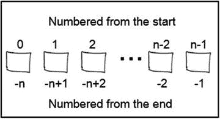

保罗·杰拉德 2016

保罗·杰拉德，瘦蟒蛇皮，10.1007/978-1-4842-2385-7_2

# 2.Python 对象

保罗·杰拉德 <sup class="calibre14">1</sup>

(1)英国伯克郡梅登黑德

Python 中的每个变量实际上都是一个对象。使用 Python 并不需要编写面向对象(OO)的代码，但是 Python 的构造方式鼓励使用面向对象的方法。 [<sup class="calibre4">1</sup>](#Fn1)

## 对象类型

所有变量都有一个类型，可以通过使用内置的 **type()** 函数来查看。

```py
>>> type(23)
<type 'int'>
>>> type('some more text')
<type 'str'>
>>> c=[1,2,'some more text']
>>> type(c)
<type 'list'>
```

其他类型包括“类”、“模块”、“函数”、“文件”、“布尔值”、“非类型”和“长型”。

特殊常量 True 和 False 是“布尔”类型。特殊常量 None 是“NoneType”。

要查看任何对象的文本定义，可以使用 str()函数；例如，变量 c 可以表示为一个字符串:

```py
>>> str(c)
"[1,2,'some text']"
```

## 工厂功能

有一系列函数可以直接创建变量类型。下面是最常用的。

<colgroup class="calibre7"><col class="calibre8"> <col class="calibre8"></colgroup> 
| int(4.0) | 创建整数 4 |
| str(4) | 创建字符串“4” |
| 列表(1，2，3，4) | 创建列表[1，2，3，4] |
| 元组(1，2，3，4) | 创建元组(1，2，3，4) |
| dict(一=1，二=2) | 创建字典{'one':1，' two':2} |

## 民数记

整数没有现实的限制；例如，您可以存储和操作 1000 位数的数字。这些数字存储为“长”数字，例如:

```py
>>> 12345678901234567890
12345678901234567890
```

实数(即带小数点的数字)以所谓的双精度存储。例如:

```py
>>>1 / 7.0
0.14285714285714285
```

实际的精确度取决于您使用的硬件架构。

非常大或非常小的实数可以用科学符号来描述。

```py
>>> x = 1E20
>>> x / 7.0
1.4285714285714285e+19
>>> int(x/7.0)
14285714285714285714286592
>>> y = 1E-20
>>> y / 7.0
1.4285714285714285e-21
```

### 算术运算符

四个算术运算符按预期工作。

<colgroup class="calibre7"><col class="calibre8"> <col class="calibre8"></colgroup> 
| #添加2 + 32.0 + 3#减法3 - 23.0 - 2#乘法3 * 23 * 2.03.0 * 2.0#部门3 / 2-6 / 2-6 / 43 / 2.0 | #整数 5# Real 5.0(如果一个或多个操作数#都是真实的)#整数 1#真实 1.0#整数 6#真正的 6.0#真正的 6.0所有除法都产生实数# 1.5# -3.0# -1.5# 1.3 |

#### 其他操作员

<colgroup class="calibre7"><col class="calibre8"> <col class="calibre8"></colgroup> 
| #模数15 % 4#指数运算4 ** 3-4 ** 34 ** -3 | # Real 3.0(之后的余数#用 15 除以 4)#整数 64#整数-64(' –'适用于#结果)#实数 0.015625(注意:负数#指数强制操作数为实数#数字 |

### 转换函数

<colgroup class="calibre7"><col class="calibre8"> <col class="calibre8"></colgroup> 
| int(1.234)int(-1.234)长(1.234)长型(-1.234)龙(' 1234 ')长型(' 1.234 ')长整型(浮点型(' 1.234 ')浮子(4)浮动(' 4.321 ') | #整数 1#整数-1# Long1L#龙-1L#长 1234L# **错误**需要 2转换数量#龙 1L(后两转换次数)#真正的 4.0#实数 4.321 |

### 布尔数字

布尔值实际上是作为整数保存的，但它的值可以是 True 或 False。

<colgroup class="calibre7"><col class="calibre8"> <col class="calibre8"></colgroup> 
| 布尔(23)布尔型(0)布尔（"任何文本"）布尔型(“”)布尔值([]) | # True -所有非零整数# False-零# True–任何字符串# False–零长度字符串# False–空列表 |

### 随机数

两个随机数生成器很有用(需要导入 random 模块)。

<colgroup class="calibre7"><col class="calibre8"> <col class="calibre8"></colgroup> 
| 随机导入random.randint随机. random() | #生成一个随机整数#介于 a 和 b 之间，包括 a 和 b。#生成随机实数#介于 0.0 和 1.0 之间的数字 |

## 序列:字符串、列表和元组

到目前为止，我们已经看了保存单个值的变量。一个*序列*是一个变量，它将多个值保存为一个数组。每个元素都可以通过其在序列中的位置来寻址，作为从第一个元素的偏移。三种类型的序列如下:

*   *字符串*:共同构成文本字符串的一系列字符。

*   *列表*:一个值序列，其中每个值都可以使用从列表中第一个条目的偏移量来访问。

*   *Tuples* :值的序列，很像列表，但是一个 tuple 中的条目是不可变的；它们不能被改变。

我们将查看所有序列共有的 Python 特性，然后分别查看这三种类型。

### 序列存储和访问

序列的元素存储为一系列连续的内存位置。序列中的第一个元素可以在位置 0 处访问，最后一个元素在位置*n*–1 处访问，其中 *n* 是序列中元素的个数(见图 [2-1](#Fig1) )。



###### 图 2-1。序列元素的存储

您可以遍历序列 x 的元素，序列 x 有 n 个元素，从元素 x[0]开始，每次 x[1]加+1，x[2] x[n-1]等等。也可以从末尾开始迭代，每次减 1:x[n-1]，x[n-2] x[0]。

### 成员资格

常见的检查是确定序列中是否存在某个值。例如:

<colgroup class="calibre7"><col class="calibre8"> <col class="calibre8"></colgroup> 
| 一个在轨道上9 英寸[1，2，3，4，5，6] | #真的#错误 |
| “x”不在“下一个”中“红色”不在[“茶色”、“粉色”]中 | #错误#真的 |

### 串联 [<sup class="calibre19">2</sup>](#Fn2)

两个或多个序列可以加在一起形成更长的序列。加号(+)用于连接字符串、列表或元组。

<colgroup class="calibre7"><col class="calibre8"> <col class="calibre8"></colgroup> 
| 序列 1 +序列 2 | #产生新的序列#将序列 2 追加到#序列 1 |
| '+'乔先生'+'肥皂先生' | # 'mrjoesoap ' |

### 序列元素和切片

序列是元素的有序列表，因此单个元素由它相对于第一个元素的偏移量来标识。切片是按顺序选择这些元素的子集的一种便捷方式，可以产生新的序列。使用以下符号标识切片:

```py
**[startindex:endindex]** 
```

切片将由从 startindex 开始到 endindex(不包括 endindex)的元素组成。

一些例子会使理解变得更容易:

<colgroup class="calibre7"><col class="calibre8"> <col class="calibre8"></colgroup> 
| mylist=['a '，' b '，' c '，' d '，' e']mylist[0]mylist[3]mylist[5]mylist[-1]mylist[1:3]mylist[:4]mylist[3:] | #一个有五个的列表元素数量# 'a '# 'd '#导致错误# 'e '# ['b '，' c']# ['a '，' b '，' c']# ['d '，' e'] |

序列可以嵌套，并且可以使用多个索引来访问元素，例如:

```py
mylist = [1,2,3,['a','b','c'],5]
mylist[2]              # 3
mylist[3]              # ['a','b','c']
mylist[3][1]           # 'b'
```

### 序列内置函数

<colgroup class="calibre7"><col class="calibre8"> <col class="calibre8"></colgroup> 
| mylist=[4、5、6、7、1、2、3]len（seq）len(mylist)最大序列最大值(米列表)我的(磨坊主) | #序列的长度# 7inseq 的最大值# 7# 1–最低 |

## 用线串

一个*字符串*是组成一段文本的一系列字符。字符串是不可变的，但是您可以通过给同一个字符串变量分配一个新的字符串来更新字符串的值。

```py
>>> mystr = 'Paddington Station'
>>> mystr=mystr.upper()     # replaces mystr 
>>> mystr
PADDINGTON STATION
```

### 分配

只要匹配，可以用单引号(')或双引号(")来分隔字符串。您可以将其中一个引用嵌入到另一个引用中。

```py
>>> text = 'Hello World!'
>>> longtext = "A longer piece of text"
>>> print(text)
Hello World!
>>>longtext
'A longer piece of text'
>>> text = 'Paul said, "Hello World!"'
>>>print(text)
Paul said, "Hello World!"
```

### 访问子字符串

当然，您可以使用切片来访问子字符串:

<colgroup class="calibre7"><col class="calibre8"> <col class="calibre8"></colgroup> 
| 保罗说，“你好”文本[:4]文本[-4:]正文[5:9]文本[0:4] +文本[12:14] | # '保罗'# ' "嗨"# '说'# '保罗希' |

### 字符串比较

字符串可以比较为 [<sup class="calibre4">3</sup>](#Fn3) 如下:

<colgroup class="calibre7"><col class="calibre8"> <col class="calibre8"></colgroup> 
| MCR > liv"丽芙>一切"' mcr'=='X 'X'>'t ' | #真的#错误#错误#错误 |

### 成员资格(搜索)

我们可以逐个字符或使用子串来检查子串是否在一个字符串中。结果是一个布尔值。

<colgroup class="calibre7"><col class="calibre8"> <col class="calibre8"></colgroup> 
| “任务”中的“a”“任务”中的“w”在“任务”中“作业”不在“任务”中“任务”中的“任务” | #真的#错误#真的#真的#真的 |

### 特殊字符和转义

字符串可以包含非打印字符和控制字符(例如制表符、换行符和其他特殊字符)，方法是用反斜杠(\)对它们进行“转义”。常见的转义字符如下:

```py
\0 Null character
\t Horizontal tab
\n Newline character
\' Single quote
\" Double quote
\\ Backslash
>>> multiline='Line 1\nLine 2\nLine 3'
>>> print(multiline)
Line 1
Line 2
Line 3
```

### 三重引号

带有嵌入换行符的较长文本可以使用三重引号符号进行赋值；例如:

```py
>>> multiline="""Line1
¼ Line 2
¼ Line 3"""
>>> multiline
'Line 1\nLine 2\nLine 3'
```

### 字符串格式

百分比(%)运算符提供了字符串格式功能。该功能的结构如下:

```py
**formatstring**                                                        **% (arguments to format)** 
```

formatstringis 是一个字符串，包含要输出的文本，其中嵌入了转换符号，用百分号(%)表示。这些是常见的转换符号:

<colgroup class="calibre7"><col class="calibre8"> <col class="calibre8"></colgroup> 
| %c | 长度为 1 的单个字符/字符串 |
| %s | 线 |
| %d | 有符号十进制整数 |
| %f | 浮点数 |
| %% | 百分比字符 |

以下是一些例子:

```py
>>> ntoys = 4
>>> myname='Fred'
>>> length = 1234.5678
>>> '%s has %d toys' % (myname,ntoys)
'Fred has 4 toys'
>>> 'is %s playing?' % (myname)
'is Fred playing?'
>>> 'length= %.2f cm' % length
'length= 1234.56 cm'        
>>> 'units are %6s meters' % length
```

在前面的示例中，. 2f 中的. 2 表示小数位数。%6s 中的 6 表示字段宽度为 6 个字符。

### 字符串函数

有大量的内置字符串函数。最常见的如下图所示。注意，这些都返回一个新的字符串；他们不改变字符串，因为字符串是不可变的。

<colgroup class="calibre7"><col class="calibre8"> <col class="calibre8"></colgroup> 
| text = '这是文本'nums = '123456 '#查找文本text.find('is ')text.find('您的')#验证检查text.isalpha（）text.isdigit（）isdigit 号码()#串联' . join((文字，数字)' . join((文字，数字)#改变大小写text.upper()text.lower()#拆分字符串text.split(' ')#替换text.replace('is '，' was ')#去釉text.rstrip()text.lstrip()text.strip() | # returns2#返回-1#所有阿尔法战士？真实的#所有数字？错误的#真的# '这是文本 123456 '# '这是文本 123456 '# '这是文本'# '这是文本'#字符串列表:#['This '，' is '，' text']#这是文本#删除尾随空格#删除前导空格#删除尾随和前导空格 |

## 列表

列表广泛用于存储按顺序收集和处理的值，例如从文本文件中读取或写入文本文件的文本行，或者根据它们在数组中的位置或偏移量查找准备好的值。

### 创建列表

<colgroup class="calibre7"><col class="calibre8"> <col class="calibre8"></colgroup> 
| mylist = []names=['汤姆'，'迪克'，'哈里']mixedlist = [1，2，3，'四']elist = [1，2，3，[4，5，6]] | #一个空列表#字符串列表#混合列表#类型#嵌入列表 |

您可以使用 len()函数找到列表的长度。长度是列表中元素的数量。列表 mylist 的最后一个元素索引将作为 mylist[len(mylist)-1]来访问。

<colgroup class="calibre7"><col class="calibre8"> <col class="calibre8"></colgroup> 
| l = len(姓名) | # 3 |

如下面的代码片段所示，访问前面列表中的值。

<colgroup class="calibre7"><col class="calibre8"> <col class="calibre8"></colgroup> 
| 姓名[1]混合列表[0]混合列表[3]混合列表[2:4]伊利斯[2]伊利斯[3]伊利斯[3][1] | # '迪克'# 1# '四'# [3，'四']# 3# [4,5,6]# 5 |

如果您试图访问列表中不存在的元素，您将得到一个“列表索引超出范围”的错误。

### 更新列表

使用 append()方法将条目添加到列表的末尾。使用 del 语句删除条目。例如:

<colgroup class="calibre7"><col class="calibre8"> <col class="calibre8"></colgroup> 
| mylist = []mylist.append('Tom ')。mylist.append('Dick ')。mylist.append('Harry ')的缩写#更改条目米列表[1]= '比尔'#删除条目del mylist[1] | #一个空列表# ['汤姆']# ['汤姆'，'迪克']# ['汤姆'，'迪克'，'哈里']# ['汤姆'，'比尔'，'哈里']-[“汤姆”，“哈里”] |

### 索引

membership (in，not in)操作符返回布尔值 True 或 False，而 index()方法在列表中找到一个条目，并返回该条目的偏移量。如果找不到条目，它将返回一个错误。

<colgroup class="calibre7"><col class="calibre8"> <col class="calibre8"></colgroup> 
| mylist=['Tom '、' Dick '、' Harry']mylist.index('Dick ')mylist.index('Henry ') | # 1# ValueError:亨利#不在列表中 |

### 序列操作和功能

序列运算符——比较、切片、成员和连接——都与处理字符串的方式相同。

序列函数— len()、max()、min()、sum()、sorted()和 reversed()—都按预期工作。

## 元组

像数字和字符串一样，元组是不可变的。它们对于您可能重用的预置查找或验证器非常有用。

### 创建元组

为了区分元组和列表，Python 使用括号()将条目括在元组中。

```py
>>> mynumbers = (1,2,3,4,5,6,7)
>>> months=('Jan','Feb','Mar','Apr','May','Jun',
¼ 'Jul','Aug','Sep','Oct','Nov','Dec')
>>> mixed = ('a',123,'some text',[1,2,3,'testing'])

# accessing tuples
>>> mynumbers[3]               # 4
>>> months[3:6]                # ('Apr','May','Jun')
>>> mixed[2]+' '+mixed[3][3]   # 'some text testing'
```

您可以使用 len()函数找到元组的长度。长度是列表中元素的数量。

如果您试图访问列表中不存在的元素，您将得到一个“元组索引超出范围”错误。

### 序列操作和功能

序列操作符——比较、切片、成员和连接——都按预期工作。index()方法的工作方式与列表完全一样。序列函数— len()、max()、min()、sum()、sorted()和 reversed()—都按预期工作。

## 字典

如果我们想让我们的程序记住一个值的集合，我们可以使用列表，我们可以使用这些值的索引来访问条目。但是，要找到我们想要的值，我们必须知道该值的偏移量(或者搜索它)。

字典提供了基于键/值对的查找工具。字典中条目的顺序是不确定的(事实上，它是随机的)，但是每个条目都可以通过使用它的键来检索。密钥必须是唯一的；每个关键字在字典中只能有一个条目。

### 创建字典

您可以使用一组键/值对来创建字典。

```py
>>> # days of week – seven key-value pairs
>>> wdays={'M':'Monday','T':'Tuesday',
¼ 'W':'Wednesday','Th':'Thursday',
¼ 'F':'Friday','Sa':'Saturday',
¼ 'Su':'Sunday'}
>>> wdays['M']
'Monday'
>>> wdays['W']
'Wednesday'
>>> wdays['Su']
'Sunday'

>>> newdict = {}      # empty dictionary
```

### 更新字典

您可以使用 dict[key]约定来更新字典。

```py
>>> newdict = {}      # empty dictionary

>>> newdict['1st'] = 'first entry' # add 1st entry
>>> newdict['2nd'] = 'second entry'# add 2nd entry
>>> newdict['1st'] = 'new value'   # update 1st entry

>>> del newdict['2nd']             # delete 2nd entry

>>> len(newdict)                   # 1
```

### 字典操作

序列操作符——比较、成员和连接——都按预期工作。以下是一些您可能会觉得有用的字典操作:

```py
# days of week – seven key/value pairs

# key existence
>>> 'Sa' in wdays 
True
>>> 'Sp' in wdays
False

# create list of keys
>>> wdays.keys() 
['M','T','W','Th','F','Sa','Su']

# create an iterable list of values
>>> wdays.values() 
dict_values(['Monday','Tuesday','Wednesday','Thursday','Friday','Saturday','Sunday'])

# look up a key with a default if key not found
>>> wdays.get('X','Not a day') 
'Not a day'
```

# 脚注

我们在第六章[中介绍了面向对象。](06.html)

建议您使用 join() string 方法来连接字符串列表或元组，因为这样效率更高。例如:

>>> '-'.联接((' a '，' b '，' c '，' d '))

'阿-b-c-d '

[3](#Fn3_source) 你可以在 http://www.asciitable.com/的[看到 ASCII 码的校对顺序。空格位于数字字符之前，数字字符位于大写字母之前；小写字母排在最后。](http://www.asciitable.com/)