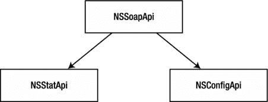

第二章


使用 SOAP API 管理设备

在本章中，我们将构建一个命令行工具来查询和管理 Citrix Netscaler 负载平衡器设备。这些设备通过 SOAP API 公开管理服务，这是 web 服务之间通信的标准方式之一。

什么是 SOAP API？

SOAP 代表简单对象访问协议。开发和创建该协议是为了用作在各种 web 服务之间交换结构化信息的机制。许多知名公司通过 SOAP API 接口公开他们的服务；例如，Amazon 允许使用 SOAP API 调用来控制他们的弹性计算云(EC2)和简单存储系统(S3)服务。

使用 SOAP 查询，用户可以创建虚拟机、启动和停止服务、操作远程分布式文件系统上的数据，以及执行产品搜索。支持 SOAP 的应用程序通过发送 SOAP“消息”来交换信息每条消息都是 XML 格式的文档。SOAP 协议位于其他传输协议之上，如 HTTP、HTTPS、SMTP 等。理论上，您可以发送封装在电子邮件消息(SMTP)中的 SOAP 请求，但是最广泛使用的 SOAP 传输机制不是普通 HTTP 就是 HTTPS (SSL 加密 HTTP)。

由于 XML 的冗长，SOAP 不是最有效的通信方式，因为即使是最小和最简单的消息也会变得非常大和神秘。SOAP 定义了一组用于构造应用层协议消息的规则。最常用的协议之一是 RPC(远程过程调用)。因此，通常所说的 SOAP API 实际上是一个 SOAP 编码的 RPC API。RPC 定义了 web 服务如何相互通信和交互。当与 RPC 一起使用时，SOAP 可以执行请求-响应对话。

SOAP 的最大优势在于它不是特定于语言或平台的，因此用不同语言编写并在不同平台上运行的应用程序可以很容易地相互通信。它还是一个开放标准协议，这意味着有许多库为开发支持 SOAP 的应用程序和服务提供支持。

SOAP 消息的结构

每个 SOAP 消息包含以下元素:

*   *信封。*该元素将 XML 文档标识为 SOAP 消息。它还定义了在 SOAP 消息中使用的名称空间。
*   *消息头*。该元素位于 Envelope 元素中，包含特定于应用程序的信息。例如，认证细节通常存储在 Header 元素中。该元素还可能包含不是发送给消息接收方的数据，而是发送给重新传输 SOAP 通信的中间设备的数据。
*   *消息体*。该元素位于 SOAP Envelope 元素中，包含请求和响应信息。邮件正文元素是必填字段，不能省略。该元素包含打算发送给消息接收者的实际数据。
*   *故障元素*。这个可选元素位于消息体中。如果存在，它包含错误代码、可读的错误描述、错误发生的原因以及任何特定于应用程序的详细信息。

清单 2-1 是一个框架 SOAP 消息的例子。

[***清单 2-1***](#_list1) 。一条简单的 SOAP 消息

```py
<?xml version="1.0"?>
<soap:Envelope
    xmlns:soap="http://www.w3.org/2001/12/soap-envelope"
    soap:encodingStyle="http://www.w3.org/2001/12/soap-encoding">

    <soap:Header>
        [...]
    </soap:Header>

    <soap:Body>
        [...]
        <soap:Fault>
            [...]
        </soap:Fault>
    </soap:Body>

</soap:Envelope>
```

用 SOAP 请求服务

假设我们有两个 web 服务:web 服务 A 和 Web 服务 b。每个 Web 服务都是运行在专用服务器上的应用程序。我们还假设服务 B 实现了一个简单的客户查找服务，它接受一个表示客户标识符的整数，并在一个数组中返回两个字段:客户的姓名和联系电话号码。服务 A 是一个应用程序，它充当客户端并向服务 b 请求详细信息。

当服务 A(发送者)想要找出关于客户的细节时，它构造清单 2-2 中所示的 SOAP 消息，并将其作为 HTTP POST 请求发送给服务 B。

[***清单 2-2***](#_list2) 。SOAP 请求消息

```py
<?xml version="1.0" encoding="UTF-8" ?>
  <SOAP-ENV:Envelope
   SOAP-ENV:encodingStyle="http://schemas.xmlsoap.org/soap/encoding/"
   xmlns:SOAP-ENV="http://schemas.xmlsoap.org/soap/envelope/"
   xmlns:SOAP-ENC="http://schemas.xmlsoap.org/soap/encoding/"
   xmlns:xsi="http://www.w3.org/1999/XMLSchema-instance"
   xmlns:xsd="http://www.w3.org/1999/XMLSchema">
   <SOAP-ENV:Body>
      <ns1:getCustomerDetails
       xmlns:ns1="urn:CustomerSoapServices">
         <param1 xsi:type="xsd:int">213307</param1>
      </ns1:getCustomerDetails>
   </SOAP-ENV:Body>
  </SOAP-ENV:Envelope>
```

接下来，服务 B(服务器)执行查找，将结果封装在 SOAP 消息中，并将其发送回来。响应消息([清单 2-3](#list3) )作为对原始 POST 请求的 HTTP 响应。

[***清单 2-3***](#_list3) 。SOAP 响应消息

```py
<?xml version="1.0" encoding="UTF-8" ?>
  <SOAP-ENV:Envelope
   xmlns:xsi="http://www.w3.org/1999/XMLSchema-instance"
   xmlns:xsd="http://www.w3.org/1999/XMLSchema"
   xmlns:SOAP-ENV="http://schemas.xmlsoap.org/soap/envelope/">
   <SOAP-ENV:Body>
      <ns1: getCustomerDetailsResponse
      xmlns:ns1="urn:CustomerSoapServices"
      SOAP-ENV:encodingStyle="http://schemas.xmlsoap.org/soap/encoding/">
         <return
         xmlns:ns2="http://schemas.xmlsoap.org/soap/encoding/"
         xsi:type="ns2:Array"
         ns2:arrayType="xsd:string[2]">
            <item xsi:type="xsd:string">John Palmer</item>
            <item xsi:type="xsd:string">+44-(0)306-999-0033</item>
         </return>
      </ns1:getCustomerDetailsResponse>
   </SOAP-ENV:Body>
  </SOAP-ENV:Envelope>
```

从例子中可以看出，SOAP 对话非常健谈。所有这些额外的信息(包括名称空间定义和字段数据类型)都是必需的，这样客户机和服务器都知道如何解析和验证数据。

查找有关 WSDL 可用服务的信息

如果您仔细查看前面的示例，您会注意到客户端请求了以下方法:getCustomerDetails。我们如何知道哪些方法或服务是可用的？此外，我们如何找出方法需要什么参数，以及什么方法将返回它的响应消息？

找到这些信息最简单的方法是从 web 服务的 WSDL (Web 服务描述语言)文档中找到。这个 XML 格式的文档描述了与 web 服务相关的各种细节，例如:

*   使用的通信协议(<bindings>部分)</bindings>
*   接受和发送的消息(<messages>部分)</messages>
*   web 服务公开的方法(<porttype>部分)</porttype>
*   使用的数据类型(<types>部分)</types>

这些部分中的每一个都可能包含多个条目，这取决于 web 服务正在做什么。例如，[清单 2-4](#list4) 是翻译服务的简化 WSDL 定义。在这个例子中，我们假想的自动翻译器接受一个文本字符串作为输入参数，并返回一个翻译后的字符串作为结果。我们有两个远程方法，分别叫做 translateEnglishToFrench 和 translateFrenchToEnglish。它们都使用相同的请求和响应数据类型。

[***清单 2-4***](#_list4) 。WSDL 定义的一个例子

```py
<message name="translateRequest">
   <part name="term" type="xs:string"/>
</message>

<message name="translateResponse">
   <part name="value" type="xs:string"/>
</message>

<portType name="languageTranslations">
   <operation name="translateEnglishToFrench">
      <input message="translateRequest"/>
      <output message="translateRequest"/>
   </operation>
   <operation name="translateFrenchToEnglish">
      <input message="translateRequest"/>
      <output message="translateRequest"/>
   </operation>
</portType>

<binding type="languageTranslations" name="bn">
   <soap:binding style="document" transport="http://schemas.xmlsoap.org/soap/http"/>
   <operation>
      <soap:operation soapAction="http://example.com/translateEnglishToFrench"
                     name="trEn2Fr"/>
      <input><soap:body use="literal"/></input>
      <output><soap:body use="literal"/></output>
   </operation>
   <operation>

      <soap:operation soapAction="http://example.com/translateFrenchToEnglish"
      name="trFr2En"/>
      <input><soap:body use="literal"/></input>
      <output><soap:body use="literal"/></output>
   </operation>
</binding>
```

绑定部分定义了用于访问每个公开的方法的访问 URL。每个操作都有一个用于引用它的名称。

Python 中的 SOAP 支持

在支持 SOAP 协议方面，Python 不如其他语言幸运。过去有一些计划和项目试图在 Python 中实现 SOAP 库，但是大多数都被放弃了。目前最活跃和最成熟的项目是 Zolera SOAP 基础设施(ZSI)。

在大多数 Linux 发行版中，这个包被命名为 python-ZSI，可以从发行版的默认包管理器中安装。如果你选择从源代码安装 ZSI 软件包，它可以在[http://pywebsvcs.sourceforge.net/](http://pywebsvcs.sourceforge.net/)找到。

使用 ZSI 从 Python 访问 SOAP 服务有两种方式:

*   服务方法可以通过 ServiceProxy 类访问，它是 ZSI 库的一部分。创建该类的对象时，所有远程函数都可以作为该对象实例的方法使用。这是访问所有服务的一种便捷方式，但是它要求您手动生成类型代码和定义名称空间，这是一项繁重的工作。
*   可以使用 wsdl2py 工具访问 SOAP 接口。该工具读取服务的 WSDL 定义并生成两个模块:一个包含类型代码信息，另一个包含服务方法。

我更喜欢使用第二种方法，因为它让我不必定义类型代码和记忆名称空间。使用 ServiceProxy 类时，用户必须显式定义过程的命名空间。此外，请求对象的类型代码必须与 WSDL 中定义的类型兼容，并且这种类型代码必须手工编写，对于使用复杂数据结构的服务来说，这可能是一个真正的难题。

将 WSDL 模式转换为 Python 助手模块

到目前为止，您已经了解了 SOAP 协议(一种基于 XML 的协议，它定义了如何封装消息)、RPC 的通信方式(客户端发送一条消息，告诉服务器它希望服务器执行什么功能，服务器用一条包含远程功能生成的数据的消息来响应)，以及 WSDL (这种语言定义了哪些方法可用以及在请求/响应中使用哪些数据类型)。

我们还决定生成两个助手模块:一个包含远程方法，另一个定义数据结构，我们将使用 ZSI 图书馆提供的 wsdl2py 工具。

我将编写一个工具来管理 Citrix Netscaler 负载平衡器设备。这些设备提供了两个 web 服务接口:

*   **统计 Web 服务* 。该服务提供查询负载平衡器所有功能方面的统计信息的方法，如虚拟服务器、服务、VLAN 配置等。在 Netscaler 操作系统的 8.1 版中，有 44 个对象可用于收集性能信息。*
**   **配置 Web 服务* 。此服务允许您更改设备配置和执行维护任务，例如启用/禁用服务器和服务。在同一个 8.1 NS 操作系统中，有 2，364 个可通过 SOAP 接口访问的可配置参数。**

 **可以通过访问[http://192.168.1.1/ws/download . pl](http://192.168.1.1/ws/download.pl)找到 WSDL 位置和其他有用信息的链接，例如 API 文档和 SNMP 对象定义，其中 192 . 168 . 1 . 1 需要替换为您正在使用的 Netscaler 负载平衡器的 IP 地址。在本章中，我将使用 192.168.1.1 作为我的 Netscaler 设备的 IP。也可以从主管理屏幕获得下载页面的链接。

我提供了以下 WSDL 网址，因为它们不太可能会改变:

*   统计 SOAP 接口的 WSDL:[http://192 . 168 . 1 . 1/API/nsstat . wsdl](http://192.168.1.1/api/NSStat.wsdl)
*   配置 SOAP 接口的 WSDL:[http://192 . 168 . 1 . 1/API/ns config . wsdl](http://192.168.1.1/api/NSConfig.wsdl)

使用 wsdl2py 脚本非常简单；如果不需要特殊的配置，我们只需要提供 WSDL 文档的位置，它就会自动生成方法和数据类型模块。不需要额外的用户输入。wsdl2py 工具可以从 web 位置获取 wsdl 文档，或者我们可以提供一个文件名，它将解析该文件。

在下面的示例中，我们将把 wsdl2py 脚本直接指向 Netscaler 负载平衡器上的 WSDL URL。

```py
$ wsdl2py --url http://192.168.1.1/api/NSStat.wsdl
```

如果脚本可以联系目标服务器，并且它接收的 XML 文档不包含错误，那么它将不会产生任何消息，并且会自动创建两个 Python 包。

 **注意**如果您检索了一个 WSDL 文件并将其存储在本地，您可以使用- file 标志并提供 WSDL 文件的文件名。这将指示 wsdl2py 解析本地存储的文件。

此时，我们已经运行了脚本，wsdl2py 已经生成了以下两个模块:

*   NSStat_services.py:这个模块包含 Locator 类，用于连接到每个远程可用方法的服务和类。
*   NSStat_services_types.py:这个文件很少被直接使用。它是从前面的模块导入的，包含我们的 web 服务使用的每种数据类型的类定义。它确实包含了一些有用的信息，我们稍后在创建请求和检查来自 web 服务的响应时会用到这些信息。

wsdl2py 工具还有其他选项可用于生成服务器助手模块。有了这些模块，我们就可以实现我们自己版本的 web 服务，该服务公开相同的接口，并理解由我们的 WSDL 文件定义的相同协议，但这超出了我们这里项目的范围。

为我们的负载平衡器工具定义需求

到目前为止，我们只研究了 SOAP 协议和提供 SOAP 支持的 Python 库，它们创建了我们将用来访问 Netscaler web 服务的助手模块。我们还没有编写实际的代码来执行 SOAP 调用，并利用它接收到的信息做一些有用的事情，但是在我们深入有趣的事情(即编写代码)之前，让我们后退一步，决定几件重要的事情:

*   我们希望我们的工具做什么？
*   我们将如何构建我们的代码？

因为这些问题听起来简单，看起来显而易见，所以经常被忽视。这通常会导致糟糕的编写和难以管理的代码。

如果我们不确切地知道我们想要我们的代码做什么，我们就有可能使我们的代码过于简单或者过于复杂。换句话说，我们可能会写几行简单的代码，但实际上我们希望它更通用，可以为其他人或其他项目重用。因此，我们不断增加新的功能，创造各种变通方法，代码变成了一个不可维护的庞然大物。这种过度复杂也是危险的，因为我们可能会发现自己花了几天、几周(如果我们真的有创造力，甚至几个月)来编写复杂的数据结构，而几行抛弃式的原型代码会更有效。所以，在开始之前仔细考虑你想做什么，但是也不要在上面花太多时间；在大多数情况下，系统管理员不需要开发全面的应用程序，因此对他们来说事情就容易多了。

在开始之前，我发现考虑以下几点，并为每一点写几个简单的段落，就足以作为一个粗略的指南和需求规范文档:

*   定义基本要求
*   定义代码结构
*   决定可配置和可更改的项目
*   定义错误处理和日志记录

基本要求

我们列出了我们希望这个工具做什么的列表；简单的陈述，如“我想要...去做……”非常有效，因为我们不追求正式的需求规格。下面的例子说明了这种思维方式:

*   我们希望我们的应用程序收集以下统计信息:
    *   CPU 和内存利用率
    *   系统概述:请求速率、数据速率、已建立的连接
    *   所有虚拟服务器概述:启动/关闭以及每个虚拟服务器中有哪些服务关闭
*   我们希望我们的应用程序能够:
    *   禁用/启用任何可用虚拟服务器的所有服务
    *   禁用/启用任何单独的服务
    *   禁用/启用任何一组服务(可能跨越多个虚拟服务器)
*   我们希望在其他脚本中重用已定义的函数。
*   代码应该易于修改和添加新功能。

代码结构

现在我们已经定义了对工具的需求，我们可以清楚地看到如何组织我们的脚本:

*   所有进行 SOAP 调用的函数都需要在单独的模块中定义。这个模块可以由不同的脚本导入，这些脚本可以使用相同的功能。
*   最好定义一个包含访问 web 服务的方法的类，这样任何人都可以简单地继承这个类并扩展附加功能。
*   该工具将由两个不同的部分组成，一部分用于读取统计数据，另一部分用于控制服务。

将其映射到源代码，我们将拥有以下文件和模块:

1.  我们自己的库 NSLib.py，它将包含以下内容的定义:
    *   NSLibError 异常类。每当我们遇到任何不可恢复的问题，我们将提出这个例外。
    *   NSSoapApi 类。这是根类，实现所有 Netscaler SOAP API 对象共有的方法:初始化和登录。
    *   NSStatApi 类。这继承了 NSSoapApi 类。该类实现所有处理统计信息收集和监视的方法。它只执行 WSDL 统计局定义的呼叫。
    *   NSConfigApi 类。这继承了 NSSoapApi 类。该类实现处理负载平衡器配置的所有方法，并调用由配置 WSDL 定义的方法。
2.  这个文件使用 NSLib 中的 NSStatApi，并且是实现我们的统计信息收集任务的实际脚本。这是我们将从命令行调用的脚本。
3.  该文件使用 NSLib 中的 NSConfigApi，并且是实现我们的负载平衡器配置任务的实际脚本。这是我们将从命令行调用的脚本。
4.  这是我们的配置脚本，包含了与负载平衡器建立通信所需的所有定义。参见下面的详细描述。

配置

我们可能需要管理和监控不止一个负载平衡器。因此，我们将创建一个简单的配置文件来标识它们中的每一个，并且还包含登录详细信息和服务组。

因为它将被对脚本相当熟悉的人使用，而不是针对简单用户的脚本，所以我们可以创建一个带有静态定义变量的 Python 文件并导入它。清单 2-5 是我将在本章中使用的例子。

[***清单 2-5***](#_list5) 。包含负载平衡器详细信息的配置文件

```py
#!/usr/bin/env python

netscalers = {
                'default': 'primary',

                'primary':    {
                                 'USERNAME': 'nstest',
                                 'PASSWORD': 'nstest',
                                 'NS_ADDR' : '192.168.1.1',
                                 'groups': {},
                              },

                 'secondary': {
                                 'USERNAME': 'nstest',
                                 'PASSWORD': 'nstest',
                                 'NS_ADDR' : '192.168.1.2',
                                 'groups': {},
                              },
             }
```

如您所见，我们这里有两个 netscalers，主要和辅助，具有不同的 IP 地址(您也可以有不同的用户和密码)。尚未定义服务组；我们可以在以后需要时添加它们。

在我们的工具中，如果我们需要访问这些配置数据，我们将如清单 2-6 所示检索它。

[***清单 2-6***](#_list6) 。访问配置数据

```py
import ns_config as config

# to access configuration of the 'primary' loadbalancer
username_pri = config.netscalers['primary']['USERNAME']

# to access configuration of the default loadbalancer
default_lb = config.netscalers['default']
username_def = config.netscalers[default_lb]['USERNAME']
```

使用 SOAP API 访问 Citrix Netscaler 负载平衡器

我们需要找到服务地点。对于 web 服务，它几乎总是一个 URL。然而，我们并不真的需要知道 URL，因为我们有特殊的 Locator 类，它一旦被初始化就创建一个绑定对象，我们用它来访问 SOAP 服务。

但是，在继续之前，我们需要解决 Netscaler 的 WSDL 的一个小问题。

修复 Citrix Netscaler WSDL 的问题

我们生成的服务访问助手模块(NSStat_services.py)中的定位器类如清单 2-7 中的[所示定义。](#list7)T3】

[***清单 2-7***](#_list7) 。定位器类定义

```py
# Locator
class NSStatServiceLocator:
    NSStatPort_address = "http://netscaler_ip/soap/"
    def getNSStatPortAddress(self):
        return NSStatServiceLocator.NSStatPort_address
    def getNSStatPort(self, url=None, **kw):
        return NSStatBindingSOAP(url or NSStatServiceLocator.NSStatPort_address, **kw)
```

这显然是错误的，因为服务主机名 netscaler_ip 不是有效的 ip 地址(应该是 192.168.1.1)，也不是有效的域名。Citrix Netscaler 一直以这种方式公开其端点，因此我们只能假设这是设计使然。

以这种方式发生的一个可能的原因是，某人可能想要使用相同的 WSDL 信息连同他的软件来管理多个负载平衡设备，因此从他将要管理的每一个设备中检索和编译 WSDL 是不切实际的。因此，由 API 用户/开发者用正确的地址替换这个地址。Netscaler SOAP API 手册中的所有示例都以相同的方式运行，它们忽略此变量，而不是传递自己的设置。

因此，我们必须修改 NSStatPort_address 变量，将 netscaler_ip 替换为我们设备的 ip 地址。幸运的是，这只能做一次；WSDL 不会经常改变(通常只在主要的操作系统升级期间)。[清单 2-8](#list8) 显示了修改。

[***清单 2-8***](#_list8) 。手动修改定位器类

```py
 # Locator
class NSStatServiceLocator:
    NSStatPort_address = "http://192.168.1.1/soap/"
    def getNSStatPortAddress(self):
        return NSStatServiceLocator.NSStatPort_address
    def getNSStatPort(self, url=None, **kw):
        return NSStatBindingSOAP(url or NSStatServiceLocator.NSStatPort_address, **kw)
```

 **注意**如果您不希望修改模块，您将在本章后面看到解决这个问题的另一种方法，通过这种方法，您可以在定位器对象的初始化过程中指定服务端点。

创建连接对象

我们已经准备好并修复了助手模块，所以最后我们将通过 SOAP API 与我们的负载平衡器进行通信。在我们继续之前，我们需要导入我们用 wsdl2py 生成的所有方法:

```py
import NSStat_services
```

初始化定位器和服务访问对象非常简单，只需两行代码就可以完成。首先，我们创建实际的定位器对象，它包含关于 web 服务位置的信息:

```py
locator = NSStat_services.NSStatServiceLocator()
```

然后，我们调用将返回绑定对象的方法，该对象已经用服务 URL 初始化:

```py
soap = locator.getNSStatPort()
```

定位器对象只有两个方法:一个从 WSDL 读取 URL，另一个初始化并返回绑定对象。

绑定对象(在我们的示例中，初始化为变量 soap)包含我们的 web 服务上可用的所有方法(在这个实例中，是 Citrix Netscaler Statistics API)。它就像一个代理，将对象方法映射到 API 函数。

在我们继续之前，让我们看看如何修复 Netscaler 无效 URL 问题。正如您已经知道的，您可以询问定位器对象并请求一个端点 URL。还可以强制 getNSStatPort 使用自定义 URL，而不是生成的 URL。因此，我们要做的是获取 URL，用我们的负载平衡器的 IP 替换假字符串，然后用正确的 URL 生成一个绑定对象。清单 2-9 显示了代码。

[***清单 2-9***](#_list9) 。替换负载平衡器地址

```py
MY_NS_IP = '192.168.1.1'
locator = NSStat_services.NSStatServiceLocator()
bad_url = locator.getNSStatPortAddress()
good_url = re.sub('netscaler_ip', MY_NS_IP, bad_url)
soap = locator.getNSStatPort(url=good_url)
```

正如您所看到的，这里我使用了 getNSStatPortAddress 定位器方法来检索 URL 字符串，然后使用正则表达式对其进行修改，并用负载平衡器的 ip 替换 netscaler_ip 字符串。最后，我请求定位器用我新的(正确的)URL 创建我的 SOAP 绑定对象。

这种方法比更改自动生成的模块更加灵活。无论出于什么原因(例如升级 NS OS)，如果您决定生成一个新的模块，您将会丢失所做的更改。另一种方法也要求你记住你必须修改代码。在发出请求的代码中覆盖 IP 更加明显，并且它不会干扰可能重用相同助手模块的其他工具。

因此，这是创建连接对象的一种快速方法，但是我们如何将它放入我们之前定义的所需结构中呢？请记住，我们决定创建一个具有初始化和日志记录功能的泛型类，然后从中派生出两个不同的类:一个用于统计和监控模块，另一个用于管理和配置模块。你可以看到 [**图 2-1**](#Fig1) 中的类继承。



[图 2-1](#_Fig1) 。类继承图

这造成了一个直接的问题，因为我们需要为每个服务使用不同的定位器对象；我们不能在 NSSoapApi 类中初始化它们，因为我们不知道需要使用哪种类型的定位器对象，Stat 还是 Config。

泛型类需要能够识别它应该使用哪个模块作为服务定位器，因此我将把 NSStatApi 或 NSConfigApi 中的模块对象作为参数传递给 NSSoapApi，NSSoapApi 将使用该参数初始化适当的定位器，并使用特定的模块调用执行登录调用。这听起来可能很复杂，但实际上并不复杂。清单 2-10 显示了实现这个的代码。T3】

[***清单 2-10***](#_list10) 。定义泛型类

```py
class NSSoapApi(object):

    def __init__(self, module=None,
                       hostname=None,
                       username=None,
                       password=None):
        [...]
        self.username = username
        self.password = password
        self.hostname = hostname
        self.module   = module
        if self.module.__name__ == 'NSStat_services':
            [...]
            self.locator = self.module.NSStatServiceLocator()
            bad_url = self.locator.getNSStatPortAddress()
            good_url = re.sub('netscaler_ip', self.hostname, bad_url)
            self.soap = self.locator.getNSStatPort(url=good_url)
        elif self.module.__name__ == 'NSConfig_services':
            [...]
            self.locator = self.module.NSConfigServiceLocator()
            bad_url = self.locator.getNSConfigPortAddress()
            good_url = re.sub('netscaler_ip', self.hostname, bad_url)
            self.soap = self.locator.getNSConfigPort(url=good_url)
        else:
            [...]
        self.login()

    def login(self):
        [...]
        req = self.module.login()
        req._username = self.username
        req._password = self.password
        [...]
        res = self.soap.login(req)._return
        [...]
```

这个泛型类需要一个模块对象传递给它，因此它可以执行以下操作:

*   从传递的模块中直接调用通用方法，如 login。
*   根据模块的不同，调用特定的方法或引用特定于模块的类，如 NSStatServiceLocator vs NSConfigServiceLocator

。

我们的子类将把模块对象传递给超类，如清单 2-11 所示。

[***清单 2-11***](#_list11) 。将模块对象传递给泛型类

```py
class NSStatApi(NSSoapApi):

    def __init__(self, hostname=None, username=None, password=None):
        super(NSStatApi, self).__init__(hostname=hostname,
                                        username=username,
                                        password=password,
                                        module=NSStat_services)

class NSConfigApi(NSSoapApi):

    def __init__(self, hostname=None, username=None, password=None):
        super(NSConfigApi, self).__init__(hostname=hostname,
                                          username=username,
                                          password=password,
                                          module=NSConfig_services)
```

登录:我们的第一个 SOAP 调用

此时，还没有进行任何实际的 API 调用；我们所做的只是准备和初始化工作。在开始请求性能数据或进行配置更改之前，我们需要做的第一件事是向负载平衡器进行验证。因此，我们的第一个 API 调用将是登录方法。

使用生成的助手库执行 SOAP 请求总是遵循相同的模式:

1.  创建一个请求对象。
2.  用参数初始化请求对象；这是 SOAP 函数的参数列表。
3.  调用表示适当 SOAP 方法的 binder 方法，并将请求对象传递给它。
4.  binder 方法返回一个 API 响应(或者在联系 web 服务失败时引发一个异常)。

正如我们已经看到的，定位器返回的绑定对象属于 NSStatBindingSOAP 类。该类的方法表示 web 服务上所有可用的函数。其中之一是登录功能，如清单 2-12 所示，我们将使用它向负载均衡器表明自己的身份。

[***清单 2-12***](#_list12) 。登录方法的定义

```py
# op: login
def login(self, request):
    if isinstance(request, login) is False:
        raise TypeError, "%s incorrect request type" % (request.__class__)
    kw = {}
    # no input wsaction
    self.binding.Send(None, None, request, soapaction="urn:NSConfigAction",
                      encodingStyle="http://schemas.xmlsoap.org/soap/encoding/",
                      **kw)
    # no output wsaction
    typecode = Struct(pname=None, ofwhat=loginResponse.typecode.ofwhat,
                      pyclass=loginResponse.typecode.pyclass)
    response = self.binding.Receive(typecode)
    return response
```

与 NSStatBindingSOAP 类的其他方法一样，login 方法只接受一个参数，即请求对象。

请求对象必须从 login 类构造，该类可从同一个 helper 模块获得。找出请求对象必须包含什么的最简单方法是查看它的定义；清单 2-13 显示了我们实例中的内容。

[***清单 2-13***](#_list13) 。登录请求类

```py
class login:
    def __init__(self):
        self._username = None
        self._password = None
        return
```

因此，当我们初始化新的请求对象时，我们必须在将它传递给绑定对象之前设置 _username 和 _password。

现在，让我们创建这些对象并进行登录 SOAP 调用。清单 2-14 显示了代码。

[***清单 2-14***](#_list14) 。默认登录方法的包装

```py
class NSSoapApi(object):
    [...]
    def login(self):
        # create request object and assign default values
        req = self.module.login()
        req._username = self.username
        req._password = self.password
        [...]
        res = self.soap.login(req)._return
        if res._rc != 0:
            # an error has occurred
```

与所有其他请求一样，发出 SOAP 登录调用是一个两步过程:

1.  我们创建并初始化请求对象；这个对象包含我们将要发送给 web 服务的数据。在下面的例子中，req 是我们的登录请求对象，我们通过为登录调用设置用户名和密码来初始化它:

    ```py
    req = self.module.login()
    req._username = self.username
    req._password = self.password
    ```

2.  我们从绑定对象中调用适当的代理函数，并将请求对象传递给它。以下步骤被压缩成一行代码:
    1.  调用我们的绑定对象的登录方法。
    2.  传递在上一步中构造的请求对象。
    3.  阅读回复。

所有步骤完成后，res 将包含返回对象，变量在 NSStat_services_types.py 模块(或 WSDL 数据类型部分)中定义:

```py
res = self.soap.login(req)._return
```

查找响应中返回的内容

我们已经知道，要想知道我们应该在对 web 服务的请求中发送什么，我们需要查看服务的 helper 模块，它包含所有请求对象的类。但是我们如何知道我们收到的回应是什么呢？

如果我们再次查看绑定类中的 login 方法，我们会发现它返回一个 loginResponse 类型的对象，如[清单 2-15](#list15) 所示。

[***清单 2-15***](#_list15) 。绑定类的返回值

```py
def login(self, request):
    [...]
    typecode = Struct(pname=None, ofwhat=loginResponse.typecode.ofwhat,
                      pyclass=loginResponse.typecode.pyclass)
    response = self.binding.Receive(typecode)
    return response
```

从 loginResponse 类([清单 2-16](#list16) )中，我们发现它只包含一个变量，_return。

[***清单 2-16***](#_list16) 。LoginResponse 类的内容

```py
class loginResponse:
    def __init__(self):
        self._return = None
        returnloginResponse.typecode =
Struct(pname=("urn:NSConfig","loginResponse"),
 ofwhat=[ns0.simpleResult_Def(pname="return", aname="_return", typed=False, encoded=None,
 minOccurs=1, maxOccurs=1, nillable=True)], pyclass=loginResponse, encoded="urn:NSConfig")
```

然而这还不够，因为 _return 是包含我们需要的信息的对象，我们需要找到如何引用它。由于 loginResponse 非常简单(只返回两个字段)，所以它使用了一个通用的响应对象；我们通过查看 loginResponse 类的 typecode 定义中的 ofwhat 设置，从该类的 typecode 设置中发现了这一点。在以下示例中，它是突出显示的字符串:

```py
class loginResponse:
    def __init__(self):
        self._return = None
        return
loginResponse.typecode = Struct(pname=("urn:NSConfig","loginResponse"),
  ofwhat=[ns0.simpleResult_Def(pname="return",
                               aname="_return",
                               typed=False,
                               encoded=None,
                               minOccurs=1,
                               maxOccurs=1,
                               nillable=True)],
  pyclass=loginResponse, encoded="urn:NSConfig")
```

更复杂的结构有以它们命名的结果对象，所以更容易找到它们，但是对于 login，我们需要在类型定义模块(NSStat_services_types.py)中寻找 simpleResult 类。这个类的定义，如清单 2-17 所示，可能看起来有点神秘，但是我们并不真的需要知道它运行的细节；只需查找 Holder 类定义。

[***清单 2-17***](#_list17) 。simpleResult 的类定义

```py
class simpleResult_Def(ZSI.TCcompound.ComplexType, TypeDefinition):
    [...]
        class Holder:
            typecode = self
            def __init__(self):
                # pyclass
                self._rc = None
                self._message = None
                return
    [...]
```

我将在本章后面更详细地解释如何找到复杂数据类型的对象的引用和定义；请参阅“读取系统健康数据”

我们登录后，如何维护会话？

您可能想知道在我们成功登录到我们的 web 服务后，接下来会发生什么。当其他调用不需要用户名和密码以及其他参数时，负载平衡器如何知道我们被授权进行其他调用？

一些 web 服务发回一个特殊的令牌，这个令牌是在服务器上生成的，并且与使用 API 的帐户相关联。如果是这样的话，我们就必须将这个令牌与我们发送给 web 服务的每个请求结合起来。

不过，使用 Netscaler 负载平衡器，事情就简单多了。在我们发送登录请求之后，如果我们的身份验证信息是正确的，负载均衡器将会用一个简单的“OK”消息来响应。它还会在 HTTP 头中用一个特殊的 cookie 来响应，这个 cookie 充当我们的令牌。我们只需要在向 web 服务发送后续请求时，确保在 HTTP 头中设置了这个 cookie，而不是将令牌细节合并到每个 SOAP 请求中。清单 2-18 显示了 tcpdump 命令的输出，它清楚地展示了这一点。(我省略了其他 TCP 包，去掉了无关的二进制数据，所以只显示 HTTP 和 SOAP 协议。)

[***清单 2-18***](#_list18) 。HTTP 封装的 SOAP 登录请求和登录响应消息

```py
11:11:35.283170 IP 192.168.1.10.40494 > 192.168.1.1.http: P 1:166(165) ack 1 win 5488
[...]
POST /soap/ HTTP/1.1
Host: 192.168.1.1
Accept-Encoding: identity
Content-Length: 540
Content-Type: text/xml; charset=utf-8
SOAPAction: "urn:NSConfigAction"
[...]
<SOAP-ENV:Envelope xmlns:SOAP-ENC="http://schemas.xmlsoap.org/soap/encoding/" xmlns:
SOAP-ENV="http://schemas.xmlsoap.org/soap/envelope/"
 xmlns:ZSI="http://www.zolera.com/schemas/ZSI/" xmlns:xsd=
"http://www.w3.org/2001/XMLSchema" xmlns:xsi=
"http://www.w3.org/2001/XMLSchema-instance" SOAP-ENV:encodingStyle=
"http://schemas.xmlsoap.org/soap/encoding/"><SOAP-ENV:Header></SOAP-ENV:
Header><SOAP-ENV:Body xmlns:ns1="urn:NSConfig"><ns1:login><username>nstest</username>
<password>nstest</password></ns1:login></SOAP-ENV:Body></SOAP-ENV:Envelope>

11:11:35.567226 IP 192.168.1.1.http > 192.168.1.10.40494: P 1:949(948) ack 706 win 57620
[...]
HTTP/1.1 200 OK
Date: Mon, 29 Jun 2009 11:13:08 GMT
Server: Apache
Last-Modified: Mon, 29 Jun 2009 11:13:08 GMT
Status: 200 OK
Content-Length: 622
Connection: close
Set-Cookie:
NSAPI=##F0F402A6574084DB4956184C6443FEE54DD5FC1E1953E3730A5A307BBEC3;Domain=
192.168.1.1; Path=/soap
Content-Type: text/xml; charset=utf-8
<?xml version="1.0" encoding="UTF-8"?><SOAP-ENV:Envelope xmlns:SOAP-ENV=
"http://schemas.xmlsoap.org/soap/envelope/" xmlns:SOAP-ENC=
"http://schemas.xmlsoap.org/soap/encoding/" xmlns:xsi=
"http://www.w3.org/2001/XMLSchema-instanc" xmlns:xsd=
"http://www.w3.org/2001/XMLSchema" xmlns:ns=
"urn:NSConfig"><SOAP-ENV:Header></SOAP-ENV:Header><SOAP-ENV:Body SOAP-ENV:
encodingStyle="http://schemas.xmlsoap.org/soap/encoding/" id=
"_0"><ns:loginResponse><return xsi:type=
"ns:simpleResult"><rc xsi:type="xsd:unsignedInt">0</rc><message xsi:type=
"xsd:string">Done</message></return></ns:loginResponse></SOAP-ENV:Body></SOAP-ENV:Envelope>
```

我们可以看到，对于登录操作的初始请求，我们发送了一个 SOAP 消息，其中我们的凭据被封装为一个 HTTP POST 请求。

响应也是 SOAP 消息，封装在 HTTP 响应中。SOAP 响应没有携带太多有用的信息；它只包含两段数据:一个数字返回代码(rc)和一个字母数字字符串(message)。当一切正常时，rc 设置为 0，message 设置为 Done。

HTTP 头包含更重要的信息:它设置了一个 cookie，我们需要将它用于其他请求:

```py
Set-Cookie: NSAPI=##F0F402A6574084DB4956184C6443FEE54DD5FC1E1953E3730A5A307BBEC3;↲
Domain=192.168.1.1;Path=/soap
```

这个 cookie 值与我们在 NS 上的帐户相关联，因此 web 服务知道发送这个 cookie 的人已经通过了身份验证。

收集性能统计数据

我们已经为统计数据收集和监控工具建立了以下要求:

*   我们希望我们的工具能够收集以下统计信息:
    *   CPU 和内存利用率
    *   系统概述:请求速率、数据速率、已建立的连接
    *   所有虚拟服务器概述:启动/关闭以及每个虚拟服务器中有哪些服务关闭
*   这些可以分为两组:
    *   系统状态(CPU、内存和请求率读数)
    *   虚拟服务器状态(虚拟服务器状态)

我们现在可以将我们的实现分成两部分，这更容易编码和测试。

读取统计数据及其返回值的 SOAP 方法

[**表 2-1**](#Tab1) 列出了我们的统计收集工具中使用的方法，以及每个方法的返回对象的名称和简要描述。我们将在代码中使用其中一些。(您应该能够非常容易地修改代码，并为工具添加更多的查询项。如果您发现自己需要更多关于更具体项目的详细信息，如 AAA、GSLB 或压缩，请参考 Netscaler API 文档，可从 Netscaler 管理网页下载。)

[表 2-1](#_Tab1) 。统计我们示例中使用的 Web 服务方法及其返回值

| 

方法

 | 

返回变量

 | 

描述

 |
| --- | --- | --- |
| 统计系统 | _internaltemp | 内部系统温度，单位为摄氏度。 |
|   | _ rescpuusage | 以百分比表示的组合 CPU 使用率。 |
|   | _memusagepcnt | 以百分比表示的内存使用量。 |
| statprotocolhttp | _httprequestsrate | 总 HTTP(S)请求速率(每秒)。 |
| statlbvserver | _ 主 IP 地址 | 虚拟服务器的 IP 地址。 |
|   | _primaryport | 虚拟服务器的端口号 |
|   | _state | 虚拟服务器的状态:启动:虚拟服务器正在运行。DOWN:虚拟服务器中的所有服务都失败。停止服务:虚拟服务器被禁用。 |
|   | _vslbhealth | 虚拟服务器的运行状况，表示为处于运行状态的服务的百分比。 |
|   | _requestsrate | 虚拟服务器每秒接收请求的速率。 |
| 启动服务 | _ 主 IP 地址 | 虚拟服务器的 IP 地址。 |
|   | _primaryport | 虚拟服务器的端口号。 |
|   | _state | 虚拟服务器的状态:启动:服务正在运行。关闭:服务没有在物理服务器上运行。停止服务:服务被禁用。 |
|   | _requestsrate | 该服务每秒接收请求的速率。 |

读取系统健康数据

读取系统状态数据非常简单；我们需要做的就是调用两个方法:一个检索关于硬件和内存状态的读数，另一个检查由负载均衡器服务的 HTTP 和 HTTPS 请求总数。

从 [**表 2-1**](#Tab1) 中我们可以看到，我们将调用 statsystem 和 statprotocolhttp 方法。这两种方法都不需要任何输入参数。[清单 2-19](#list19) 显示了我们的 NSStatApi 类中统计信息收集方法的简化版本。

[***清单 2-19***](#_list19) 。获取系统健康数据

```py
def system_health_check(self):
    results = {}
    [...]
    req = self.module.statsystem()
    res = self.soap.statsystem(req)._return
    results['temp'] = res._List[0]._internaltemp
    results['cpu'] = res._List[0]._rescpuusage
    results['mem'] = res._List[0]._memusagepcnt
    [...]
    req = self.module.statprotocolhttp()
    res = self.soap.statprotocolhttp(req)._return
    results['http_req_rate'] = res._List[0]._httprequestsrate
    [...]
    return results
```

这看起来类似于我们之前执行的登录请求；然而，有一个重要的区别需要注意。这一次我们需要使用 _List 变量来访问我们感兴趣的细节。这是因为所有 response _return 对象都包含两个必需变量和一个可选变量:_rc、_message 或 _List。我们已经知道 _rc 和 _message 包含一个请求返回代码和一个提供关于请求状态更多细节的消息。

但是，_List 是可选的，它是一个数组，可以包含返回对象的一个或多个实例。即使该方法总是返回单个实例，它仍然包含在数组中。这是提供标准通信方式的方法之一:每个请求总是返回相同的变量集，所以如果我们需要，我们可以编写一个标准的 SOAP 请求调度程序/响应处理程序。

我们如何找出列表中返回了哪些结构对象？这很简单。首先，您需要在 NSStat_services_types.py 模块中查找包含 SOAP 通信中使用的所有数据类型的 methodname 响应类。在我们的例子中，我们正在搜索 statsystemResult_Def 类。

一旦我们找到了它，我们需要寻找类型定义，如下所示:

```py
TClist = [ZSI.TCnumbers.IunsignedInt(pname="rc", aname="_rc", minOccurs=1,
maxOccurs=1, nillable=False, typed=False, encoded=kw.get("encoded")),
ZSI.TC.String(pname="message", aname="_message", minOccurs=1, maxOccurs=1,
nillable=False, typed=False, encoded=kw.get("encoded")),
GTD("urn:NSConfig","systemstatsList",lazy=False)(pname="List",
aname="_List", minOccurs=0, maxOccurs=1, nillable=False, typed=False,
encoded=kw.get("encoded"))]
```

现在，我们寻找 systemstatsList 类定义，如清单 2-20 所示。

[***清单 2-20***](#_list20) 。systemstatsList 类定义

```py
class systemstatsList_Def(ZSI.TC.Array, TypeDefinition):
    #complexType/complexContent base="SOAP-ENC:Array"
    schema = "urn:NSConfig"
    type = (schema, "systemstatsList")
    def __init__(self, pname, ofwhat=(), extend=False, restrict=False,
                 attributes=None, **kw):
        ofwhat = ns0.systemstats_Def(None, typed=False)
        atype = (u'urn:NSConfig', u'systemstats[]')
        ZSI.TCcompound.Array.__init__(self, atype, ofwhat, pname=pname,
                                          childnames='item', **kw)
```

在这个类定义中，我们找到了对实际类的引用，它将包含我们将在 SOAP 响应中收到的所有变量。

最后，在[清单 2-21](#list21) 中，我们搜索 systemstats_Def 类，其中子类 Holder 包含所有可用的变量。

[***清单 2-21***](#_list21) 。systemstats 返回类型的定义

```py
class systemstats_Def(ZSI.TCcompound.ComplexType, TypeDefinition):
    [...]
    class Holder:
        typecode = self
        def __init__(self):
            # pyclass
            self._rescpuusage = None
            self._memusagepcnt = None
            self._internaltemp = None
            [...]
```

这可能看起来很复杂，但是对于自动化系统来说，访问信息总是相同的模式，这有助于简化过程。

正在读取服务状态数据

检索关于服务的信息非常类似；只是涉及到更多的步骤:

1.  我们需要检索 Netscaler 上所有虚拟服务器的列表。这可以通过 statlbvserver 方法实现，该方法接受一个可选的 *name* 参数。如果指定了该选项，将只返回有关该虚拟服务器的信息。如果没有指定*名称*或者设置为空，将返回所有虚拟服务器的信息。
2.  对于列表中的每个虚拟服务器，我们会创建一个附加到它的服务列表。这实际上需要使用不同的 SOAP 服务 Netscaler 配置 SOAP。Statistics API 不提供查询配置实体之间的依赖关系的功能，因此我们将使用配置 API 中的 getlbvserver 方法。
3.  我们检查虚拟服务器健康分数是否为 100 %*而不是*。如果服务器不在忽略列表中，我们会列出附加到它的不健康服务。我们使用 statservice 方法来检索每个服务的统计信息，如果服务没有处于运行状态，我们会指出这一点。

 **注意**在 Citrix 负载均衡器中，虚拟服务器附带了许多服务来满足用户请求。虚拟服务器的运行状况分数是以虚拟服务器池中活动服务的百分比来计算的。如果虚拟服务器池中包含十项服务，其中两项没有响应运行状况检查，则该虚拟服务器的得分为 80%。

在下面的代码清单中，我展示了实现健康和服务统计信息收集的类和方法。为了保持代码简单，这些例子没有任何错误处理。完整的源代码可以从该书在 www.apress.com 的页面下载，包含了额外的错误处理和报告功能。

首先，在[清单 2-22](#list22) 中，我们定义了一个新的统计 API 包装类，它实现了两个方法:get_vservers_list 和 get_service_details。该类继承了我们前面定义的 NSSoapApi 基类的所有函数。

[***清单 2-22***](#_list22) 。统计 API 包装类

```py
class NSStatApi(NSSoapApi):
    [...]
    def get_vservers_list(self, name=''):
        result = {}
        req = self.module.statlbvserver()
        req._name = name
        res = self.soap.statlbvserver(req)._return
        for e in res._List:
            result[e._name.strip('"')] = { 'ip':           e._primaryipaddress,
                                           'port':         e._primaryport,
                                           'status':       e._state,
                                           'health':       e._vslbhealth,
                                           'requestsrate': e._requestsrate, }
        return result

    def get_service_details(self, service):
        result = {}
        req = self.module.statservice()
        req._name = service
        res = self.soap.statservice(req)._return
        result = { 'ip': res._List[0]._primaryipaddress,
                   'port': res._List[0]._primaryport,
                   'status': res._List[0]._state,
                   'requestsrate': res._List[0]._requestsrate, }
        return result
```

get_vservers_list 方法调用 statlbvserver SOAP 方法，并传递一个可选的 name 参数。如果名称字符串为空，将返回所有虚拟服务器的列表。当列表返回时，我们用完整列表中的几个条目创建自己的字典。

get_service_details 方法调用 statservice SOAP 方法，并将服务名作为参数传递。SOAP 响应由关于服务的详细信息组成。我们将只提取我们感兴趣的信息，并将其作为 Python 字典返回。

在清单 2-23 中，我们定义的第二个类是一个配置 API 包装类。这个类应该主要用于处理负载平衡器配置的函数，但是我们需要从这个服务中调用一个函数:getlbvserver。该函数返回(除了关于虚拟服务器的其他细节之外)绑定到特定虚拟服务器的所有服务的列表。我们的方法叫做 get_services_list，它只是以 Python 列表的形式返回结果，以服务名作为元素。

[***清单 2-23***](#_list23) 。配置 API 包装类

```py
class NSConfigApi(NSSoapApi):
    def get_services_list(self, vserver):
        req = self.module.getlbvserver()
        req._name = vserver
        res = self.soap.getlbvserver(req)._return
        result = [e.strip('"') for e in res._List[0]._servicename]
        return result
```

最后，在[清单 2-24](#list24) 中，我们实现了我们的查询函数，它执行以下步骤:

1.  初始化两个类的实例。
2.  检索所有虚拟服务器的列表。
3.  如果虚拟服务器运行状况不是 100%，则获取绑定到它的服务列表。
4.  打印出所有不健康的服务。

[***清单 2-24***](#_list24) 。正在检索服务状态数据

```py
ns = NSStatApi([...])
ns_c = NSConfigApi([...])

for (vs, data) in ns.get_vservers_list(name=OPTS.vserver_query).iteritems():
        if (data['status'] != 'UP' or data['health'] != 100) and
           vs not in config.netscalers['primary']['vserver_ignore_list'] or
           OPTS.verbose:
            print " SERVICE: %s (%s:%s)" % (vs, data['ip'], data['port'])
            print "    LOAD: %s req/s" % data['requestsrate']
            print "  HEALTH: %s%%" % data['health']
            for srv in sorted(ns_c.get_services_list(vs)):
                service = ns.get_service_details(srv)
                if service['status'] != 'UP' or OPTS.vserver_query or OPTS.verbose:
                    print ' * %s (%s:%s) - %s (%s req/sec)' % (srv, service['ip'],
                                                               service['port'],
                                                               service['status'],
                                                           service['requestsrate'])
```

以下是该工具的示例输出。根据您的负载平衡器配置以及虚拟服务器和服务的运行状态，您显然会得到不同的结果。

在本例中，第一部分显示了负载平衡器的基本健康信息:内存使用、CPU 使用、温度和 HTTP 请求总数。第二部分显示关于不完全健康的服务的信息。该服务应该有 30 个服务在运行，但其中两个被标记为关闭:

```py
$ ./ns_stat.py
**************************************************
Health check for loadbalancer: 192.168.1.1
 Memory usage: 6.434952%
    CPU usage: 15%
  Temperature: 47C
     Requests: 4926/sec
------------------------------
SERVICE: main_web_server (192.168.0.5:80)
    LOAD: 1140 req/s
  HEALTH: 92%
 * web_farm_service-13 (192.168.2.13:80) - DOWN (0 req/sec)
 * web_farm_service-14 (192.168.2.14:80) - DOWN (0 req/sec)
------------------------------
$
```

自动化一些管理任务

我们练习的第二部分是为我们的负载平衡器创建一个管理工具。回到我们最初的需求，我们知道我们希望配置工具执行以下任务:

1.  禁用/启用任何可用虚拟服务器的所有服务。
2.  禁用/启用任何单独的服务。
3.  禁用/启用任何一组服务(可能跨多个虚拟服务器)。

设备配置 SOAP 方法

配置 API 提供了 2500 多种不同的方法来改变负载平衡器的配置。配置负载平衡器通常是一项复杂的任务，远远超出了本书的范围。不过，在本节中，我将展示如何获取服务列表以及如何启用和禁用它们。其他函数的行为方式类似，所以如果您需要创建一个新的虚拟服务器，您只需调用适当的函数。

表 [**2-2**](#Tab2) 列出了我们将在配置工具中使用的方法，以及每个方法的返回变量和描述。

[表 2-2](#_Tab2) 。用于启用和禁用服务器的方法

| 

方法

 | 

返回变量

 | 

描述

 |
| --- | --- | --- |
| 禁用服务 | _rc | 操作的返回代码(simpleResult 类型)；如果成功，则为 0。 |
|   | _ 消息 | 结果的详细说明(simpleResult 类型)。如果成功，则“完成”；否则会提供有意义的解释。 |
| 启用服务 | _rc | 操作的返回代码(simpleResult 类型)；如果成功，则为 0。 |
|   | _ 消息 | 结果的详细说明(simpleResult 类型)。如果成功，则“完成”；否则会提供有意义的解释。 |
| getlbvserver | _ 服务名称 | 绑定到特定虚拟服务器的所有服务的列表。 |

如您所见，启用和禁用服务的前两种方法的响应非常简单:要么成功，要么失败。就像 login 方法一样，它们返回一个数据结构 simpleResponse，这个数据结构只包含一个返回代码和一个详细的错误描述，以防失败。

最后一个方法是 getlbvserver，我们在上一节中使用它来检索绑定到虚拟服务器的所有服务的列表。这里将使用相同的方法包装器。

设置服务状态

设置服务的状态非常简单，只需调用 enableservice 或 disableservice，并将服务名作为方法调用的参数。Citrix Netscaler 负载平衡器服务和虚拟服务器名称不区分大小写，因此在调用任一方法时，您都不需要考虑为 name 参数设置正确的大小写。

我们在 NSConfigApi 类中定义了另一个函数，它将实现状态之间的切换，并将两个 SOAP 函数包装到一个方便、易用的类方法中。我们将这个方法称为 set_service_state，它将接受两个必需的参数:一个新的状态和一个 Python 数组，该数组包含我们想要更改其状态的所有服务的名称。清单 2-25 显示了代码。

[***清单 2-25***](#_list25) 。SOAP enableservice 和 disableservice 函数的包装器

```py
def set_service_state(self, state, service_list, verbose=False):
    [...]
        for service in service_list:
            if verbose:
                print 'Changing state of %s to %sd... ' % (service, state)
            req = getattr(self.module, '%sservice' % state)()
            req._name = service
            res = getattr(self.soap, '%sservice' % state)(req)._return
    [...]
    return
```

如你所见，这是一个简单的函数；然而，它包含了一件值得多加注意的事情:我们没有明确地指定我们所调用的方法的名称；它是在运行时根据我们在状态变量中收到的参数值自动构造的。

为了实现这一点，我们使用 Python getattr 函数，该函数允许我们在运行时获取对对象属性的引用，而无需事先知道属性名。当我们调用 getattr 时，我们提供两个参数:一个对象的引用和我们正在处理的属性的名称。因此，我们对方法的显式调用如下所示:

```py
result = some_object.some_function()
```

这相当于:

```py
result = getattr(some_object, "some_function")()
```

请务必注意 getattr 调用后的()。getattr 返回值是对对象的引用，因此不执行函数。如果我们正在访问一个对象变量，它将返回该变量的值，但是如果我们正在访问一个函数，我们将只获得对它的引用:

```py
>>> class C():
...  var = 'test'
...  def func(self):
...   print 'hello'
...
>>> o = C()
>>> getattr(o, 'var')
'test'
>>> getattr(o, 'func')
<bound method C.func of <__main__.C instance at 0xb7fe038c>>
>>> getattr(o, 'func')()
hello
>>>
```

此方法通常用于实现 dispatcher 功能，我们也在代码中使用它，而不是显式测试 state 参数，如下所示:

```py
if state == 'enable':
    req = self.module.enableservice()
    req._name = service
    res = self.soap.enableservice(req)._return
elif state == 'disable':
    req = self.module.disableservice()
    req._name = service
    res = self.soap.disableservice(req)._return
```

此时，我们构造函数的名称，并自动调用它:

```py
    req = getattr(self.module, '%sservice' % state)()
    req._name = service
    res = getattr(self.soap, '%sservice' % state)(req)._return
```

这是一项强大的技术，它使您的代码可读性更强，更易于维护。在前面的例子中，我们将行数从八行减少到只有三行。但是，有一个警告:我们可能会引用一个不存在的属性。在我们的示例中，我们必须确保状态设置为“启用”或“禁用”；否则，getattr 将返回 None 作为结果。

关于日志记录和错误处理

虽然它们不影响我们的工具或 API 访问库的功能，但是实现基本的日志记录、错误报告和错误处理是很重要的。在编写代码的每个阶段，我们需要预测所有可能的结果，特别是如果我们使用外部库和/或外部服务，比如 SOAP API。

使用 Python 日志记录模块

不管我们的项目有多大，尽可能多地报告代码中发生的事情的细节是一个好的做法。Python 附带了一个内置的日志模块，该模块灵活且可配置，并且易于使用。

日志记录级别和范围

Python 日志模块提供了五个级别的详细信息。表 [**2-3**](#Tab3) 提供了何时使用每个等级的详细信息。

[表 2-3](#_Tab3) 。日志记录级别以及何时应该使用每个

| 

水平

 | 

何时使用

 |
| --- | --- |
| 调试 | 顾名思义，这个日志记录级别是为了调试目的。使用 DEBUG 记录尽可能多的信息；这个级别的消息应该包含足够的细节，以便您识别代码可能存在的问题。 |
| 信息 | 这是一个不太详细的级别，通常用于记录系统生命周期中的关键事件，比如联系外部服务或调用相当复杂的子系统。 |
| 警告 | 报告此日志记录级别的所有意外事件。凡是没有危害，但是出格的，都要在这里举报。例如，如果没有找到配置文件，但是我们有默认设置，我们应该发出警告。 |
| 错误 | 此级别用于记录任何阻止我们完成给定任务但仍允许我们继续完成剩余任务的事件。例如，如果我们需要检查五台虚拟服务器的状态，但其中一台找不到，我们就报告这是一个错误，并继续检查其他服务器。 |
| 批评的 | 如果我们不能继续下去，我们用这个日志级别记录错误并退出。此时不需要提供详细信息；说到故障排除，我们就切换到较低级别的，比如 DEBUG。 |

考虑我们日志记录的范围和目的是很重要的。我们必须区分工具的常规输出和日志记录。常规输出和报告是该工具的主要功能，因此不能与来自应用程序的日志消息混淆。我们也可以选择使用日志模块来编写应用程序输出消息，但是它们需要进入不同的流。应用程序日志纯粹是为了报告应用程序的状态。

例如，如果我们无法连接到负载平衡器，我们必须将其记录为严重事件并退出。换句话说，我们的工具发生了一些问题，导致它无法完成操作。但是，如果我们获得温度读数，并确定它高于正常值，我们不能在日志流中将其记录为临界，因为高系统温度与我们的应用程序无关。不管负载平衡器的健康状况如何，我们的工具都可以正常运行。继续这个例子，我们可能决定要么简单地打印警告消息，要么将它记录在其他流中，可能称为 loadbalancers_health.log。

配置和使用记录器

根据我们想要实现的目标，日志配置可以简单也可以复杂。我倾向于不使它过于复杂，尽可能保持简单。在一天结束的时候，在我们的日志配置中，我们只需要几样东西:

*   **测井级别**。我们希望我们的记录器产生多少输出？如果工具是成熟的、经过良好测试的、稳定的，实际上我们会将日志级别设置为错误，但是如果我们正在开发，我们可能会坚持调试。
*   **日志目的地**。我们希望在屏幕上还是在文件中记录消息？最好将它写到一个文件中，特别是当我们使用多个记录器时，一个用于应用程序状态消息，另一个用于我们正在管理或监控的系统。
*   **日志消息格式**。默认的日志记录程序消息格式信息不多，所以我们可能希望向它添加额外的字段，这很容易实现。

幸运的是，日志模块提供了一个 basicConfig 方法，允许我们通过一个函数调用来设置所有这些:

```py
import logging
logging.basicConfig(level=logging.DEBUG, filename='NSLib.log',
format="%(asctime)s [%(levelname)s] (%(funcName)s() (%(filename)s:%(lineno)d)) %(message)s")
```

正如您可能已经猜到的，设置日志记录级别是微不足道的；我们只需要使用一个已定义的内部变量，其名称与我们之前使用的日志级别名称相匹配:DEBUG、INFO、WARNING、ERROR 或 CRITICAL。日志输出目标只是一个文件名。如果我们不指定任何文件名，日志模块将使用标准输出(stdout)来写入所有消息。

日志格式有点复杂。必须按照 Python 字符串格式规则定义格式，假设正确的参数是字典。使用散列数组中的参数格式化 Python 中的字符串的标准约定如下:

```py
>>> string = "%(var1)s %(var2)d %(var3)s" % {'var1': 'I bought', 'var2': 3, 'var3':
 'sausages'}
>>> print string
I bought 3 sausages
>>>
```

正如在我们的例子中，日志模块期望在%操作符的左边有一个格式化的字符串，并提供一个标准的预填充字典作为右边的参数。表 [**2-4**](#Tab4) 列出了在测井格式字符串中使用的最有用的参数。

[表 2-4](#_Tab4) 。可在日志格式字符串中使用的预定义字典字段

| 

水平

 | 

描述

 |
| --- | --- |
| %（asctime）s | 以可读形式显示日志消息的时间，例如 2009-07-07 14:04:39，462。逗号后面的数字是以毫秒为单位的时间部分。 |
| %(levelname)s | 表示日志级别的字符串。可能的默认值:调试、信息、警告、错误或严重。 |
| %(funcName)s | 生成日志消息的函数的名称。 |
| %(文件名)s | 进行日志记录调用的文件的名称。这不包含文件的完整路径，只包含文件名部分。 |
| %(模块)s | 生成日志调用的模块的名称。这与去掉扩展名的文件名相同。 |
| %（lineno）d | 发出日志记录调用的文件中的行号。并不总是可用。 |
| %(消息)s | 以 msg % args 格式处理的实际日志记录消息:logging.debug(msg，args) |

一旦我们配置了日志模块，使用它就非常简单了—我们所要做的就是初始化日志记录器的一个新实例，并调用它的方法来编写适当的日志消息(所有方法都由适当的日志级别名称调用):

[***清单 2-26***](#_list26) 。初始化新的记录器实例

```py
logging.basicConfig(level=logging.DEBUG, filename='NSLib.log',
format="%(asctime)s [%(levelname)s] (%(funcName)s() (%(filename)s:%(lineno)d)) %(message)s")

logger = logging.getLogger()
logger.critical('Simple message...')
logger.error('Message with one argument: %s', str1)
logger.warning('Message with two arguments. String %s and digit: %d', (msg, val))
try:
    not_possible = 1 / 0
except:
    logger.critical('An exception has occurred! Stack trace below:', exc_info=True)
```

如您所见，日志模块非常灵活，而且易于配置。尽可能多地使用它，并尽量避免使用打印语句的旧式日志记录。

处理异常

*异常*是阻止我们的代码(或者我们的代码正在调用的模块的代码)正确执行并导致执行终止的错误。在我们之前的例子中，在[清单 2-26](#list26) 中，代码失败了，因为我们包含了一个指示 Python 执行被零除的语句，这是不可能的。这引发了一个 ZeroDivisionError 异常，代码的执行在此终止。除非我们使用了 try:...除了:...语句，我们的程序将在这一点上终止。Python 允许我们对异常采取行动，因此我们可以决定如何适当地处理它们。例如，如果我们试图与远程 web 服务建立通信，但是服务没有响应，我们将得到一个“连接超时”异常。如果我们有不止一个服务要查询，我们可能只是报告这是一个错误，并继续其他服务。

捕捉异常很容易:

```py
try:
    call_to_some_function()
except:
    do_something_about_it()
```

正如我们在上一节中看到的，我们可以只通过指示我们想要记录日志记录器函数调用的异常细节来记录完整的异常堆栈跟踪。在我的代码示例中，我使用下面的结构来检测异常，记录它，并传递它。如果您正在编写一个模块，并且您不能真正决定如何处理发生的异常，这是处理它们的方法之一:

```py
try:
    module.function()
except:
    logger.error('An exception has occurred while executing module.function()',
                 exc_info=True)
    raise
```

还可以捕捉特定的异常，并对每个异常执行不同的操作:

```py
try:
    result = divide_two_numbers(arg1, arg2)
except ZeroDivisionError:
    # if this happens, we will return 0
    logger.error('We attempted to divide by zero, setting result to 0')
    result = 0
except:
    # something else has happened, so we reraise it
    logger.critical('An exception has occurred while executing module.function()',
                 exc_info=True)
    raise
```

如果您正在编写自己的模块，您可能会决定引入特定于该模块的异常，这样就可以相应地捕捉和处理它们。我在 NSLib.py 模块中使用了这种技术。自定义异常必须从泛型异常类派生。如果您不需要任何特定的功能，您可以将新的异常定义为以下类:

```py
class NSLibError(Exception):
    def __init__(self, error_message):
        self.error_message = error_message

    def __str__(self):
        return repr(self.error_message)
```

一旦定义了异常类，就可以通过调用 raise 运算符并传递该异常类的对象实例来引发它:

```py
class NSSoapApi(object):
    def __init__(self, module=None, hostname=None, username=None, password=None):
        [...]
        if not (hostname and username and password):
            self.logger.critical('One or more from the following: hostname, username and password, are undefined')
            raise NSLibError('hostname, username and password must be defined')
```

尽管这不是必需的，但遵循异常类约定是一种好的做法，该约定规定所有异常类名都应以 Error 结尾。除非模块很大，并且实现明显不同的功能，否则您可能只需为每个模块或一组模块定义一个异常。

NetScaler NITRO API

现在我们知道了如何使用 SOAP API 来管理 NetScaler 设备，让我们快速了解一下管理这些负载平衡器的替代方法。从 9.x 版本开始，Citrix 引入了基于 REST 的 API，称为 Nitro API。从 NetScaler 操作系统的 10.5 版本开始，Citrix 还提供了一个用于访问和使用 Nitro API 的 Python 模块。本章的其余部分展示了如何使用这个模块。

[计] 下载

首先，我们需要获得模块和文档文件。我们可以从正在运行的 NetScaler 设备中检索它们:

1.  登录 netscaler web 控制台。
2.  点击“下载”
3.  下载“NITRO API SDK for Python”(NITRO-Python . tgz)。

下载完模块和文档归档文件后，我们需要对它们进行解压缩:

```py
$ tar zxf nitro-python.tgz
$ ls -l
total 27724
-rw-r--r-- 1 rytis rytis  7700769 Aug 21 17:35 nitro-python.tgz
-rwxr-xr-- 1 rytis rytis 20684800 Jul  3 20:52 ns_nitro-python_tagma_50_10.tar
$ rm nitro-python.tgz
$ tar xf ns_nitro-python_tagma_50_10.tar
$ ls -l
total 20204
drwxr-xr-x 7 rytis rytis     4096 Jul  3 20:26 nitro-python-1.0
-rwxr-xr-- 1 rytis rytis 20684800 Jul  3 20:52 ns_nitro-python_tagma_50_10.tar
$ ls -l nitro-python-1.0/
total 52
drwxr-xr-x 2 rytis rytis  4096 Jul  3 20:26 doc
drwxr-xr-x 2 rytis rytis  4096 Jul  3 20:26 lib
-r-x------ 1 rytis rytis 10351 Jul  3 19:44 License.txt
-r-x------ 1 rytis rytis   109 Jul  3 19:44 MANIFEST.in
drwxr-xr-x 2 rytis rytis  4096 Jul  3 20:26 nitro_python.egg-info
drwxr-xr-x 3 rytis rytis  4096 Jul  3 20:26 nssrc
-rw-r--r-- 1 rytis rytis   353 Jul  3 20:26 PKG-INFO
-r-x------ 1 rytis rytis  1054 Jul  3 19:44 readme_start.txt
drwxr-xr-x 2 rytis rytis  4096 Jul  3 20:26 sample
-rw-r--r-- 1 rytis rytis    59 Jul  3 20:26 setup.cfg
-r-x------ 1 rytis rytis  1573 Jul  3 19:44 setup.py
```

为了安装和检查依赖项，nitro-python 包依赖于 requests 模块，但是所需的文件在同一个包中提供，所以我们不需要担心单独安装它们:

```py
$ cd nitro-python-1.0
$ python setup.py install
$ pip freeze
argparse==1.2.1
distribute==0.6.24
nitro-python==1.0
requests==2.3.0
wsgiref==0.1.2
$
```

使用 Nitro-Python 模块

模块布局

Citrix Netscaler Python API 包的布局略有不同，它遵循典型的 Java 打包模式，将类和方法分成许多子包。我们不打算讨论这在布局 Python 项目中是否是一个好的实践；不过，我发现这有点不寻常，它导致了大量的、有时不方便的导入语句，我们将在后面看到。

如果我们检查包的目录结构，我们会看到子包结构是多么的细粒度，有许多目录(每个目录都是一个独立的子包)和很少的模块。每个模块通常只包含一个或两个在每个模块中定义的类。我们可以通过在 nitro-python-1.0 目录下运行以下命令来确认这一点:

```py
$ nitro-python-1.0/
$ find nssrc/ -name \*.py -exec grep -c ^class {} \; -print
```

主包中有许多模块文件，这表明代码很可能是自动生成的:

```py
$ cd nitro-python-1.0/
$ find nssrc/ -name \*.py -not -name __init__.py | wc -l
1132
```

那么，我们怎样才能找到我们需要的类或方法呢？

API 函数分为两个主要部分:

*   **配置**。此类别中的功能用于主动管理 Netscaler 设备。
*   **统计**。此类别中的功能用于从 Netscaler 设备收集统计数据。

每个类别中的项目列表几乎相同，因为可以配置的项目通常也可以被监控。表 [**2-5**](#Tab5) 显示每个类别中项目的逻辑组。

[表 2-5](#_Tab5) 。功能的逻辑分组

| 

配置

 | 

统计数字

 | 

描述

 |
| --- | --- | --- |
| 事件 | - | 用于订阅和发布 Netscaler 事件的事件框架 |
| 美国汽车协会 | 美国汽车协会 | 认证、授权和记账服务 |
| 应用 | - | 应用程序资源配置 |
| 应用流加速 | 应用流加速 | AppFlow 资源 |
| 应用防火墙 | 应用防火墙 | 应用防火墙 |
| 云应用平台 | 云应用平台 | 应用程序级别的体验质量 |
| 审计 | 审计 | 审计资源 |
| 证明 | 证明 | 认证资源 |
| 批准 | 批准 | 授权服务 |
| 自动缩放 | 自动缩放 | 自动缩放 |
| 基础 | 基础 | 基本系统配置资源 |
| 钙 | 钙 | 内容加速器服务 |
| 集成缓存 | 集成缓存 | 集成缓存服务 |
| 串 | 串 | Netscaler 集群管理 |
| 压缩 | 压缩 | HTTP 压缩服务 |
| 缓存重定向 | 缓存重定向 | HTTP 缓存管理服务 |
| 内容切换 | 内容切换 | 内容感知流量管理服务 |
| 分贝 | - | 数据库用户配置 |
| 域名服务 | 域名服务 | DNS 管理 |
| HTTP DoS 保护 | HTTP DoS 保护 | HTTP 拒绝服务保护服务 |
| 前端优化 | 前端优化 | Web 内容优化服务 |
| 过滤器 | - | 请求内容过滤配置 |
| 全局服务器负载平衡 | 全局服务器负载平衡 | 全球服务器负载平衡服务 |
| 高可用性 | 高可用性 | Netscaler 高可用性配置资源 |
| 安全协议 | 安全协议 | IPsec 管理 |
| 负载平衡 | 负载平衡 | 负载平衡管理资源 |
| 线性低密度聚乙烯 | 线性低密度聚乙烯 | 链路层发现协议资源 |
| 网络 | 网络 | 网络配置管理 |
| 纳秒 | 纳秒 | 全局系统配置资源 |
| 标准温度和压力 | - | 系统 NTP 配置 |
| 政策 | - | 系统策略配置 |
| 优先排队 | 优先排队 | 优先排队服务 |
| 草案 | 草案 | 协议管理 |
| - | 服务质量 | 服务质量统计数据 |
| 回答者 | 回答者 | 响应服务 |
| 重写 | 重写 | HTTP 重写服务 |
| 升高 | - | 远程集成服务引擎配置 |
| 路由器 | - | 路由器配置 |
| 当然连接 | 当然连接 | SureConnect 服务 |
| 简单网络管理协议(Simple Network Management Protocol) | 简单网络管理协议(Simple Network Management Protocol) | 简单网络管理协议服务 |
| 溢出 | 溢出 | 溢出管理资源 |
| 加密套接字协议层 | 加密套接字协议层 | 安全套接字层配置资源 |
| 溪流 | 溪流 | 连接流管理资源 |
| 系统 | 系统 | 系统配置管理资源 |
| 交通管理 | 交通管理 | 交通服务/政策管理资源 |
| 改变 | 改变 | URL 转换资源 |
| 隧道 | - | SSL VPN 隧道管理 |
| 效用 | - | 系统技术支持工具 |
| 虚拟专用网 | 虚拟专用网 | 虚拟专用网管理资源 |
| 网络界面 | - | Netscaler Web 界面配置 |

每个组包含处理系统的相同方面的资源；例如，负载平衡组包含处理负载平衡器资源配置、虚拟服务器资源配置等的所有资源。要了解所有详细信息，您必须从正在运行的设备下载 NetScaler NITRO API 文档档案，并使用 web 浏览器阅读文档。它设计得很好，信息也很容易找到。

所有 NetScaler 资源都在 ns src . com . Citrix . NetScaler . nitro . resource 包的子包中定义。配置资源可以在 ns src . com . Citrix . netscaler . nitro . resource . config 包中的包中找到(例如，LBserver 资源定义在 ns src . com . Citrix . netscaler . nitro . resource . config . lb . lbv server 模块中)，统计资源可以在 ns src . com . Citrix . netscaler . nitro . resource . stats 包中的包中找到(例如，LBserver 统计资源可以在 ns src . com . Citrix . netscaler . nitro . resource . stat 中找到

不幸的是，很难找到正确的方法，在大多数情况下，我们必须遵循以下清单:

*   确定我们是想要获取统计数据还是进行配置更改。
*   如果我们正在读取统计数据，那么我们会对 ns src/com/Citrix/netscaler/nitro/resource/stats 目录中包含的模块感兴趣。
*   如果我们正在配置资源，那么我们应该查看位于 ns src/com/Citrix/netscaler/nitro/resource/config 目录中的模块。
*   服务管理资源位于 ns src/com/Citrix/netscaler/nitro/service 目录中。
*   实用程序类位于 ns src/com/Citrix/netscaler/nitro/util 目录中。这些主要供图书馆内部使用，但我们可能会发现它们也很有用。
*   异常定义位于 ns src/com/Citrix/netscaler/nitro/中。
*   一旦我们确定了包含与我们要做的事情相关的功能的包，我们必须手动定位相关的模块，并找出我们需要使用的资源的名称。

继续 LBservice 配置示例，假设我们想要找到与 LBservice 配置相关的方法。我们知道它们位于/ns src/com/Citrix/netscaler/nitro/resource/config 中，因此我们转到该目录并列出所有子目录:

```py
$ cd nssrc/com/citrix/netscaler/nitro/resource/config
$ ls -l
total 200
drwxr-xr-x 2 rytis rytis 4096 Jul  3 20:26 aaa
drwxr-xr-x 2 rytis rytis 4096 Jul  3 20:26 app
drwxr-xr-x 2 rytis rytis 4096 Jul  3 20:26 appflow
drwxr-xr-x 2 rytis rytis 4096 Jul  3 20:26 appfw
drwxr-xr-x 2 rytis rytis 4096 Jul  3 20:26 appqoe
drwxr-xr-x 2 rytis rytis 4096 Jul  3 20:26 audit
drwxr-xr-x 2 rytis rytis 4096 Jul  3 20:26 authentication
drwxr-xr-x 2 rytis rytis 4096 Jul  3 20:26 authorization
drwxr-xr-x 2 rytis rytis 4096 Jul  3 20:26 autoscale
drwxr-xr-x 2 rytis rytis 4096 Jul  3 20:26 basic
drwxr-xr-x 2 rytis rytis 4096 Jul  3 20:26 ca
drwxr-xr-x 2 rytis rytis 4096 Jul  3 20:26 cache
drwxr-xr-x 2 rytis rytis 4096 Jul  3 20:26 cluster
drwxr-xr-x 2 rytis rytis 4096 Jul  3 20:26 cmp
drwxr-xr-x 2 rytis rytis 4096 Jul  3 20:26 cr
drwxr-xr-x 2 rytis rytis 4096 Jul  3 20:26 cs
drwxr-xr-x 2 rytis rytis 4096 Jul  3 20:26 db
drwxr-xr-x 2 rytis rytis 4096 Jul  3 20:26 dns
drwxr-xr-x 2 rytis rytis 4096 Jul  3 20:26 dos
drwxr-xr-x 2 rytis rytis 4096 Jul  3 20:26 Event
drwxr-xr-x 2 rytis rytis 4096 Jul  3 20:26 feo
drwxr-xr-x 2 rytis rytis 4096 Jul  3 20:26 filter
drwxr-xr-x 2 rytis rytis 4096 Jul  3 20:26 gslb
drwxr-xr-x 2 rytis rytis 4096 Jul  3 20:26 ha
-rw-r--r-- 1 rytis rytis  449 Jul  3 20:04 __init__.py
drwxr-xr-x 2 rytis rytis 4096 Jul  3 20:26 ipsec
drwxr-xr-x 2 rytis rytis 4096 Jul  3 20:26 lb
drwxr-xr-x 2 rytis rytis 4096 Jul  3 20:26 lldp
drwxr-xr-x 2 rytis rytis 4096 Jul  3 20:26 network
drwxr-xr-x 2 rytis rytis 4096 Jul  3 20:26 ns
drwxr-xr-x 2 rytis rytis 4096 Jul  3 20:26 ntp
drwxr-xr-x 2 rytis rytis 4096 Jul  3 20:26 policy
drwxr-xr-x 2 rytis rytis 4096 Jul  3 20:26 pq
drwxr-xr-x 2 rytis rytis 4096 Jul  3 20:26 protocol
drwxr-xr-x 2 rytis rytis 4096 Jul  3 20:26 responder
drwxr-xr-x 2 rytis rytis 4096 Jul  3 20:26 rewrite
drwxr-xr-x 2 rytis rytis 4096 Jul  3 20:26 rise
drwxr-xr-x 2 rytis rytis 4096 Jul  3 20:26 router
drwxr-xr-x 2 rytis rytis 4096 Jul  3 20:26 sc
drwxr-xr-x 2 rytis rytis 4096 Jul  3 20:26 snmp
drwxr-xr-x 2 rytis rytis 4096 Jul  3 20:26 spillover
drwxr-xr-x 2 rytis rytis 4096 Jul  3 20:26 ssl
drwxr-xr-x 2 rytis rytis 4096 Aug 28 11:55 stream
drwxr-xr-x 2 rytis rytis 4096 Jul  3 20:26 system
drwxr-xr-x 2 rytis rytis 4096 Jul  3 20:26 tm
drwxr-xr-x 2 rytis rytis 4096 Jul  3 20:26 transform
drwxr-xr-x 2 rytis rytis 4096 Jul  3 20:26 tunnel
drwxr-xr-x 2 rytis rytis 4096 Jul  3 20:26 utility
drwxr-xr-x 2 rytis rytis 4096 Jul  3 20:26 vpn
drwxr-xr-x 2 rytis rytis 4096 Jul  3 20:26 wi
```

我们可以看到子目录大致与 [**表 2-5**](#Tab5) 中的列表相匹配，虽然有些名字是缩写的。在我们的示例中，负载平衡组缩写为“lb”

现在，如果我们转到“lb”目录，我们会发现许多处理负载平衡器资源配置的模块:

```py
$ cd lb
$ ls -l
total 744
-rw-r--r-- 1 rytis rytis   1369 Jul  3 20:04 __init__.py
-rw-r--r-- 1 rytis rytis   3446 Jul  3 20:04 lbgroup_binding.py
-rw-r--r-- 1 rytis rytis   6986 Jul  3 20:04 lbgroup_lbvserver_binding.py
-rw-r--r-- 1 rytis rytis  16062 Jul  3 20:04 lbgroup.py
-rw-r--r-- 1 rytis rytis   3664 Jul  3 20:04 lbmetrictable_binding.py
-rw-r--r-- 1 rytis rytis   7232 Jul  3 20:04 lbmetrictable_metric_binding.py
-rw-r--r-- 1 rytis rytis   9059 Jul  3 20:04 lbmetrictable.py
-rw-r--r-- 1 rytis rytis   3885 Jul  3 20:04 lbmonbindings_binding.py
-rw-r--r-- 1 rytis rytis   6741 Jul  3 20:04 lbmonbindings.py
-rw-r--r-- 1 rytis rytis   7171 Jul  3 20:04 lbmonbindings_service_binding.py
-rw-r--r-- 1 rytis rytis   6665 Jul  3 20:04
lbmonbindings_servicegroup_binding.py
-rw-r--r-- 1 rytis rytis   3055 Jul  3 20:04 lbmonitor_args.py
-rw-r--r-- 1 rytis rytis   3548 Jul  3 20:04 lbmonitor_binding.py
-rw-r--r-- 1 rytis rytis   8153 Jul  3 20:04 lbmonitor_metric_binding.py
-rw-r--r-- 1 rytis rytis 103635 Jul  3 20:04 lbmonitor.py
-rw-r--r-- 1 rytis rytis   7894 Jul  3 20:04 lbmonitor_service_binding.py
-rw-r--r-- 1 rytis rytis   7954 Jul  3 20:04 lbmonitor_servicegroup_binding.py
-rw-r--r-- 1 rytis rytis  16051 Jul  3 20:04 lbparameter.py
-rw-r--r-- 1 rytis rytis   1102 Jul  3 20:04 lbpersistentsessions_args.py
-rw-r--r-- 1 rytis rytis   8354 Jul  3 20:04 lbpersistentsessions.py
-rw-r--r-- 1 rytis rytis   8144 Jul  3 20:04 lbroute6.py
-rw-r--r-- 1 rytis rytis   8731 Jul  3 20:04 lbroute.py
-rw-r--r-- 1 rytis rytis   7512 Jul  3 20:04 lbsipparameters.py
-rw-r--r-- 1 rytis rytis  10514 Jul  3 20:04 lbvserver_appflowpolicy_binding.py
-rw-r--r-- 1 rytis rytis  10721 Jul  3 20:04 lbvserver_appfwpolicy_binding.py
-rw-r--r-- 1 rytis rytis  11369 Jul  3 20:04 lbvserver_appqoepolicy_binding.py
-rw-r--r-- 1 rytis rytis  14857 Jul  3 20:04
lbvserver_auditnslogpolicy_binding.py
-rw-r--r-- 1 rytis rytis  14877 Jul  3 20:04
lbvserver_auditsyslogpolicy_binding.py
-rw-r--r-- 1 rytis rytis  10881 Jul  3 20:04
lbvserver_authorizationpolicy_binding.py
-rw-r--r-- 1 rytis rytis   9367 Jul  3 20:04 lbvserver_binding.py
-rw-r--r-- 1 rytis rytis  10474 Jul  3 20:04 lbvserver_cachepolicy_binding.py
-rw-r--r-- 1 rytis rytis  11289 Jul  3 20:04 lbvserver_capolicy_binding.py
-rw-r--r-- 1 rytis rytis  10681 Jul  3 20:04 lbvserver_cmppolicy_binding.py
-rw-r--r-- 1 rytis rytis   7236 Jul  3 20:04 lbvserver_csvserver_binding.py
-rw-r--r-- 1 rytis rytis  11386 Jul  3 20:04 lbvserver_dnspolicy64_binding.py
-rw-r--r-- 1 rytis rytis   6143 Jul  3 20:04 lbvserver_dospolicy_binding.py
-rw-r--r-- 1 rytis rytis  11309 Jul  3 20:04 lbvserver_feopolicy_binding.py
-rw-r--r-- 1 rytis rytis  14777 Jul  3 20:04 lbvserver_filterpolicy_binding.py
-rw-r--r-- 1 rytis rytis  14644 Jul  3 20:04 lbvserver_pqpolicy_binding.py
-rw-r--r-- 1 rytis rytis 124769 Jul  3 20:04 lbvserver.py
-rw-r--r-- 1 rytis rytis  10591 Jul  3 20:04
lbvserver_responderpolicy_binding.py
-rw-r--r-- 1 rytis rytis  10514 Jul  3 20:04 lbvserver_rewritepolicy_binding.py
-rw-r--r-- 1 rytis rytis  14450 Jul  3 20:04 lbvserver_scpolicy_binding.py
-rw-r--r-- 1 rytis rytis  11101 Jul  3 20:04 lbvserver_service_binding.py
-rw-r--r-- 1 rytis rytis   8876 Jul  3 20:04 lbvserver_servicegroup_binding.py
-rw-r--r-- 1 rytis rytis   9325 Jul  3 20:04
lbvserver_servicegroupmember_binding.py
-rw-r--r-- 1 rytis rytis  11429 Jul  3 20:04
lbvserver_spilloverpolicy_binding.py
-rw-r--r-- 1 rytis rytis  14590 Jul  3 20:04
lbvserver_tmtrafficpolicy_binding.py
-rw-r--r-- 1 rytis rytis  10554 Jul  3 20:04
lbvserver_transformpolicy_binding.py
-rw-r--r-- 1 rytis rytis   3448 Jul  3 20:04 lbwlm_binding.py
-rw-r--r-- 1 rytis rytis   6260 Jul  3 20:04 lbwlm_lbvserver_binding.py
-rw-r--r-- 1 rytis rytis  10356 Jul  3 20:04 lbwlm.py
```

模块名称通常与 NetScaler 命令行界面名称非常匹配，因此如果您熟悉 NetScaler 命令行配置，您应该能够识别包含资源定义的正确模块。例如，lbvserver.py 有一个表示 lbvserver 资源的类定义。

 **注意**如果你只使用了命令行或者 web 界面，你可能不会意识到一些中间资源，比如绑定资源。如果您熟悉 NetScaler 的基本概念，您应该知道可以将服务(服务资源表示在专用主机上运行的任何服务)绑定到 LBvserver (LBvserver 表示虚拟负载平衡服务)。当您将多个服务绑定到虚拟负载平衡服务器时，您实际上是指示 NetScaler 开始将到达 LBvserver 的所有流量转发到绑定到 LBvserver 的服务。绑定服务的 CLI 命令是“bind lb vserver<vserver name>T5】service name>CLI 不公开的是中间对象，称为“绑定”此绑定对象是 LBvserver 和服务之间的一对一映射。可以把它想象成关系数据库中的多对多表关系。当两个表之间存在多对多关系时，您将创建第三个表，用于分离其他两个表。

注册

我们要做的第一件事就是用 NetScaler 验证我们自己。在幕后，我们发送身份验证细节，负载平衡器用身份验证令牌进行回复，我们将在后续请求中使用该令牌。

为了建立连接，我们需要创建 nitro_service 类的一个实例，用正确的凭证细节初始化它，并调用 login()方法:

```py
>>> from nssrc.com.citrix.netscaler.nitro.service.nitro_service import nitro_service
>>> client = nitro_service('192.168.0.100', 'http')
>>> client.set_credential('nsroot', 'nsroot')
>>> client.timeout = 10
>>> client.isLogin()
False
>>> client.login()
<nssrc.com.citrix.netscaler.nitro.resource.base.base_response.base_response
instance at 0x7ffe352ad098>
>>> client.isLogin()
True
>>>
```

重要的是，我们要为连接设置超时，如示例所示。如果我们不这样做，默认超时将保持设置为零秒，如果我们尝试建立连接，将会得到以下异常:

```py
>>> client.login()
Traceback (most recent call last):
  File "<stdin>", line 1, in <module>
  File "/home/rytis/.virtualenvs/nitro-test/local/lib/python2.7/site-packages/nitro_python-1.0-py2.7.egg/nssrc/com/citrix/netscaler/nitro/service/nitro_service.py",
line 220, in login
    raise e
requests.exceptions.ConnectionError:
HTTPConnectionPool(host='192.168.0.100', port=80): Max retries
exceeded with url: /nitro/v1/config/login (Caused by <class
'socket.error'>: [Errno 115] Operation now in progress)
```

一旦我们建立了连接，我们就可以在与 NetScaler 负载平衡器的通信中使用客户端对象。

收集统计数据

如前所述，所有处理从设备收集的统计信息的类都可以在 ns src/com/Citrix/netscaler/nitro/resource/stats/子目录中找到。在本节中，我们将了解如何收集特定于系统和特定于资源(虚拟服务器)的统计数据。

处理特定于系统的数据的类位于 ns src/com/Citrix/netscaler/nitro/resource/stat/system/中。在这个包中，我们可以找到以下模块:

*   systembw_stats.py
*   systemcpu_stats.py
*   systemmemory_stats.py
*   system_stats.py

为了获得 CPU 使用情况的详细信息，我们必须使用 systemcpu_stats.py 模块中定义的类。首先，我们需要初始化会话对象。不需要显式调用 login()方法，因为库会自动为我们完成这项工作:

```py
>>> from nssrc.com.citrix.netscaler.nitro.service.nitro_service import nitro_service
>>> from nssrc.com.citrix.netscaler.nitro.resource.stat.system.systemcpu_stats import systemcpu_stats
>>> client = nitro_service('192.168.0.100', 'http')
>>> client.set_credential('nsroot', 'nsroot')
>>> client.timeout = 500
```

然后，我们创建一个 systemcpu_stats 类的实例。我们必须传递客户端对象，以便 systemcpu_stats 对象知道如何连接到负载平衡器:

```py
>>> cpu_stats = systemcpu_stats.get(client)
```

在我的实例中，我有一个带有六个 CPU 的设备，因此响应包含六个元素:

```py
>>> len(cpu_stats)
6
```

最后，我们来看看实际的统计数据:

```py
>>> for c in cpu_stats:
...   print c.percpuuse
...
0
2
1
0
2
0
```

可以看到，设备并不是特别忙。

类似地，我们可以检索关于内存使用的数据:

```py
>>> from nssrc.com.citrix.netscaler.nitro.service.nitro_service import nitro_service
>>> from nssrc.com.citrix.netscaler.nitro.resource.stat.system.systemmemory_stats import systemmemory_stats
>>> client = nitro_service('192.168.0.100', 'http')
>>> client.set_credential('nsroot', 'nsroot')
>>> client.timeout = 500
>>> mem_stats = systemmemory_stats.get(client)
>>> mem_stats[0].memtotallocmb
u'1964'
```

其他可供读取的有趣属性见 [**表 2-6**](#Tab6) 。

[表 2-6](#_Tab6) 。Netscaler 设备特定属性

| 

属性名称

 | 

描述

 |
| --- | --- |
| Shmemallocpcnt | 共享内存百分比。 |
| Shmemallocinmb | 共享内存，以兆字节为单位。 |
| Shmemtotinmb | 允许分配的总共享内存，以兆字节为单位。 |
| Memtotfree | 系统中总的空闲 PE 内存。 |
| Memusagepcnt | NetScaler 上的内存利用率百分比。 |
| Memtotuseinmb | 使用的 NetScaler 内存总量，以兆字节为单位。 |
| Memtotallocpcnt | 当前分配的内存百分比。 |
| Memtotallocmb | 当前分配的内存，以兆字节为单位。 |
| memtotinmb | 可供数据包引擎(PE)使用的总可用(抓取)内存，以兆字节为单位。 |
| Memtotavail | 可供 PE 从系统中获取的总系统内存。 |

您可以在 REST API 文档中找到有关可用属性的详细信息，可以从 NetScaler 管理 Web UI 下载该文档。

如果我们想要检索在我们的负载平衡器设备上运行的虚拟服务器的信息，我们需要使用 ns src . com . Citrix . netscaler . nitro . resource . stat . lb . lbv server _ stats 模块。

首先，让我们检查虚拟服务器的状态。在以下示例中，我们检索所有虚拟服务器的统计数据，然后查看每台服务器的名称和状态:

```py
 >>> from nssrc.com.citrix.netscaler.nitro.service.nitro_service
import nitro_service
>>> client = nitro_service('192.168.0.100', 'http')
>>> client.set_credential('nsroot', 'nsroot')
>>> client.timeout = 500
>>> from nssrc.com.citrix.netscaler.nitro.resource.stat.lb.lbvserver_stats import lbvserver_stats
>>> lbvs_stats = lbvserver_stats.get(client)
>>> len(lbvs_stats)
4
>>> for lbvs in lbvs_stats:
...   print "%s: %s" % (lbvs.name, lbvs.state)
...
test_1: UP
test_2: UP
test_3: UP
test_4: DOWN
```

如果我们需要检索单个虚拟服务器的详细信息，我们指定服务器的名称。在这种情况下，结果不是一个列表，而只是一个对象:

```py
>>> lbvs_stats = lbvserver_stats.get(client, name="test_4")
>>> len(lbvs_stats)
Traceback (most recent call last):
  File "<stdin>", line 1, in <module>
TypeError: object of type 'lbvserver_stats' has no len()
>>> lbvs_stats.state
u'DOWN'
```

有关属性的完整列表，请参考 NetScaler REST API 文档。最有用的属性在[表 2-7](#Tab7) 中列出。

[表 2-7](#_Tab7) 。虚拟服务器的特定属性

| 

属性名称

 | 

描述

 |
| --- | --- |
| Vsvrsurgecount | 在此 vserver 上等待的请求数。 |
| 已建立连接 | 处于已建立状态的客户端连接数。 |
| Inactsvcs | 绑定到 vserver 的非活动服务的数量。 |
| Vslbhealth | vserver 的运行状况。这给出了绑定到此 vserver 的启动服务的百分比。 |
| 小学女教师 | SVM 的 IP 地址。 |
| 主端口 | 运行服务的端口。 |
| 类型 | 与 vserver 关联的协议。 |
| 状态 | 服务器的当前状态。可能的值有启动、关闭、未知、OFS(停止服务)、TROFS(停止服务的转换)、TROFS_DOWN(停止服务时关闭)。 |
| actsvcs | 绑定到 vserver 的活动服务的数量。 |
| 托菲特 | vserver 命中总数。 |
| hitstate | tothits 的速率(/s)计数器。 |
| 请求总数 | 此服务或虚拟服务器上接收的请求总数。(这适用于 HTTP/SSL 服务和服务器。) |
| 请求率 | totalrequests 的速率(/s)计数器。 |
| 总计响应 | 在此服务或虚拟服务器上接收的响应数。(这适用于 HTTP/SSL 服务和服务器。) |
| 响应状态 | totalresponses 的速率(/s)计数器。 |
| totalrequestbytes | 此服务或虚拟服务器上接收的请求字节总数。 |
| requestbytesrate | totalrequestbytes 的速率(/s)计数器。 |
| totalresponsebytes | 此服务或虚拟服务器接收的响应字节数。 |
| responsebytestate | totalresponsebytes 的速率(/s)计数器。 |
| totalpktsrecvd | 此服务或虚拟服务器接收的数据包总数。 |
| pktsrecvdrate | totalpktsrecvd 的速率(/s)计数器。 |
| totalpktssent | 发送的数据包总数。 |
| pktssentrate | totalpktssent 的速率(/s)计数器。 |
| 电路连接 | 当前客户端连接数。 |
| 光标连接 | 虚拟服务器后面的实际服务器的当前连接数。 |

我希望这些信息为您指明了正确的道路，并使您能够找到 NetScaler 设备上可用的大量统计数据。

执行管理任务

寻找管理任务方法同样容易。所有方法都在 ns src/com/Citrix/netscaler/nitro/resource/config/目录中的可用模块中定义。以下示例显示了如何禁用和启用任何特定的服务器:

```py
>>> from nssrc.com.citrix.netscaler.nitro.service.nitro_service import nitro_service
>>> from nssrc.com.citrix.netscaler.nitro.resource.config.basic.server import server
>>> client = nitro_service('192.168.0.100', 'http')
>>> client.set_credential('nsroot', 'nsroot')
>>> srv_obj = server.get(client, name="test_srv_1")
>>> srv_obj.state
u'ENABLED'
>>> srv_obj.state = 'DISABLED'
>>> server.update(client, srv_obj)
>>> >>> srv_obj = server.get(client, name="test_srv_1")
>>> srv_obj.state
u'DISABLED'
```

摘要

本章演示了如何使用 Python 访问 SOAP API 来监控和管理 Citrix Netscaler 负载平衡器。它还介绍了如何组织您自己的项目，如何组织您的代码，以及如何处理错误和报告模块的功能状态。提出了以下几点:

*   SOAP API 是一种调用远程服务器上的过程的方法，也称为 web 服务。
*   SOAP 协议为服务提供者和消费者之间的信息交换定义了一个消息结构。
*   SOAP 消息使用 XML 语言来结构化数据。
*   底层或载体协议是 HTTP。
*   WSDL 用于描述 web 服务上可用的所有服务以及调用/响应消息中使用的数据结构。
*   可以使用 wsdl2py 工具将 WSDL 定义转换为 Python 助手模块。
*   在开始编码之前定义需求是很重要的。
*   错误和异常必须得到适当的处理。
*   日志模块用于记录消息，并按严重性对其进行分组。
*   从版本 10.5 开始，nitro-python 包可用于访问 NetScaler 上的 REST API。**