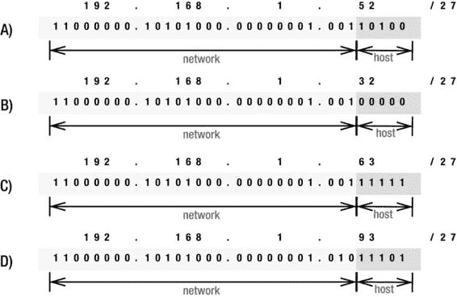
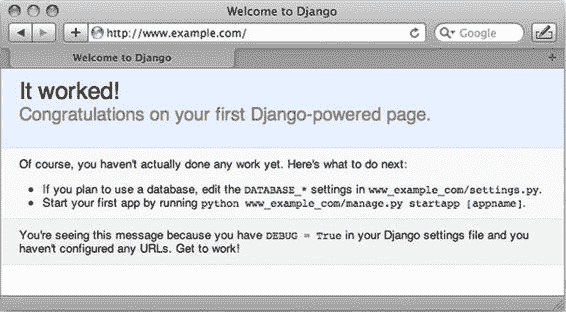
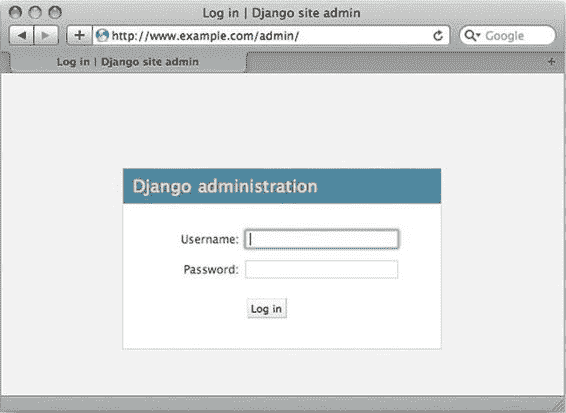
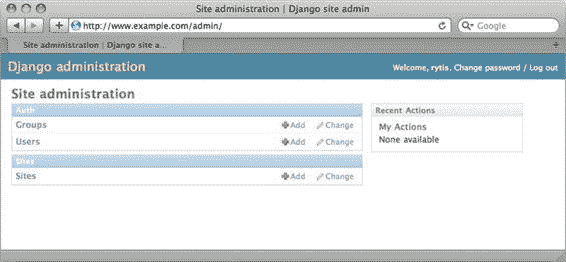
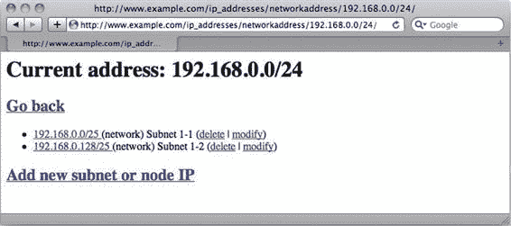

第三章


为 IP 地址会计创建一个 Web 应用程序

在这一章中，我们将构建一个简单的应用程序来跟踪内部网络上分配的所有 IP 地址。本章涵盖了开发该应用程序的所有阶段，从收集和设置需求开始，通过实现阶段的各个方面来设计应用程序。

设计应用程序

理想情况下，应用程序设计不应该基于将要用来实现它的技术。话虽如此，这种独立性很难实现，而且在大多数情况下是不实际的，因为每种技术都暗示着它自己的实现模式和最佳实践。

在本章中，我们将在解释将要使用的技术之前定义*需求和应用程序设计*。这样，即使在您自己的工作中，您将使用不同的技术，您也会更容易理解如何重用设计阶段。

列出要求

在开发任何应用程序时，最重要的考虑是准确理解您想从中获得什么。远离你在别处看到的用户界面图像，或者你过去可能使用过的其他(可能类似的)应用程序的功能。相反，拿一张纸，用简短的句子写下你希望你的应用程序做什么。

我们想象的组织是一个相当大的企业，具有相当复杂的网络基础设施，因此有效地分配和使用 IP 地址空间非常重要。过去，地址记录在简单的电子表格中，不同的团队使用不同的结构来表示相同的信息。在这里，没有分配 IP 地址范围的权限，因此团队之间有效和清晰的沟通非常重要。新系统正在引入，而旧系统正在退役。组策略阻止服务器使用动态 IP 分配；只有用户机器可以从 DHCP 获得地址信息。根据这一简要描述，我们来列出以下要求:

*   该系统必须是集中的，但是可以被许多不同的用户访问。
*   应用程序必须能够存储 IP 范围和个人 IP 地址。
*   应用程序必须提供一种方法来创建范围和单个 IP 地址的分层组织。
*   用户必须能够添加、删除和修改条目。
*   用户必须能够搜索信息。
*   系统必须能够检查使用 IP 地址的机器是否有响应。
*   对于所有 IP 地址，系统应该尝试获取名称记录。
*   必须要求用户输入他们所做的任何 IP 保留的描述。
*   扩展系统使用 DHCP 应该很容易。

既然我们已经定义了所有的需求，我们就可以在开发阶段的任何时候回顾这些需求，并验证我们的应用程序是否完全符合预期。我们不会实现不必要的功能；通过将实际的实现与需求集进行比较，我们将总是知道我们已经取得了多少进展，还有多少工作要做。展望未来，如果有必要，我们甚至可以将个人任务委派给其他人。如果在某个时候我们发现我们遗漏了一些重要的功能，我们总是可以回到我们的列表并相应地修改它，但是这将是一个有意识的决定，这将阻止我们在开发过程中实现任何新的功能。

做出设计决策

一旦我们建立了需求，我们就可以进行一些关于如何实现它们的设计决策。每个设计决策必须试图解决需求列表中陈述的一些目标。

因为这不是一个大规模的项目，所以不需要创建正式的设计文档；同样的非正式发言清单在这里就足够了。因此，根据刚才陈述的需求，我们可以对应用程序开发和结构做出以下决定:

*   该应用程序将是基于网络的。
*   它将运行在专用的网络服务器上，组织中的任何人都可以通过自己的网络浏览器进行访问。
*   该应用程序将使用 Python 编写，并将使用 Django 框架。
*   实施分为两个阶段:基本的 IP 分配和预留功能，以及与 DHCP 的集成。(我们将在本章中处理第一个阶段，然后在第 4 章中继续讨论 DHCP 集成。)

就是这样；尽管这个列表很短，但它确保了我们不会偏离我们最初陈述的目标，如果我们真的需要做一些改变，那将被记录下来。这里的列表主要代表设计的非功能方面；我们将在接下来的章节中讨论更具体的细节。形式上，这应该构成一个详细的设计文档，但是我将只描述两件事:我们的应用程序将操作什么数据，以及应用程序将如何处理这些数据。

定义数据库模式

从刚才陈述的需求中，我们知道我们需要记录以下数据:

*   IP 范围和/或单个 IP 地址
*   当前范围所属的父范围
*   对于每条记录，是否允许为空

**IP 地址如何工作**

在继续之前，让我们检查一下 IP 寻址是如何工作的，这样您将更好地理解我们将要做出的一些具体的数据库布局和结构决策。这里提供的描述有些简化；如果你想了解更多关于 IP 网络的知识，特别是关于 IP 地址的知识，我推荐维基百科上关于 http://en.wikipedia.org/wiki/Classless_Inter-Domain_Routing CIDR 的词条:

。

简而言之，每个 IP 地址都有两个部分:网络地址部分，用于标识特定地址所属的网络，以及该网络中的主机地址。IPV4 中的完整 IP 地址总是 32 位长。在无类域间路由(CIDR) 推出之前，只有三种可用的网络块或网络类:A 类(8 位定义网络地址，允许超过 1600 万个唯一主机地址)、B 类(16 位网络地址，超过 65，000 个唯一主机地址)和 C 类(24 位网络地址，256 个唯一主机地址)。这是非常低效的，因为它不允许细粒度的地址和范围分配，所以 CIDR 方案被引入，它允许我们使用任何长度的网络地址。在 CIDR 符号中，每个 IP 地址后面都有一个数字，用来定义网络部分包含多少位。因此，地址 192.168.1.1/24 告诉我们，这是一个来自 C 类网络的 IP，其前 24 位是网络地址。

这张图片展示了 IP 地址的各种配置，我稍后会解释。该示例使用的网络地址范围比默认的 C 类小得多，因此您可以看到它是如何工作的。



*   (A)显示了 IP 地址 192.168.1.52，以及它是如何分成两部分的:网络地址和主机地址。
*   在(B)中，主机地址设置为 0，从而有效地定义了网络。因此，如果您想引用 192.168.1.52 地址所属的网络范围，您可以将其写成 192.168.1.32/27。
*   如果我们将主机地址设置为全 1，我们将获得该范围内最后一个可能的 IP 地址，也称为*广播 IP* 。在中的示例中，它是地址 192.168.1.63。
*   最后，在(D)中，您可以看到 192.168.1.93/27 是如何超出范围的，因此与 192.168.1.52/27 处于不同的 IP 网络范围；它的网络部分是不同的。其实是在一个相邻的网络范围内，192.168.1.64/27。

这应该对 IP 编号方案有所启发，您可以看到理解这一点如何帮助我们更有效地定义我们的数据库模式。

当您查看 IP 地址是如何构造的时，您可能会注意到较大的网络范围包含较小的网络范围，因此一个 24 位网络可能包含两个 25 位网络，或四个 26 位网络，依此类推；这完全取决于网络基础设施。这种结构让我们很容易检查网络之间的父子关系。

现在，我们需要决定如何存储这些信息。将它存储为四个独立的十进制数(四个八位字节)和一些位是一个显而易见的选择，但是正如您可能已经猜到的，这对任何数据库系统都没有帮助。像“给我所有属于这个范围的 IP”这样的搜索在客户端计算量会很大。因此，我们将把所有 IP 号码转换成 32 位整数，并照此存储。我们还将以位为单位分别存储网络大小，因此计算范围内的第一个和最后一个地址将非常简单。

我来举例说明一下。如果我们取之前使用的 IP 地址 192.168.1.52/27，用按位记数法表示，就会得到下面这个二进制数:11000000000000100110100。这个数字可以表示为 32 位整数(十进制表示法):3232235828。现在我们可以找到它的网络地址。我们知道网络范围是由前 27 位定义的，所以我们需要做的就是对这个数和一个由 27 个 1 和 5 个 0 组成的数进行二进制 AND 运算(1111111111111111111100000 b = 4294967264d):

```py
3232235828D AND 4294967264D = 3232235808D
```

或者，用二进制表示:

```py
11000000101010000000000100100000B
```

将这个结果与“IP 地址如何工作”边栏中的例子进行比较，您会发现结果是一致的。

找到上边界同样容易；我们需要将可用地址的最大数量添加到之前计算的结果中。因为 27 位网络空间留下 5 位来定义主机地址，所以最大(或广播)地址是 2^5 = 32。因此，我们给定地址的网络表示为 3232235808D，其中最后一个地址是 3232235808D + 32D = 3232235840D。从这里，我们可以很容易地找到所有在同一网络范围内的地址。

基于这些信息，我们准备定义我们的数据库模式，它非常简单，只包含一个表。表 3-1 描述了模式中的每一列。

[表 3-1](#_Tab1) 。网络定义方案中的字段

| 

圆柱

 | 

数据类型

 | 

评论

 |
| --- | --- | --- |
| 记录 ID | 整数 | 主键，它是唯一的，并且随着每个新记录自动递增。 |
| 地址 | 整数 | 一个键，它必须被定义，并且是一个表示 32 位网络地址的整数。 |
| 网络规模 | 整数 | 一个密钥，它必须被定义并决定地址的网络部分的位数。 |
| 描述 | 文本 | 必须定义，描述这个 IP 是做什么的。 |

创建应用程序工作流

由于这个应用程序相对简单，我们不需要使用正式的规范语言，如统一建模语言(UML)，来定义应用程序的行为和工作流。这一阶段的主要目标是写下想法和布局结构，这样我们就可以在实现时随时参考文档，并且我们可以确认实现与最初设计的没有什么不同。

我发现只写几个语句是有用的，这些语句简要地描述了对于我们需求列表中的每个功能需求，将会发生什么，以及信息将如何呈现给最终用户。*功能需求*是我们的应用程序需要执行的功能。不要将它们与*非功能需求*相混淆，例如性能或可用性需求，它们不会影响应用程序的工作流程。

搜索和显示功能

一个常见的需求是搜索功能。即使我们不打算搜索，而只想查看列出的所有地址和网络范围，这也是一个广泛的搜索请求，要求系统显示所有可用信息。

因为我们已经决定为信息创建一个层次结构，所以 *search* 函数将通过在描述中查找 IP 地址或子字符串，并返回匹配条目的列表。*显示*功能将显示关于当前所选地址的信息(地址、网络位数以及范围的起始和结束地址),并列出所有子条目——即所选条目中的所有地址或网络。单击它们中的任何一个都会导致一个搜索和显示调用，它会沿着树向下。

显示功能还应该提供到父条目的链接，这样用户可以双向移动。如果搜索查询是空的或者匹配树中最顶端的节点，应该没有向上移动一级的选项。网络树(或超级网络)中最顶端的节点总是 0.0.0.0/0。对于每个子条目，view 函数应该调用一个*健康检查*函数来查看地址是否有响应。另外，一个*名称解析*过程被调用来获得一个 DNS 名称。这些信息应该相应地显示出来。

如果当前选择的树节点是一个网络地址，应该向用户显示一个到 Add New Entry 表单的链接。

添加功能

*添加*功能允许用户添加新的子条目。该表单要求输入新条目的详细信息，比如 IP 地址和描述，并创建一个相应的数据库条目。如果成功完成，表单将返回到之前的视图。

当我们添加一个新条目时，这个函数必须确认该条目是有效的，并且提供的 IP 地址存在。我们还需要检查该地址是否是任何当前父网络的子集。

删除功能

*删除*选项应该出现在每个条目旁边的地址列表中。单击它应该会产生一个简单的 JavaScript 确认对话框，如果确认删除，则必须从数据库中删除相应的条目。

如果条目是一个网络地址，所有子条目都应该递归删除。例如，如果我有一个包含网络 B 的网络 A，而网络 B 又包含地址 C，当我删除网络 A 时，网络 B 和地址 C 条目也应该被删除。

修改功能

当前地址列表中的所有条目都应该有一个*修改*选项。单击 Modify 应该会显示一个类似于添加新条目的表单，其中所有字段都填充了当前信息。

如果条目是一个网络地址，只有描述应该是可更改的。如果条目是主机 IP 地址，则在使用新设置更新数据库行之前，应该执行完整性检查(例如地址是否重复或者是否在有效的网络范围内)。

系统健康检查功能

当列出所有子条目时，*视图*函数应该为每个不是网络地址的地址调用一个*系统健康检查*。运行状况检查函数执行简单的 ICMP 检查(ping ),如果收到响应，则返回 True，否则返回 False。

名称解析功能

正如我们对健康检查函数所做的那样，我们将创建另一个过程，该过程将为网络外部的所有地址调用*名称解析*。名称解析将执行反向 DNS 查找，并返回 DNS 名称(如果可用)。如果没有 DNS 记录，将返回一个空字符串。

Django 框架的基本概念

正如我前面提到的，我们将使用 Django web 框架来开发应用程序。我选择 Django 是因为它是一个多功能的工具，可以极大地简化 web 应用程序开发。

姜戈是什么？

简而言之，Django 是一个高级 web 开发框架。Django 为快速 web 应用程序开发提供了工具。它的设计方式鼓励开发人员编写更干净、更一致的代码；同时也让他们少写代码。为开发人员提供了 web 开发中常用的各种高级功能，因此他们不需要重写别人已经开发的东西。Django 还加强了模块化，使开发人员能够编写一个无需修改或修改很少就可以在许多不同项目中使用的模块。

以下是 Django 框架的一些要点。

对象到关系数据库映射器？

我们使用 Python 类来定义我们的数据模型，Django 自动将它们转换成数据库表和关系。除此之外，Django 提供了一个直接来自 Python 的数据库访问 API，所以我们很少需要自己编写任何 SQL 代码。此外，我们可以在各种数据库系统(MySQL、SQLite 和其他)之间切换，而无需对代码进行任何更改。

管理界面

当我们定义我们的数据方案时，Django 不仅自动创建数据库和所有需要的表，它还生成一个全功能的管理界面来管理我们的数据。

灵活的模板系统

所有可显示的组件或视图都被分离到模板中，所以我们永远不会发现自己在程序中生成 HTML 代码。相反，代码和 HTML 设计是分开的。模板语言学习起来非常简单，但是灵活且对设计者友好，所以我们可以把设计工作交给其他人。

开源社区支持

最后但同样重要的是，Django 是开源的，并得到了活跃的开发者社区的支持。Django 发展非常迅速，每年都有几次重大升级，并且已经出现了一段时间，证明了自己是一个成熟可靠的产品。

模型/视图/控制器模式

在深入其实现细节之前，让我们先来探索 Django 所基于的最重要的设计模式:模型-视图-控制器(MVC)。任何遵循这种模式的 web 应用程序都被分成三个不同的部分:数据模型、视图和控制器。

数据模型组件

*数据模型*(或只是模型)部分定义了应用程序正在使用或操作的数据。这通常是数据库数据结构，但也可以是数据访问方法和函数。在 Django 中，所有的数据结构都被定义为 Python 类，框架自动在数据库上创建相应的数据模式。

视图组件

大多数 web 框架中的*视图*部分负责向最终用户显示数据。它是一组生成 HTML 代码的函数，这些代码被发送回 web 浏览器。Django 更进了一步，将传统上所谓的视图组件分成两个不同的实体:视图和模板。用 Django 的术语来说，视图是决定*将显示哪些*数据的代码，模板是定义*如何显示*数据的组件。

控制器组件

按照惯例，*控制器*组件负责从数据库中检索数据(或访问模型)，对数据进行操作，并将其传递给视图组件。在 Django 中，控制器组件并不明显，也没有与其他组件分开——整个框架充当一个控制器组件。因为数据模型被定义为一组 Python 类，所以更加智能，知道如何对数据进行基本操作。视图(但不是模板！)还包含一些应用程序逻辑，所有这些都由框架控制。

安装 Django 框架

我建议你下载并使用 www.djangoproject.com 发布的最新 Django 代码。在撰写本文时，最新的版本是 1.6，这里所有的例子和代码都是基于这个版本的 Django。如果您要使用 1.6 以外的版本，请阅读发行说明，了解可能影响功能的任何更改。通常会有清晰的说明，告诉你如何让你的代码适应 Django 的新版本。根据我的经验，这项任务通常非常简单，不需要开发人员做大量的工作。

我假设您的系统上已经安装了 Python 2.6+。本章示例将使用的数据库引擎是 SQLite，因此相应的包和 Python 绑定也必须安装。在大多数现代 Linux 发行版中，这是标准设置，很可能会出现在您的系统中。如果您有疑问，可以使用以下命令进行检查:

```py
$ python
Python 2.7.5 (default, Feb 19 2014, 13:47:28)
[GCC 4.8.2 20131212 (Red Hat 4.8.2-7)] on linux2
Type "help", "copyright", "credits" or "license" for more information.
>>> import sqlite3
>>> sqlite3.version
'2.6.0'
>>>
```

如果您正在使用一个非主流的 Linux 发行版，或者如果在初始安装过程中没有安装软件包，请参考您的 Linux 发行版的文档，以获取有关安装最新 Python 2.7.x 发行版和 SQLite 软件包的信息。

 **注**截至本文撰写时，Django 1.6 需要 Python 2.6.5 及以上版本。下一个 Django 版本 1.7 将完全放弃 Python 2.6，支持的最低 Python 版本将是 2.7。Django 版及以上正式支持 Python 3，所以也可以使用。

大多数主流 Linux 发行版都有一个相当最新的 Django 版本，作为一个包提供。例如，在 Fedora 系统上安装 Django 的方式如下:

```py
$ sudo yum install python-django
```

您还可以使用 Python 包管理器(PIP)来安装所需的包:

```py
$ sudo pip install django
```

使用 PIP 的优点是软件包通常是最新的。在撰写本文时，Fedora 存储库中的包是 1.6.4，PyPI (Python 包索引，PIP 查找包的地方)中的包是 1.6.5，这是最新的可用版本。主要的缺点是，您最终会在系统上部署一个应用程序，而这个应用程序对于系统的包管理器来说是未知的。

您可以通过从 Python 命令行界面导入其模块来测试 Django 安装:

```py
# python
Python 2.7.5 (default, Feb 19 2014, 13:47:28)
[GCC 4.8.2 20131212 (Red Hat 4.8.2-7)] on linux2
Type "help", "copyright", "credits" or "license" for more information.
>>> import django
>>> django.get_version()
'1.6.4'
>>>
```

Django 应用的结构

Django 将任何网站都视为一个*项目。在 Django 的术语中，项目是一组 web 应用程序和项目(或站点)特定的配置。您可以在不同的站点重用相同的应用程序，只需将它们部署到新的项目中，它们就会自动使用新的设置，比如数据库凭证。一个项目可以包含任意数量的应用程序。术语*项目*可能听起来有点混乱；我觉得*网站*或者*网站*更合适。*

创建新项目很简单。假设您已经正确安装了 Django，那么您只需要在您想要创建新项目目录的目录中运行 django-admin.py 命令。Django 的管理工具将用基本的配置文件创建一个简单的项目框架。

我们将使用/var/app/vhosts/www _ example _ com/作为项目的基本目录，该目录将包含所有 Django 应用程序:

```py
$ mkdir -p /var/app/virtual/
$ cd /var/app/virtual
$ django-admin.py startproject www_example_com
$ ls -lR www_example_com/
total 8
-rw-r--r--  1 rytis  staff  258 10 Jun 21:08 manage.py
drwxr-xr-x  6 rytis  staff  204 10 Jun 21:08 www_example_com

www_example_com//www_example_com:
total 24
-rw-r--r--  1 rytis  staff     0 10 Jun 21:08 __init__.py
-rw-r--r--  1 rytis  staff  1999 10 Jun 21:08 settings.py
-rw-r--r--  1 rytis  staff   306 10 Jun 21:08 urls.py
-rw-r--r--  1 rytis  staff   405 10 Jun 21:08 wsgi.py
```

在项目目录中，您会找到以下文件:

*   manage.py:一个自动生成的脚本，您将使用它来管理您的项目。使用该工具可以创建新的数据库表、验证模式或转储 SQL 脚本。该工具还允许您调用命令提示界面来访问数据模型。
*   www_example_com/settings.py:保存数据库信息和应用程序特定设置的配置文件。
*   www_example_com/urls.py:充当 URL 调度程序的配置文件。在这里，您可以定义哪些视图应该响应哪些 URL。
*   www_example_com/wsgi.py:一个 wsgi 配置文件，如果 Django 应用程序在一个兼容 WSGI 的 web 服务器(比如 Apache)上运行，并且启用了 mod_wsgi，那么可以使用这个文件。

 **注意**配置文件的位置特定于你的项目。在本章中，我们的项目是在/var/app/virtual/www _ example _ com/中创建的，所以当您看到对 manage.py、settings.py 和 urls.py 文件的引用时，请假定该位置。

一旦创建了新项目，就需要指定 Django 应该使用的数据库引擎。如前所述，在我们的例子中，我们将使用 SQLite。要实现这一点，我们需要在 settings.py 配置文件(在本章后面称为*设置文件*)中做两处更改:指定数据库引擎和数据库文件的绝对文件名:

```py
DATABASES = {
    'default': {
        'ENGINE': 'django.db.backends.sqlite3',
        'NAME': os.path.join(BASE_DIR, 'db.sqlite3'),
    }
}
```

当项目和数据库配置完成后，我们可以通过在项目目录中发出以下命令来创建应用程序:

```py
$  python manage.py startapp ip_addresses
$ ls –l ip_addresses/
total 12
-rw-r--r-- 1 root root   0 2014-05-24 14:55 __init__.py
-rw-r--r-- 1 root root  57 2014-05-24 14:55 models.py
-rw-r--r-- 1 root root 514 2014-05-24 14:55 tests.py
-rw-r--r-- 1 root root  26 2014-05-24 14:55 views.py
```

就像 Django 管理工具一样，项目管理脚本为我们的新应用程序创建了一个框架。现在我们已经建立了项目(或网站)并配置了一个应用程序，我们需要做的是定义数据模型，编写视图方法，创建 URL 结构，最后设计模板。所有这些我将在下面的章节中详细描述，但是首先我仍然需要展示如何让其他人看到我们的新网站。

该应用程序不能立即使用；我们需要在设置文件中将它添加到 INSTALLED_APPS 列表中:

```py
INSTALLED_APPS = (
    'django.contrib.auth',
    'django.contrib.contenttypes',
    'django.contrib.sessions',
    'django.contrib.sites',
    'ip_addresses',
)
```

在 Apache Web 服务器上使用 Django

Django 自带轻量级 web 服务器，是用 Python 编写的。这是快速测试或开发过程中的一个很好的工具，但是我强烈建议不要在生产环境中使用它。我在使用它时从未遇到任何问题，但是正如 Django 背后的开发人员所说，他们从事 web 框架业务，并不是来开发健壮的 web 服务器的。

web 服务器最明显的选择之一是 Apache web 服务。它被广泛应用于互联网上的绝大多数网站。许多 Linux 发行版默认包含 Apache 安装包。设置 Apache 很容易，它既服务于静态 CSS 样式表和图像又服务于动态生成的页面(就像在 Django 应用程序中一样)。

我们的示例将假设以下信息:

*   网站名称:[www.example.com](http://www.example.com)
*   服务器的 IP 地址:192.168.0.1
*   Django 代码存储的目录:/var/app/vhosts/[www.example.com/](http://www.example.com/)
*   存储静态内容的目录:/var/www/vhosts/www _ example _ com/

 **注意**你可能想知道为什么代码和内容目录是分开的。分开的原因是这是一种额外的安全措施。正如你将在本章后面看到的，我们将指示 web 服务器为所有对虚拟服务器的请求调用 mod_python 模块。例外是以/static/开头的所有 URIs，这将是我们的静态内容。现在，如果由于某种原因我们在配置文件中犯了一个错误，导致 mod_python 没有被调用，并且代码目录是 DocumentRoot 指令的一部分，那么我们所有的 python 文件都将变成可下载的。因此，请始终将您的代码文件单独保存在 DocumentRoot 之外！

清单 3-1 显示了 Apache web 服务器配置文件中的 VirtualServer 定义。根据您的 Linux 发行版，这一部分可能直接包含在 httpd.conf 中，或者作为一个单独的配置文件与其他 VirtualServer 定义放在一起。

[清单 3-1](#_list1) 。Django Web 应用程序的虚拟服务器定义

```py
<VirtualHost 192.168.0.1:80>
    ServerName www.example.com
    DocumentRoot /var/www/virtual/www.example.com
    ErrorLog /var/log/apache2/www.example.com-error.log
    CustomLog /var/log/apache2/www.example.com-access.log combined
    SetHandler mod_python
    PythonHandler django.core.handlers.modpython
    PythonPath sys.path+['/var/app/virtual/']
    SetEnv DJANGO_SETTINGS_MODULE www_example_com.settings
    SetEnv PYTHON_EGG_CACHE /tmp
    <Location "/static/">
        SetHandler None
    </Location>
</VirtualHost>
```

配置的第一部分处理基本配置，例如设置服务器名称、所有静态内容的基本目录以及日志文件位置。接下来是 mod_python 配置，其中第一行告诉 Apache 将每个 web 服务器阶段的执行传递给 mod_python 模块:

```py
SetHandler mod_python
```

该指令后面是模块配置设置。

**什么是 APACHE 处理程序**

所有的要求。由 Apache web 服务器分阶段处理。例如，对一个简单的 index.html 文件的请求可能涉及三个阶段:将 URI 翻译成文件的绝对位置；读取文件并在 HTTP 响应中发送它；并记录该事件。每个请求涉及的阶段取决于服务器配置。每个阶段都由一个处理程序处理。Apache 服务器只有基本的处理程序；更复杂的函数由作为可加载模块一部分的处理程序实现，mod_python 就是其中之一。Python 模块有所有可能的 Apache 阶段的处理程序，但是默认情况下没有调用处理程序。每个阶段都需要与配置文件中适当的处理程序相关联。

Django 只需要一个处理程序，即通用的 PythonHandler，它在向请求者提供实际内容的阶段被调用。Django 框架自带处理程序，不需要默认的 mod_python.publisher 处理程序。

下面的语句告诉 Apache 调用 Django 的处理程序:

```py
PythonHandler django.core.handlers.modpython
```

正如你已经知道的，Django 中的每个网站实际上都是一个 Python 模块，有它的配置文件。Django 处理程序需要这些信息，这样它就可以加载配置并找到合适的函数。下面两行提供了这些信息。第一个指令将我们的基本目录添加到默认的 Python 路径中，第二个指令设置一个环境变量，该变量标识哪个框架将用于获取要加载的模块的名称。

```py
PythonPath sys.path+['/var/app/virtual/']
SetEnv DJANGO_SETTINGS_MODULE ip_accounting.settings
```

我们还需要确定临时 Python 文件的存储位置。我们确保用户可以写这个目录，我们用它来运行 Apache web 服务器:

```py
SetEnv PYTHON_EGG_CACHE /tmp
```

最后，让我们定义异常，这样静态内容(所有以/static/开头的内容)就不会交给 mod_python 进行处理。相反，将调用默认的 Apache 处理程序；它将简单地服务于任何请求的文件:

```py
<Location "/static/">
    SetHandler None
</Location>
```

如果您按照这些说明来配置 Django，并且已经创建了您的第一个应用程序，并指示 Apache 相应地为其提供服务，那么您现在应该能够启动 web 浏览器并导航到 Django web 应用程序。此时，数据模型还没有创建，甚至 URL dispatcher 也没有配置，所以 Django 将只提供通用的“它工作了！”页面，如图 3-1 中的[所示。](#Fig1)



[图 3-1](#_Fig1) 。标准 Django 应用程序问候页面

 **提示**如果您看到的是“服务器错误”消息而不是标准页面，请检查包含 Python 异常或 Apache 错误消息的 Apache 错误日志文件，这可以帮助您确定错误的原因。

实现基本功能

一旦准备工作完成？包括 Django 安装和 Apache web 服务器的设置已经完成，我们可以继续开发 web 应用程序了。这个过程可以分为以下几个部分:

*   创建模型
*   定义 URL 模式
*   创建视图

以我的经验，这个过程是非常迭代的；随着开发的进行，我继续修改我的模型，添加新的 URL，并创建新的视图。这种方法允许我非常快速地让一些东西工作起来，并且测试一些功能，即使整个应用程序还没有完成。不要认为这种方法是混乱的。恰恰相反；我只处理我在设计阶段确定并写下的元素。因此，这个过程仅仅是将一个巨大的工作分解成更小的、更易管理的块，这些块可以单独地、分阶段地进行开发和测试。

定义数据库模型

在继续之前，回头看一下[表 3-1](#Tab1) 并回顾我们将在数据模型中使用的字段。因为 Django 将对象映射到关系数据库，并且是自动进行的，所以我们需要为应用程序中使用的每个概念创建一个类定义，它将被映射到数据库中的表。

[表 3-2](#_Tab2) 。常用的 Django 字段类型

| 

字段类名

 | 

描述

 |
| --- | --- |
| 布尔菲尔德 | 该字段只接受 True 或 False 值，除非它用于 MySQL 数据库，在这种情况下，该字段相应地存储值 1 或 0。在测试字段值时，请记住这一点。 |
| 加菲 | 使用该字段存储字符串。它需要一个 max_length 参数来设置它可以存储的字符串的最大长度。不要使用此字段存储大量文本；请改用 TextField。 |
| 戴达菲尔德 | 将日期存储为 Python datetime.date 类的实例。该字段类接受两个可选参数:auto_now，如果设置为 True，则在每次保存对象时将字段值设置为当前日期；auto_now_add，如果设置为 True，则仅在首次创建时将字段值设置为当前日期。这两个参数都强制 Django 使用当前日期，并且不能被覆盖。 |
| 日期 | 将日期和时间存储为 Python datetime.datetime 实例。使用与 DateField 相同的可选参数。 |
| 德西马菲尔德 | 用于存储固定精度的十进制数。需要两个参数:max_digits，用于设置数字的最大位数 decimal _ places，用于设置小数位数。 |
| 邮箱 | 类似于 CharField，但也检查有效的电子邮件地址。 |
| 文件字段 | 用于存储上传的文件。请注意，文件不是存储在数据库中，而是存储在本地文件系统中。该字段需要一个参数 path_to，它指向相对于 MEDIA_ROOT 目录的。您可以使用 strftime 变量根据当前日期和时间构造路径名和文件名。必须在当前项目的设置文件中设置 MEDIA_ROOT。 |
| 浮田 | 存储浮点数。 |
| ImageField(图像字段) | 非常类似于 FileField，但是额外执行一个文件是有效图像的检查。还有两个可选参数:height_field 和 width_field，它们存储模型类变量的名称，并将根据上传的图像尺寸自动填充。使用此字段类型需要 Python 影像库(PIL)。 |
| -你是什么意思 | 存储整数值。 |
| 正积分域 | 存储整数值，但只允许正整数。 |
| NullBooleanField | 像 BooleanField 一样存储 True 和 False，但也不接受任何值。在需要是/否/未定义选项的组合时很有用。 |
| 斯拉格菲尔德 | 像 CharField 一样存储文本，但只允许字母数字字符、下划线和连字符。用于存储 URL(没有域部分！).max_length 参数默认为 50，但可以被覆盖。 |
| TextField 对象 | 用于存储大块文本。 |
| 时间字段 | 将时间存储为 Python datetime.time 实例。接受与 DateField 相同的可选参数。 |
| URLField 先生 | 用于存储包括域名在内的 URL。有一个可选的参数 verify_exists，它检查 URL 是否有效，是否实际加载，并且不返回 404 或任何其他错误。 |
| XMLField | 一个文本字段，它还检查文本是否是有效的 XML，是否对应于 RELAX NG([www.relaxng.org](http://www.relaxng.org))定义的 XML 模式。需要参数 schema_path，该参数必须指向有效的架构定义文件。 |

我们只有一个表，所以让我们为它定义类，如清单 3-2 所示。将这段代码添加到 models.py 文件中，就在默认内容的下面。

[***清单 3-2***](#_list2) 。定义应用程序网络地址模型的数据类

```py
class NetworkAddress(models.Model):
    address = models.IPAddressField()
    network_size = models.PositiveIntegerField()
    description = models.CharField(max_length=400)
    parent = models.ForeignKey('self')
```

这段代码非常简单明了。我们首先定义一个新的类 NetworkAddress，它继承自 Django 的模型。模型类，在 django.db 模块中定义。所以这个类变成了一个定制模型，Django 将用它来创建数据库表。这个模型类还将用于动态创建数据库 API。稍后我将展示如何使用这个 API。

在这个类中，我们通过用 models 类中的适当对象初始化类变量来定义三个字段。Django 提供了许多不同类型的字段，表 3-2 列出了最常用的类型。

要创建数据库表，我们只需使用带有 syncdb 选项的 manage.py 实用程序。当我们第一次运行它时，它还会为设置文件中列出的其他应用程序创建表(身份验证、Django 内容类型以及会话和站点管理)。内置身份验证应用程序需要一个管理员帐户，因此它会多问几个问题:

```py
$ python manage.py syncdb
Creating tables ...
Creating table django_admin_log
Creating table auth_permission
Creating table auth_group_permissions
Creating table auth_group
Creating table auth_user_groups
Creating table auth_user_user_permissions
Creating table auth_user
Creating table django_content_type
Creating table django_session
Creating table ip_addresses_networkaddress

You just installed Django's auth system, which means you don't have any superusers defined.
Would you like to create one now? (yes/no): yes
Username (leave blank to use 'rytis'):
Email address: rytis@example.com
Password:
Password (again):
Superuser created successfully.
Installing custom SQL ...
Installing indexes ...
Installed 0 object(s) from 0 fixture(s)
$
```

这个命令行对话框已经成功地在数据库中创建了所有必需的表。为了确切地了解我们的表在数据库中的结构，我们使用以下命令:

```py
$ python manage.py sql ip_addresses
BEGIN;
CREATE TABLE "ip_addresses_networkaddress" (
    "id" integer NOT NULL PRIMARY KEY,
    "address" char(15) NOT NULL,
    "network_size" integer unsigned NOT NULL,
    "description" varchar(400) NOT NULL,
    "parent_id" integer REFERENCES "ip_addresses_networkaddress" ("id")
)
;
COMMIT;
$
```

如您所见，Django 使用变量名作为表中字段的名称，表名由应用程序和模型类名构成。这很方便，因为它确实提供了一定程度的名称间距，所以您不必担心您的类名与另一个应用程序的类名冲突。

URL 配置

在 Django 开发过程中，您会发现自己经常更改 URL 配置，因为您将添加新的视图和功能。为了不使这个过程失控，你需要为如何定义新的 URL 制定一些基本规则。虽然 Django 让您可以完全控制整个过程，但是通过选择合理的 URL 结构和命名约定，对他人(尤其是对自己)好一点。

对于如何创建 URL，没有明确的规则或指导方针。作为一名系统管理员，您可能不会开发面向大量用户的 web 系统，因此您可以更轻松地组织它们。然而，我想提出一些我认为非常有用的指导方针

*   总是以应用程序的名称开始。在 IP 地址示例中，所有 URL(包括域名)都将是 http://www . example . com/IP _ address/[...].如果你想在你的网站中使用另一个应用程序，你不必担心 URL 名称重叠。例如，视图功能就很常见。在我们的例子中，如果我们没有将应用程序名称放在前面，并且我们有两个应用程序 A 和 B，如果它们都想使用 URL /view/的话，我们就会遇到问题。
*   将模型名称放在应用程序名称之后。如果需要同一类型的更具体的对象子集，请在模型名称后添加选择标准。尽可能避免使用对象 id！因此，继续我们的示例，我们将拥有 ip_addresses/networkaddress/，它列出了所有顶级网络。如果我们导航到/IP _ addresses/network address/109 . 168 . 0 . 0/
*   如果需要对任何对象进行操作，请在特定对象名称后添加操作谓词。因此，在我们的示例中，如果我们想要一个到网络地址的删除函数的链接，我们将使用/IP _ addresses/network address/192 . 168 . 0 . 1/delete。

这些指导原则可以通过以下示例 URL 进行总结:

```py
http://www.example.com/<application>/<model>/<object>/<action>/
```

URL 映射在 urls.py 模块中定义，其默认设置如[清单 3-3](#list3) 所示。

[***清单 3-3***](#_list3) 。站点范围的 urls.py 文件的默认内容

```py
from django.conf.urls import patterns, include, url

from django.contrib import admin
admin.autodiscover()

urlpatterns = patterns('',
    # Examples:
    # url(r'^$', 'www_example_com.views.home', name='home'),
    # url(r'^blog/', include('blog.urls')),

    url(r'^admin/', include(admin.site.urls)),
)
```

这个文件的结构非常简单明了。最重要的部分是 urlpatterns 变量，它是 URL 元组的列表。每个条目(元组)有三个部分:

```py
url(<regular expression>, <callback function>, <dictionary (optional)>)
```

当用户从 Django web 应用程序请求一个页面时，会发生这样的情况:请求被发送到 Apache web 服务器，该服务器又会调用它的 Django 处理程序。Django 框架将检查 urlpatterns 中的所有条目，并尝试将每个正则表达式与所请求的 URL 进行匹配。当找到匹配时，Django 将调用一个与正则表达式相关联的回调函数。它将传递一个 HttpRequest 对象(我将在视图部分讨论这一点)和一个可选的从 URL 获取的参数列表。

我强烈建议您不要在主 urls.py 文件中定义任何特定于应用程序的 URL 规则；使用您正在开发的应用程序的本地配置。通过这种方式，您可以将应用程序 URL 从网站中分离出来，从而允许您在不同的项目中重用相同的应用程序。

让我解释一下这是如何工作的。解耦相当简单；您只需在应用程序模块中定义特定于应用程序的 URL，并在所有以应用程序名称开头的请求中引用该文件。因此，在我们的示例中，我们将在主项目 urls.py 中包含以下条目:

```py
urlpatterns = ('',
    [...]
    url(r'^ip_addresses/', include('www_example_com.ip_addresses.urls')),
    [...]
)
```

而特定于应用程序的配置文件 ip_addresses/urls.py 包含:

```py
urlpatterns = patterns('',
    [...]
)
```

如您所见，main urls.py 将捕获所有以 ip_addresses/开头的 URL，URL 的其余部分被发送到 ip_addresses/urls.py 进行进一步处理。

使用管理界面

我们现在可以继续创建一些视图和表单来显示记录，并添加和删除它们，但是在我们这样做之前，下面是如何启用 Django 管理界面。这是一个非常方便的工具，它提供了对数据的即时访问，具有完整而丰富的功能，允许您添加、删除、修改、搜索和过滤存储在数据库中的记录。它在开发阶段也非常有用，允许您在创建表单添加新记录之前添加新记录并创建显示视图。

启用管理界面

 **注意**在 Django 的早期版本中，管理界面默认是禁用的。在 Django 的最新版本中，管理界面会自动为您启用，因此您不需要做任何事情。浏览这里的说明并熟悉配置文件结构仍然是一个好主意。

启用管理界面只需做很少的工作:将其添加到站点配置中的应用程序列表，启用 URL 规则，并配置 Apache 为界面提供静态内容(主要是 CSS 和 JS 脚本)。您可以修改 settings.py 模块中的 INSTALLED_APPS 列表，使其包含管理包:

```py
INSTALLED_APPS = (
    'django.contrib.auth',
    'django.contrib.contenttypes',
    'django.contrib.sessions',
    'django.contrib.sites',
    'django.contrib.admin',
    'ip_addresses',
)
```

完成之后，您需要重新运行 syncdb 命令,以便在数据库中为管理应用程序创建新表:

```py
$ python manage.py syncdb
Creating table django_admin_log
Installing index for admin.LogEntry model
$
```

取消对 urls.py 模块中与管理插件相关的所有行的注释。你要确保你的 urls.py 看起来像清单 3-4 中的。

[***清单 3-4***](#_list4) 。在 urls.py 模块中启用管理界面

```py
from django.conf.urls import patterns, include, url

from django.contrib import admin
admin.autodiscover()

urlpatterns = patterns('',
    # Examples:
    # url(r'^$', 'www_example_com.views.home', name='home'),
    # url(r'^blog/', include('blog.urls')),

    url(r'^admin/', include(admin.site.urls)),

    # ip_addresses application
    url(r'^ip_addresses/', include('ip_addresses.urls')),
)
```

您在 DocumentRoot 目录中创建一个链接，这样/opt/local/django-trunk/django/contrib/admin/media 的内容就可以由 Apache 从 URL www.example.com/static/admin:提供服务

```py
$ ln –s /usr/share/django/django/contrib/admin/media \
/var/www/virtual/www.example.com/static/admin
```

一旦您完成了所有这些准备工作，您应该能够导航到 www.example.com/admin 并看到管理界面登录页面，如图 3-2 所示。



[图 3-2](#_Fig2) 。Django 管理登录页面

您可以使用先前在第一次运行 syncdb 时创建的管理员帐户登录。登录后，您将看到基本的用户和站点管理选项，如[图 3-3](#Fig3) 所示。



[图 3-3](#_Fig3) 。Django 管理界面的默认视图

允许管理插件管理新模型

您可能已经注意到，Django 管理界面还没有提供任何管理 NetworkAddress 模型的选项。这是因为它没有找到任何这样做的指令。向管理界面添加任何数据模型类都非常容易；您需要做的就是在您的应用程序目录 admin.py 中创建一个新的 Python 模块，包含清单 3-5 中的代码。

[***清单 3-5***](#_list5) 。将网络地址类添加到管理界面

```py
from www_example_com.ip_addresses.models import NetworkAddress
from django.contrib import admin

class NetworkAddressAdmin(admin.ModelAdmin):
    pass

admin.site.register(NetworkAddress, NetworkAddressAdmin)
```

在我们的示例中，我们首先从标准 Django 包中导入 NetworkAddress 类和管理模块。然后，我们为我们想要置于管理模块控制之下的每个模型定义一个管理类。管理类的命名约定是 <model class="" name="">Admin。该类必须从 admin 继承。ModelAdmin 类，它定义了模型管理界面的默认行为。</model>

对于我们的简单模型，没有必要调整默认行为。它允许查看/添加/删除/修改等基本功能，并且因为我们将创建自己的具有附加功能的界面(例如以层次顺序显示信息)，所以我们不需要 Django 管理模块的任何额外功能。

你可以用自动生成的界面玩一玩；尝试添加新条目并修改现有条目。此外，尝试输入无效信息，比如格式错误的 IP 地址，并检查 Django 管理界面对错误的反应。您会注意到无效的 IP 地址不被接受；但是，没有逻辑检查网络大小是否在适用的范围内:1–32。(我们将不得不在表单级别使用验证，我将在后面描述。)

查看记录

让我们从最简单的视图开始，它的目的是表示数据库中定义的所有网络的信息。现在，您必须使用前面创建的管理界面来添加新网络和定义关系。

首先，我们需要定义 URL 映射规则，以便将请求重定向到适当的视图函数:

```py
urlpatterns = patterns(ip_addresses.views',
    url(r'^networkaddress/$', 'display'),
    url(r'^networkaddress/(?P<address>\d{1,3}\.\d{1,3}\.\d{1,3}\.\d{1,3}\/\d{1,2})/$',
     'display'),
)
```

第一个规则匹配 URL /ip_address/networkaddress/第二个规则搜索类似/IP _ address/network address/a . b . c . d/x/的 URL。它还调用 display 函数，但这一次它传递关键字参数 address，该参数用字符串 a.b.c.d/x 初始化。

让我们通过定义一个视图的简化版本来快速测试一下这是否可行。现阶段我们想知道的是，我们的两条规则是否如预期的那样起作用。清单 3-6 是一个简单的 views.py 文件的例子，它将测试我们的 URL。

[***清单 3-6***](#_list6) 。测试 URL 调度程序规则的简单视图

```py
from ip_addresses.models import *
from django.http import HttpResponse

def display(request, address=None):
    if not address:
        msg = "Top of the address tree"
    else:
        msg = "Top level address: %s" % address
    return HttpResponse(msg)
```

这里发生的事情非常简单。我们导入模型类和 HttpResponse 类。Django 框架期望一个 HttpResponse 的实例或者一个由它调用的任何视图函数产生的异常。显然，view 函数在这一点上并没有多大作用；它将只显示来自 URL 的 IP 地址，或者告诉你它在地址树的顶端，如果在 URL 中没有找到 IP。

在开始创建更复杂的视图之前，这是整理 URL 映射正则表达式的好方法。在调试视图功能时，您需要知道您的映射是否按预期运行。

 **注意**同时包含 IP 地址和网络大小的原因是，只有这两个地址对才能创建唯一的对象。如果您只使用 IP 地址，在大多数情况下，它可能是不明确的。例如，192.168.0.0 (/24)和 192.168.0.0 (/25)不是同一个网络，尽管它们的 IP 地址相同。

现在，在继续之前，让我们在数据库中创建一些条目。您必须使用 Django 管理界面，因为没有用于输入数据的定制表单。表 3-3 包含示例数据，你可以用它来创建类似的条目，并将本书中的结果与你在实施过程中得到的结果进行比较。

[表 3-3](#_Tab3) 。一个样本 IP 网络和地址数据集


手动添加的内容似乎很多。如果您想手动创建所有记录，那很好，但是 Django 有另一个特性:您可以将初始数据作为 fixture 文件提供。Django 版本支持三种格式:XML、YAML 和 JSON。这在开发和测试阶段非常有用。您只需创建一次初始数据，然后在需要时使用确切的数据集重新创建数据库。

清单 3-7 显示了我们将用来初始化数据库的样本夹具文件的一部分。我在这里选择使用 JSON，主要是因为它的简单性、可读性和可支持性。

[***清单 3-7***](#_list7) 。用于加载初始数据的 sample_data.json 文件摘录

```py
[
...
    {
        "model":  "ip_addresses.networkaddress",
        "pk": 1,
        "fields": {
            "address":  "192.168.0.0",
            "network_size": 24,
            "description": "First top level network"
        }
    },
...
    {
        "model":  "ip_addresses.networkaddress",
        "pk": 3,
        "fields": {
            "address":  "192.168.0.0",
            "network_size": 25,
            "description": "Subnet 1-1",
            "parent": 1

    },
...
]
```

文件的结构非常简单明了。每条记录都以定义模型类开始，后跟主键，主键是一个整数，除非您已经显式地重新定义了它。最后，所有类字段都在“字段”部分的“键:”值”对中列出。

如果记录之间有任何关系，它们通过使用主键值来定义，就像在这个例子中一样；子网 1-1 有一个父记录，通过将“parent”设置为值 1(父记录的主键)来引用它。

如果该字段是可选的，您可以跳过它。创建文件后，使用以下命令加载数据:

```py
$ python manage.py loaddata sample_data.json
Installed 20 object(s) from 1 fixture(s)
$
```

使用模板

模板在 Django 框架模型中扮演着重要的角色。正是模板允许开发人员将应用程序逻辑从表示中分离出来。同样，模型定义数据结构，视图函数负责数据查询和过滤，模板定义数据如何呈现给最终用户。

Django 附带了一种灵活而复杂的模板语言。让我们看看如何将模板与视图函数获得的数据一起使用。首先，我们需要定义一个视图，该视图将查询数据库并获取我们将呈现给用户的信息。[清单 3-8](#list8) 显示了新的显示功能。

[***清单 3-8***](#_list8) 。使用模板显示数据的视图功能

```py
def display(request, address=None):
    if not address:
        parent = None
    else:
        ip, net_size = address.split('/')
        parent = NetworkAddress.objects.get(address=ip, network_size=int(net_size))
    addr_list = NetworkAddress.objects.filter(parent=parent)
    return render_to_response('display.html',
                              {'parent': parent, 'addresses_list': addr_list})
```

正如您已经知道的，Django 的 URL dispatcher 调用 display 函数时要么没有初始 IP 地址(当用户请求树的顶端列表时)，要么没有初始 IP 地址(请求显示子网的内容)。如果地址字段为空，我们将显示所有没有父节点的树节点。如果地址字段不为空，我们需要获取父节点设置为给定地址的树节点列表。结果存储在 addr_list 中，并传递给模板。

需要显示两个实体:关于当前树节点的信息和其子节点的列表。所以我们必须将两者作为变量传递给模板渲染过程。在我们的示例中，我们使用一个名为 render_to_response 的快捷函数，它接受两个参数:模板文件的名称和模板将用来呈现 HTML 输出的变量字典。

可以使用以下 import 语句导入 render_to_response 快捷方式:

```py
from django.shortcuts import render_to_response
```

正如您所看到的，我们指定了模板名，而没有任何前面的目录路径，那么 Django 如何知道在哪里寻找模板呢？默认情况下，settings.py 配置文件中启用了以下模板加载器:

```py
TEMPLATE_LOADERS = (
                    'django.template.loaders.filesystem.load_template_source',
                    'django.template.loaders.app_directories.load_template_source',
)
```

我们使用 app _ directories 加载程序提供的功能。这个加载器查找存储在 templates/子目录下的应用程序目录中的模板。将模板存储在应用程序中非常有用，因为这允许开发人员为每个应用程序分发一组默认模板。因此，回到我们的示例，我们需要在应用程序目录 ip_addresses 中创建一个名为“templates”的子目录。然后我们创建清单 3-9 所示的模板，它负责显示由显示视图函数传递给它的信息。

[***清单 3-9***](#_list9) 。显示视图的模板

```py

Current address: {{ parent.address }}/{{ parent.network_size }}</h1>
<a href="../../{{ parent.parent.address }}/{{
 parent.parent.network_size }}/">Go back</a></h2>

At the top of the networks tree</h1>



    <ul>
    
        <li><a href="../../{{ address.address }}/{{
 address.network_size }}/modify/">{{
 address.address }}/{{ address.network_size }}
           </a>
            (host)(network)
            {{ address.description }}
            (<a href="../../
                      {{ address.address }}/{{ address.network_size }}/delete/">delete</a> |
            <a href="../../
                     {{ address.address }}/{{ address.network_size }}/modify/">modify</a>)
        </li>
    
    </ul>


This is a node IP

No addresses or subnets in this range


<a href="add/">Add new subnet or node IP</a></h2>
```

您可能已经猜到模板语言标记是用或{{...}}.这两种形式的区别在于，前者用于包围命令和过程控制语句，例如比较和验证操作符，而后者用于指示需要在指定位置显示变量的内容。

引用对象属性时，所有变量都遵循相同的 Python 约定。例如，在模板中，parent 是 NetworkAddress 模型类的一个实例，因此 parent 具有属性 Address。为了在模板中显示该变量，我们需要将其作为 parent.address 引用。

表 3-4 列出了你会经常用到的基本命令结构。

[表 3-4](#_Tab4) 。Django 模板语言最常见的元素

| 

结构

 | 

描述

 |
| --- | --- |
| </variable> | 最常用于测试变量是否已定义且内容不为空。根据结果，您可以显示变量的值，也可以提供一条信息性消息，告知找不到该值。 |
| </list></variable>{ % endfor % } | 遍历<list>中的所有项，并将单个列表项分配给<variable>，您可以在 for 构造中使用它。</variable></list> |
| { % ifqual<variable1><variable2>% }</variable2></variable1> | 比较两个变量<variable1>和<variable2>，并根据结果处理两个模板块中的一个。</variable2></variable1> |
|  | 这两个运算符之间的所有内容都将被忽略。 |

正如您在模板中看到的，我已经添加了 URL 链接来删除、修改和添加记录。即使在这个阶段，所有这些都是可能的，因为我们最初设定了需求，并且在开发过程的任何阶段，我们都精确地知道需要做什么。

在这种情况下，应用程序还没有准备好执行这些操作，但是我们需要进行布局设计并在模板中实现它。如果您需要将模板交给其他人，这尤其有用，因为那个人不必猜测您可能需要什么操作和什么链接，即使功能尚未实现，他也可以创建它们。

[图 3-4](#Fig4) 显示了当我们导航到一个预先创建的网络地址时，应用程序网页的外观。



[图 3-4](#_Fig4) 。网络地址列表

删除记录

我们已经有了一个到列出了每个 IP 地址的 delete 函数的链接，如您所知，它的基本 URL 与列表函数的相同，但是它还附加了/delete/例如，以下是 192.168.0.0/25 网络的删除 URL:

```py
http://www.example.com/ip_addresses/networkaddress/192.168.0.0/25/delete/
```

首先，我们需要“教”Django 识别这个 URL 并调用删除函数(或视图)。让我们通过将以下 URL 规则添加到 urls.py 文件来实现这一点:

```py
url(r'^networkaddress/(?P<address>\d{1,3}\.\d{1,3}\.\d{1,3}\.\d{1,3}\/\d{1,2})/delete/$',
      'delete'),
```

清单 3-10 显示了 Django 框架在遇到匹配该规则的 URL 时将调用的删除函数。

[***清单 3-10***](#_list10) 。删除视图

```py
def delete(request, address=None):
    ip, net_size = address.split('/')
    parent = NetworkAddress.objects.get(address=ip,
                                        network_size=int(net_size)).parent
    NetworkAddress.objects.get(address=ip, network_size=int(net_size)).delete()
    redirect_to = '../../../'
    if parent:
        redirect_to += '%s/%s/' % (parent.address, int(parent.network_size))
    return HttpResponseRedirect(redirect_to)
```

在我们的示例中，地址变量总是包含 x.x.x.x/y 格式的 IP 地址，其中 x.x.x.x 是 IP 地址，y 是网络位数。我们不以这种格式存储地址信息，所以我们必须将其拆分为两部分，然后才能使用它来查找所需的记录。

在我们删除对象之前，让我们通过运行下面的 object get 方法来找出它的父对象:

```py
parent = NetworkAddress.objects.get(address=ip, network_size=int(net_size)).parent
```

一旦我们检索到了对象，让我们简单地调用 delete()方法，该方法可用于任何 Django 模型对象。

您可能想知道作为我们刚刚删除的树节点的子节点的对象会发生什么情况。Django 框架足够智能，可以运行一个递归 SQL 查询，该查询将跟踪外键并删除树中所有相关的对象。

对象删除完成后，我们通过返回 HttpResponseRedirect 对象并以 path 作为其初始化参数来重定向到当前视图。

 **提示**你注意到我们如何在重定向 URL 中使用相对路径了吗？我们这样做是因为我们不知道如果有人重用代码，项目甚至应用程序将被调用。我们知道的是 URL 结构，所以我们可以计算出我们需要重定向到哪里，并使用相对路径。尽量避免使用绝对路径和在生成的 URL 中嵌入应用程序名称。

添加新记录

这是需要用户输入的功能。因为我们的模型相当简单，所以只需要填写几个字段，特别是 IP 地址、网络大小和描述。根据用户单击添加链接时所处的位置，将自动分配一个父树节点。例如，如果用户导航到[http://www . example . com/ip _ addresses/network address/192 . 168 . 1 . 0/24/](http://www.example.com/ip_addresses/networkaddress/192.168.1.0/24/)并点击添加新 IP 链接，新记录将自动获得 192.168.0.1/24 作为父记录。

Django 中有两种处理数据输入的方式:硬方式和 Django 方式。如果我们选择硬方法，我们需要在模板中定义表单，手动处理请求 HTTP POST 变量，执行验证，并进行数据类型转换。或者，我们可以选择使用 Django 表单对象和小部件，它们会自动为我们完成所有这些工作。

因此，首先我们需要定义一个表单模型类，用于生成 HTML 表单小部件。我们通过在 models.py 中定义清单 3-11 中所示的类来实现这一点。

[***清单 3-11***](#_list11) 。地址添加表单类

```py
from django.forms import ModelForm

[...]

class NetworkAddressAddForm(ModelForm):
    class Meta:
        model = NetworkAddress
        exclude = ('parent', )
```

这里发生的事情是，我们定义了一个表单类，它使用一个数据模型类作为原型。换句话说，这告诉 Django 生成一个表单来接受数据模型中定义的数据。我们可以选择定义任意的表单类，使用任意的字段集，但是在这个例子中，我们只需要数据模型中的三个字段。

坚持住。我们有四个字段，其中一个是父对象。但是我们不希望用户能够选择父对象，仅仅因为它在创建时就已经知道了。另一个原因是，对于大型数据库，父列表可能会变得太大而无法处理。因此，我们必须使用排除列表来指明哪些字段不需要显示在表单中。

第二步是定义处理视图的表单。这个视图与普通的只显示数据的视图函数略有不同，因为它可以通过两种不同的方式调用:作为 HTTP GET ，这意味着用户刚刚导航到表单页面；或者作为 HTTP POST ，这意味着用户提交了表单数据。

在 HTTP GET 的情况下，我们只显示空表单。如果我们收到一个 HTTP POST，我们将必须检查表单是否有效。如果表单数据有效，我们必须调用表单的 save()函数，这将在数据库中创建一个新对象。如果表单无效，它将再次显示，请求中的字段条目已经填充，错误消息解释了错误。

我们如何验证表单？非常简单——通过调用另一个 form 方法:is_valid()，如[列表 3-12](#list12) 所示。我们甚至不需要考虑错误信息；这些也是根据模型的数据类型自动创建的。

[***清单 3-12***](#_list12) 。Add 函数的视图方法

```py
from django.template import RequestContext

[...]

def add(request, address=None):
    if request.method == 'POST':
        parent = None
        if address:
            ip, net_size = address.split('/')
            parent = NetworkAddress.objects.get(address=ip,
                                                network_size=int(net_size))
        new_address = NetworkAddress(parent=parent)
        form = NetworkAddressAddForm(request.POST, instance=new_address)
        if form.is_valid():
            form.save()
            return HttpResponseRedirect("..")
    else:
        form = NetworkAddressAddForm()
    return render_to_response('add.html', {'form': form,},
                              context_instance=RequestContext(request))
```

在这个视图中，我们还执行了创建新对象的附加步骤。通常从 POST 数据创建新表单如下所示:

```py
form = NetworkAddressAddForm(request.POST)
```

但是要记住；在我们的表单中没有父字段，我们需要从 URL 中的地址部分派生它。因此，我们需要自己找到父对象，并将其分配给新对象:

```py
new_address = NetworkAddress(parent=parent)
form = NetworkAddressAddForm(request.POST, instance=new_address)
```

用实例参数调用表单初始化函数会强制 Django 使用分配给它的对象，而不是创建一个新的对象。

你可以看到我们使用了模板 add.html，并将表单对象传递给它。清单 3-13 显示了模板的样子。

[***清单 3-13***](#_list13) 。添加表单模板

```py
<form action="." method="POST">

{{ form.as_p }}
<input type="submit" value="Add" />
</form>
```

是的，它是那么短，但它做了很多。首先，它将呈现一个 HTML 表单，带有适当的字段和一个提交按钮。如果提交的表单数据无效，它也会显示错误消息。

演示文稿(如图 3-5 所示)是完全可定制的，但为了简单起见，我们只使用。as_p 标签，因此字段将显示在< p >标签内，以便更好地对齐。


[图 3-5](#_Fig5) 。HTML 页面上的表单小部件

 **注意**Django 的新版本(从 1.5 开始)强制执行跨站点请求伪造(CSRF) 默认检查。简而言之，CSRF 是指恶意网站试图使用输入到该网站的数据在您的网站上执行某些操作。这很糟糕，因为这意味着有人可以伪装成合法网站，并可以收集敏感的用户数据。为了确保这种情况不会发生，Django 在每次构建表单时都会生成一个惟一的令牌，这个令牌会和表单数据一起发送回去。Django 然后检查提供的令牌是否与本地存储的令牌匹配。如果匹配，则请求是真实的；否则，其他人正在试图发送数据，这样的请求需要被忽略。

最后，我们确保向 urls.py 文件添加两条新规则，一条用于向子网范围添加地址，另一条用于添加顶级地址:

```py
url(r'^networkaddress/(?P<address>\d{1,3}\.\d{1,3}\.\d{1,3}\.\d{1,3}\/\d{1,2})/add/$',
      'add'),
  url(r'^networkaddress/add/$', 'add'),

```

修改现有记录

对象修改的表单和视图与添加表单和视图非常相似。唯一的区别是允许用户编辑的字段将会更少。实际上，如果用户决定更改 IP，他或她需要删除记录并在另一个网络中重新创建。因此，我们将只允许用户更改记录的描述。

因此，我们的表单对象中唯一的字段是描述，如清单 3-14 所示。

[***清单 3-14***](#_list14) 。修改表单类

```py
class NetworkAddressModifyForm(ModelForm):
    class Meta:
        model = NetworkAddress
        fields = ('description',)

```

正如您所看到的，我们没有排除字段，而是使用了字段列表，它告诉 Django 应该包括哪些字段；所有其他字段都将被忽略。

视图方法与用于添加新记录的方法非常相似。事实上，除了一点之外，一切都是一样的:在第一次查看表单时，表单已经预先填充了数据库中的数据，因为用户正在更改现有的数据，而不是创建新的记录。

保存更改是一样的，因为 Django 发现记录已经存在并更新它，而不是添加一个新的。从[清单 3-15](#list15) 中可以看到，甚至连模板都是不做任何改动就重用的。

[***清单 3-15***](#_list15) 。修改视图方法

```py
def modify(request, address=None):
    if request.method == 'POST':
        # submitting changes
        ip, net_size = address.split('/')
        address_obj = NetworkAddress.objects.get(address=ip,
                                                 network_size=int(net_size))
        form = NetworkAddressModifyForm(request.POST, instance=address_obj)
        if form.is_valid():
            form.save()
            return HttpResponseRedirect("..")
    else:
        # first time display
        ip, net_size = address.split('/')
        address_obj = NetworkAddress.objects.get(address=ip,
                                                 network_size=int(net_size))
        form = NetworkAddressModifyForm(initial={ 'description':
                                                   address_obj.description, })
    return render_to_response('add.html', {'form': form,},
                              context_instance=RequestContext(request))
```

我们还向 url dispatcher 配置文件 urls.py 添加了两条新规则:

```py
url(r'^networkaddress/(?P<address>\d{1,3}\.\d{1,3}\.\d{1,3}\.\d{1,3}\/\d{1,2})/modify/$',
    'modify'),
url(r'^networkaddress/modify/$', 'modify'),
```

摘要

在这一章中，我们介绍了如何设计一个应用程序，以及如何从需求收集和规范到设计再到实际的实现。还解释了如何使用 Django 框架进行快速 web 应用程序开发。

*   总是从需求规格开始。这将作为一个参考点，并简化测试。它还有助于管理用户期望。
*   首先设计数据模型，确保设计符合需求。
*   将应用程序从项目(或网站)中分离出来，以便可以多次重用。