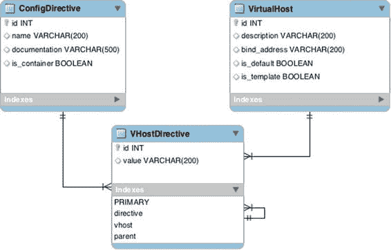
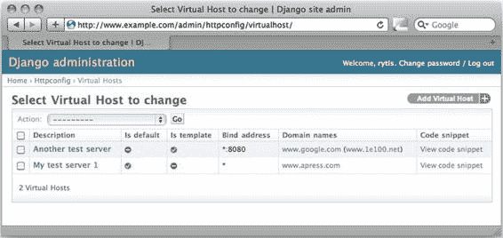
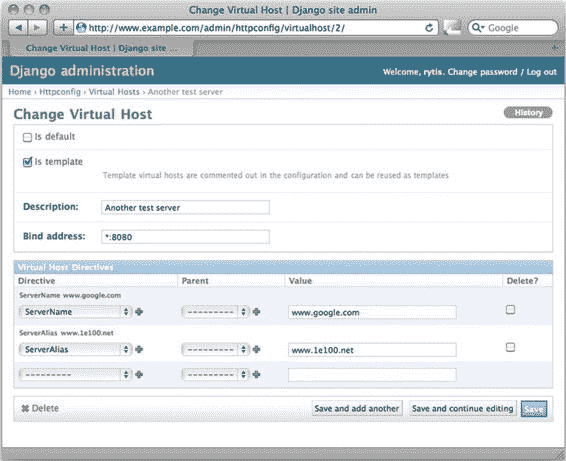

# 五、在 Apache 配置文件中维护虚拟主机列表

我们在第 3 章和第 4 章[中详细研究了 Django web 框架。在本章中，我们将继续探索 Django 框架，尤其是管理应用。我们将使用内置的对象管理应用，而不是自己编写视图和表单，但是我们将对它进行定制，以满足我们的需要和要求。我们将在本章中创建的应用是一个基于 web 的应用，用于为 Apache web 服务器](04.html)生成虚拟主机配置。

指定应用的设计和要求

为什么您想要一个为您生成 Apache 配置文件的应用呢？这种方法有利也有弊。让我从自动生成配置文件的优点开始。

首先，虽然你不能完全消除它，但你大大减少了误差因素。当您自动生成配置文件时，这些设置或者可以作为一个选项，因此您不能犯任何错误，或者可以被验证。这样你就有了一个做基本错误检查的系统，像“ServreName”这样愚蠢的错误就被消除了。其次，这种方法在某种程度上加强了备份策略。如果您不小心破坏了应用配置，您总是可以重新创建它。第三，在我看来，这是最重要的方面，你可以有一个中心位置来配置多个客户端。例如，让我们假设您有一个由十个相同的 web 服务器组成的 web 场，所有这些服务器都位于一个 web 负载平衡器后面。所有的服务器都运行 Apache web 服务器，并且都应该进行相同的配置。通过使用自动化的配置系统，您只需生成一次配置文件(或者更好的是，您可以按需创建配置)，然后上传到所有服务器。

也有一些缺点。任何配置工具，除非是为您正在配置的系统编写的，否则都会在您和应用之间增加一层。对配置结构的任何更改都会立即对配置工具产生影响。需要在配置系统中提供新的配置项目。即使是语法上最轻微的变化也需要考虑。如果您想充分利用您的配置工具，您必须针对每个新的软件版本重新验证它，以确保您的工具仍然生成有效的配置文件。

选择权显然在你。对于标准配置，我建议尽可能自动化，并且如果您正在创建自己的工具，您可以始终考虑特定于您的环境的额外配置。

功能需求

让我们回到 Apache web 服务器配置工具。首先，这个工具应该只生成基于名称的虚拟主机配置。我们不期望这个工具生成特定于服务器的配置，只期望生成负责定义虚拟主机的模块。

在虚拟主机定义部分，您可以使用来自各种已安装模块的配置指令。通常 Apache 核心模块总是可用的；因此，该工具应该为您提供来自核心模块的所有配置指令的列表。应该可以添加新的配置指令。

一些配置指令可能相互嵌套，如下例所示，SetHandler 指令封装在 Location 指令部分。该工具应该允许您定义配置指令之间的关系，其中一个指令被另一个指令封装:

```py
<Location /status>
    SetHandler server-status
</Location>
```

可能会出现多个虚拟主机定义部分具有非常相似的配置的情况。我们将要构建的应用应该允许您克隆任何现有的虚拟主机定义及其所有配置指令。除了克隆操作之外，应用应该允许您将任何虚拟主机部分标记为模板。模板虚拟主机块不应该成为配置文件的功能部分，尽管它可以以注释块的形式包含在内。

任何虚拟主机定义中最重要的部分是服务器域名及其别名。虚拟主机响应的所有域名的列表应该很容易获得，并且应该提供到适当 web 位置的链接。

配置文件应该作为 web 资源可用，而服务器应该作为纯文本文件文档可用。

高层设计

如前所述，我们将使用 Django web 框架来构建我们的应用。然而，我们将重用 Django 提供的数据管理应用，而不是手动编写所有表单，我们将根据自己的需要对其进行配置。

应用不太可能维护大量虚拟主机的配置，因此我们将使用 SQLite3 数据库作为我们配置的数据存储。

我们将在数据库中存储两种类型的数据:虚拟主机对象和配置指令。这允许扩展和进一步修改应用——例如，我们可以扩展配置指令模型并添加一个“允许值”字段。

设置环境

我们已经在第 3 章和第 4 章[中详细讨论了 Django 应用的结构，所以你应该可以轻松地为新应用创建环境设置。我将在这里简要地提到关键的配置项，这样你就可以更容易地理解本章后面的例子和代码片段。](04.html)

Apache 配置

首先，我们需要指示 Apache web 服务器如何处理发送给我们的应用的请求。这是一个相当标准的配置，假设我们的工作目录在/srv/app/中，Django 项目名是 www_example_com。文档根目录设置为/srv/www/www.example.com，它仅用于包含到管理网站静态文件的链接。稍后我们将开始创建链接。清单 5-1 显示了代码。

[***清单 5-1***](#_list1) 。Apache Web 服务器配置

```py
<VirtualHost *:80>
    ServerName www.example.com
    DocumentRoot /srv/www/www.example.com
    ErrorLog /var/log/httpd/www.example.com-error.log
    CustomLog /var/log/httpd/www.example.com-access.log combined
    SetHandler mod_python
    PythonHandler django.core.handlers.modpython
    PythonPath sys.path+['/srv/app/']
    SetEnv DJANGO_SETTINGS_MODULE www_example_com.settings
    SetEnv PYTHON_EGG_CACHE /tmp
    <Location "/static/">
        SetHandler None
    </Location>
</VirtualHost>
```

创建配置后，我们确保配置文件(/srv/www/www.example.com/和/srv/app/)中提到的所有目录都存在。此外，我们确保这些目录归运行 Apache 守护进程的用户所有。通常是名为 apache 或 httpd 的用户。完成后，我们重新启动 Apache web 服务器，这样它就可以读入新的配置。

创建 Django 项目和应用

我们将从创建一个名为 www_example_com 的新 Django 项目开始。正如你从第三章第一章和第四章第三章已经知道的，这个项目实际上变成了一个 Python 模块，包括它的初始化方法 T4 和可能的子模块(项目中的应用)。因此，项目名称必须遵循 Python 变量命名约定，不能包含点或以数字开头。我们先开始一个新项目:

```py
$ cd /srv/app/
$ django-admin.py startproject www_example_com
```

此时，您应该能够导航到您之前定义的网站 URL(在我们的例子中，它是 http://www.example.com ),并且您应该看到标准的 Django 欢迎页面。

下一步是在项目中创建新的应用。为应用选择名称时，必须遵循与项目名称相同的命名规则。我将简单地称之为 httpconfig:

```py
$ django-admin.py startapp httpconfig
```

配置应用

现在，我们需要指定项目的一些细节，比如数据库引擎类型，还要告诉项目新的应用。即使我们已经创建了它的框架文件，应用也不会自动包含在项目配置中。

首先，在项目目录的 settings.py 文件中更改数据库配置。不要担心数据库文件，因为它是自动创建的:

```py
DATABASES = {
    'default': {
        'ENGINE': 'django.db.backends.sqlite3',
        'NAME': os.path.join(BASE_DIR, 'db.sqlite3'),
    }
}
```

其次，更改默认的管理媒体位置；您将在现有的媒体目录中链接到它。在同一个 settings.py 文件中，确保具有以下设置:

```py
ADMIN_MEDIA_PREFIX = '/static/admin/'
```

第三，将两个新应用添加到启用的应用列表中。您将启用管理应用，它是标准 Django 安装的一部分，您还将把您的应用添加到列表中:

```py
INSTALLED_APPS = (
    'django.contrib.admin',
    'django.contrib.auth',
    'django.contrib.contenttypes',
    'django.contrib.sessions',
    'django.contrib.messages',
    'django.contrib.staticfiles',
    'httpconfig',
)
```

第四，您必须运行一个数据库同步脚本，它将为我们创建数据库文件，并创建应用模型文件中定义的所有必需的数据库表。当然，在 httpconfig 应用中还没有，但是您需要完成这一步，以便管理和其他应用创建它们的数据库表。运行以下命令创建数据库:

```py
$ python manage.py syncdb
Creating tables ...
Creating table django_admin_log
Creating table auth_permission
Creating table auth_group_permissions
Creating table auth_group
Creating table auth_user_groups
Creating table auth_user_user_permissions
Creating table auth_user
Creating table django_content_type
Creating table django_session

You just installed Django's auth system, which means you don't have any superusers defined.
Would you like to create one now? (yes/no): yes
Username (leave blank to use 'rytis'): 
Email address: rytis@example.com
Password: 
Password (again): 
Superuser created successfully.
Installing custom SQL ...
Installing indexes ...
Installed 0 object(s) from 0 fixture(s)
```

定义 URL 结构

您已经设置了应用和数据库，但是仍然无法导航到任何页面，甚至是管理界面。这是因为项目不知道如何响应请求 URL，以及如何将它们映射到适当的应用视图。

您需要在 urls.py 配置文件中做两件事:启用到管理接口对象的 URL 路由，并指向特定于应用的 urls.py 配置。特定于项目的 urls.py 文件位于/SRV/app/www _ example _ com/www _ example _ com/的项目目录中。启用这两种设置后，其内容将是清单 5-2 中的代码。

[***清单 5-2***](#_list2) 。特定于项目(或站点)的 URL 映射

```py
from django.conf.urls import patterns, include, url

# this is required by the administration appplication
from django.contrib import admin
admin.autodiscover()

urlpatterns = patterns('',
    # route requests to the administration application
    url(r'^admin/', include(admin.site.urls)),
    # delegate all other requests to the application specific
    # URL dispatcher
    url(r'', include('httpconfig.urls')),
)
```

您还没有在这个应用中创建任何视图，但是您已经可以在特定于应用的 urls.py 中定义 URL 映射，这需要在应用目录 httpconfig 中创建。大部分工作将在管理界面中完成，因此应用与外界的交互相当有限。它将只响应两个请求:如果 URL 路径上没有指定任何内容，视图应该以纯文本格式返回所有虚拟主机。如果指定了整数，它将只返回特定虚拟主机的配置文件部分。这将在管理界面中使用。在 httpadmin 目录中，创建清单 5-3 中所示的 urls.py 文件。

[***清单 5-3***](#_list3) 。特定于应用的 URL 映射

```py
from django.conf.urls import patterns, include, url

urlpatterns = patterns('httpconfig.views',
    url(r'^$', 'full_config'),
    url(r'^(?P<object_id>\d+)/$', 'full_config'),
)
```

这种配置意味着 URL 中没有特定于应用的部分——对根位置的所有请求都将被转发到我们的应用。如果您需要将该应用“隐藏”在 URL 中的某个路径后面，请参考第 3 章和第 4 章[中的](04.html)来了解如何操作的详细信息。

除了这个配置之外，您还必须定义视图方法；否则，Django URL 解析器可能会抱怨未定义的视图。在应用目录的 views.py 文件中创建以下方法:

```py
from django.http import HttpResponse

def full_config(request):
    return HttpResponse('<h1>Hello!</h1>')
```

 **提示**如果您在导航到新创建的网站时出现任何错误，请确保项目目录中的所有文件和目录以及项目目录本身都属于 *Apache* 或 *httpd* 用户。还要注意，如果您对项目目录中的 Python 文件进行了任何更改，您将需要重新启动 Apache 守护进程，以便新的代码而不是旧的代码来处理请求，旧的代码可能仍然缓存在内存中。

数据模型

正如我们在需求和设计部分所讨论的，我们的应用的数据库模型相当简单，只包含两个实体: 虚拟主机定义和配置指令定义。然而，对于实现，我们还需要向模式中添加第三个元素，将虚拟主机和配置指令元素联系起来。添加另一个表的原因是每个配置指令可以是一个或多个虚拟主机的一部分。此外，每个虚拟主机中可能有一个或多个指令。因此，我们在对象之间有一个多对多的关系，为了解决这个问题，我们需要插入一个与其他表有一对多关系的中间表。

我们可以在[图 5-1](#Fig1) 所示的实体关系(ER)图中表示这个关系模型，在图中可以看到每个实体的属性以及它们之间的关系。ER 图 在编码时真的很有帮助，如果你知道不同表之间的关系，它们有时会让你不用编写复杂的代码来查找可以通过简单的 SQL 语句轻松获得的信息。我们将在后面的章节中再次使用这种技术。



[图 5-1](#_Fig1) 。实体关系图

 **注**[图 5-1](#Fig1) 中的图表是使用 MySQL 工作台工具生成的。它遵循用来表示数据表的约定和结构，以及它们之间的关系(一对多链接，等等)。那些细节的描述已经超出了本书的范围，但是如果你想进一步了解这个主题，我推荐*开始数据库设计:从新手到专业人员，* 2 <sup class="calibre17"> nd </sup> ed *。，作者 Clare Churcher(纽约:Apress，2012)，这是一篇很好的数据库设计入门。在维基百科页面[http://en.wikipedia.org/wiki/Entity-relationship_model](http://en.wikipedia.org/wiki/Entity-relationship_model)上可以找到图表中使用的一些符号的更简短的描述。*

您可以看到 ConfigDirective 和 VirtualHost 表与 VHostDirective 表具有一对多的关系。该表还包含配置指令的值，该值特定于特定的虚拟主机。您可能还注意到，VHostDirective 自身有一个环回关系。这是为了实现指令封装，其中一些指令可以是其他指令的“父”指令。

基本模型结构

在创建数据模型时，我们将经历几次迭代。我们将从只包含对象属性的基本模型开始，然后随着管理界面的改进逐步添加功能。清单 5-4 显示了初始代码。

[***清单 5-4***](#_list4) 。基本模型结构

```py
from django.db import models

class ConfigDirective(models.Model):
    name = models.CharField(max_length=200)
    is_container = models.BooleanField(default=False)
    documentation = models.URLField(
                       default='http://httpd.apache.org/docs/2.0/mod/core.html')

    def __unicode__(self):
        return self.name

class VirtualHost(models.Model):
    is_default = models.BooleanField(default=False)
    is_template = models.BooleanField(default=False, 
                                      help_text="""Template virtual hosts are 
                                                  commented out in the configuration 
                                                  and can be reused as templates""")
    description = models.CharField(max_length=200)
    bind_address = models.CharField(max_length=200)
    directives = models.ManyToManyField(ConfigDirective, through='VHostDirective')

    def __unicode__(self):
        default_mark = ' (*)' if self.is_default else ''
        return self.description + default_mark

class VHostDirective(models.Model):
    directive = models.ForeignKey(ConfigDirective)
    vhost = models.ForeignKey(VirtualHost)
    parent = models.ForeignKey('self', blank=True, null=True, 
                               limit_choices_to={'directive__is_container': True})
    value = models.CharField(max_length=200)

    def __unicode__(self):
        fmt_str = "<%s %s>" if self.directive.is_container else "%s %s"
        directive_name = self.directive.name.strip('<>')
        return fmt_str % (directive_name, self.value)
```

如果你遵循了第 3 章和第 4 章中的例子和解释，你应该对这个模型相当熟悉。定义每个元素的基本属性，以及定义类之间关系的 ForeignKey 对象。

不过，有一件事您可能不太熟悉 VirtualHost 类中的多对多关系声明:

```py
directives = models.ManyToManyField(ConfigDirective, through='VHostDirective')
```

如果已经定义了连接两个实体的 VHostDirective 类，为什么还要显式定义这种关系呢？原因在于，这允许您直接从 VirtualHost 中找到相应的 ConfigDirectives，而不必先找到 VHostDirective 对象。

我们可以从这个模型中创建数据库结构，但是此时它将是空的，因此如果没有核心 Apache 模块指令的列表，它就没有多大用处。我已经创建了一个包含所有核心模块指令条目的初始数据 JSON 文件。下面是几个条目的例子:你可以从这本书的网页上的[http://apress.com](http://apress.com)获得全套资料。

```py
[
  <...>
    {
        "model":    "httpconfig.configdirective",
        "pk":       1,
        "fields":   {
                        "name":   "AcceptPathInfo",
                        "documentation":
                    "http://httpd.apache.org/docs/2.0/mod/core.html#AcceptPathInfo",
                        "is_container":     "False"
                    }
    },

    {
        "model":    "httpconfig.configdirective",
        "pk":       2,
        "fields":   {
                        "name":   "AccessFileName",
                        "documentation":
                    "http://httpd.apache.org/docs/2.0/mod/core.html#AccessFileName",
                        "is_container":     "False"
                    }
    },
  <...>
]
```

如果您将该文件复制到项目目录(在我们的示例中，这将是 www _ example _ com/httpconfig/fixtures/)并将其命名为 initial_data.json，则每次运行 syncdb 命令时都会加载该文件中的数据。现在，删除所有与应用相关的表(如果您已经在数据库中创建了表的话)，并使用新模型和初始数据集重新创建数据库表:

```py
$ sqlite3 database.db 
SQLite version 3.7.13 2012-07-17 17:46:21
Enter ".help" for instructions
Enter SQL statements terminated with a ";"
sqlite> .tables
auth_group                  django_admin_log
auth_group_permissions      django_content_type
auth_message                django_session
auth_permission             django_site
auth_user                   httpconfig_configdirective
auth_user_groups            httpconfig_vhostdirective
auth_user_user_permissions  httpconfig_virtualhost
sqlite> drop table httpconfig_configdirective;
sqlite> drop table httpconfig_vhostdirective;
sqlite> drop table httpconfig_virtualhost;
sqlite> .exit 
$ ./manage.py syncdb
Creating table httpconfig_configdirective
Creating table httpconfig_virtualhost
Creating table httpconfig_vhostdirective
Installing index for httpconfig.VHostDirective model
Installing json fixture 'initial_data' from absolute path.
Installed 62 object(s) from 1 fixture(s)
```

您几乎可以开始在管理应用中管理对象了；只需在管理界面中注册所有的模型类，然后重启 Apache web 服务器。正如您已经知道的，您必须在应用目录中创建 admin.py 文件，其内容类似于[清单 5-5](#list5) 。T3】

[***清单 5-5***](#_list5) 。基本管理挂钩

```py
from django.contrib import admin
from www_example_com.httpconfig.models import *

class VirtualHostAdmin(admin.ModelAdmin):
    pass

class VHostDirectiveAdmin(admin.ModelAdmin):
    pass

class ConfigDirectiveAdmin(admin.ModelAdmin):
    pass

admin.site.register(VirtualHost, VirtualHostAdmin)
admin.site.register(ConfigDirective, ConfigDirectiveAdmin)
admin.site.register(VHostDirective, VHostDirectiveAdmin)
```

如果您导航到管理控制台，您可以在[http://www.example.com/admin/](http://www.example.com/admin/)找到，您将看到登录屏幕。您可以使用在第一次调用 syncdb 时创建的用户帐户登录。登录后，您将看到标准的管理界面，其中列出了所有的模型类，并允许您创建单独的条目。现在，您必须意识到这已经为您节省了多少工作——您不需要处理用户管理、模型对象发现或任何其他日常工作。然而，管理接口 是通用的，完全不知道数据模型背后的目的以及哪些字段对您来说是重要的。

让我们以我们的模型为例。您的主要实体是虚拟主机。但是，如果您在管理界面中导航到它，您将只能在列表视图中看到一列。如果您添加了任何条目，您将看到显示的是描述字段。单击添加按钮添加新的虚拟主机。显示了所有属性字段，但是配置指令呢？这些需要在不同的屏幕上单独创建，然后您必须将每个指令链接到适当的虚拟主机。那不是很有用，是吗？

幸运的是，Django 管理模块非常灵活，可以定制以适应您能想到的大多数需求。在接下来的部分中，我们将改进管理界面的外观，并为其添加更多的功能。

修改管理界面

大多数管理界面调整都是在 models.py 和 admin.py 文件中完成的。Python 社区正试图将所有的模型定义文件从管理定制文件中分离出来，并且已经做了大量的工作来实现这种分离。但是，在撰写本文时，仍然可以在 models.py 文件中找到一些影响管理界面的项目。在这两种情况下，我将始终指出您需要在哪个文件中进行更改，但是除非得到指示，否则始终假定应用目录为:/SRV/app/www _ example _ com/http config/。

改进类和对象列表

管理应用只能猜测您的数据模型、它的属性以及您希望得到的信息。因此，如果您不做任何修改或调整，您将得到标准的对象表示字符串显示，就像该类的 __unicode__()方法返回的字符串一样。在接下来的几节中，我将向您展示如何更改默认布局。

自定义类名

默认情况下，Django 试图猜测类名。通常，管理框架会得到相当接近的结果，但是有时您可能会以奇怪的名称结束。例如，我们的三个类将被列为:

*   配置指令
*   v 主机指令
*   虚拟主机

在这种情况下,“V host 指令”的名称可能看起来有点神秘。另一个问题是类名的复数形式。我们已经很好地解决了这些例子，但是如果我们有一个名为“Host Entry”的类，例如，我们会以自动生成的复数形式“Host Entrys”结束，这显然不是正确的拼写。

在这种情况下，您可能希望自己设置类名和名称的复数形式。您不需要设置两者，只需设置您想要修改的一个即可。这个设置是在模型定义文件 models.py 中完成的。

[***清单 5-6***](#_list6) 。更改类名

```py
class ConfigDirective(models.Model):
    class Meta:
        verbose_name = 'Configuration Directive'
        verbose_name_plural = 'Configuration Directives'
    [...]

class VirtualHost(models.Model):
    class Meta:
        verbose_name = 'Virtual Host'
        verbose_name_plural = 'Virtual Hosts'
    [...]

class VHostDirective(models.Model):
    class Meta:
        verbose_name = 'Virtual Host Directive'
        verbose_name_plural = 'Virtual Host Directives'
    [...]
```

您进行修改并重新加载 Apache web 服务器。现在，您将看到更多可读的选项:

*   配置指令
*   虚拟主机指令
*   虚拟主机

向对象列表添加新字段

让我们从修改虚拟主机列表开始。如果您还没有创建任何虚拟主机，现在就可以这样做。在配置中使用什么属性并不重要；在这个阶段，我们只对正确的布局感兴趣。此外，为您创建的虚拟主机分配一些配置指令。

任何虚拟主机最重要的属性之一是 ServerName，它定义了这个特定虚拟主机响应的主机名。如您所知，Apache web 服务器通过主机 HTTP 头值来标识虚拟主机。它从 HTTP 请求中获取该值，并尝试将其与配置文件中的所有 ServerName 或 ServerAlias 字段进行匹配。当它找到一个匹配时，它就知道哪个虚拟主机应该服务于这个特定的请求。因此，这两条指令可能是您希望在虚拟主机列表中看到的指令。

在只显示对象的字符串表示的列表中，如何包括这些虚拟主机？您可以使用 ModelAdmin 类属性 list_display 来指定您想要显示的属性，但是在 VirtualHost 类中没有服务器名称列表这样的属性。因此，您必须编写自己的方法来返回每个关联的 ServerName 和 ServerAlias。你用清单 5-7 所示的方法扩展你的虚拟主机类。

[***清单 5-7***](#_list7) 。列出相关的服务器名和服务器别名

```py
def domain_names(self):
  result = ''
  primary_domains = self.vhostdirective_set.filter(directive__name='ServerName')
  if primary_domains:
      result = "<a href='http://%(d)s' target='_blank'>%(d)s</a>" % 
                                   {'d': primary_domains[0].value}
  else:
      result = 'No primary domain defined!'
  secondary_domains = self.vhostdirective_set.filter(directive__name='ServerAlias')
  if secondary_domains:
      result += ' ('
        for domain in secondary_domains:
        result += "<a href='http://%(d)s' target='_blank'>%(d)s</a>, " % 
                                  {'d': domain.value}
      result = result[:-2] + ')'
  return result
domain_names.allow_tags = True
```

此代码获取所有指向 ConfigDirective 对象的 VHostDirective 对象，该对象的名称为“ServerName”或“ServerAlias”。然后，将这种 VHostDirective 对象的值追加到结果字符串中。事实上，该值用于构造一个 HTML 链接，单击该链接将在新的浏览器窗口中打开。这里的意图是虚拟主机的所有链接都显示在列表中，并且是可点击的，因此您可以立即测试它们。

让我们仔细看看检索 VHostDirective 对象的指令(清单 5-7 中突出显示的行)。正如您从模型定义中所知道的，您现在正在修改的 VirtualHost 类没有链接到 VHostDirective 类。链接反了；VHostDirective 类有一个指向 VirtualHost 类的外键。Django 允许您通过使用特殊的属性名<*lower case _ class _ name*>_ set 来创建反向查找。在我们的例子中，名称是 virtualhostdirective_set。此属性实现标准的对象选择方法，如 filter()和 all()。现在，使用这个 virtualhostdirective_set 属性，我们实际上正在访问 VHostDirective 类的实例，因此我们可以指定一个转发过滤器，该过滤器根据我们的搜索字符串匹配相应的指令对象名称:directive__name='ServerName '。

让我们添加另一个方法，返回到对象表示 URL 的链接。我们还将在清单中显示它，以便用户可以单击它，这个虚拟主机的代码片段将出现在新的浏览器窗口中。这个虚拟主机类方法是在 models.py 文件中定义的:

```py
def code_snippet(self):
    return "<a href='/%i/' target='_blank'>View code snippet</a>" % self.id
code_snippet.allow_tags = True
```

您是否注意到，在这两种情况下，我们都通过将方法的 allow_tags 属性设置为 True 来修改它？这阻止了 Django 解析 HTML 代码并用“安全”字符替换它们。启用标记后，您可以在对象列表中放置任何 HTML 代码；例如，您可以包含指向外部 URL 的链接或包含图像。

最后，让我们列出我们希望在对象列表中看到的所有属性。这包括我们刚刚创建的两个函数的类属性和名称。将以下属性添加到 admin.py 文件中的 ModelAdmin 类定义中:

```py
class VirtualHostAdmin(admin.ModelAdmin):
    list_display = ('description', 'is_default', 'is_template', 
                    'bind_address', 'domain_names', 'code_snippet')
```

现在当你导航到虚拟主机对象列表时，你应该看到类似于[图 5-2](#Fig2) 的东西。这可能不明显，但是列出的域名和代码片段文本是可点击的，并且应该在新的浏览器窗口中打开 URL。



[图 5-2](#_Fig2) 。修改对象列表视图

重组表单字段

如果您尝试使用当前的管理界面添加虚拟主机实例，您可能会注意到这个过程是多么不友好和混乱。首先，您必须创建一个新的 VirtualHost 对象；然后，您必须离开它，通过选择新创建的 VirtualHost 对象来创建一个或多个 VHostDirective 对象。如果可以从一个表单中创建所有这些内容，岂不是更好？幸运的是，这很容易做到。用 Django 的术语来说，这叫做*内联表单集*，它允许你在与父模型相同的页面上编辑模型。

在我们的例子中，父模型是 VirtualHost，我们想要内联编辑 VHostDirective 的实例。这只需两步就能完成。首先，创建一个新的 administration 类，它继承自 admin。TabularInline 类。将以下代码添加到 admin.py 文件中。这个类的属性表明您想要包含哪个子模型，以及您想要在表单集中有多少额外的空行:

```py
class VHostDirectiveInLine(admin.TabularInline):
    model = VHostDirective
    extra = 1
```

第二步是指示管理类，您希望将这个内嵌表单包含在主模型编辑表单中:

```py
class VirtualHostAdmin(admin.ModelAdmin):
    inlines = (VHostDirectiveInLine,)
    [...]
```

这个简单的操作产生了一个非常漂亮的表单集，包括父模型和子模型的输入字段，如图 5-3 所示。



[图 5-3](#_Fig3) 。包括子模型编辑表单

如果您不喜欢表单中字段的组织方式，您可以更改它们的顺序，也可以将它们分组到逻辑组中。通过定义*字段集*对字段进行分组。每个字段集是由两个元素组成的元组:一个字段集名称和一个字段集属性字典。需要一个字典键，即字段列表。另外两个键 classes 和 description 是可选的。以下是 ConfigDirective 模型管理表单的示例，其中定义了两个字段集组:

```py
class ConfigDirectiveAdmin(admin.ModelAdmin):
    fieldsets = [
                    (None,      {'fields': ['name']}),
                    ('Details', {'fields': ['is_container', 'documentation'],
                             'classes': ['collapse'],
                             'description': 'Specify the config directive details'})
                ]
```

第一组只包含一个字段，没有名称。第二组标记为详细信息..它在标签下有一个简短的描述，包含两个字段，并具有显示/隐藏功能。

Classes 属性定义 CSS 类名并依赖于类定义。标准的 Django administration CSS 定义了两个有用的类:折叠类允许你显示/隐藏整个组，宽类为表单字段增加了一些额外的空间。

添加自定义对象操作

我们几乎准备好了应用，但是还有两个函数需要实现。在虚拟主机模型中，我们有一个布尔标志来指示该主机是否是默认主机。该信息也方便地显示在列表中。然而，如果我们想改变它，我们必须导航到对象的编辑页面并在那里改变设置。

如果可以在对象列表屏幕上完成，只需选择适当的对象并使用列表左上角下拉菜单中的操作，那就太好了。但是，当前唯一可用的操作是“删除选定的虚拟主机”Django 允许我们定义自己的动作功能，并将它们添加到管理屏幕菜单中。在动作列表中获得一个新函数有两个步骤。首先，我们在管理类中定义一个方法；接下来，我们确定应该将该方法作为一个操作列在其操作列表中的管理类。

调用自定义操作方法时，会传递三个参数。第一个是调用方法的模型管理类的实例。我们可以在模型管理类之外定义自定义方法，在这种情况下，多个模型管理类可以重用它们。如果在特定的模型管理类中定义方法，第一个参数将始终是该类的实例；换句话说，这是一个典型的类方法自我属性。

第二个参数是 HTTP 请求对象。一旦操作完成，它可以用来将消息传递给用户。

第三个参数是包含用户选择的所有对象的查询集。这是您将要操作的对象列表。因为只能有一个默认虚拟主机，所以您必须检查是否选择了多个对象，如果是，则返回一个错误，指出。清单 5-8 显示了对模型管理类的修改，它创建了一个新的自定义对象动作。

[***清单 5-8***](#_list8) 。设置默认虚拟主机标志的自定义操作

```py
class VirtualHostAdmin(admin.ModelAdmin):
    [...]
    actions = ('make_default',)

    def make_default(self, request, queryset):
        if len(queryset) == 1:
            VirtualHost.objects.all().update(is_default=False)
            queryset.update(is_default=True)
            self.message_user(request, 
                 "Virtual host '%s' has been made the default virtual host" % queryset[0])
        else:
            self.message_user(request, 'ERROR: Only one host can be set as the default!')
    make_default.short_description = 'Make selected Virtual Host default'
```

我们要定义的下一个自定义操作是对象复制。此操作会提取选定的对象并“克隆”它们。克隆将具有相同的设置和具有相同值的相同配置指令集，但以下例外情况适用:

*   虚拟主机描述将在其描述后附加“(Copy)”字符串。
*   新的虚拟主机不会是默认的。
*   新的虚拟主机不会是模板。

这里的挑战是正确解析 VHostDirective 对象的所有父子依赖关系。在 Apache 虚拟主机定义中，我们只能有一个封装级别，所以我们不需要对相关对象进行任何递归发现。复制方法可分为以下逻辑步骤:

1.  创建 VirtualHost 类的新实例并克隆所有属性。
2.  克隆没有任何父级的所有指令。
3.  克隆所有容器指令，因此可能包含子指令。
4.  对于每个容器指令，找到它的所有子指令并克隆它们。

[清单 5-9](#list9) 显示了复制功能代码。

[***清单 5-9***](#_list9) 。复制虚拟主机对象的操作

```py
def duplicate(self, request, queryset):
    msg = ''
    for vhost in queryset:
        new_vhost = VirtualHost()
        new_vhost.description = "%s (Copy)" % vhost.description
        new_vhost.bind_address = vhost.bind_address
        new_vhost.is_template = False
        new_vhost.is_default = False
        new_vhost.save()
        # recreate all 'orphan' directives that aren't parents
        o=vhost.vhostdirective_set.filter(parent=None).filter(directive__is_container=False)
        for vhd in o:
            new_vhd = VHostDirective()
            new_vhd.directive = vhd.directive
            new_vhd.value = vhd.value
            new_vhd.vhost = new_vhost
            new_vhd.save()
        # recreate all parent directives
        for vhd in vhost.vhostdirective_set.filter(directive__is_container=True):
            new_vhd = VHostDirective()
            new_vhd.directive = vhd.directive
            new_vhd.value = vhd.value
            new_vhd.vhost = new_vhost
            new_vhd.save()
            # and all their children
            for child_vhd in vhost.vhostdirective_set.filter(parent=vhd):
                msg += str(child_vhd)
                new_child_vhd = VHostDirective()
                new_child_vhd.directive = child_vhd.directive
                new_child_vhd.value = child_vhd.value
                new_child_vhd.vhost = new_vhost
                new_child_vhd.parent = new_vhd
                new_child_vhd.save()
    self.message_user(request, msg)
duplicate.short_description = 'Duplicate selected Virtual Hosts'
```

生成配置文件

我们已经完成了管理界面的调整，因此现在可以添加新的虚拟主机和管理现有的数据库条目了。我们需要完成显示信息的视图方法的编写。不过，有一个问题:“parent”指令模仿了 XML 语法。也就是说，它们有开始和结束元素。我们为 VHostDirective 模型类编写的默认字符串表示负责开始元素，但是我们还需要编写一个函数来生成类似 XML 的结束标记。这两个标签将用于包含“子”配置指令。

我们将下面的方法添加到 models.py 文件中的 VHostDirective 类。如果指令被标记为容器指令:，此函数将<tag>转换为</tag>

```py
def close_tag(self):
    return "</%s>" % self.directive.name.strip('<>') if self.directive.is_container else ""
```

一旦我们完成了这些，我们用清单 5-10 中的代码扩展之前创建的空视图方法。如果没有提供参数，这段代码将遍历所有可用的对象。如果整数作为参数提供，它将只选择具有匹配 ID 的对象。对于列表中的所有对象，都会创建一个字典结构。该结构包含 VirtualHost 对象和相应的指令对象。孤儿和容器是分开存储的，所以在模板中更容易区分它们。return 对象将响应的 MIME 类型设置为“text/plain”，这允许我们将 URL 直接下载到配置文件中。

[***清单 5-10***](#_list10) 。查看方法

```py
from httpconfig.models import *
from django.http import HttpResponse, HttpResponseRedirect
from django.shortcuts import render_to_response, get_object_or_404

# Create your views here.

def full_config(request, object_id=None):
    if not object_id:
        vhosts = VirtualHost.objects.all()
    else:
        vhosts = VirtualHost.objects.filter(id=object_id)
    vhosts_list = []
    for vhost in vhosts:
        vhost_struct = {}
        vhost_struct['vhost_data'] = vhost
        vhost_struct['orphan_directives'] = \ 
          vhost.vhostdirective_set.filter(directive__is_container=False).filter(parent=None)
        vhost_struct['containers'] = []
        for container_directive in \ 
          vhost.vhostdirective_set.filter(directive__is_container=True):
            vhost_struct['containers'].append({'parent': container_directive,
                                               'children': \ 
          vhost.vhostdirective_set.filter(parent=container_directive),
                                              })
        vhosts_list.append(vhost_struct)
    return render_to_response('full_config.txt', 
                              {'vhosts': vhosts_list},
                              mimetype='text/plain')
```

 **注意**例子中的反斜杠字符是用来换行的。这是一种有效的 Python 语言语法，允许您格式化代码以获得更好的可读性。如果您重新键入这些示例，请保持相同的代码结构和布局。不要将反斜杠字符与换行符号()混淆，换行符号表示该行太长，不适合一页，已经换行。重用示例时，必须连接由该符号拆分的线条。

从[第 3 章](03.html)和[第 4 章](04.html)可知，模板存储在应用文件夹的 templates 子目录中。[清单 5-11](#list11) 显示了 full_config.txt 模板。

[***清单 5-11***](#_list11) 。虚拟主机视图模板

```py
# Virtual host configuration section
# automatically generated - do not edit



##
## {{ vhost.vhost_data.description }}
##
# <VirtualHost {{
vhost.vhost_data.bind_address }}>
#    
#      {{ orphan_directive }}
#    
#    
#      {{ container.parent|safe }}
#        
#          {{ child_dir }}
#        
#      {{ container.parent.close_tag|safe }}
#    
#  </VirtualHost>
```

完成所有修改后，您应该能够导航到网站 URL(在我们的示例中，这将是[http://www.example.com/](http://www.example.com/))，结果应该是自动生成的 Apache 配置文件的一部分，其中包含虚拟主机定义，如[清单 5-12](#list12) 所示。请注意，模板也包括在内，但被注释掉了，因此将被 web 服务器忽略。

[***清单 5-12***](#_list12) 。示例配置文件

```py
# Virtual host configuration section
# automatically generated - do not edit
##
## My test server 1
##
  <VirtualHost *>
      ServerName www.apress.com
      <Directory />
          AcceptPathInfo Off
          AddDefaultCharset Off
      </Directory>
  </VirtualHost>
##
## Another test server
##
#  <VirtualHost *:8080>
#
#      ServerName www.google.com
#
#      ServerAlias www.1e100.net
#
#
#  </VirtualHost>
```

摘要

在本章中，我们讨论了如何修改默认的 Django 管理应用，使其更加用户友好并适合您的对象模型。需要记住的要点:

*   对象列表可以包括任何模型属性以及自定义函数。
*   对象列表中的自定义函数也可以生成 HTML 输出。
*   您可以向对象列表管理页面添加自定义操作。
*   如果您的模型有许多字段，它们可以重新排列成逻辑组。
*   您可以将子模型作为内嵌字段集包含在父编辑页面中。