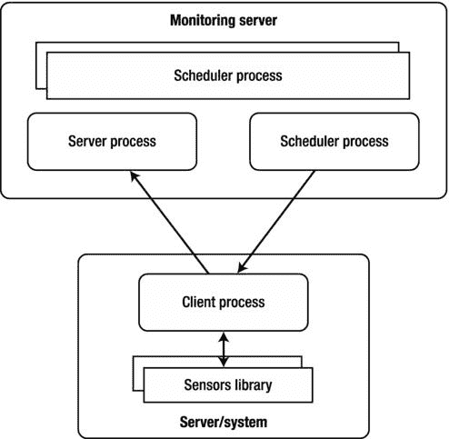
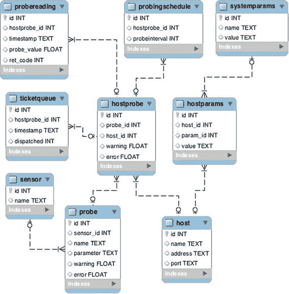

第九章


管理和监控子系统

这是四章中的第一章，我将向您展示如何构建一个简单的分布式监控系统。在第一部分中，我演示了如何构建一个监控服务器组件。该组件负责向所有监控代理发送查询，调度请求，并将收集的数据存储在本地数据库中。本章将讨论三个主题:数据建模、进程间通信和多线程编程。在数据建模部分，我们将研究一些数据库设计和建模方法。稍后我们将研究 XML-RPC 协议和支持它的 Python 库。最后，我们将看看用 Python 进行多线程编程。

设计

在开始实现之前提出某种设计是很重要的，尤其是在编写分布式系统的代码时。我需要建立两个主要领域:监视系统将由哪些组件组成，以及它将操作哪些数据对象。

组件

从需求收集练习中，我知道系统将是集中式的——也就是说，将有多个代理向主监控服务器报告。因此，至少需要两个不同的组件:监控服务器和监控代理。服务器进程将与客户机通信，并从它们那里检索性能和状态数据。

现在的问题是代理人需要有多聪明。它需要知道如何自己执行所有检查吗？或者它应该有一个可插拔的架构，代理本身只作为一个控制器组件？我将选择代理依赖插件来执行所有检查的架构。代理进程本身只会将服务器请求代理给插件代码，并将结果传回。我将这些插件称为“传感器”,因为这就是它们实际上在做的事情——测量系统的参数。

[图 9-1](#Fig1) 表示高层组件交互图。以下部分提供了每个组件的更详细的设计说明。



[图 9-1](#_Fig1) 。系统组件

监控服务器

监控服务器负责向客户端系统发出请求，并从所有客户端接收传感器读数。从客户机获取数据有两种选择:第一种是让服务器发起连接，第二种是让客户机发起连接。每种方法都有其优点。当客户端启动连接时，服务器端的开销会减少，因为它不需要做任何调度工作。它也更安全，因为不可能请求数据，因此数据将仅由系统接收，该系统在客户端(监控服务器)上注册。

然而，客户端发起的连接的最大缺点是服务器完全无法控制传入的信息流，这会导致服务器过载。理想情况下，应该由服务器决定在什么时间点需要什么信息。例如，一个真正智能的系统会禁用某些没有意义的检查。一个很好的例子是在收到硬盘故障警报后停止卷使用检查；很明显，磁盘故障将导致所有卷检查失败，因此报告潜在问题的症状没有意义。

在我的简单监控系统中，我将使用一种有效的服务器启动的控制机制，但不会牺牲安全模型。服务器进程将向客户端发送通知以提交传感器数据。当客户端收到这样的通知时，它将执行检查并将读数提交回它注册的服务器。所以没有办法从客户端获取数据；它只是一个单向的通信通道，只有“可信的”服务器才能接收结果。

客户端配置以类似的方式完成:客户端接收外部信号以更新其配置(“受信任的”服务器地址或传感器代码),然后启动与服务器的连接以获取所需的详细信息。

监控代理

监控代理进程是完全被动的，仅当它从服务器接收指令时才动作。如前所述，这样的指令可以是提交传感器读数，更新服务器地址，以及从服务器检索新的传感器代码。

当代理被通知提交读数时，它将调用外部工具来执行实际的读数。然后，它将从流程中读取输出，并将其与流程返回代码一起发送回监控服务器。

服务器地址更新命令指示监控代理连接到当前注册的服务器并请求新地址。然后，代理将尝试连接到新地址。如果操作成功，当前服务器地址将被新地址替换；否则地址不会改变。

最后，当代理收到更新其中一个传感器代码的命令时，它将连接回服务器并请求传感器代码存档。服务器将把存档的副本发送回请求的客户机。当归档文件被接收并存储在临时位置时，它被解压缩并执行基本的健全性检查。如果检查成功，旧代码被存档，新代码被部署到适当的位置。

传感器

与其他监视系统不同，在其他监视系统中，传感器或检查包含一些逻辑(例如，正如我们在前一章中看到的，Nagios 检查返回 OK、警告或关键状态消息)，我不打算在我的传感器中嵌入任何验证逻辑。毕竟，传感器是用来报告状态的，不能也不应该知道它所报告的情况是否会造成任何危险。由主监控服务器决定读数是否表明系统有任何问题。

这种方法允许进一步扩展检查逻辑，以执行更高级和适应性更强的报告。例如，代替简单的阈值检查，系统可以扩展为趋势检查。即使被观察系统上的负载超过了设定的阈值，它也可能是正常的，因为这就是负载模式。类似地，如果系统报告给定时间段内的负载远低于正常值，则可能表明存在问题，而简单的阈值检查无法检测到这些问题。

数据对象

自然，所有涉及的过程都将消耗或产生(或两者兼有)一些数据。最明显的数据是传感器读数，但也会有配置、已定义的调度设置等等。因此，在编写任何代码之前，我需要对监控系统将要处理的数据进行合理的定义和设计。

将有四种不同类型的数据:

*   配置数据，描述所有监视代理、传感器及其参数
*   站点配置数据，它定义了需要在每台服务器上执行哪些检查，以及在哪里可以找到客户端服务器
*   计划数据，定义检查的时间间隔
*   性能读取数据，即从客户端服务器上的传感器接收的数据

配置

配置数据包含关于传感器、传感器参数和监控代理的数据。所有可用的代理及其名称和地址都是监控系统配置的一部分。除了所有主机和传感器的简单列表之外，配置还包含关于哪些传感器在哪些监控服务器上可用的信息。

代理服务器的可用硬件资源和配置可能不同，因此必须能够为每个监控代理定义单独的阈值。

性能读数

显然，这是监控系统中的关键数据组件。每个性能读数需要保持它被记录的时间，以便它可以在时间线上被正确地表示。还需要记录数值和传感器应用返回代码，以及节点和传感器标识信息。

站点配置

目前，站点信息将只保存监控服务器地址，但是需要放置占位符，以便将来功能扩展。值得注意的是，站点信息在监控服务器上集中维护，代理服务器将检索这些信息并相应地更新本地配置。

集中存储这些信息的原因是，如果将这些信息存储在一个位置，控制配置会容易得多。当代理需要更新时，单独的进程将发出更新命令，以便自动更新配置。

行程安排

调度配置定义了哪些传感器命令需要在哪些监控代理上以及以什么时间间隔执行。将为每个具有适当间隔设置的代理检查组合保存信息。

该数据类似于 UNIX cron 文件中定义的信息，但是在定义执行时间模式方面没有那么灵活。所有的时间间隔都将是等长的。

数据结构

在上一节中，我简要描述了我将在监控系统中使用的数据结构的高级设计。在本节中，我将创建数据库布局和不同数据库表之间的关系。最后，这些信息将被映射到用于初始化数据库的 SQL 语句。

我用来创建图表和数据模型的建模工具是 MySQL Workbench，这是一个开源应用，你可以从[http://wb.mysql.com](http://wb.mysql.com)下载。MySQL Workbench 是一个强大的数据库和实体关系(ER)可视化设计工具。您可以创建新的可视化设计，并根据设计生成 SQL 脚本。

数据规范化简介

数据规范化 是一种确保数据以防止丢失数据完整性的方式维护的方法。如果数据库结构没有规范化，错误的代码操作、用户数据输入错误或者更新操作期间的系统或应用故障都可能导致数据损坏。我这里指的数据损坏是逻辑损坏，即数据库文件是正确的，但存储的信息可能在逻辑上是不正确的。为了继续数据布局部分，我需要解释一些数据规范化的概念，这样您就可以理解为什么我要以一种特殊的方式组织数据。

假设我想要实现配置部分的一个需求，即存储以下信息项:

*   关于传感器的信息
*   传感器选项
*   监控代理信息

因此，我创建了一个包含以下字段的表:主机名、地址、传感器名称和传感器选项。然后，我输入一些我想在两个监控代理上执行的检查:

```py
hostname         address          sensor name      sensor options 
---------------  ---------------  ---------------  ---------------
my laptop        127.0.0.1        disk_check       free_space 
my laptop        127.0.0.1        memory_check     total 
remote server    192.168.0.1      disk_check       free_space 
remote server    192.168.0.1      memory_check     total
```

现在，假设我想更新远程服务器的地址字段。因为信息存储在两个不同的行中，所以我需要确保所有的行将被更新。如果由于某种原因，尝试更新数据库的应用未能识别所有行并相应地更新，我可能会在表中得到以下数据:

```py
hostname         address          sensor name      sensor options 
---------------  ---------------  ---------------  ---------------
my laptop        127.0.0.1        disk_check       free_space 
my laptop        127.0.0.1        memory_check     total 
remote server    192.168.0.1      disk_check       free_space 
remote server    192.168.0.2      memory_check     total
```

从数据库的角度来看，这个数据是正确的，但是不一致:远程服务器现在有两个地址，不清楚哪个是正确的。

这就是数据规范化派上用场的地方。遵循一些简单的规则，您可以将信息拆分到不同的表中，从而消除数据损坏或不规则的可能性。有三种基本的数据规范化形式，每种形式都定义了结构化数据的规则。除了这些形式之外，还开发了许多更高级的规范化形式，但在大多数情况下，它们只引起学术兴趣。

我将从第一个范式开始，它定义了创建表结构的两个重要规则:行必须是惟一的，列中不能有重复组。

第一条规则非常明显，意味着必须有一种唯一标识每一行的方法。唯一键可以是一列或多列的组合。

第二条规则意味着我不能定义携带逻辑上相同信息的多个列。例如，如果我想对每台服务器进行多次检查，并将这些检查添加为附加列来存储该信息，这将违反第二条规则，如下例所示:

```py
hostname    address     sensor1      options1     sensor2        options2 
----------  ----------  -----------  -----------  -------------  -----------
my laptop   127.0.0.1   disk_check   free_space   memory_check   total
```

单列中也不允许有分组数据；例如，以字符串形式列出选项，如 free_space、swap_space，也会违反这条规则。

当数据满足第一范式的所有规则，并且还满足不是主键的一部分的所有字段依赖于该键的所有字段的要求时，该数据被认为处于第二范式。考虑以下示例:

```py
address          sensor           default option 
---------------  ---------------  ---------------
127.0.0.1        disk_check       free_space 
127.0.0.1        memory_check     total 
192.168.0.1      disk_check       free_space 
192.168.0.2      memory_check     total
```

单独的地址或传感器字段都不能成为每一行的唯一键，但是地址-传感器的组合可以被认为是每一行的唯一键。所以表符合第一范式。然而，默认选项字段仅取决于传感器，与地址列无关，因此该表不是第二范式。

我需要将数据分成两个表，这样每个表都满足第二范式规则。第一个表列出了每个传感器的默认选项，唯一的关键字是传感器字段。

```py
sensor           default option 
---------------  ---------------
disk_check       free_space 
memory_check     total
```

第二个表列出了每个节点上的所有检查，其中唯一键是两列的组合。

```py
address          sensor 
---------------  ---------------
127.0.0.1        disk_check 
127.0.0.1        memory_check 
192.168.0.1      disk_check 
192.168.0.2      memory_check
```

 **注意**值得注意的是，如果第一范式表没有组合键，则自动在第二范式中。

最后，第三种范式要求所有非键字段只依赖于主键。在下面的示例中，我记录了在每个代理上执行了哪些检查。出于本例的目的，假设每分钟只能执行一次检查，因此地址“-”检查时间是唯一的键。

```py
address     check time    sensor         sensor location
----------  ------------  -------------  -----------------
127.0.0.1   10:20         disk_check     /checks/disk
127.0.0.1   10:21         disk_check     /checks/disk 
127.0.0.1   10:22         memory_check   /checks/memory
127.0.0.1   10:23         memory_check   /checks/memory
```

此表符合第二范式的规则，但仍不在第三范式中。这是因为尽管所有字段都依赖于一个完整的主键，但其中一些字段也依赖于非键字段。特别是，传感器位置取决于传感器场。在有故障的应用中，可能出现同一传感器的传感器位置不同的情况。因此，我需要将 sensor“-”传感器位置拆分到一个单独的表中，以符合第三范式。

一般来说，数据规范化可以防止数据丢失完整性，因此通常被认为是一种好的做法。然而，有时规范化数据会对应用的性能和代码复杂性造成严重影响。如果您完全确定数据变得不规则时不会发生严重的问题——更重要的是，如果您有办法从这种情况中恢复——您可以牺牲数据规范化的完整性来换取速度和代码的简单性。因此，在设计数据结构时，一定要运用自己的判断。

在下面的例子中，我将展示一种情况，在这种情况下，严格遵循规范化规则是不可行的，你可以做出一些妥协。

配置数据

让我们从配置数据开始，它包含关于所有监控代理和分配给它们的传感器检查的信息。有多种方法来组织和设计数据库表。一种正式的方法是将所有列记为一条记录，并从那里开始，应用第一个范式的所有规则。当您完成并拥有第一范式的一个或多个表时，您可以继续应用第二范式规则，直到您获得想要的结果—理想情况下，数据库表为第三范式。

虽然这种方法每次都能完美地工作，但我觉得它有点乏味，因为经过一些练习，你已经知道如何组织表格，并且经历所有正式的步骤只会产生不必要的工作。我发现下面的方法更有效。

想想你的模型中的对象是静态的和独立的。回到配置数据，我看到有两个对象:主机和传感器。现在，我为每个这样的对象创建表。我将从主机条目表[开始，表 9-1](#Tab1) 。

[表 9-1](#_Tab1) 。主持人参赛作品

| 

田

 | 

数据类型

 | 

描述

 |
| --- | --- | --- |
| 身份 | 整数 | 唯一标识符。 |
| 名字 | 文本 | 主机的名称。 |
| 地址 | 文本 | 主机的 IP 地址或完整域名。 |
| 港口 | 文本 | 运行客户端进程的端口号。 |

正如您所看到的，这个表已经是第三范式了，完全没有必要对它做任何改进。每个条目都是唯一的，列中没有重复组，只有一个主键字段(名称)，其他字段仅依赖于该字段。

 **注意**我需要指出的是，这个表和其他表中的 ID 不被视为唯一字段。当您规范化数据时，字段必须携带合理的信息，而隐藏 id 或时间戳等任意字段不能被视为信息字段，因为它们不构成数据集。它们主要用于参考目的，因为处理整数值比处理文本或其他数据类型的键更快更有效。

现在让我们继续传感器的定义。这将稍微复杂一些，因为从传感器设计中，我已经知道每个传感器可以执行几项检查。例如，磁盘卷传感器可以执行多项检查，如总空间、已用空间、已用信息节点等。您可能希望将所有字段添加到一个表中，以便传感器检查组合成为唯一的关键字段。这对于小型数据集来说可能没问题，但是如果您想要扩展和添加更多字段，这种结构就变得不灵活，您需要重新设计表。根据经验，我建议拆分任何包含多个“*”的数据...*"属性。回到我的例子，我可以声明每个*传感器包含多个检查*。因此，如果您将这些信息拆分到两个表中，在大多数情况下，您会发现这一点。[表 9-2](#Tab2) 是传感器条目表。

[表 9-2](#_Tab2) 。传感器条目

| 

田

 | 

数据类型

 | 

描述

 |
| --- | --- | --- |
| 身份 | 整数 | 唯一标识符 |
| 名字 | 文本 | 传感器的名称 |

检查表(或称*探头，本书中我称之为*)如[表 9-3](#Tab3) 所示；它包含更多信息，还引用了传感器条目。

[表 9-3](#_Tab3) 。探针条目

| 

田

 | 

数据类型

 | 

描述

 |
| --- | --- | --- |
| 身份 | 整数 | 唯一标识符。 |
| 名字 | 文本 | 探测器的名称。 |
| 参数 | 文本 | 要传递给传感器检查命令的字符串。 |
| 警告 | 漂浮物 | 该特定探测器的默认阈值，处于警告级别。 |
| 错误 | 漂浮物 | 此特定探测器在错误级别的默认阈值。 |
| 传感器 id | 整数 | 传感器记录的 ID。正如我提到的，在正式符号中，这应该是传感器的名称，但是为了简单和灵活，我们使用唯一的行 id。 |

现在仔细查看[表 9-2](#Tab2) 和[表 9-3](#Tab3) ，看看是否能发现任何违反规范化表单规则的地方。传感器表这么简单，毫无疑问是第三范式，但是探头表呢？乍一看，它看起来很好，但是仔细观察你会发现我有重复的组，所以这个表甚至不是第一范式！有两个字段可以有效地定义相似类型的信息:阈值字段、警告和错误。我必须创建一个新表来保存阈值定义，包括警告、错误，如果我想添加的话，还可能包括其他信息性和严重性。然而，这带来了另一个复杂性:我不能在那个表中放入任何值，因为阈值是特定于每个探针的。因此，我需要定义另一个表，将探测和阈值记录联系在一起，并添加值列。我现在有两个选择:重组表，引入两个新的表，并且还要面对复杂得多的代码来处理这个问题；或者接受两个阈值水平的限制。因为我在这里构建的监控系统非常简单，并且我不需要太多的阈值粒度，所以我选择了第二个选项。

定义完静态组件后，继续处理关系。我的监控系统将在所有被监控的主机上执行探测读取，因此我需要定义这个关系。显然，并不是所有的探测器都适用于所有的主机，所以我必须创建另一个表来定义探测器到主机的映射。我还将允许基于每个主机的阈值覆盖。它只是表中的一个占位符，阈值优先的逻辑必须在代码级别实现。参见[表 9-4](#Tab4) 。

[表 9-4](#_Tab4) 。探测器到主机的映射

| 

田

 | 

数据类型

 | 

描述

 |
| --- | --- | --- |
| 编号 | 整数 | 唯一标识符。 |
| 探测器 id | 整数 | 探测记录的 ID。 |
| 主机标识 | 整数 | 必须在其上执行探测的主机记录的 ID。 |
| 警告 | 浮动 | 警告阈值覆盖条目的占位符。不得为必填字段，因为如果留空，将采用默认值。 |
| 错误 | 浮动 | 错误阈值覆盖条目的占位符。不得为必填字段，因为如果留空，将采用默认值。 |

工作特性

性能数据表中唯一的附加信息是监控代理返回的读数和执行测量时的时间戳。其余信息可从主机-探测器映射表中找到([表 9-4](#Tab4) )。探头读数表([表 9-5](#Tab5) )包含进行测量的主机的详细信息、传感器的类型以及准确的检查参数。

[表 9-5](#_Tab5) 。探针读数

| 

田

 | 

数据类型

 | 

描述

 |
| --- | --- | --- |
| 编号 | 整数 | 唯一标识符。 |
| hostprobe_id | 整数 | 主机到探测器映射表中记录的 ID。 |
| 时间戳 | 文本 | 时间戳表示进行测量的时间。 |
| 探测值 | 浮动 | 探测代码返回的值。 |
| S7-1200 可编程控制器 | 整数 | 传感器代码的返回代码。 |

行程安排

调度数据由两个互不相关的不同部分组成:定义在特定时间间隔需要执行哪些探测的调度数据；以及票据队列，用于保存票据调度程序进程的指令。让我们仔细看看它们。

探测调度表([表 9-6](#Tab6) )保存静态数据，该数据引用了探测器到主机映射表中的各个记录。这是查找有关传感器名称和需要执行的特定探头参数的信息所必需的。它还指示需要联系哪个监控代理(或主机)。除了这些信息之外，调度表还包含 interval 参数，该参数指示探测器读数之间的时间段。

[表 9-6](#_Tab6) 。探测器调度

| 

田

 | 

数据类型

 | 

描述

 |
| --- | --- | --- |
| 编号 | 整数 | 唯一标识符。 |
| hostprobe_id | 整数 | 主机到探测器映射表中记录的 ID。 |
| 探测间隔 | 整数 | 探测检查的时间间隔，以分钟表示。 |

标签队列表([表 9-7](#Tab7) )包含关于要执行的探针的动态数据。该表由调度程序进程或任何其他需要从代理获取性能数据的进程填充。dispatcher 进程从表中读取所有条目，并向监控代理发送请求。一旦发送了请求，记录就被更新为已分派。这样做是为了防止重复请求。最后，当监控服务器进程收到传感器数据和票据编号时，它会从表中删除记录。

[表 9-7](#_Tab7) 。探针购票队列

| 

田

 | 

数据类型

 | 

描述

 |
| --- | --- | --- |
| 编号 | 整数 | 唯一标识符。 |
| hostprobe_id | 整数 | 主机到探测器映射表中记录的 ID。该记录包含执行传感器查询呼叫所需的所有信息。 |
| 时间戳 | 文本 | 时间戳记录指示票据何时被放入队列。当请求已经被分派，但是结果从未返回时，用于检测情况。 |
| 派遣 | 整数 | 一个标志，指示票证是否已被分派给相应的监控代理。 |

站点配置

站点配置信息分为两个表:系统范围的参数和主机特定的参数。在开发应用时，我希望能够灵活地定义新的自定义参数，因此不是将设置固定到表列，而是将每个设置定义为表中的一个键值对。*键*列唯一地标识了参数名，该值是默认值，可以在将参数映射到特定主机的第二个表中被覆盖。这种方法允许我拥有一个两级继承系统，就像我拥有传感器阈值条目一样。

所以第一个表包含键值记录，如[表 9-8](#Tab8) 所示。

[表 9-8](#_Tab8) 。系统参数

| 

田

 | 

数据类型

 | 

描述

 |
| --- | --- | --- |
| 编号 | 整数 | 唯一标识符。 |
| 名字 | 文本 | 系统参数设置的唯一名称。 |
| 价值 | 文本 | 该项的默认值，可以用作系统范围的设置，也可以根据每个特定主机条目的需要进行覆盖。所有值都存储为文本，并且必须在运行时将类型转换为适当的类型。 |

第二个表([表 9-9](#Tab9) )参考系统参数表并允许覆盖设置。

[表 9-9](#_Tab9) 。特定于主机的参数

| 

田

 | 

数据类型

 | 

描述

 |
| --- | --- | --- |
| 编号 | 整数 | 唯一标识符。 |
| 金字塔吗 | 整数 | 参数表中记录的 ID。 |
| 主机标识 | 整数 | 主机表记录的 ID。这允许对每个特定的主机应用特定的设置。 |
| 派遣 | 文本 | 主机特定的参数值。 |

在 ER 图中表示信息

现在，我已经定义了将在监控服务器上使用的所有表。定义了每个字段以及表之间的关系。尽管我只有几个表，但有时仍然很难找到并可视化不同表之间的关系。为了使事情变得简单，尤其是在编写 SQL 查询时，画一个实体关系(er)图是一个好主意，这是在第 5 章中引入的概念。

[图 9-2](#Fig2) 是我为之前定义的表格画的 ER 图。



[图 9-2](#_Fig2) 。服务器数据结构的 ER 图

沟通流程

我在这里建立的监控实际上是一个分布式计算系统。它具有大多数分布式系统属性—控制器进程(调度程序组件)负责向处理节点(监控代理)发送作业请求，最后将信息提供回数据处理组件(监控服务器)。

与任何分布式系统一样，定义通信流和交换信息的方法至关重要。实现进程通信的方法有很多——SOAP(在[第 2 章](02.html)中详细讨论)、REST(表述性状态转移)、XML-RPC 等等。我将使用交换信息和调用远程方法的 XML-RPC 方法，因为它使用起来相对简单，而且 Python 自带内置的 XML-RPC 客户端和服务器库。

用于信息交换的 XML-RPC

XML-RPC 是一种执行远程过程调用的方法，通过这种方法，一个进程向远程系统发送消息，并使其执行特定的功能。XML-RPC 协议类似于 SOAP 协议，但是结构更简单。事实上，最初的 XML-RPC 是 SOAP 协议的前身。XML-RPC 消息使用 XML 编码，并使用 HTTP 作为传输机制。

结构

XML-RPC 调用消息具有相对简单的结构，并且它们只允许一种数据序列化方法。下面是一个 XML-RPC 过程调用消息的例子:

```py
<methodCall>
<methodName>cmd_get_sensor_code</methodName>
<params>
<param>
<value><string>disk</string></value>
</param>
</params>
</methodCall>
```

尽管在这个例子中只有一个参数被传递给远程过程，但是 XML-RPC 允许多个参数嵌套在数组或列表中，这意味着它允许将复杂的对象和结构作为请求或响应参数来传输。XML-RPC 协议支持主要的数据类型，比如数组、base64 编码的数据流、布尔值、日期时间对象、双精度浮点数、整数、字符串、结构和空对象。

以下是对传感器更新请求的响应示例，响应对象是以 base64 编码的二进制数据对象，因此可以封装在 XML 消息中:

```py
<methodResponse>
<params>
<param>
<value><base64>
QlpoOTFBWSZTWbXv/NUAAad/hP6YQIB+9v/vOw5fCv/v3+4AAQAIQAIdVWSrWEoknonqmYpo0wmT
TEANBoPUGI0NB6nqMmnqCVNBMSaGp6Jp6I9IAAGgAZNABoADhppghkNNMjJhANNAGE0aZMACBoJJ
Knp6JPJNlD0T1PU0bUADQAaGQABoDT1Mfhn03axWSSsQghGnU545FVU08YoQcAwgFBiiK7+M3lmm
9b2lcEqqqb5TUIVrK2vGUFTK6AEqDJIMQwCK7At2EVF6xHAj3e5I33xZm8d8+FQEApNQvgxJEflD
nwilZzqaPMelGNtGl27o7Ss51Fl0ebZuhJZOQ5aVjg6gZIyrzq6MNttwJpbNuJHGMzNiJQ4RMSkQ
23GVRwYVCyti8yqZ1ppjGGBr6lG4QY328gCTLALIZNlYNq01p8U48MsCHPFLznOVKisKYsE7nubL
K1tdUnEQ4XKbibYRsVQSsDnwYtshI+I1gkr2DWoihkgeB4fejEhqPRLzISHihEn0F5Ge4sqCpMgt
8IAyfCEqEyEetRVc/QnBQOrV6dA18m9GHtJOGkikwdjGTpgGdAMTw5FqKHHMHT1ucTvZcRWOurze
q2ndOEjXSliyjqWyXlD5/aWSwKy5UhjUKjbGhyRbVUHIEZQSekThXKgZNUq1Mi7eXZddjBdKRigi
F+RgMBo1LwT5iqJoUSZtCokLR/T5dLx2ySEQZA+ZaARBHaPwlDRNtiF25NTtoLgTsWpDJQRoKwSI
UKYILTRv2giFmqLzY1K0awTkMRrztnSqDbUNsKeNQ8UpddfLkXFdEA/xdyRThQkLXv/NUA==
</base64></value>
</param>
</params>
</methodResponse>
```

Python 支持

Python 内置了对 XML-RPC 协议的支持，允许您编写简单的客户端和服务器应用，而无需安装任何额外的包。

客户端库称为 xmlrpclib，它提供了访问服务和创建 XML-RPC 调用消息的基本功能。为了访问服务器，首先需要创建一个代理对象，然后用它来调用远程过程。在大多数情况下，您必须知道您将使用的过程的名称，因为 XML-RPC 不使用正式的服务定义语言，如 WSDL。如果您调用保留方法 systems.listMethods()，一些服务器可能会提供可用过程的列表，因此值得一试，但不要依赖此方法。在初始化远程连接时，您还需要指定一个端点 URL，例如本例中使用的/xmlrpc/

```py
>>> import xmlrpclib
>>> proxy = xmlrpclib.ServerProxy('http://192.168.1.65:8081/xmlrpc/')
>>> url = proxy.cmd_get_new_monitor_url('myhost')
>>> print url
http://localhost:8081/xmlrpc/
>>>
```

Python 也有一个基本的 XML-RPC 服务器，它允许您编写函数并使它们对远程客户端可用。创建 XML-RPC 服务器的工作流程非常简单——您需要导入服务器类，创建服务器对象，用您希望它监听的服务器地址和端口号初始化它，向服务器注册您的函数，最后运行服务器:

```py
>>> from SimpleXMLRPCServer import SimpleXMLRPCServer as s
>>> def hello(name):
... return "Hello, %s!" % name
... 
>>> server = s(('localhost', 8080))
>>> server.register_function(hello, 'hello')
>>> server.serve_forever()
```

然后，您可以使用客户端库连接和使用公开的函数:

```py
>>> import xmlrpclib
>>> proxy = xmlrpclib.ServerProxy('http://localhost:8080/')
>>> print proxy.hello('John')
Hello, John!
>>>
```

另一个有用的方法是 dumps，您可以使用它将基本的 Python 数据类型“封装”到 XML 结构中。这用于在将消息发送到远程服务器之前构造消息:

```py
>>> import xmlrpclib
>>> print xmlrpclib.dumps(('temperature', 20))
<params>
<param>
<value><string>temperature</string></value>
</param>
<param>
<value><int>20</int></value>
</param>
</params>
>>>
```

樱桃派

尽管内置的 XML-RPC 服务器使用起来非常简单，但我需要一个更具可伸缩性的解决方案，以防我必须支持具有数百个提交结果的监控代理的广泛分布的系统。默认情况下，SimpleXMLRPCServer 库只启动一个进程，因此不是多线程的，这意味着只能与它建立一个连接，所有其他客户端都必须等待。这就是奇瑞皮的用武之地。

简而言之，CherryPy 是一个 web 应用框架，允许快速开发和部署 web 应用。它是用 Python 编写的，毫不奇怪，它支持的 web 开发语言也是 Python。

除了作为 web 应用框架，CherryPy 还是一个符合 RFC2616 的 web 服务器，RFC 2616 定义了 HTTP 1.1 协议。CherryPy 可以单独用作高度可配置和可定制的 web 服务器，也可以与任何支持 WSGI 接口的 web 服务器结合使用。

我选择 CherryPy 作为 HTTP 服务器和公开 XML-RPC 函数的简单框架的原因是，它支持开箱即用的多套接字连接和多线程，因此我不必编写任何额外的代码。此外，该框架提供了一种简单的配置方法。

使用 CherryPy 非常简单。下面是一个简单的 web 应用示例，它只打印出一条静态消息:

```py
import cherrypy
from datetime import datetime

class CurrentTime(object):
def index(self):
return str(datetime.now())
index.exposed = True

cherrypy.quickstart(CurrentTime())
```

这就是显示当前时间的 web 服务所需的全部内容。如果您想服务于 XML-RPC 过程，事情并没有很大的不同。你只需要从 _cptools 继承你的主类。XMLRPCController 类并使用@cherrypy.expose decorator 函数，该函数有效地将每个函数注册到框架中，并使其作为远程过程可用。

让我们使用 CherryPy 重写 hello RPC 服务:

```py
import cherrypy
from cherrypy import _cptools

class Root(_cptools.XMLRPCController):
@cherrypy.expose
def hello(self, name):
return "Hello, %s" % name

cherrypy.quickstart(Root(), '/')
```

正如您所看到的，该框架给默认的内置实现增加了很少的开销，但是作为交换，它提供了一个多线程的、完全可配置的 web 服务器，以及在 Apache 等企业级 web 服务器后面使用它的能力。

您可以使用 Python 安装程序 pip 通过以下命令安装最新的 CherryPy 包:

```py
pip install cherrypy
```

服务器进程

服务器进程不发起任何连接；它只接受传入的请求。实际上，通信是由调度程序或其他工具发起的，这些工具指示客户端需要执行一些操作，然后向服务器报告或向服务器请求其他详细信息。因为服务器进程正在处理大型数据集—它存储探测器读数并维护客户端配置数据—它将使用一个轻量级数据库引擎:SQLite3。

将数据存储在 SQLite3 数据库中

SQLite3 是一个轻量级数据库管理系统。它是完全独立的，事实上只是一组库，它们允许应用使用 SQL 语法来存储和操作数据，这意味着您不需要设置和配置任何数据库服务器。不需要配置 SQLite3 您可以直接“连接”到数据库文件。Python 内置了对 SQLite3 的支持；您只需要导入库并开始使用它。

初始化数据库文件

您可以从 Python 应用创建数据库，也可以使用 SQL 指令编写文件并从命令行初始化数据库。或者，SQLite3 提供了一个命令行工具来与数据库交互。

[清单 9-1](#list1) 显示了初始化 SQL 语句的完整序列；这将使进一步的阅读更加容易，因为服务器代码将包含大量 SQL 语句，并且您确实需要手头有表模式和初始数据。

[***清单 9-1***](#_list1) 。服务器数据库的初始化 SQL 命令

```py
-- ******************************************
-- Table: SENSOR
-- Description: List of all available sensors

DROP TABLE IF EXISTS sensor;

CREATE TABLE sensor (
    id INTEGER PRIMARY KEY,
    name TEXT
);

INSERT INTO sensor VALUES (1, 'cpu_load');
INSERT INTO sensor VALUES (2, 'memory');
INSERT INTO sensor VALUES (3, 'processes');

-- ******************************************
--       Table: PROBE
-- Description: Adds parameter list to sensor command
--              and defines default thresholds

DROP TABLE IF EXISTS probe;

CREATE TABLE probe (
    id INTEGER PRIMARY KEY,
    sensor_id INTEGER,
    name TEXT,
    parameter TEXT,
    warning FLOAT,
    error FLOAT,
    FOREIGN KEY (sensor_id) REFERENCES sensor(id)
);

INSERT INTO probe VALUES ( 1, 1, 'Idle CPU %', 'idle', NULL, NULL);
INSERT INTO probe VALUES ( 2, 1, 'Used CPU %', 'used', NULL, NULL);
INSERT INTO probe VALUES ( 3, 1, 'User CPU %', 'user', NULL, NULL);
INSERT INTO probe VALUES ( 4, 1, 'System CPU %', 'system', NULL, NULL);
INSERT INTO probe VALUES ( 5, 1, 'IO Wait CPU %', 'iowait', NULL, NULL);
INSERT INTO probe VALUES ( 6, 2, 'Free memory, %', 'free_pct', NULL, NULL);
INSERT INTO probe VALUES ( 7, 2, 'Free memory, in bytes', 'free', NULL, NULL);
INSERT INTO probe VALUES ( 8, 2, 'Used memory, %', 'used_pct', NULL, NULL);
INSERT INTO probe VALUES ( 9, 2, 'Used memory, in bytes', 'used', NULL, NULL);
INSERT INTO probe VALUES (10, 2, 'Used swap, %', 'swap_used_pct', NULL, NULL);
INSERT INTO probe VALUES (11, 3, '1 min load average', 'load1', NULL, NULL);
INSERT INTO probe VALUES (12, 3, '5 min load average', 'load5', NULL, NULL);
INSERT INTO probe VALUES (13, 3, '15 min load average', 'load15', NULL, NULL);
INSERT INTO probe VALUES (14, 3, 'Running processes', 'running', NULL, NULL);
INSERT INTO probe VALUES (15, 3, 'Total processes', 'total', NULL, NULL);

-- ******************************************
--       Table: HOST
-- Description: List of all monitoring agents

DROP TABLE IF EXISTS host;

CREATE TABLE host (
    id INTEGER PRIMARY KEY,
    name TEXT,
    address TEXT,
    port TEXT
);

INSERT INTO host VALUES (1, 'My laptop', 'localhost', '8080');

-- ******************************************
--       Table: HOSTPROBE
-- Description: Maps available probes to the hosts
--              overrides thresholds if required

DROP TABLE IF EXISTS hostprobe;

CREATE TABLE hostprobe (
    id INTEGER PRIMARY KEY,
    probe_id INTEGER,
    host_id INTEGER,
    warning FLOAT,
    error FLOAT,
    FOREIGN KEY (probe_id) REFERENCES probe(id),
    FOREIGN KEY (host_id) REFERENCES host(id)
);

INSERT INTO hostprobe VALUES ( 1, 1, 1, NULL, NULL);
INSERT INTO hostprobe VALUES ( 2, 2, 1, NULL, NULL);
INSERT INTO hostprobe VALUES ( 3, 3, 1, NULL, NULL);
INSERT INTO hostprobe VALUES ( 4, 4, 1, NULL, NULL);
INSERT INTO hostprobe VALUES ( 5, 5, 1, NULL, NULL);
INSERT INTO hostprobe VALUES ( 6, 6, 1, NULL, NULL);
INSERT INTO hostprobe VALUES ( 7, 7, 1, NULL, NULL);
INSERT INTO hostprobe VALUES ( 8, 8, 1, NULL, NULL);
INSERT INTO hostprobe VALUES ( 9, 9, 1, NULL, NULL);
INSERT INTO hostprobe VALUES (10, 10, 1, NULL, NULL);
INSERT INTO hostprobe VALUES (11, 11, 1, NULL, NULL);
INSERT INTO hostprobe VALUES (12, 12, 1, NULL, NULL);
INSERT INTO hostprobe VALUES (13, 13, 1, NULL, NULL);
INSERT INTO hostprobe VALUES (14, 14, 1, NULL, NULL);
INSERT INTO hostprobe VALUES (15, 15, 1, NULL, NULL);

-- ******************************************
--       Table: TICKETQUEUE
-- Description: Holds all pendiing and sent tickets
--              tickets are removed when the sensor reading arrive

DROP TABLE IF EXISTS ticketqueue;

CREATE TABLE ticketqueue (
    id INTEGER PRIMARY KEY,
    hostprobe_id INTEGER,
    timestamp TEXT,
    dispatched INTEGER,
    FOREIGN KEY (hostprobe_id) REFERENCES hostprobe(id)
);

-- ******************************************
--       Table: PROBEREADING
-- Description: Stores all readings obtained from the monitoring agents

DROP TABLE IF EXISTS probereading;

CREATE TABLE probereading (
    id INTEGER PRIMARY KEY,
    hostprobe_id INTEGER,
    timestamp TEXT,
    probe_value FLOAT,
    ret_code INTEGER,
    FOREIGN KEY (hostprobe_id) REFERENCES hostprobe(id)
);

-- ******************************************
--       Table: PROBINGSCHEDULE
-- Description: Defines execution intervals for the probes

DROP TABLE IF EXISTS probingschedule;

CREATE TABLE probingschedule (
    id INTEGER PRIMARY KEY,
    hostprobe_id INTEGER,
    probeinterval INTEGER,
    FOREIGN KEY (hostprobe_id) REFERENCES hostprobe(id)
);

INSERT INTO probingschedule VALUES (1, 11, 1);
INSERT INTO probingschedule VALUES (2, 15, 1);
INSERT INTO probingschedule VALUES (3, 8, 5);
INSERT INTO probingschedule VALUES (4, 10, 5);

-- ******************************************
--       Table: SYSTEMPARAMS
-- Description: Defines system configuration parameters

DROP TABLE IF EXISTS systemparams;

CREATE TABLE systemparams (
    id INTEGER PRIMARY KEY,
    name TEXT,
    value TEXT
);

INSERT INTO systemparams VALUES (1, 'monitor_url', 'http://localhost:8081/xmlrpc/');

-- ******************************************
--       Table: HOSTPARAMS
-- Description: Assigns system parameters to the hosts
--              allows to override the default values

DROP TABLE IF EXISTS hostparams;

CREATE TABLE hostparams (
    id INTEGER PRIMARY KEY,
    host_id INTEGER,
    param_id INTEGER,
    value TEXT,
    FOREIGN KEY (host_id) REFERENCES host(id),
    FOREIGN KEY (param_id) REFERENCES systemparams(id)
);

INSERT INTO hostparams VALUES (1, 1, 1, 'http://localhost:8081/xmlrpc/');
```

将这些命令保存到一个文本文件中，或者从本书的源代码库中下载代码，并运行以下命令来创建初始数据库文件:

```py
sqlite3 –init monitor_db_init.sql monitor.db
```

这将创建一个新的数据库文件，或者打开现有文件(如果有的话)，并从该文件运行 SQL 命令。

 **注意**我正在使用 DROP TABLE 命令，所以有效地运行这个命令会清除您可能已经在数据库文件中收集的任何数据。慎用。

从 Python 应用访问 SQLite3 数据库中的数据非常简单:

```py
>>> import sqlite3
>>> con = sqlite3.connect('monitor.db')
>>> for e in con.execute('select * from hostprobe'):
... print e
... 
(1, 1, 1, None, None)
(2, 2, 1, None, None)
(3, 3, 1, None, None)
(4, 4, 1, None, None)
(5, 5, 1, None, None)
(6, 6, 1, None, None)
(7, 7, 1, None, None)
(8, 8, 1, None, None)
(9, 9, 1, None, None)
(10, 10, 1, None, None)
(11, 11, 1, None, None)
(12, 12, 1, None, None)
(13, 13, 1, None, None)
(14, 14, 1, None, None)
(15, 15, 1, None, None)
>>>
```

但是，您需要注意，如果您运行 update 或 insert 语句，您必须在运行 execute()语句之后调用 commit()函数来完成事务；否则，事务将回滚，所有更改都将丢失。

 **提示**你也可以使用 sqlite3 命令行工具来操作 sqlite3 文件。一些有用的命令包括:。读取<文件名>(打开一个文件)。表(列出数据库中的所有表)。模式<表>(描述表结构)。

行动

服务器进程的主要目的是接受监控代理提交的数据。然而，除此之外，它还提供自动配置和传感器代码升级服务。服务器还实现了一个虚拟服务，它总是返回一个包含文本“OK”的字符串。此服务的主要目的是让客户端可以在更改其配置之前测试服务器的健康状况。

接受传感器读数

实现传感器数据存储的函数需要提供三个参数:标签号、探测器读数以及传感器应用返回代码，以及读取时的时间戳。

当收到呼叫时，根据票证队列验证票证是非常重要的。如果票号不在队列中，这意味着提供的读数是无效的，可能表明某个恶意应用试图伪造数据。还有一种可能是，客户端花了很长时间才做出响应，而票证在队列中已经过期，因此我们对这些数据不再感兴趣。

因为我们需要准确记录传感器读取时间，所以最好在客户端记录下来，并与读取数据一起提交，而不是在服务器端对数据进行时间戳标记。

还要注意，代码从票据队列中删除了票据，这有效地完成了探测读取请求周期。清单 9-2 显示了代码。

[***清单 9-2***](#_list2) 。传感器数据存储功能

```py
@cherrypy.expose
def cmd_store_probe_data(self, ticket, probe, tstamp):
    # probe - [ret_code, data_string]
    self.store_reading(ticket, probe, tstamp)
    return 'OK'

def store_reading(ticket, probe, tstamp):
    con = sqlite3.connect('monitor.db')
    res = [r[0] for r in con.execute('SELECT hostprobe_id FROM ticketqueue WHERE id=?',
                                      (ticket,) )][0]
    if res:
        con.execute('DELETE FROM ticketqueue WHERE id=?', (ticket,) )
        con.execute('INSERT INTO probereading VALUES (NULL, ?, ?, ?, ?)', 
                    (res, str(tstamp), float(probe[1].strip()), int(probe[0])))
        con.commit()
    else:
        print 'Ticket does not exist: %s' % str(ticket)
```

提供新的配置

正如您在数据库部分所知道的，服务器数据库有两个包含系统配置属性的表。虽然我已经创建了一个数据结构，它允许将来进行扩展，并且能够保存几乎无限数量的配置参数，但此时它只用于一个目的:定义监控服务器地址。负责此参数的条目具有 monitor_url 的键值。可以为每个单独的节点覆盖此设置，这基本上是在多个监控服务器之间分配负载的一种方式。

当客户机收到检索新数据的指令时，它将连接回服务器并提供其主机名。服务器代码([清单 9-3](#list3) )首先尝试从 CherryPy 配置类中查找自己的地址和端口号。要读取 CherryPy 配置，您需要调用以下函数并提供配置项键作为参数:

```py
cherrypy.config.get('server.socket_port')
```

[***清单 9-3***](#_list3) 。提供新的服务器地址

```py
@cherrypy.expose
def cmd_get_new_monitor_url(self, host):
    port = cherrypy.config.get('server.socket_port') if 
                           cherrypy.config.get('server.socket_port') else 8080
    host = cherrypy.config.get('server.socket_host') if 
                           cherrypy.config.get('server.socket_host') else '127.0.0.1'
    server_url = "http://%s:%s/xmlrpc/" % (host, str(port))
    con = sqlite3.connect('monitor.db')
    res = con.execute("""SELECT hostparams.value 
                                      FROM hostparams, host, systemparams
                                     WHERE host.id = hostparams.host_id
                                       AND systemparams.name = 'monitor_url'
                                       AND hostparams.param_id = systemparams.id
                                       AND host.address = ?""", (host,) ).fetchone()
    if not res:
       res = con.execute("""SELECT value FROM systemparams WHERE name = 
                                                             'monitor_url'""").fetchone()
    if res:
        server_url = res[0]
    return server_url
```

请记住，只有在配置中定义了结果，您才能得到结果；因此，我有采用默认值的回退语句。

下一步是找到特定于主机的设置，如果找不到，则使用系统范围的值或默认值。也有可能它们没有被定义；如果是这样，我们将发送 CherryPy 配置，或者，如果没有，发送假定的默认值。

提供新的传感器代码

当被指示这样做时，客户端可以请求传感器检查应用的更新。[第十章](10.html)详细讲传感器应用的结构和逻辑；现在，只需注意代码是作为压缩的 TAR 归档文件存储在预先配置的目录中。您会注意到传感器代码目录的配置没有存储在数据库中。这样做是为了方便用户将其更改到任何其他位置。[第 10 章](10.html)还讨论了如何访问存储在纯文本文件中的配置数据。

当通过 XML-RPC 链接发送二进制数据时，必须使用 Python xmlrpclib 库的一个特殊函数:binary()，它封装二进制数据并将其转换成符合 HTTP 和 XML 要求的格式。二进制数据被转换为 base64 字符集，因此它可以被客户端接受，而客户端只希望接收一定范围的可用字符。清单 9-4 显示了代码。

[***清单 9-4***](#_list4) 。通过 XML-RPC 链接发送二进制数据

```py
@cherrypy.expose
def cmd_get_sensor_code(self, sensor):
    with open("%s/%s.tar.bz2" % (self.cm.sensor.source_dir, sensor), 'rb') as f:
        return xmlrpclib.Binary(f.read())
```

服务器运行状况检查

服务器进程中的最后一个动作是系统健康检查调用，此时它只是返回一个预定义的字符串。您可以扩展它来执行更精细的自我健康检查——例如，测试数据库是否存在以及是否可以读写。

```py
@cherrypy.expose
def healthcheck(self):
    return 'OK'
```

调度程序

由于监控客户端完全是被动的，除非被告知，否则不会执行任何操作，所以我需要某种调度机制 来发送指令给客户端执行监控检查。

有几种方法可以实现这种调度机制。最简单的方法是编写一个脚本，定期向所有节点发送传感器检查请求，并将该脚本作为 UNIX cron 作业运行。这很容易实现，但是缺乏灵活性——我可能最终需要为每个轮询间隔添加一个新的 cron 条目，因此更改轮询时间表意味着更改所有的 cron 条目。

另一个解决方案是编写一个独立的后台守护进程，它将在后台运行，并在规定的时间发送检查请求。因为轮询时间表是在数据库中定义的，所以可以很容易地适应它，而不需要更改 cron 配置。另一个好处是它可以在 cron 守护进程不可用的地方运行。

行动

请求调度器应该实现几个动作，我将在本节中描述。

调度程序守护程序的主要功能是发送传感器读取请求。该过程将查看数据库中的*待处理票据队列*，并发送对尚未发出的票据的请求。我将把这个过程称为*票调度员*T4。

显然，票必须以某种方式生成并注入到待处理票队列中。所以我需要另一个过程来完成这个任务。该过程将查看调度表，以了解需要运行哪些检查以及检查的时间间隔。当它找到应该在当前时间执行的标签时，它将把相应的标签插入到未决标签表中。我将这个进程命名为*票调度器* 。您可能会注意到，我已经暗示了调度逻辑——在给定的时间间隔生成票据。然而，这种模块化结构允许我使用任何调度算法；例如，如果系统负载增加，我可以增加不太重要的检查的时间段。此外，因为所有票据都在数据库队列中，所以它们也可以由外部进程注入，比如命令行工具。

运行多个流程

很明显，我需要为我的调度器实现运行两个甚至更多单独的进程。我可以编写单独的脚本并并行运行它们，也可以编写一个产生多个进程的多线程应用。第一种方法更容易实现，因为我不必在脚本中处理流程管理，但是它缺乏可维护性——我可能很容易运行和维护大量脚本。

另一种方法是从我的应用中产生多个线程或进程。这有点复杂，因为我必须负责从我的应用中启动和停止进程，但它也提供了更多的灵活性并产生了更好的代码，因为所有的函数都在同一个脚本中维护，并且可以共享公共的对象和类定义。

多线程、多重处理和 GIL

Python 支持多线程已经很久了。事实上，有两个库实现了多线程。首先是线程库，提供底层原语；我建议避免这个模块，除非你真的有一个特定的需求来控制低层次的线程活动。另一个是线程库，它提供了处理多线程的高级类和助手类，比如锁、队列、信号量、事件等等。

线程实现因系统而异，但一般来说，它们可以被视为轻量级进程。通常线程是从一个进程中启动的，它们共享同一个内存地址空间。因为它们共享内存，所以它们很容易交流——它们可以很容易地访问相同的变量。因此，开发人员在使用多线程时必须格外小心；共享变量在更新前必须被锁定，这样其他线程就不会得到不一致的结果。这不一定是一件坏事，但是在使用线程的时候你需要记住这一点。

使用线程时一个更大的问题是 Python 解释器的实现。因为 Python 内存管理不是线程安全的，所以不可能(安全地)运行解释 Python 字节码的多个本机线程。停止多个线程同时执行的机制称为*全局解释器锁* (GIL) ，确保在任何给定的时间点只有一个 Python 解释器线程在运行。所以虽然每个 Python 线程都映射到一个专用的原生系统线程，但是一次只有一个线程在运行；因此，实际上您的多线程应用变成了单线程，GIL、线程调度和上下文切换机制带来了额外的开销。

您可能想知道，如果一次只有一个线程在运行，为什么线程库会提供各种锁定原语。GIL 的主要目标是防止多个线程访问同一个 Python 对象结构。所以它保护了解释器的内部内存结构，但没有保护你的应用数据，这些数据你必须自己处理。

锁定线程的这种情况是原始 Python 实现特有的，不太可能改变。当前的 Python 解释器——CPython——经过了大量优化，在没有 GIL 的情况下重写它会影响那些单线程 Python 应用的性能。还有其他 Python 实现，比如 IronPython，它们没有 GIL，因此在使用多个 CPU 内核时效率更高。

线程的替代方法是在应用中使用进程。线程和进程的主要区别在于，进程有自己完全隔离的内存段和堆栈。因此，多个进程不能共享相同的对象，这消除了由多个线程同时更新对象数据的所有问题。但是，这是有代价的——创建新进程时会有更多的额外开销，因为需要复制主进程并分配新的内存段。另一个问题是开发人员不能从两个不同的进程中引用同一个对象。所以进程需要不同的通信方法，比如队列和管道。

从版本 2.6 开始，Python 中已经实现了对多处理的支持。Python 有一个名为多重处理的库，其 API 与线程库调用非常匹配，因此移植现有的多线程应用是一项相对简单的任务。该模块可以帮助用户使用相对简单的代码编写并行化代码。通过利用系统进程而不是线程，多重处理可以帮助您避免类似 GIL 的问题。

如你所见，Python 中“真正的”多重处理可以通过在进程中而不是线程中运行代码来实现。在某些情况下，这种方法更有优势，因为这些进程不共享任何东西，并且彼此完全独立，这允许进一步解耦这些进程，并在不同的服务器上运行它们。进程使用队列和管道原语共享数据，这些原语可以使用 TCP/IP 将数据从一个进程发送到另一个进程。

基本使用模式和示例

如前所述，多处理库 API 与线程库非常相似。本节中的清单和代码片段提供了几个如何创建多个流程并在它们之间交换数据的示例。

您可以将希望在单独的进程中运行的代码定义为函数或从多处理继承的类。进程类。对于使用哪种方法以及何时使用，没有严格的规则；这很大程度上取决于任务的大小和代码的复杂性。我更喜欢使用类而不是函数，因为这让我更容易扩展代码库；此外，新类可以扩展，因此应用代码可以用作扩展功能的新应用的基础库。

清单 9-5 展示了用多重处理库创建进程。

[***清单 9-5***](#_list5) 。使用多重处理库创建进程

```py
import multiprocessing
import time

def sleeper(timeout):
    print "function: I am a sleeper function and going to sleep for %s seconds" % timeout
    time.sleep(timeout)
    print "function: I'm done!"

class SleeperClass(multiprocessing.Process):
    def __init__(self, timeout):
        self.timeout = timeout
        print "Class: I am a class and can do initialisation tasks before starting"
        super(SleeperClass, self).__init__()

    def run(self):
        print "Class: I have been told to run now"
        print "Class: So I'm going to sleep for %s seconds" % self.timeout
        time.sleep(self.timeout)
        print "Class: I'm done."

p1 = multiprocessing.Process(target=sleeper, args=(5,))
p2 = SleeperClass(10)
p1.start()
p2.start()
p1.join()
p2.join()
```

正如你所看到的，如果你使用类，你有在进程开始前运行一些初始化任务的优势。运行示例代码将产生以下结果:

```py
Class: I am a class and can do initialisation tasks before starting
function: I am a sleeper function and going to sleep for 5 seconds
Class: I have been told to run now
Class: So I'm going to sleep for 10 seconds
function: I'm done!
Class: I'm done.
```

当您开发产生多个进程的应用时，尤其是如果它们将是长时间运行的进程，比如服务，您必须处理中断，以便所有进程都被优雅地终止。现在让我们做一个快速实验，看看如果在程序运行时按 Ctrl-C 会发生什么:

```py
Class: I am a class and can do initialisation tasks before starting
function: I am a sleeper function and going to sleep for 5 seconds
Class: I have been told to run now
Class: So I'm going to sleep for 10 seconds
^CTraceback (most recent call last):
  File "./example_processes.py", line 26, in <module>
    p1.join()
  File "/System/Library/Frameworks/Python.framework/Versions/2.6/lib/python2.6/
multiprocessing/process.py", line 119, in join
Process Process-1:
Traceback (most recent call last):
Process SleeperClass-2:
  File "/System/Library/Frameworks/Python.framework/Versions/2.6/lib/python2.6/
multiprocessing/process.py", line 231, in _bootstrap
Traceback (most recent call last):
  File "/System/Library/Frameworks/Python.framework/Versions/2.6/lib/python2.6/
multiprocessing/process.py", line 231, in _bootstrap
    res = self._popen.wait(timeout)
  File "/System/Library/Frameworks/Python.framework/Versions/2.6/lib/python2.6/
multiprocessing/forking.py", line 117, in wait
    self.run()
  File "./example_processes.py", line 19, in run
    self.run()
  File "/System/Library/Frameworks/Python.framework/Versions/2.6/lib/python2.6/
multiprocessing/process.py", line 88, in run
    self._target(*self._args, **self._kwargs)
  File "./example_processes.py", line 7, in sleeper
    time.sleep(timeout)
    return self.poll(0)
    time.sleep(self.timeout)
  File "/System/Library/Frameworks/Python.framework/Versions/2.6/lib/python2.6/
multiprocessing/forking.py", line 106, in poll
    pid, sts = os.waitpid(self.pid, flag)
KeyboardInterrupt
KeyboardInterrupt
KeyboardInterrupt
```

如您所见，这是非常糟糕的行为——两个进程都收到了 KeyboardInterrupt 异常并异常终止。同样，如果你多次尝试这个实验，你可能每次都会得到不同的结果。实际结果取决于进程在收到键盘中断信号时在 CPU 执行队列中的位置。

为了解决这个问题，我需要捕获并处理每个进程中的中断，以便当中断到达时，进程完成它正在做的事情并优雅地退出。我将把这两个函数都包装到 try 中:...除了键盘中断:...子句，它允许我捕获进程收到的所有中断。重要的是要知道主进程也接收中断信号，因此也需要处理它。但是当子进程运行时，主进程在做什么呢？它只是在等待它们完成，所以基本上它“停留”在 p1.join()语句上。如果主进程没有其他事情要做，最好让它检查正在运行的子进程的数量，并在所有子进程都完成工作后将它们加入进来。你可以在清单 9-6 中看到这一点。

[***清单 9-6***](#_list6) 。处理中断的多个进程

```py
import multiprocessing
import time

def sleeper(timeout):
    try:
        print "function: I am a sleeper function and going to sleep for %s 
seconds" %
 timeout
        time.sleep(timeout)
        print "function: I'm done!"
    except KeyboardInterrupt:
        print "function: I have received a signal to stop, exiting..."

class SleeperClass(multiprocessing.Process):
    def __init__(self, timeout):
        self.timeout = timeout
        print "Class: I am a class and can do initialisation tasks before starting"
        super(SleeperClass, self).__init__()

    def run(self):
        try:
            print "Class: I have been told to run now"
            print "Class: So I'm going to sleep for %s seconds" % self.timeout
            time.sleep(self.timeout)
            print "Class: I'm done."
        except KeyboardInterrupt:
            print "Class: I must stop now, exiting..."

p1 = multiprocessing.Process(target=sleeper, args=(5,))
p2 = SleeperClass(10)
p1.start()
p2.start()
try:
    while len(multiprocessing.active_children()) != 0:
        time.sleep(1)
except KeyboardInterrupt:
    p1.terminate()
    p2.terminate()
p1.join()
p2.join()
```

在这个例子中，我调用了 multithreading.active_children()函数 ，它返回正在运行的活动进程的列表。如果列表不为空，主进程会在再次检查列表之前休眠一秒钟。当接收到键盘中断时，主进程将试图终止子进程。当您按下 Ctrl-C 时，所有进程都将接收到这个中断，因此将停止它们的执行。但是，如果你给主进程发送一个 SIGINT 信号，它就会终止，因为 SIGINT 实际上会引发 KeyboardInterrupt，但与 Ctrl-C 组合不同，该信号不会级联到子进程。因此，您必须向子进程发送一个信号，或者简单地终止它们。

以相等的时间间隔运行方法

如您所知，我的应用中的一个进程是票证调度程序进程。此过程将查看调度配置，并将请求票证注入票证队列；然后，它们将由票据调度程序进行调度。这里我想做的基本上是实现一个行为类似 UNIX cron 守护进程的进程，以预定义的时间间隔处理票证。

例如，我可能需要每 5 分钟探测一次传感器检查。然后，我需要这个过程每隔 5 分钟将适当的票注入队列。我要实现的算法有以下步骤:

*   在预定的时间间隔醒来。在我们的例子中，最短的间隔是 1 分钟。
*   找到所有应该在该时刻触发的规则。
*   将适当的记录插入票证队列。

因此，我需要一种在给定的时间间隔“醒来”的机制。我可以使用 time.sleep()函数，它允许我暂停执行任意秒数，但是这会牺牲准确性，因为其他代码(查找规则和插入票据)也需要一些时间；如果我将我的线程设置为睡眠 60 秒，执行时间是 1 秒，那么总时间将是 61 秒。我可能会测量执行时间，然后只调用睡眠函数 60 秒减去执行时间间隔，但是测量和减法调用也会消耗时间，所以也不会那么准确。

我需要的是一个向我的进程发送信号的机制，进程等待信号。当接收到信号时，进程执行任何需要的操作，然后再次等待信号。

一个简单的时钟实现

首先，我需要一个振荡器进程，它的主要目的是以预定义的时间间隔生成事件。任何其他需要定时执行的进程都可以监听事件并做出相应的反应。一般来说，振荡器是通过某种固定或半固定的模式自然地来回传递的东西。

振荡器进程使用 time.sleep()函数来测量事件之间的间隔。因为除了设置和重置事件之外没有太多其他事情要做，所以计时器非常准确。[清单 9-7](#list7) 显示了实现振荡器类的代码。

[***清单 9-7***](#_list7) 。振荡器类以定义的时间间隔生成事件

```py
class Oscillator(multiprocessing.Process):

    def __init__(self, event, period):
        self.period = period
        self.event = event
        super(Oscillator, self).__init__()

    def run(self):
        try:
            while True:
                self.event.clear()
                time.sleep(self.period)
                self.event.set()
        except KeyboardInterrupt:
            pass
```

oscillator 类接受一个代理对象，该对象在示例中作为事件变量被引用。这个代理对象是多重处理返回的一个实例。经理类。Manager 类是一种在不同进程之间共享状态和数据的机制，它还支持其他数据类型，例如:list、dict、NameSpace、Lock、RLock、Semaphore、Condition、Event、Queue、Value 和 Array。除了 list、dict 和 NameSpace，所有其他类型都是线程库中相应原语的克隆。

让我们定义一个简单的类，它将监听事件并在收到事件时执行一些操作。清单 9-8 中的代码只是打印当前时间。

[***清单 9-8***](#_list8) 。调度程序类监听周期性事件

```py
class Scheduler(multiprocessing.Process):

    def __init__(self, event):
        self.event = event
        super(Scheduler, self).__init__()

    def run(self):
        try:
            while True:
                self.event.wait()
                print datetime.now()
        except KeyboardInterrupt:
            pass
```

现在让我们看看这一切是如何组合在一起的。在清单 9-9 的主进程代码中，我创建了一个管理类的实例。然后，我将使用它返回一个事件实例的代理。相同的对象将被传递给振荡器和调度器进程。振荡器将设置并清除事件状态，调度程序将等待事件清除，然后打印时间并再次返回等待状态。

[***清单 9-9***](#_list9) 。将共享事件对象传递给两个进程

```py
mgr = multiprocessing.Manager()
e = mgr.Event()
o = Oscillator(e, 60)
s = Scheduler(e)
o.start()
s.start()
try:
    while len(multiprocessing.active_children()) != 0:
        time.sleep(1)
except KeyboardInterrupt:
    o.terminate()
    s.terminate()
o.join()
s.join()
```

如果您运行这段代码，您将得到每分钟生成的输出。在这里，您可以根据需要使用任意数量的“订阅者”对象，所有对象都在等待振荡器实例生成的事件。

```py
2010-02-28 18:35:09.243200
2010-02-28 18:36:09.244793
2010-02-28 18:37:09.246509
2010-02-28 18:38:09.248229
2010-02-28 18:39:09.249935
2010-02-28 18:40:09.251436
2010-02-28 18:41:09.253154
```

值得注意的是，这种实现虽然相当精确，但并不理想，并且时间间隔实际上比预定义的 60 秒稍长。这是因为重置事件对象花费了一些时间。然而，给定间隔大小(60 秒)，该误差实际上可以忽略(大约 2000 毫秒)，并且仅是总振荡周期的大约 0.003%。对于简单的调度系统，这是可以接受的。

类似 Cron 的调度程序

让我们回到票证调度器实现。如您所知，调度信息存储在 probingschedule 表中，该表有以下字段:

 。探测调度表字段

| 

田

 | 

数据类型

 | 

描述

 |
| --- | --- | --- |
| 编号 | 整数 | 唯一标识符。 |
| hostprobe_id | 整数 | 指向相应的主机探测条目。该字段包含主机探测行的 ID。 |
| 探测间隔 | 整数 | 以分钟为单位的探测间隔。 |

我的调度器实现与 cron 应用使用的逻辑略有不同。cron 配置允许您精确地指定某件事情应该在什么时候发生，比如“每小时过去 5 分钟，每周二”或者“每 10 分钟，每天 9 点到 17 点之间”，而我的调度程序只理解时间段，比如“每 X 分钟”

我要用来计算某件事是否需要发生的算法是这样的:

*   取自纪元以来的秒数，或任意起点(1970-01-01)。
*   除以 60，所以用分钟表示。
*   如果以分钟表示的当前时间可以被探测间隔值整除，则计划在此时进行录制；换句话说，当前时间模数探测间隔应该等于零。

这听起来可能相当复杂，但是 SQLite3 SQL 语言允许我在一条 SQL 语句中执行所有这些检查。我使用 strftime("%s "，" now ")内置函数来获取从 epoch 开始的秒数，该秒数被转换为分钟数，并且在同一语句中检查探测间隔的模数。清单 9-10 显示了 Ticket Scheduler 类的完整代码。

[***清单 9-10***](#_list10) 。TicketScheduler 类将探测票证插入票证队列

```py
class TicketScheduler(multiprocessing.Process):

    def __init__(self, event):
        self.event = event
        self.con = sqlite3.connect('monitor.db')
        super(TicketScheduler, self).__init__()

def run(self):
        try:
            from datetime import datetime
            while True:
                self.event.wait()
                res = [r[0] for r in self.con.execute("""SELECT hostprobe_id 
                                                   FROM probingschedule 
                                                  WHERE (strftime('%s', 'now')/60) % 
                                             probingschedule.probeinterval = 0;""")]
                for probe_id in res:
                    self.con.execute("INSERT INTO ticketqueue VALUES 
                                     (NULL, ?, datetime('now'), 0)", (probe_id,))
                    self.con.commit()
        except KeyboardInterrupt:
            pass
```

因此，存储在 res 数组中的结果将包含该分钟需要执行的所有主机探测器的 ID 号。下一个 for 循环将相应的记录插入票据队列。每个记录包含探测 ID 和时间戳，dispatched 标志被设置为零，这意味着票还没有被发送到目标主机。

票务调度员

一旦票证被放入待处理票证队列中，就会有另一个称为票证调度程序的进程来搜索待处理票证并向客户端主机发送请求。每个客户端实现 cmd_submit_reading XMLRPC 调用，期望在请求中找到以下信息:

*   票号
*   传感器名称
*   传感器参数

此外，我需要知道 XML-RPC 服务器的主机名和端口号。

所有这些信息都分散在多个表中，需要整合在一起。图 9-3 是包含这些信息的表格的 ER 图，以及它们之间的关系。这将有助于定义 SQL 查询。


[图 9-3](#_Fig3) 。票务调度组件的表和关系的 ER 图

正如您已经知道的，票证队列包含票证 id 和 hostprobe 行 id，所以我必须从请求所有尚未被分派的条目开始:

```py
pending_tickets = [r for r in self.con.execute("""SELECT id, hostprobe_id 
                                                    FROM ticketqueue 
                                                   WHERE dispatched = 0""")]
```

一旦我有了 hostprobe 行 id 的列表，我需要从传感器表中找出传感器名称。该条目从探针表中引用，探针表包含特定于该特定传感器的参数。该探测器直接从主机探测器条目引用。XML-RPC 服务器信息在主机表中，也可以从主机探测表中直接引用。我现在需要将所有数据合并到一个 SQL 语句中。最简单的方法是使用隐式连接符号，它列出了所有需要匹配的字段。因为我在引用行时使用主键字段，所以需要在 select 语句中对它们进行比较。

在[清单 9-11](#list11) 中，您可以看到票据调度程序代码的一部分，它使用了之前生成的未决票据列表。for 循环将遍历所有 ticket ID-host probe ID 对，并获取进行传感器检查调用所需的信息。一旦进行了调用，相应的票据将被标记为已分派，因此它将不会显示在后续的查询中。

[***清单 9-11***](#_list11) 。从多个表中检索信息

```py
for (ticket_id, hostprobe_id) in pending_tickets:
    res = [r for r in self.con.execute("""SELECT host.address, 
                                                 host.port, 
                                                 sensor.name, 
                                                 probe.parameter
                                            FROM hostprobe, host, probe, sensor
                                           WHERE hostprobe.id=?
                                                 AND hostprobe.host_id = host.id
                                                 AND hostprobe.probe_id = probe.id
                                                 AND probe.sensor_id = sensor.id""", 
                                                               (hostprobe_id,) )][0]
    self._send_request(ticket_id, res[0], res[1], res[2], res[3])
    self.con.execute("UPDATE ticketqueue SET dispatched=1 WHERE id=?", (ticket_id,))
    self.con.commit()
```

WHERE 子句中的比较操作有效地对表数据执行连接，因此结果只返回匹配的记录。显然，起点是主机探测器行 ID。你可能还注意到我调用了另一个函数，self。_send_request ，它执行对远程系统的 XML-RPC 调用。代码([清单 9-12](#list12) )非常简单明了；只有一点需要注意:当存储在数据库中时，参数字符串是一个逗号分隔的列表，在发送到远程客户端之前，需要将其转换为一个数组。

[***清单 9-12***](#_list12) 。向客户机节点发送 XML-RPC 调用的函数

```py
def _send_request(self, ticket, address, port, sensor, parameter_string=None):
        url = "http://%s:%s/xmlrpc/" % (address, port)
        proxy = xmlrpclib.ServerProxy(url, allow_none=True)
        if parameter_string:
            parameter = parameter_string.split(',')
        else:
            parameter = None
        print ticket
        print sensor
        print parameter
        res = proxy.cmd_submit_reading(ticket, sensor, parameter)
        return
```

摘要

这是我展示如何实现一个简单的分布式监控系统的三章中的第一章。本章专门介绍数据结构和监控服务器组件；后续章节将详细分析监控代理和统计分析器的结构。需要记住的要点:

*   总是从一个合理的设计开始你的项目。
*   定义组成系统的所有组件以及它们将要执行的操作。
*   定义组件将要使用的数据结构。
*   当设计数据库表时，尽量接近第三范式，但不要忘记简单性和实用性对你的决策也有一定的影响。
*   尽管 XML-RPC 是一个相当老的协议，但是由于它的简单性，它对于中小型项目仍然非常有用。
*   Python 内置了对 XML-RPC 的支持:xmlrpclib 用于客户端实现，SimpleXMLRPCServer 用于服务器实现。
*   CherryPy 在自动化 web 框架任务方面很有用，它还支持 XML-RPC 函数包装。
*   Python 中的多线程不是“真正的”多线程——即使您运行单独的线程，由于全局解释器锁(GIL)的实现，只有一个线程是活动的。
*   如果您需要充分利用多个处理器并避免复杂的对象锁定情况，请将组件解耦到没有共享数据的独立进程中，并使用多处理库，该库使用进程而不是线程。