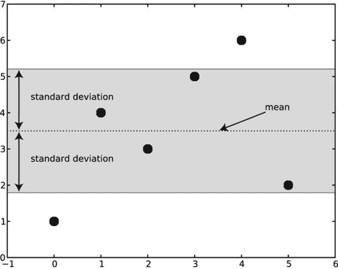
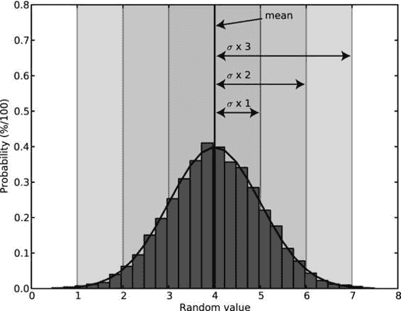
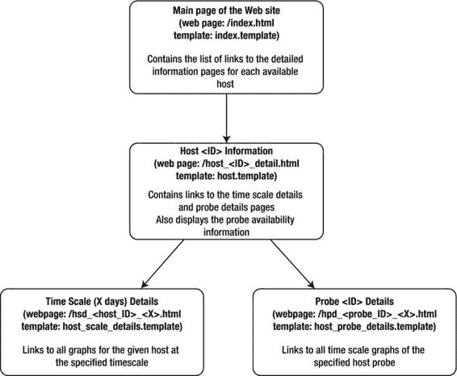

第十一章


统计数据收集和报告

这是致力于开发监测系统的系列章节中的第三章。在前面的章节中，我们创建了两个组件:一个监控服务器和一个监控代理组件，它们可以收集和存储来自各种来源的统计数据。为了使这些数据真正有用，我们需要对其进行分析，得出一些结论，并将结果呈现给最终用户。在本章中，我们将创建一个简单的基于 web 的应用，它对数据执行统计分析 并生成一些报告。

应用要求和设计

统计表示系统应该相当简单且易于使用。以下是它需要提供的基本功能:

*   系统应该提供一个列表，列出所有正在被监控的可用主机。
*   对于每个可用的主机，应该有一个该主机可用的所有探测器的列表(一个*探测器*是一个运行在远程服务器上的简单检查脚本)。
*   探测器应该分为两个标准:探测器名称和数据时间刻度。
*   数据应该以不同的时间尺度呈现，例如过去 24 小时、过去 7 天和过去 30 天获得的读数。
*   系统应报告达到设定阈值的次数。此信息可以表示为在某个时间范围内所有请求数量的百分比。
*   系统应该提供数据的基本统计分析，例如平均值、数据趋势等。

该系统将是一个脚本，从监控数据库读取数据，然后生成静态 HTML 页面以及所需的数据图形图像。这个脚本可以使用 cron 等系统调度工具定期运行。

将通过使用 NumPy 和 matplotlib 库来执行图形和统计分析。

使用 NumPy 库

统计分析是科学家们已经做了很长时间的事情。因此，几乎每种计算机语言都有大量的科学库。Python 编程语言最流行的库可能是 NumPy(以前称为 Numeric)、和 SciPy，前者提供高级数学函数，后者提供超过 15 个不同的科学模块(具有各种用于优化、线性代数、信号处理和分析以及统计分析的科学算法)。

对于我们在这里要做的事情来说，大部分功能可能是多余的。然而，只调用一个函数并知道结果是可信的，这种便利胜过在系统上安装一些额外的包。我建议花些时间熟悉这两个库(还有图形绘图库 matplotlib，我们将在本章后面讨论)，因为它们为分析和报告提供了有用的工具。

安装 NumPy

NumPy 包的可用性很大程度上取决于您使用的 Linux 发行版。一些发行版，如 Fedora 和 Ubuntu，试图保持应用的最新版本，将提供二进制包。在这种情况下，您可以使用操作系统软件包管理器(如 yum 或 aptitude)来为您安装软件包。例如，下面是如何在 Fedora 系统上安装 NumPy:

```py
$ yum install numpy
```

一些发行版，尤其是企业级的发行版，如 Red Hat Enterprise Linux 和 CentOS，在包的选择上更加保守，可能不提供预编译的包。对于这些发行版，最好下载源代码包并从源代码构建库。你可以在 http://sourceforge.net/projects/numpy/找到 NumPy 的源代码。

NumPy 示例

大多数 NumPy 函数都经过优化，可以有效地处理数组。这些数组可以有一维或多维。在我们的大多数示例中，我们将对一维数组进行操作，数组中的数据是传感器在一段时间内的标量读数。

使用数组

NumPy 数组与常规 Python 数组数据类型不同。该数组结构经过精心设计，在 NumPy 函数使用时非常有效。类型实现是特定于 NumPy C 代码的。它在访问方法方面提供了一些兼容性，但是并不是所有的函数都是重复的，正如您可以从这个例子中看到的:

```py
>>> import numpy
>>> array_py = [1, 4, 5, 7, 9]
>>> array_np = numpy.array([1, 4, 5, 7, 9])
>>> type(array_py)
<type 'list'>
>>> type(array_np)
<type 'numpy.ndarray'>
>>> array_np.append(2)
Traceback (most recent call last):
  File "<stdin>", line 1, in <module>
AttributeError: 'numpy.ndarray' object has no attribute 'append'
>>>
```

因为我们将广泛使用 NumPy 数组，所以让我们仔细看看它们的基本功能。正如您已经注意到的，数组是通过调用 NumPy 的数组构造函数创建的。当您查看 array 对象的公开方法时，这种数据类型的科学性是显而易见的。它缺少一种相当简单的追加新值的方法，但是它提供了一些最常见的统计函数:

```py
>>> a1 = numpy.array([1, 4, 5, 7, 9])
>>> a1.mean()   # calculate a mean value of the array
5.2000000000000002
>>> a1.std()    # calculate the standard deviation
2.7129319932501073
>>> a1.var()    # calculate the variance
7.3599999999999994
>>>
```

让我们先看看如何在列表中添加另一个元素。如您所见，标准列表方法 append()在这里不起作用。但是，NumPy 库有自己版本的 append 函数，可以用来追加元素:

```py
>>> a1 = numpy.array([1, 2, 3])
>>> numpy.append(a1, [4])
array([1, 2, 3, 4])
>>>
```

与普通 Python 列表的另一个区别是如何访问多维数组:

```py
>>> a1 = numpy.array([[1, 2, 3], [4, 5, 6]])
>>> a1[1, 1]   # second element of the second row
5
>>>
```

多维数组在每一行中必须有相同数量的条目，因为它们实际上是矩阵元素。只要数组中有足够的元素，就可以随时更改数组的形状:

```py
>>> a = np.arange(16)
>>> a
array([ 0,  1,  2,  3,  4,  5,  6,  7,  8,  9, 10, 11, 12, 13, 14, 15])
>>> a.reshape(2, 8)
array([[ 0,  1,  2,  3,  4,  5,  6,  7],
       [ 8,  9, 10, 11, 12, 13, 14, 15]])
>>> a.reshape(4, 4)
array([[ 0,  1,  2,  3],
       [ 4,  5,  6,  7],
       [ 8,  9, 10, 11],
       [12, 13, 14, 15]])
>>> a.reshape(4, 5)
Traceback (most recent call last):
  File "<stdin>", line 1, in <module>
ValueError: total size of new array must be unchanged
>>>
```

因此，您已经看到了如何将元素追加到列表中，以及如何构造和使用多维数组。让我们尝试将另一行追加到二维数组中:

```py
>>> numpy.append(a1, [7, 8, 9])
array([1, 2, 3, 4, 5, 6, 7, 8, 9])
>>>
```

这显然是错误的。我们希望出现第三行，但是我们得到的是一个一维列表，附加了额外的条目。所发生的是 NumPy 展平列表并向其追加新值，因为这就是 append()操作所做的——追加新元素，而不是子列表。

幸运的是，NumPy 还有另外两个函数，不仅允许向列表追加新行，还允许追加新列。vstack()函数追加新行，hstack()函数追加新列:

```py
>>> numpy.vstack((a1, [7, 8, 9]))
array([[1, 2, 3],
       [4, 5, 6],
       [7, 8, 9]])
>>> numpy.hstack((a1, [[7], [8]]))
array([[1, 2, 3, 7],
       [4, 5, 6, 8]])
>>>
```

附加的便利函数允许您在数组中迭代:

```py
>>> a = numpy.array([[1, 2, 3], [4, 5, 6], [7, 8, 9]])
>>> # simple iterator returns subarrays
>>> for i in a: print i
...
[1 2 3]
[4 5 6]
[7 8 9]
>>> # the following flattens the array
>>> for i in a.flat: print i,
...
1 2 3 4 5 6 7 8 9
>>> # returns a tuple with the element "coordinates" and the element itself
>>> for i in numpy.ndenumerate(a): print i
...
((0, 0), 1)
((0, 1), 2)
((0, 2), 3)
((1, 0), 4)
((1, 1), 5)
((1, 2), 6)
((2, 0), 7)
((2, 1), 8)
((2, 2), 9)
>>>
```

显然，您可以像处理“普通”Python 数组一样，进行通常的切片和切块操作:

```py
>>> a = numpy.array([[1, 2, 3, 4, 5], [6, 7, 8, 9, 0]])
>>> # get the middle 3 digits from the first row
... a[0, 1:4]
array([2, 3, 4])
>>> # same but from the second row this time
... a[1, 1:4]
array([7, 8, 9])
>>> # what about making a vertical cut at the third column?
... a[:,2]
array([3, 8])
>>>
```

最后，让我们看看一些高级的数组索引技术，我们将在本章后面用到。您已经熟悉了标准的 Python 数组索引，您可以在其中指定想要查看的特定项或一系列值。NumPy 数组对象也可以接受其他数组作为索引:

```py
>>> a = np.arange(-10, 1)
>>> a
array([-10,  -9,  -8,  -7,  -6,  -5,  -4,  -3,  -2,  -1,   0])
>>> i = np.arange(0, 9, 2)
>>> i
array([0, 2, 4, 6, 8])
>>> a[i]
array([-10,  -8,  -6,  -4,  -2])
>>>
```

这些例子演示了数组操作的基础。我们将讨论其他主题，如排序、搜索和数组整形，因为我们的示例程序需要它们。

基本数学和统计运算

到目前为止，您可能已经得到了 NumPy 库是关于高级数组操作的印象。虽然数组数据类型是 NumPy 的核心，但是这个库不仅仅是关于数组操作的。NumPy 附带了一套广泛的科学例程，比如线性代数、统计和金融函数。在这里，我将向您展示一些我认为最有用的模块函数的基本示例。

NumPy 库提供了广泛的数学原语，比如所有元素的和、加、乘、除和乘方函数。大部分都是不言自明的，从下面的例子可以看出:

```py
>>> import numpy as np
>>> a = np.linspace(1, 11, 8)
>>> a
array([  1.        ,   2.42857143,   3.85714286,   5.28571429,
         6.71428571,   8.14285714,   9.57142857,  11.        ])
>>># sum of all elements
... np.sum(a)
48.0
>>># round all elements to the nearest integer
... np.rint(a)
array([  1.,   2.,   4.,   5.,   7.,   8.,  10.,  11.])
>>># add two elements
... np.add(a, 100)
array([ 101.        ,  102.42857143,  103.85714286,  105.28571429,
        106.71428571,  108.14285714,  109.57142857,  111.        ])
>>># the second element can also be an array, but the shapes must match
... np.add(np.array([1, 2, 3]), np.array([10, 20, 30]))
array([11, 22, 33])
>>># similarly you can subtract the elements
... np.subtract(a, 10)
array([-9.        , -7.57142857, -6.14285714, -4.71428571, -3.28571429,
       -1.85714286, -0.42857143,  1.        ])
>>># multiply
... np.multiply(a, 10)
array([  10.        ,   24.28571429,   38.57142857,   52.85714286,
         67.14285714,   81.42857143,   95.71428571,  110.        ])
>>># ... or divide
... np.divide(a, 10)
array([ 0.1       ,  0.24285714,  0.38571429,  0.52857143,  0.67142857,
        0.81428571,  0.95714286,  1.1       ])
>>># ... raise each element to power from the second array
... np.power(a, 2)
array([   1.        ,    5.89795918,   14.87755102,   27.93877551,
         45.08163265,   66.30612245,   91.6122449 ,  121.        ])
>>>
```

以下是两个函数，可用于查找数组中的最大值和最小值:

```py
>>> a
array([0, 7, 7, 2, 6, 3, 2, 8, 4, 3])
>>> np.amin(a)
0
>>> np.amax(a)
8
>>>
```

计算平均值和标准偏差

因为我们要构建一个报告系统，生成关于我们系统行为的统计报告，所以让我们来看看我们将要使用的一些统计函数。

很可能，最常用的函数是用于计算一系列元素的平均值。NumPy 库提供了两个函数来计算数组中所有数字的平均值:mean()和 average()。

mean()函数计算任意一组给定数字的简单数学平均值。

```py
>>> a = np.arange(10.)
>>> a
array([ 0.,  1.,  2.,  3.,  4.,  5.,  6.,  7.,  8.,  9.])
>>> np.mean(a)
4.5
>>>

```

average()函数接受一个额外的参数，该参数允许您提供用于计算数组平均值的权重。请记住，权重数组必须与主数组长度相同。

```py
>>> a = np.array([5., 5., 5., 6., 6.])
>>> np.mean(a)
5.4000000000000004
>>> np.average(a, weights=np.array([1, 1, 1, 5, 10]))
5.833333333333333
>>>
```

您可能想知道为什么要使用加权平均值。最受欢迎的用例之一是当您想要使一些元素比其他元素更重要时，尤其是当这些元素按时间顺序列出时。使用前面的例子，让我们假设我们最初使用的数字[5，5，5，6，6]代表系统负载读数，读数是每分钟获得的。现在，我们可以通过简单地将所有数字相加，然后除以数组中的元素总数来计算平均值(或算术平均值)(这就是 mean()函数的作用)。在我们例子中，结果是 5.4。然而，最后一次阅读——最近的——通常更令人感兴趣，也更重要。因此，我们在计算中使用权重，有效地告诉 average()函数哪些数字对我们更重要。从结果中可以看出，当我们指出它们的重要性时，6 的最后两个值对最终结果的影响更大。

较少为人所知和使用的统计函数是*方差*和*标准差*。这两个指标彼此密切相关，并且是分布如何展开的度量。简而言之，这些是衡量数据集可变性的函数。方差计算为每个数据点距离平均值的平方的平均值。用数学术语来说，方差表示数据的统计离差。举个例子，假设我们在一个数组中有一组随机数据:[1，4，3，5，6，2]。这个数组的平均值是 3.5。现在我们需要计算数组中每个元素距离平均值的平方。距离的平方计算为(值*–*平均值) <sup class="calibre17">2</sup> 。所以，比如第一个值是(1–3.5)<sup class="calibre17">2</sup>=(-2.5)<sup class="calibre17">2</sup>= 6.25。其余值如下:[6.25，0.25，0.25，2.25，6.25，2.25]。我们现在需要做的是计算这些数字的平均值，以获得原始数组的方差，在我们的例子中，平均值为 2.9(四舍五入)。下面是如何通过一个 NumPy 函数调用来执行所有这些计算:

```py
>>> a
array([ 1.,  4.,  3.,  5.,  6.,  2.])
>>> np.var(a)
2.9166666666666665
>>>
```

我们确定这个数字表示距离平均值的平均平方距离，但是因为这个值是平方的，所以有点误导。这是因为它不是实际的距离，而是强调的距离值。我们现在需要获得这个值的平方根，以使它与其余的值一致。结果值代表数据集的*标准差* 。2.9 的平方根大约等于 1.7。这意味着数组中的大多数元素距离平均值不超过 1.7，在我们的例子中是 3.5。任何超出此范围的元素都是正常期望值的例外。[图 11-1](#Fig1) 说明了这个概念。在图表中，六个元素中有四个在标准偏差范围内，两个读数在范围之外。请记住，由于计算标准偏差的方式，数据集中总会有一些值距离平均值的距离大于集合的标准偏差。



[图 11-1](#_Fig1) 。数据集的均值和标准差

NumPy 库提供了一个方便的函数来计算任何数组的标准偏差值:

```py
>>> a = np.array([1., 4., 3., 5., 6.,2.])
>>> a
array([ 1.,  4.,  3.,  5.,  6.,  2.])
>>> np.std(a)
1.707825127659933
>>>
```

到目前为止，我们示例中的数据集相当随机，数据点太少。大多数真实世界的数据，尽管看起来是随机的，却遵循一种被称为*正态分布* 的分布。例如，一个国家的人的平均身高可能是 5 英尺 11 英寸(大约是 1.80 米)。大多数人的身高接近这个值，但是当我们远离这个平均值时，我们会发现越来越少的人在这个范围内。分布在平均值处达到峰值，然后从平均值向两侧逐渐减小。分布模式呈钟形，由两个参数定义:数据集的平均值(分布的中点)和标准差(定义图形的“斜度”)。标准差越大，图形就越“平坦”，这意味着分布在可能值的范围内更加分散。因为分布是由标准偏差值描述的，所以可以得出一些有趣的观察结果:

*   大约 68%的数据在平均值的一个标准偏差范围内。
*   大约 95%的数据落在平均值的两个标准偏差距离内。
*   几乎所有的数据(99.7%)都在平均值的三个标准偏差范围内。

为了更好地理解这一点，让我们来看看对一个大得多的数据集的分析。我生成了一组正态分布的随机数据。平均值(在数学文本中，通常标注为μ或 mu)为 4，标准差(也称为或西格玛)为 0.9。数据集由 10，000 个遵循正态分布模式的随机数组成。然后，我根据它们的值将所有这些数字放入适当的桶中，总共 28 个桶。该时段(或图上的条形)值是该时段范围内所有数字的总和。为了使它更有意义，我随后对桶值进行了规范化，因此所有桶的总和等于 1。因此，bucket 值现在表示数据集中出现的数字的概率或百分比。

你可以在[图 11-2](#Fig2) 中看到最终的数量分布直方图。条形由近似函数线包围，这有助于您形象化正态分布的形式。水平轴上 4 标记处的垂直线表示数据集中所有数字的平均值。从这条线，我们有三个标准差带:一个西格玛值距离，两个西格玛值距离，和三个西格玛值距离。如您所见，这直观地证明了几乎所有数据都包含在平均值的三个标准偏差距离内。



[图 11-2](#_Fig2) 。正态分布和标准差带

有几件事要记住。首先，图形形状几乎完全类似于正态分布模式的理论形状。这是因为我选择了一个大型数据集。对于较小的数据集，值更加随机，并且数据不会精确地遵循分布的理论形状。因此，如果想要获得有意义的结果，对大型数据集进行操作是很重要的。第二，正态分布被设计来模拟具有从–无穷大到+无穷大的任何值的过程。因此，它可能不太适合只有积极结果的过程。

假设您想要测量高速公路上的平均车速。显然，速度不可能是负的，但是正态分布允许这样。也就是说，理论模型允许，尽管概率极低，负速度。然而，在实践中，如果平均值距离 0 值超过四或五个标准偏差距离，则使用正态分布模型是相当安全的。

我们已经花了很多时间讨论和分析一个科学现象，但是这和本书的主题系统管理有什么关系呢？正如我提到的，大多数自然过程都是随机事件，但它们通常都聚集在一些值周围。以高速公路上汽车的平均速度为例。速度是有限制的，但这并不意味着所有的汽车都以那个速度行驶——有些会更快，有些会更慢。但是平均速度很有可能达到或低于限速。此外，大多数汽车将以接近平均水平的速度行驶。你离这个平均值的两边越远，以这个速度行驶的汽车就越少。如果你测量一组相当大的汽车的速度，你将得到速度分布图，它应该类似于正态分布图的理想模式。

这个模型也适用于系统使用。你的服务器只有在用户请求的时候才会执行工作。类似于高速公路上的汽车速度，系统负载将平均在某个值左右。

我选择了分布函数参数(平均值和标准偏差),以便它们在一个假想的四 CPU 服务器上模拟负载模式。正如你在图 11-2 中看到的，平均负载在 4 时达到峰值，这对于一个繁忙但没有过载的系统来说是很正常的。让我们假设服务器一直很忙，并且不遵循任何昼夜负载变化模式。虽然负荷几乎是恒定的，但总会有一些变化，但你离平均值越远，你达到那个读数的机会就越小。例如，下一次读数不太可能(准确地说是 32%的可能性)小于(大约)3 或大于(大约)5。同样，这条规则也适用于分别低于和高于 2 和 6 的读数——实际上，达到这些读数的几率不到 5%。

这告诉我们什么？好吧，知道了分布概率，我们就可以*动态*设置警报阈值。显然，我们并不太担心值太低，因为这不会对系统造成任何损害(虽然间接，它可能表明一些问题)。最有趣的是集合中的上限值。我们知道，每三个读数中有两个会落在第一个范围内(从平均值到每侧的一个标准偏差距离)。更高的百分比属于第二个级别；事实上，这将是大多数的阅读——超过 95%。您可以做出所有这些读数都正常并且系统运行正常的决定。然而，如果你遇到一个理论上只有 5%发生的读数，你可能想要得到一个警告信息。出现频率仅为 0.3%的读数令人担忧，因为它们与正常的系统行为相差甚远，因此您应该立即开始调查。

换句话说，您刚刚学习了如何定义什么是“正常”的系统行为，以及如何度量“异常”这是一个非常强大的工具，可以确定您在日常工作中可能使用的任何监视系统(比如 Nagios)的警告和错误阈值。我们将在应用中使用这种机制，它将自动更新阈值。

标准差和方差函数的补充函数是*直方图计算* 函数。它用于根据数值将数字分类到桶中。我用这个函数计算了图 11-2 中[正态分布模式的条形大小。该函数接受一个需要排序的值的数组，还可以选择接受容器的数量(默认为 10)，以及这些值是否应该进行规范化(默认为不进行规范化)。结果是两个数组的元组:一个包含 bin 大小，另一个包含 bin 边界。这里有一个例子:](#Fig2)

```py
>>> a = np.random.randn(1000)
>>> h, b = np.histogram(a, bins=8, normed=True, new=True)
>>> h
array([ 0.00238784,  0.02268444,  0.12416748,  0.30444912,  0.37966596,
        0.26146807,  0.08834994,  0.01074526])
>>> b
array([-3.63950476, -2.80192639, -1.96434802, -1.12676964, -0.28919127,
        0.5483871 ,  1.38596547,  2.22354385,  3.06112222])
>>>
```

函数 numpy . random . randn(<*count*>)用于生成均值为 0、标准差为 1 的正态分布集。还要记住，randn()从标准正态分布返回样本，因此不能保证两次运行的结果相同。

寻找数据集的趋势线

我们将在本章中构建的示例应用应该报告并帮助我们可视化各种读数的趋势。例如，假设我们正在收集关于 CPU 负载的数据。我们如何发现负载是否随着时间逐渐增加？一个显而易见的方法是看读数的图表；真正明显的趋势将立即显现。但是我们不想自己查看所有可能的图表，并试图找出一个趋势。如果负载的增加不是很明显，可能无法判断这些值在图上一般是趋于上升还是下降，因为它们将随机分散在某个平均值周围。

幸运的是，一个被称为*回归*或*曲线拟合* 的成熟过程允许我们找到最适合任何给定数据集的函数。所得曲线是所提供值的近似值，通常是受随机噪声严重影响的一般函数或趋势。曲线拟合最流行和计算效率最高的方法之一叫做最小二乘法的*方法。该方法假设最佳拟合曲线是与给定数据集的偏差平方和最小的曲线。换句话说，曲线应该尽可能接近所有的数据点。*

定义这种曲线最常见的方法是使用多项式。*多项式*是仅使用加法和乘法运算就可以用固定长度函数表示的函数。作为乘法运算的一种表达方式，指数也是允许的，只要不是负数，用的是整数。

多项式函数的一个例子是*y = 2 * x*<sup class="calibre17">*2*</sup>*+x+4。*最大指数定义多项式函数的次数。在这个例子中，最大的指数是 2；因此，这是一个二次多项式。因此，通过使用最小二乘法，我们可以找到最适合给定数据集的多项式。为了简单起见，我们将只计算一次多项式，它定义了一个直线函数。该函数的斜率显示趋势是上升、下降还是不随时间显著变化。斜率由常数乘数定义。例如，对于 *y = a * x + b* ，直线的斜率由 *a* 的值定义。如果这个值是正数，这条线向上；如果是负数，这条线向下。第二个常数 *b* 定义了直线在垂直轴上的位置。

如您所见，一次多项式由两个常数定义:斜率和位置。在我们的函数中，这些分别是常数 *a* 和 *b* 。现在的问题是如何从任何一组看似随机的数据中找到这些常数。实际计算过程有些冗长，这里就不赘述了。幸运的是，NumPy 提供了一个函数，该函数接受数据点的两个坐标数组( *x* 和 *y* )，并返回多项式常数作为结果。您还可以指定所需多项式函数的次数，但我们将坚持一次多项式计算。以下示例生成一些随机数据，然后人为地在序列中引入一个斜率，然后计算得到的一次多项式常数:

```py
>>> x = np.arange(100)
>>> y = np.random.normal(4., 0.9, 100)
>>> for i in range(100):
...    y[i] = y[i] + i/40
>>>a, b = np.polyfit(x, y, 1)
```

 **注意**你可以在[http://en.wikipedia.org/wiki/Polynomial](http://en.wikipedia.org/wiki/Polynomial)的维基百科页面上找到更多关于多项式函数以及常数是如何推导出来的细节。

在[图 11-3](#Fig3) 中，你可以看到原始数据(显示为点)以及最佳拟合或趋势线。尽管有些值比数据集的其余部分大得多，但实际趋势并不像您预期的那样陡峭。趋势函数常数也为我们提供了未来将要发生的事情的一个很好的指示。例如，在观察了 100 个值之后，我们确定了这个数据集的多项式函数是 *y = 0.024 * x + 3.7* 。因此，在一定的置信度下，我们可以假设再测量 100 次后的平均值为 0.024 * 200 + 3.7 = 8.5。如果我们假设这是我们系统的平均负载读数，我们将清楚地知道在不久的将来平均负载会是多少。这是一种可以用于容量规划的强大方法。


[图 11-3](#_Fig3) 。随机数据的最佳拟合趋势线

向文件读写数据

在某些情况下，您可能需要将数据写入文件，然后在以后读入数据以供进一步处理。NumPy 为此提供了几个输入/输出过程。在下面的示例中，数据存储在文本文件中，逗号字符用作分隔符。

```py
>>> a = np.arange(16).reshape(4,4)
>>> a
array([[ 0,  1,  2,  3],
       [ 4,  5,  6,  7],
       [ 8,  9, 10, 11],
       [12, 13, 14, 15]])
>>> np.savetxt('data.txt', a, fmt="%G", delimiter=',')
>>> b = np.loadtxt('data.txt', delimiter=',')
>>> b
array([[  0.,   1.,   2.,   3.],
       [  4.,   5.,   6.,   7.],
       [  8.,   9.,  10.,  11.],
       [ 12.,  13.,  14.,  15.]])
>>>
```

许多流行的工具(如 Excel)都理解这种格式，因此您可以使用这种方法导出数据，并与使用不同工具的其他人交换文件。

用 matplotlib 表示数据

你可能想知道我用什么程序来生成你在本章中看到的图表。我使用了另一个 Python 库提供的工具，名为 matplotlib 。这个库的主要用途是创建和绘制各种科学图表。它允许您生成和保存图像文件，但它也带有一个图形界面，有缩放和平移选项。该库提供了用于生成 2D 和 3D 图的功能。

matplotlib 是一个复杂的软件，它提供的功能类似于 MATLAB 等商业产品。在这里，我们将只查看生成简单的 2D 图并向其添加注释。

 **注**关于使用 matplotlib 的更多详细信息，请参见 Shai Vaingast 的*开始 Python 可视化*(Apress，2014)。

安装 matplotlib

通常，安装 matplotlib 有两种选择:使用 Python 包索引(PyPI)安装程序(pip)工具或从源代码构建包。下面是从 PyPI 安装库的命令:

```py
$ sudo pip install matplotlib
```

 **注意**如果使用画中画工具，一定要检查安装的是哪个版本。我遇到过这样的情况，PyPI 上的 matplotlib 版本比最新版本要旧得多。

我推荐另一个选择:从最新的源代码包构建库。通过这种方式，您可以确保获得最新版本。这个过程并不复杂。首先，从 SourceForge 资源库下载源代码，网址为[http://SourceForge . net/projects/matplotlib/files/matplotlib/](http://sourceforge.net/projects/matplotlib/files/matplotlib/)。然后解包并运行以下命令来构建和安装 matplotlib 模块:

```py
$ python setup.py build
$ sudo python setup.py install
```

根据您的 Linux 安装，您可能还需要安装一些 matplotlib 所依赖的、默认安装中不包含的附加包。例如，您可能需要安装 FreeType 开发库和头文件(适用于 Red Hat Linux 的 freetype-devel 包)以及用于操作 PNG 图像格式文件的程序的开发工具(适用于 Red Hat Linux 的 libpng-devel 包)。请查阅您的 Linux 发行版文档以了解具体的细节，例如安装过程和软件包名称。

安装完库后，可以通过发出以下命令来检查它是否正常工作:

```py
$ python
Python 2.6.2 (r262:71600, Jan 25 2010, 18:46:45)
[GCC 4.4.2 20091222 (Red Hat 4.4.2-20)] on linux2
Type "help", "copyright", "credits" or "license" for more information.
>>> import matplotlib
>>> matplotlib.__version__
'0.99.1.1'
>>>
```

了解库结构

matplotlib API 被组织成三层责任:

*   第一层是 matplotlib.backend_bases。FigureCanvas 对象，表示在其上绘制图形的区域。
*   第二层是 matplotlib.backend_bases。Renderer 对象，它知道如何在 FigureCanvas 对象上绘制。
*   第三层是 matplotlib.artist.Artist 对象，它知道如何使用渲染对象。

通常，前两层负责与系统图形库对话，如 wxPython 和 PostScript 引擎，Artist 用于处理更高级别的图元，如线条和文本。大多数情况下，您将只使用艺术家对象。

艺术家分为两种不同的类型:画图原语和容器。图元是表示您想要绘制的对象的对象，例如直线、文本、矩形等等。容器是包含原语的对象。使用 matplotlib 创建图形的标准模式是创建一个主包含对象(Figure 类的实例)，添加一个或多个轴或子图实例，然后使用这些实例的辅助方法来绘制图元。对于我的图，我通常使用 Subplot，因为它是 Axes 的子类，并提供更高级别的访问控制。

绘制图表

Subplot 类最广泛使用的方法之一是 plot()函数。它用于在子情节(或轴)上画线或标记。清单 11-1 演示了如何绘制正弦函数图。T3】

[***清单 11-1***](#_list1) 。画一个简单的图表

```py
import matplotlib.pyplot as plt
import numpy as np

fig = plt.figure()
ax = fig.add_subplot(1, 1, 1)
x = np.arange(100)
y = np.sin(2 * np.pi * x / 100)
ax.plot(y)
plt.show()
```

如果你在运行 X 窗口管理器的系统上运行这个脚本，你会在一个单独的窗口中看到一个图表，如图[图 11-4](#Fig4) 所示。您将能够使用窗口功能，如平移和缩放，以及保存和打印文件。


[图 11-4](#_Fig4) 。一个 matplotlib 窗口实例的例子

更改绘图图元的外观

plot()函数更完整的语法是包含两个坐标数组， *x* 和 *y* ，并指定绘图格式，例如绘图颜色和样式。下面的代码绘制了与[清单 11-1](#list1) 相同的图形，但是使用了一条红色虚线，这是由颜色的 r 快捷键和线型的:快捷键指定的。

```py
x = np.arange(100)
y = np.sin(2 * np.pi * x / 100)
ax.plot(x, y, 'r:')
```

还可以使用关键字参数来指定图形的格式和绘图颜色。

```py
ax.plot(x, y, linestyle='dashed', color='blue')
```

[表 11-1](#Tab1) 列出了最常用的格式化字符串字符和它们的关键字变元选项。

[表 11-1](#_Tab1) 。图形样式格式化字符和关键字参数

| 

样式快捷方式

 | 

关键字参数

 | 

描述

 |
| --- | --- | --- |
| - | linestyle='solid ' | 实线 |
| - | linestyle= '虚线' | 短划线 |
| ： | linestyle='dotted ' | 点线 |
| -. | linestyle='dash_dot ' | 点划线 |
| O | marker='circle ' | 圆形标记(不与线条相连) |
| 。 | marker='dot ' | 点标记(不与线条相连) |
| * | marker='star ' | 星形标记(没有连线) |
| + | 标记='plus ' | 加号标记(不与线条相连) |
| X | 标记 ='x' | x 标记(不与线条相连) |

当您使用快捷样式字符串时，有限的一组颜色可用，如[表 11-2](#Tab2) 所示。当您使用关键字参数来指定颜色时，您有更多的选择。

[表 11-2](#_Tab2) 。图形颜色快捷键

| 

样式快捷方式

 | 

颜色

 |
| --- | --- |
| K | 黑色 |
| W | 白色的 |
| B | 蓝色 |
| G | 格林（姓氏）；绿色的 |
| 稀有 | 红色 |
| C | 蓝绿色 |
| M | 品红 |
| Y | 黄色 |

如果只使用灰色阴影，可以将 color 关键字参数设置为表示 0 到 1 范围内的浮点数的字符串，其中 0 表示黑色，1 表示白色。请确保将其设置为字符串；不要直接分配浮点。

```py
ax.plot(x, y, linestyle='dashed', color='0.5')  # good
ax.plot(x, y, linestyle='dashed', color=0.5)    # bad
```

也可以使用 HTML 十六进制字符串，比如#aa11bb *。*指定颜色的另一种方法是传递一个由 0 到 1 范围内的三个浮点数组成的元组，表示红色、绿色和蓝色分量，如下例所示:

```py
ax.plot(x, y, linestyle='dashed', color=(0.2, 0.7, 0.3))
```

绘制条形图和使用多轴

另一种常用的绘图方法是使用 bar 原语，通过 bar()方法 创建。

清单 11-2 演示了创建一个有两个图形的图。第一个图形也放在极坐标系统上。两个图都使用条形图来显示数据。

[***清单 11-2***](#_list2) 。使用笛卡尔坐标和极坐标绘制条形图

```py
import matplotlib.pyplot as plt
import numpy as np

fig = plt.figure()

ax = fig.add_subplot(2, 1, 1, polar=True)
x = np.arange(25)
y = np.sin(2 * np.pi * x / 25)
ax.bar(x * np.pi * 2/ 25, abs(y), width=0.3, alpha=0.3)

ax2 = fig.add_subplot(2, 1, 2)
x2 = np.arange(25)
y2 = np.sin(2 * np.pi * x2 / 25)
ax2.bar(x2, y2)

plt.show()
```

请注意，我们现在有两个轴对象。它们是自动排列的，但是您必须指定它们在网格上的位置。所以当你初始化每个 Axes 对象时，你需要指定画布上将有多少行和多少列——在清单 11-2 的例子中是两行和一列。然后，对于每个轴对象，您需要给出序号，这将用于在画布网格上相应地放置它们。该示例分别使用 1 和 2:

```py
ax = fig.add_subplot(2, 1, 1, polar=True) # rows, columns, id
...
ax2 = fig.add_subplot(2, 1, 2)            # rows, columns, id
```

polar 关键字参数指示轴将具有笛卡尔坐标系还是极坐标。如果将坐标系设置为极坐标，请记住完整的圆范围是从 0 到 2*π。

bar()方法使用两个可选的关键字参数:width 和 alpha，width 设置条形宽度，alpha 控制原语的透明度。你可以在[图 11-5](#Fig5) 中看到结果图。


[图 11-5](#_Fig5) 。在笛卡尔坐标和极坐标上绘制条形

使用文本字符串

您可能已经注意到，到目前为止，图表上显示的文本非常少。matplotlib 方便地将值添加到两个轴上，但这是它所能猜测的。添加像轴注释、图形标题和各种标签这样的文本是我们的责任。幸运的是，Axes 对象有多个辅助函数，可以帮助我们将文本添加到绘图中。您可以按如下方式放置文本:

*   向 *x* 和 *y* 轴添加文本。
*   添加情节标题。
*   在图面上任意放置文本。
*   在图上标注具体的点。

两个轴的标题和注释是在轴(或子情节)初始化期间通过使用适当的关键字参数来设置的。可以使用 text()方法并指定坐标和文本字符串来放置任意文本字符串。类似地，可以使用 annotate()函数创建注释。annotate()函数接受关键字参数，这些参数指示文本应该放置的位置(xytext 参数)和箭头应该指向的位置(xy 参数)。可选的 arrowprops 字典允许您广泛地配置注释箭头的外观，但是最简单的配置是 arrowstyle 字典项，您可以使用它来设置箭头的方向。

清单 11-3 展示了添加所有四种类型的文本。

[***清单 11-3***](#_list3) 。向图表中添加文本

```py
import matplotlib.pyplot as plt
import numpy as np

fig = plt.figure()
ax = fig.add_subplot(1, 1, 1,
                     title="Fourth degree polynomial",
                     xlabel='X Axis',
                     ylabel='Y Axis')
x = np.linspace(-5., 3)
y = 0.2 * x**4 + 0.5 * x**3 - 2.5 * x**2 - 1.2 * x - 0.6
ax.plot(x, y)
ax.grid(True)

ax.text(-4.5, 6, r'$y = 0.2 x^4 + 0.4 x^3 - 2.5 x^2 - 1.2 x - 0.6$', fontsize=14)
ax.annotate('Turning point',
            xy=(1.8, -7),
            xytext=(-0.8, -12.6),
            arrowprops=dict(arrowstyle="->",)
           )

plt.show()
```

注意文本字符串是如何格式化的。[清单 11-3](#list3) 使用 Python 原始字符串符号(只是提醒它被定义为 r'anystring ')并将整个表达式包含在$ characters 中。这指示 matplotlib 文本呈现引擎该文本将包含 TeX 标记指令的子集。

[图 11-6](#Fig6) 显示了[清单 11-3](#list3) 生成的图。


[图 11-6](#_Fig6) 。向图表中添加文本

将图保存到文件

到目前为止，我们已经研究了情节生成的各个方面。您已经看到，您生成的图显示在 GUI 的交互式窗口中。如果您只需要快速检查结果，这是完全可以接受的，但这也意味着您每次想要查看图表时都需要执行完整的计算。您可以选择从绘图显示窗口保存图形，但这是一个手动过程，不适合自动报告系统。

matplotlib 使用生成图像的图像后端进程。对于我们大多数只想使用最流行的格式(如 PNG、PDF、SVG、PS 和 EPS)的人来说，matplotlib 提供了反纹理几何(Agg)后端，它在幕后使用 C++反纹理图像渲染引擎。默认情况下，当您导入 pyplot 模块时，matplotlib 使用其中一个 GUI 引擎(例如，wxPython)。要改变这种行为，您必须首先指示它使用 Agg 后端，然后导入 pyplot。

清单 11-4 展示了如何用 Agg 后端初始化 matplotlib 并生成两个不同格式的文件。

[***清单 11-4***](#_list4) 。将图像保存到文件

```py
#!/usr/bin/env python

import matplotlib
matplotlib.use('Agg')
import matplotlib.pyplot as plt
import numpy as np

fig = plt.figure()
ax = fig.add_subplot(1, 1, 1)
x = np.arange(100)
y = np.sin(2 * np.pi * x / 100)
ax.plot(y)
plt.savefig('sin-wave.png')
plt.savefig('sin-wave.pdf')
```

请注意，您不需要特别告诉 Agg 引擎文件类型。它很聪明，可以从文件扩展名中判断出来。如果必须使用非标准扩展名，或者根本不使用扩展名，可以使用可选的关键字参数来强制文件类型:

```py
plt.savefig('sin-wave', format='png')
```

绘制统计数据

我们已经花了大量的时间讨论数据分析的各种统计方法。您知道如何检查数据集中是否有任何趋势，以及趋势是积极的还是消极的。您还知道如何计算数据集的平均值以及数据符合预定义边界的可能性(标准偏差)。现在让我们看看如何应用这些知识。我们将构建一个简单的应用，它定期运行并生成状态页面。这些页面是静态页面，将由 Apache web 服务器提供服务。

整理数据库中的数据

第 9 章详细介绍了我们的监控系统所使用的各种数据库表，以及它们之间的关系。因为我们对报告本章示例的探头读数感兴趣，所以我们最感兴趣的是探头读数表，它包含从传感器获得的原始数据。该表的值需要在处理前进行过滤，因此我们需要知道该读数属于哪个传感器，或者更准确地说，属于哪个探头。我们还需要按读取探针读数的主机对探针读数进行分组。换句话说，我们需要遍历主机表中的所有条目；然后，对于我们找到的每个主机，我们需要检查哪些探测器正在其上运行。一旦我们建立了完整的主机-探针组合，我们就需要获得一段时间内的传感器读数。

在我在本例中使用的测试数据库中，主机表中有两台主机(称为我的笔记本电脑和我的服务器)和两个探测器(称为 Used CPU %和 HTTP requests)。两台主机都在报告它们的 CPU 使用情况，但是只有服务器在为网页提供服务，因此它在监控传入的 HTTP 请求的数量。您可以下载包含数据的数据库文件以及本书的其余源代码。数据库预加载了随机生成的示例性能数据，但它试图遵循真实世界的使用模式。

在我们继续实现之前，让我们快速概述一下站点生成器脚本的基本结构。

显示可用主机

首先，我们需要找到数据库中存在的所有主机。一旦我们有了这个列表，我们将使用主机 ID 来搜索与这个主机相关联的所有探测器。我们需要收集探测器名称、警告和错误阈值以及主机探测器 ID，我们将使用它们来搜索探测器读数。清单 11-5 显示了用来收集这些信息的代码。

[***清单 11-5***](#_list5) 。检索所有主机和关联的探测器

```py
class SiteGenerator:
    def __init__(self, db_name):
        self.db_name = db_name
        self.conn = sqlite3.connect(self.db_name)
        self.hosts = []
        self._get_all_hosts()

    def _get_all_hosts(self):
        for h in self.conn.execute("SELECT * FROM host"):
            host_entry = list(h)
            query_str = """ SELECT hostprobe.id,
                                   probe.name,
                                   COALESCE(hostprobe.warning, probe.warning),
                                   COALESCE(hostprobe.error, probe.error)
                            FROM   probe,
                                   hostprobe
                            WHERE  probe.id = hostprobe.probe_id AND
                                   hostprobe.host_id = ?
                        """
            probes = self.conn.execute(query_str, (h[0],)).fetchall()
            host_entry.append(probes)
            self.hosts.append(host_entry)
```

在这段代码中，注意 COALESCE()函数，它从列表中返回第一个非空结果。请记住，我们可以在 probe 表中定义站点范围的阈值，但是我们也允许在 hostprobe 表中覆盖此设置。这使我们能够在每个主机的基础上设置阈值。因此，逻辑是检查特定于主机的阈值设置是否没有设置为 NULL，如果设置为 NULL，则返回默认值。下面是一个简单的例子来说明这个函数的行为:

```py
sqlite> select coalesce(1, 2);
1
sqlite> select coalesce(NULL, 2);
2
sqlite> select coalesce(NULL, NULL);

sqlite>
```

绘制时间刻度图

现在我们有了进一步数据处理所需的所有信息:主机和相关的主机探测器。有许多不同的方法来表示我们收集的统计信息。在本例中，我们将按照两个参数之一对信息进行排序:探测器名称和时间刻度。为了简化实现，我们将使用预定义的可用时间表列表:1 天、7 天和 30 天。

我发现如果我将正在开发的网站结构可视化，开发模板和相应的代码会更容易。[图 11-7](#Fig7) 展示了我们网站的结构，以及样本 HTML 文件名(id 将被替换为实际值)和相应的 Jinja2 模板。



[图 11-7](#_Fig7) 。网站结构

索引页

索引页面是我们网站上最简单的页面。它需要生成最少的代码，因为我们不需要做任何计算。我们只是传入主机列表，这个列表已经在类初始化方法中生成了。

私有类方法加载模板并将主机列表传递给它:

```py
def _generate_hosts_view(self):
        t = self.tpl_env.get_template('index.template')
        f = open("%s/index.html" % self.location, 'w')
        f.write(t.render({'hosts': self.hosts}))
        f.close()
```

模板遍历主机列表，并生成指向主机详细信息页面的链接:

```py
<h1>Hosts</h1>
<ul>

    <li><a href="host_{{ host[0] }}_details.html">{{ host[1] }}</a>
        ({{ host[2] }}:{{ host[3] }})</li>

</ul>
```

在这个例子中，我们将大量使用主机列表和主机探测列表。[表 11-3](#Tab3) 显示了每个字段的细节，所以你不需要记住每个字段包含的内容。

[表 11-3](#_Tab3) 。主机和探测器列表字段

| 

元素

 | 

元素字段

 | 

描述

 |
| --- | --- | --- |
| 自我主机 | Zero | 主机 ID |
| 自我主机 | one | 主机的名称 |
| 自我主机 | Two | 主机的地址 |
| 自我主机 | three | 监控代理的端口号 |
| 自我主机 | four | 探测元素列表(以下字段) |
| 主持人[4] | Zero | 主机探测器 ID |
| 主持人[4] | one | 探测器的名称 |
| 主持人[4] | Two | 警告阈值(如果未定义，则为无) |
| 主持人[4] | three | 错误阈值(如果未定义，则为无) |

主机详细信息页面

对于主机详细信息页面，我们需要计算服务可用性数字，并在每个主机的 web 页面上显示它们。每个页面将有两个部分:一部分显示服务可用性统计信息，另一部分列出包含每个时间刻度/主机探测器组合的图表的页面链接。

清单 11-6 显示了两个私有方法，它们执行计算并生成网页。

[***清单 11-6***](#_list6) 。生成主机详细资料网页

```py
def _generate_host_toc(self, host):
    probe_sa = {}
    for probe in host[4]:
        probe_sa[probe[1]] = {}
        for scale in TIMESCALES:
            probe_sa[probe[1]][scale] =
            self._calculate_service_availability(probe, scale)
    t = self.tpl_env.get_template('host.template')
    f = open("%s/host_%s_details.html" % (self.location, host[0]), 'w')
    f.write(t.render({ 'host': host,
                       'timescales': TIMESCALES,
                       'probe_sa': probe_sa,
                     }))
    f.close()

def _calculate_service_availability(self, probe, scale):
    sa_warn = None
    sa_err  = None
    sampling_rate = self.conn.execute("""SELECT probeinterval
                                           FROM probingschedule
                                          WHERE hostprobe_id=?""",
                                      (probe[0],)).fetchone()[0]
    records_to_read = int(24 * 60 * scale / sampling_rate)
    query_str = """SELECT count(*)
                     FROM (SELECT probe_value
                             FROM probereading
                            WHERE hostprobe_id=?
                            LIMIT ?)
                    WHERE probe_value > ?"""
    if probe[2]:
        warning_hits = self.conn.execute(query_str,
                                         (probe[0], records_to_read, probe[2],)
                                        ).fetchone()[0]
        sa_warn = float(warning_hits) / records_to_read
    if probe[3]:
        error_hits   = self.conn.execute(query_str,
                                         (probe[0], records_to_read, probe[3],)
                                        ).fetchone()[0]
        sa_err  = float(error_hits) / records_to_read
    return (sa_warn, sa_err)
```

将为列表中找到的每个主机调用第一个函数 _generate_host_toc() 。作为一个参数，_generate_host_toc()函数接收一个主机结构，该主机结构还包含与之相关的所有探测器的列表(见[表 11-3](#Tab3) )。然后，该函数遍历所有主机条目和所有时间刻度值，调用第二个函数 _ calculate _ service _ avail ability()。

_ calculate _ service _ avail ability()函数计算每个主机探测器在给定时间刻度内违反每个阈值的次数。为此，它需要计算出需要分析多少条记录。这取决于采样率。例如，如果我们每分钟都在读取一个探测器，我们每天将有 24 * 60 = 1440 条记录。但是，如果我们每 5 分钟执行一次检查，将会有 24 * (60/5) = 288 条记录。采样率存储在数据库中，因此我们只需获取该值并计算要分析的记录数。

下一步是计算值高于阈值设置的记录数。我们将使用的数据库查询对于两种值检查是相同的。所以我们构造一次，然后在 connection.execute()调用时使用它，并设置适当的阈值。让我们看一下 SQL 查询:

```py
SELECT count(*)
  FROM (SELECT probe_value
          FROM probereading
         WHERE hostprobe_id=?
         LIMIT ?)
  WHERE probe_value > ?
```

这实际上是两个嵌套的查询。SQLite3 引擎将执行的第一个查询是内部 SELECT 语句，它为指定的主机探测器从列表中选择最后的 *x* 记录。外部 SELECT 语句计算列表中 probe_value 高于指定阈值的记录数。您可能会注意到，在内部 SELECT 语句中，我们没有对列表进行任何排序。那么我们有多确定我们真的会得到*最后的*记录，而不是从数据库中随机或半随机选择的记录呢？在 SQLite 中，每一行都有一个关联的 ROWID 值，所有行都按其行 ID 排序。如果我们不在 SELECT 语句中指定顺序，它将自动按行 id 排序。因为我们只是将行添加到数据库中，所以我们所有的行 id 都在序列中。因此，一个简单的 LIMIT SQL 语句保证我们将得到最后选中的行。

 **注意**你可以在官方 SQLite3 文档中找到更多关于行 ID 字段的信息，位于[http://sqlite.org/lang_createtable.html#rowid](http://sqlite.org/lang_createtable.html#rowid)。请注意，其他数据库引擎，如 PostgreSQL 和 MySQL，可能会有不同的行为。

仅当阈值可用时，才会执行 SQL 查询；否则，该函数返回 None 作为结果。一旦计算完成，我们加载模板并传递变量给它。该模板负责显示可用性统计信息，还负责生成指向包含图表的页面的链接。清单 11-7 显示了主机详细信息模板。

[***清单 11-7***](#_list7) 。主机详细信息模板

```py
<h1>Host details: {{ host[1] }}</h1>
  <h2>Views grouped by the timescales</h2>
    <p>Here you'll find all available probes for this host on the sametimescale.</p>
      <ul>
      
        <li><a href="hsd_{{ host[0] }}_{{ scale }}.html">{{ scale }} day(s)view</a></li>
      
      </ul>
  <h2>Views grouped by the probes</h2>
    <p>Here you'll find all available time scale views of the same probe</p>
      <ul>
      
        <li><a href="hpd_{{ probe[0] }}.html">{{ probe[1] }}</a></li>
      
      </ul>
  <h2>Host statistics</h2>
    <h3>Service availability details</h3>
      
      <h4>Availability of the "{{ probe }}" check</h4>
        <ul>
        
          <li>On a {{ scale }} day(s) scale:
            <ul>
              <li>Warning: {{ probe_sa[probe][scale][0]|round(3) }}%</li>
              <li>Error: {{ probe_sa[probe][scale][1]|round(3) }}%</li>
            </ul>
          </li>
        
        </ul>
      
```

图表收集页面

图形收集页面从详细的主机信息页面链接。正如你在图 11-7 中看到的，我们有两种类型的图表收集页面:一种包含具有相同时间刻度的图表，但绘制来自不同探测器的数据，另一种绘制单个主机探测器的所有可用时间刻度图表。

虽然这些函数非常相似，但我将它们分成了两个函数调用，主要是为了保持代码的模块化结构。清单 11-8 显示了这两个函数。

[***清单 11-8***](#_list8) 。生成图形收集页面

```py
def _generate_host_probe_details(self, host_struct, probe_struct):
    t = self.tpl_env.get_template('host_probe_details.template')
    f = open("%s/hpd_%s.html" % (self.location, probe_struct[0]), 'w')
    images = []
    for scale in TIMESCALES:
        images.append([ scale,
                        "plot_%s_%s.png" % (probe_struct[0], scale),
                      ])
    f.write(t.render({'host': host_struct,
                      'probe': probe_struct,
                      'images': images,
                     }))
    f.close()

def _generate_host_scale_details(self, host_struct, scale):
    t = self.tpl_env.get_template('host_scale_details.template')
    f = open("%s/hsd_%s_%s.html" % (self.location, host_struct[0], scale), 'w')
    images = []
    for probe in host_struct[4]:
        images.append([ probe[1],
                        "plot_%s_%s.png" % (probe[0], scale),
                      ])
    f.write(t.render({'host': host_struct,
                      'scale': scale,
                      'images': images,
                     }))
    f.close()
```

_generate_host_probe_details()函数负责链接所有可用时标的所有主机探头图像。以下是该函数的模板代码:

```py
<h1>Host: {{ host[1] }}</h1>
  <h2>Probe: {{ probe[1] }}</h2>
    
    <h3>Time scale: {{ image[0] }} day(s)</h3>
      
    
```

模板简单地遍历由函数生成的数据集。数据集包括图像文件名。

函数链接指定时间范围内的所有主机探测器。与第一个函数类似，这个函数生成图像文件名，并且这个列表在模板中使用。以下是该函数的模板代码:

```py
<h1>Host: {{ host[1] }}</h1>
  <h2>Scale: {{ scale }} day(s)</h2>
    
    <h3>{{ image[0] }}</h3>
      
    
```

绘制性能图

我们已经参考了这些图像，但是我们还没有创建任何图表。在这一节中，我们将查看从数据库中读取数据并为每个可能的主机探测器/时间刻度组合生成单独图像的函数。如您所见，这些图像可以通过多种标准进行组合。在本例中，我们按照时间刻度值和探测器名称对它们进行分组。

除了简单的数据绘图，我们的函数还将计算数据集的一些统计参数:给定数据的趋势函数和标准偏差值，这将为我们提供新的警告和错误阈值的建议。当您刚刚开始监视一个新实体，并且不知道这些值应该是什么时，这可能特别有用。

[清单 11-9](#list9) 显示了绘制性能数据的函数。您应该从前面对 NumPy 和 matplotlib 模块的讨论中认识到数字和绘图函数。

[***清单 11-9***](#_list9) 。绘制性能数据

```py
def _plot_time_graph(self, hostprobe_id, time_window, sampling_rate, plot_title,
                     plot_file_name, warn=None, err=None):
    records_to_read = int(time_window / sampling_rate)
    records = self.conn.execute("""SELECT timestamp, probe_value
                                     FROM probereading
                                    WHERE hostprobe_id=?
                                    LIMIT ?""",
                                (hostprobe_id, records_to_read)).fetchall()
    time_array, val_array = zip(*records)

    mean = np.mean(val_array)
    std = np.std(val_array)
    warning_val = mean + 3 * std
    error_val = mean + 4 * std

    data_y = np.array(val_array)
    data_x = np.arange(len(data_y))
    data_time = [dateutil.parser.parse(s) for s in time_array]
    data_xtime = matplotlib.dates.date2num(data_time)
    a, b = np.polyfit(data_x, data_y, 1)
    matplotlib.rcParams['font.size'] = 10
    fig = plt.figure(figsize=(8,4))
    ax = fig.add_subplot(1, 1, 1)
    ax.set_title(plot_title + "\nMean: %.2f, Std Dev: %.2f, Warn Lvl: %.2f, Err Lvl:
                                       %.2f" %
                               (mean, std, warning_val, error_val))
    ax.plot_date(data_xtime, data_y, 'b')

ax.plot_date(data_xtime,
             data_x * a + b,
                 color='black', linewidth=3, marker='None', linestyle='-', alpha=0.5)
    fig.autofmt_xdate()
    if warn:
        ax.axhline(warn, color='orange', linestyle='--', linewidth=2, alpha=0.7)
    if err:
        ax.axhline(err, color='red', linestyle='--', linewidth=2, alpha=0.7)
    ax.grid(True)
    plt.savefig("%s/%s" % (self.location, plot_file_name))
```

_plot_time_graph()函数从一个 SQL 查询开始，该查询选择属于适当主机探测器的时间戳和探测器值字段。这里我们再次使用 LIMIT 语句从表中检索最新的结果。

请记住，只有当您使用 SQLite3 数据库时，这种方法才能保证有效，因为记录会自动按照它们的 ROWID 值进行排序。其他数据库的行为可能有所不同。同样，这个假设依赖于我们从不从数据库中删除任何记录的事实；因此，行 id 保证是连续的。

如果您正在使用不同的数据库引擎，或者如果您正在更新该表中的任何记录，并且您怀疑行 ID 可能会改变并且排序可能会改变，那么您可以通过时间戳字段强制排序。这确保了在 LIMIT 指令从结果列表中截取最后一部分之前，所有记录都将按照它们的时间戳进行排序。但是，这可能会对性能产生重大影响，可以通过在必填字段上添加索引来提高性能:

```py
sqlite> .timer ON
sqlite> SELECT timestamp, probe_value FROM probereading WHERE hostprobe_id=1 LIMIT 5;
2009-12-16T21:30:20|0.0
2009-12-16T21:31:20|0.000431470294632392
2009-12-16T21:32:20|0.000311748085651205
2009-12-16T21:33:20|0.000777994331440024
2009-12-16T21:34:20|0.00475251893721452
CPU Time: user 0.000139 sys 0.000072
sqlite> SELECT timestamp, probe_value FROM probereading WHERE hostprobe_id=
1 ORDER BY timestamp LIMIT 5;
2009-12-16T21:30:20|0.0
2009-12-16T21:31:20|0.000431470294632392
2009-12-16T21:32:20|0.000311748085651205
2009-12-16T21:33:20|0.000777994331440024
2009-12-16T21:34:20|0.00475251893721452
CPU Time: user 0.192693 sys 0.018909
sqlite> CREATE INDEX idx_ts ON probereading (timestamp);
CPU Time: user 0.849272 sys 0.105697
sqlite> SELECT timestamp, probe_value FROM probereading WHERE hostprobe_id=
1 ORDER BY timestamp LIMIT 5;
2009-12-16T21:30:20|0.0
2009-12-16T21:31:20|0.000431470294632392
2009-12-16T21:32:20|0.000311748085651205
2009-12-16T21:33:20|0.000777994331440024
2009-12-16T21:34:20|0.00475251893721452
CPU Time: user 0.000169 sys 0.000136
sqlite>
```

我们正在绘制的数据是时间敏感的，因此根据对应的时间戳值绘制在轴上更有意义。matplotlib 有一个绘制定时数据的函数叫做 time_plot()。它的语法与 plot()函数的语法相同，但是数据参数(要么只有 X，要么同时有 X 和 Y 数据)必须是浮点数，表示自 0001-01-01 以来的天数，小数部分定义小时、分钟和秒。为此，我们需要执行两个操作:将文本字符串转换为 Python datetime 类型，然后将其转换为浮点数。这是通过下面这段代码完成的:

```py
    import dateutil
...
    data_time = [dateutil.parser.parse(s) for s in time_array]
    data_xtime = matplotlib.dates.date2num(data_time)
```

如果可能，我们还绘制了警告和错误阈值线。每个图标题包括数据集的统计参数以及警告和错误阈值的建议值。图 11-8 显示了一个样本图。


[图 11-8](#_Fig8) 。性能数据图

摘要

在这一章中，我们看了使用 NumPy 库的基本统计分析。该库中的统计函数可以让您更好地了解正在监视的系统，尤其是在您记住以下要点的情况下:

*   大多数现实生活中的数据，虽然看起来是随机的，但遵循正态分布模式。
*   标准差告诉您每个值平均离数据集的平均值有多远。
*   您可以使用标准差来确定警告和错误阈值的最佳值。
*   一次多项式函数参数可用于识别数据集的总体趋势。
*   使用数据趋势函数，您可以预测系统的未来行为。