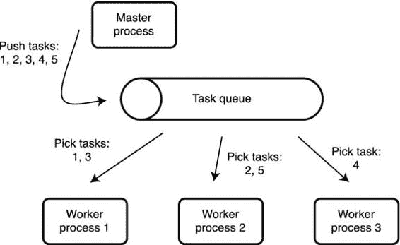
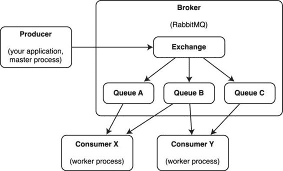

第十二章


分布式信息处理系统

在前三章中，我们构建了一个基于 XML-RPC 消息协议的分布式监控系统。虽然它工作得很好，但它可能缺少一些功能，如消息优先级和任务调度。我们可以在已经编写的代码中添加额外的功能，但是我将向您展示如何用一个更健壮、功能更全的基于分布式任务队列 Celery 的系统来替换定制的消息传递平台。

消息和任务队列快速介绍

任务队列是一种强大的机制，允许您将工作分割成更小的块，将这些工作块发送到大量的机器，然后收集结果。根据您可以使用的机器数量，您可能会显著增加处理时间。

任务排队系统

从本质上讲，任务排队机制相对简单。主进程生成一个或多个需要处理的任务，然后将指令推入任务队列。一个(或多个)工作进程监视队列，一旦发现新任务，它就从队列中获取它。当任务完成时，结果(如果有)被发送回主进程。该过程如图 12-1 所示。



[图 12-1](#_Fig1) 。任务排队

这种机制可用于将任务分配给在单台机器或多台机器上运行的多个进程。

理解任务队列是在多个进程之间分配任务的一种方法是很重要的。它不是特定的实现或产品。这种任务分配可以应用于多个级别。例如，您可以使用一个线程作为主进程，多个线程作为辅助进程来创建应用级任务队列。然后线程可以使用共享变量在它们之间分配任务。另一个例子是主机级任务分发。一台主机可以是主控主机，它生成任务并将任务下推到处理这些任务的工作主机。一个实际的例子是 web 邮件系统，其中前端(主节点)节点接受用户输入并将其发送到邮件处理节点(工作节点)，然后邮件处理节点充当邮件中继并将电子邮件发送出去。再者，任务队列甚至根本不需要和电脑有关系！例如，团队领导可以在便利贴上写下一天的任务，贴在白板上，然后团队成员可以在一天中拿起它们，做笔记上写的事情。

如果希望异步执行长时间运行的任务，任务队列非常有用。您需要任务被处理，但不需要马上得到结果。一个很好的例子是从 web 表单发送电子邮件。电子邮件可能需要一段时间才能发送，尤其是在远程邮件服务器不可用并且您需要多次重试发送邮件的情况下。同时，你不希望用户一直等到邮件发出。因此，web 前端从用户那里获取 web 表单数据，将其发送到邮件中继进行进一步处理，并指示用户电子邮件正在发送。

高度分布式任务队列的一个例子是 Google 的 Appengine 任务队列。你可以在[https://developers . Google . com/app engine/docs/python/task queue](https://developers.google.com/appengine/docs/python/taskqueue)上阅读关于实现的更多信息。任务队列的其他例子有 Resque(【https://github.com/resque/resque】)是 Ruby 应用的任务队列库；jesque(【https://github.com/gresrun/jesque】)，这是一个用 Java 语言实现的 Resque 芹菜([http://www.celeryproject.org](http://www.celeryproject.org))，我们将在本章中讨论。

理解任务队列是多个协同工作的组件的整体是非常重要的:主进程，它通常结合多个子系统，例如任务执行调度器；消息队列，用于通信目的；和实现任务执行算法的工作进程。

消息队列系统

任务队列中的核心组件之一是消息队列。消息队列是一种在进程和系统之间共享信息的机制。任务队列使用消息队列在任务队列系统的不同组件之间进行通信。例如，当主进程需要向一个工作进程发送任务时，它使用消息队列来传递消息。在前面的手动任务队列示例中，白板扮演消息队列的角色。团队领导(主流程)使用白板(消息队列)向团队成员(工作流程)发送消息(在便利贴上手写的文本)。

有时您会发现消息队列系统被称为消息代理。有许多不同的消息队列；一些流行的例子是:

*   ActiveMQ([http://activemq.apache.org](http://activemq.apache.org))
*   rabbitq(http://www . rabbitq . com
*   zeromq(t0)} http://zerocq . org 的缩写形式的缩写形式为 zerocq(零、零、零、零、零、零、零、零、零、零、零、零、零、零、零、零、零、零、零、零、零、零、零、零、零、零

通常，消息队列和任务队列是非常松散耦合的。例如，Celery 可以使用以下消息代理之一:

*   rabbit MQ([http://www.rabbitmq.com](http://www.rabbitmq.com)，推荐给芹菜的消息队列)
*   Redis ( [http://redis.io](http://redis.io) ，一个分布式键值存储)
*   mongo DB([http://www.mongodb.com](http://www.mongodb.com)，一个流行的 NoSQL 分布式数据库)
*   豆茎([http://kr.github.io/beanstalkd](http://kr.github.io/beanstalkd)，一个任务队列)
*   亚马逊 SQS([http://aws.amazon.com/sqs/](http://aws.amazon.com/sqs/)，消息队列即服务，由亚马逊提供)
*   沙发数据库([http://couchdb.apache.org](http://couchdb.apache.org)，一个 JSON 文档数据库)
*   zookeeper([http://zookeeper.apache.org/](http://zookeeper.apache.org/)，一个分布式协调服务，提供诸如命名、配置管理、同步等服务)
*   Django DB([https://www.djangoproject.com](https://www.djangoproject.com)，Django ORM(对象关系映射器)，这是 Django 支持的任何数据库之上的抽象层)
*   SQLAlchemy([http://www.sqlalchemy.org](http://www.sqlalchemy.org)，另一个 ORM 工具包，在最流行的 SQL 数据库之上提供对象抽象)
*   铁 MQ([http://www.iron.io/mq](http://www.iron.io/mq)，一个消息队列)

如您所见，您并不局限于专用的消息队列；您可以从各种各样的专用工具和通用数据库中进行选择。

设置 Celery 服务器和客户端

在这一节中，我们看看如何安装和配置 Celery 及其所有要求。我们还会看到一些基本的任务队列使用模式。

安装和设置 RabbitMQ

我将使用推荐的消息队列 RabbitMQ，它是受支持平台中功能最全、最稳定的。除非您有非常好的理由使用不同的平台，否则也要在部署中使用 RabbitMQ。如果您正在构建大型系统，请小心，因为用许多不同的队列扩展 RabbitMQ 可能会有问题；您可能需要先做一些性能测试。

RabbitMQ 在大多数流行的 Linux 发行版上都可以作为一个包获得。如果您使用的是基于 RedHat 的系统，可以使用以下命令安装 RabbitMQ:

```py
$ sudo yum install rabbitmq-server
```

安装好软件包后，启动它并检查它是否正常运行:

```py
$ sudo systemctl start rabbitmq-server
$ sudo systemctl status rabbitmq-server
rabbitmq-server.service - RabbitMQ broker
   Loaded: loaded (/usr/lib/systemd/system/rabbitmq-server.service; disabled)
   Active: active (running) since Sun 2014-07-20 12:30:22 BST; 25s ago
  Process: 304 ExecStartPost=/usr/lib/rabbitmq/bin/rabbitmqctl wait /var/run/rabbitmq/pid (code=exited, status=0/SUCCESS)
  Process: 32746 ExecStartPre=/bin/sh -c /usr/lib/rabbitmq/bin/rabbitmqctl status > /dev/null 2>&1 (code=exited, status=2)
 Main PID: 303 (beam)
   CGroup: /system.slice/rabbitmq-server.service
           ├─303 /usr/lib64/erlang/erts-5.10.4/bin/beam -W w -K true -A30 -P 1048576 -- -root /usr/lib64/erlang -progname erl -- -home /var/lib/rabbitmq -- -pa /usr/lib/rabbitmq/lib/rabbitmq_server-3.1.5/sbin/../ebin -noshell -noinput -s rabbit boot -sname rabbit@fedora -boot start...
           ├─334 /usr/lib64/erlang/erts-5.10.4/bin/epmd -daemon
           ├─403 inet_gethost 4
           └─404 inet_gethost 4

Jul 20 12:30:19 fedora.local rabbitmq-server[303]: RabbitMQ 3.1.5\. Copyright (C) 2007-2013 GoPivotal, Inc.
Jul 20 12:30:19 fedora.local rabbitmq-server[303]: ##  ##  Licensed under the MPL.  See http://www.rabbitmq.com/
Jul 20 12:30:19 fedora.local rabbitmq-server[303]: ##  ##
Jul 20 12:30:19 fedora.local rabbitmq-server[303]: ##########  Logs: /var/log/rabbitmq/rabbit@fedora.log
Jul 20 12:30:19 fedora.local rabbitmq-server[303]: ######  ##  /var/log/rabbitmq/rabbit@fedora-sasl.log
Jul 20 12:30:19 fedora.local rabbitmq-server[303]: ##########
Jul 20 12:30:22 fedora.local rabbitmq-server[303]: Starting broker... completed with 0 plugins.
Jul 20 12:30:22 fedora.local rabbitmqctl[304]: ...done.
Jul 20 12:30:22 fedora.local systemd[1]: Started RabbitMQ broker.
Jul 20 12:30:46 fedora.local systemd[1]: Started RabbitMQ broker.
```

如果您没有看到任何错误消息，这意味着 RabbitMQ 已经成功安装并启动。真的就这么简单！如果您需要对服务器配置进行任何更改(例如，更改服务器绑定的端口)，您可以创建一个名为/etc/rabbitmq/rabbitmq.conf 的配置文件。有关配置参数的更多详细信息，可以在位于[http://www.rabbitmq.com/configure.html](http://www.rabbitmq.com/configure.html)的 rabbitmq 官方文档中找到。

安装和设置芹菜

一旦 RabbitMQ 服务器安装在主节点和工作节点上，就可以继续进行 Celery 的安装和配置了。请记住，主服务器和辅助服务器不一定需要位于不同的主机上；出于测试目的，两者都可以设置在同一台主机上。

大多数流行的 Linux 发行版上都有 Celery 软件包。在基于 RedHat 的系统上，您可以通过运行以下命令来安装 Celery:

```py
$ sudo yum install python-celery
```

在基于 Debian 的系统上，包名是相同的:

```py
$ sudo apt-get install python-celery
```

但是，我建议从 PyPI 存储库中安装 Celery 包，因为它将包含最新的稳定版本:

```py
$ sudo pip install celery
```

创建芹菜系统用户和组

首先，您应该确保在所有工作节点上自动启动 Celery 进程。这不是必需的，您可以在每次需要时手动启动 Celery 进程，但是这种方法不可伸缩。以下示例假设您正在使用基于 RedHat 的系统，并且 systemd 控制系统服务。如果您使用的是不同的 Linux 发行版，那么您必须调整示例。

出于安全原因，不建议您以 root 用户身份运行 Celery。更好的方法是创建一个专用的用户和组，并在这些凭证下运行 Celery 守护程序。

要创建新用户并检查其 UID 和 GID，请运行以下命令:

```py
# useradd --system -s /sbin/nologin celery
# id celery
uid=987(celery) gid=984(celery) groups=984(celery)
```

创建芹菜项目目录和示例应用

所有 Celery 应用必须位于一个项目目录中，该目录可以按如下方式创建:

```py
# mkdir /opt/celery_project
# chown celery:celery /opt/celery_project
```

您还需要一个示例应用来测试您的配置。我们将在本章的后面查看应用开发的具体细节，但现在让我们创建一个名为/opt/celery_project/tasks.py 的文件，其内容如下:

```py
from celery import Celery

app = Celery('tasks', broker='amqp://guest@localhost//', backend='amqp')

@app.task
def hello(name='Anonymous'):
    return "Hello, %s" % name
```

 **注意**如果你用的是比 3.1 更早的芹菜版本，用‘芹菜’对象名代替‘app’；早期版本希望找到这个特定的名称。在 3.1 及更高版本中，名称不再重要。

创建所需的系统目录

需要两个目录:一个用于存储日志文件，另一个用于存储临时 PID 文件。如果使用以下内容创建配置文件/usr/lib/tmpfile.d/celery.conf，systemd 进程会自动创建这些目录:

```py
d /run/celery 0755 celery celery -
d /var/log/celery 0755 celery celery -
```

创建系统配置文件

systemd 进程管理守护进程需要一个名为/var/lib/systemd/system/celery . service 的系统定义文件，其内容如下:

```py
[Unit]
Description=Celery workers
After=network.target

[Service]
Type=forking
User=celery
Group=celery
EnvironmentFile=-/etc/conf.d/celery
WorkingDirectory="${CELERYD_CHDIR}"
ExecStart=/bin/celery multi start –A "${CELERY_APP}" "${CELERYD_NODES}" \
          --pidfile="${CELERYD_PID_FILE}" \
          --logfile="${CELERYD_LOG_FILE}" --loglevel="${CELERYD_LOG_LEVEL}"
ExecStop=/bin/celery multi stopwait –A "${CELERY_APP}" "${CELERYD_NODES}" \
          --pidfile="${CELERYD_PID_FILE}"
ExecReload=/bin/celery multi restart –A "${CELERY_APP}" "${CELERYD_NODES}" \
           --pidfile="${CELERYD_PID_FILE}" \
           --logfile="${CELERYD_LOG_FILE}" --loglevel="${CELERYD_LOG_LEVEL}"

[Install]
WantedBy=multi-user.target
```

它需要名为/etc/conf.d/celery 的环境配置文件，包含以下内容:

```py
CELERY_APP="tasks"
CELERYD_NODES="worker"
CELERY_BIN="/bin/celery"
CELERYD_PID_FILE="/run/celery/%n.pid"
CELERYD_LOG_FILE="/var/log/celery/%n.log"
CELERYD_LOG_LEVEL="DEBUG"
CELERYD_USER="celery"
CELERYD_GROUP="celery"
```

创建这些文件后，您可以使用以下命令启用并启动该服务:

```py
# systemctl enable celery
# systemctl start celery
```

如果一切正常，您应该在日志文件/var/log/celery/celery.log 中看到以下输出:

```py
[2014-07-20 19:00:52,594: WARNING/MainProcess] /usr/lib/python2.7/site-packages/celery/apps/worker.py:161: CDeprecationWarning:
Starting from version 3.2 Celery will refuse to accept pickle by default.

The pickle serializer is a security concern as it may give attackers
the ability to execute any command.  It's important to secure
your broker from unauthorized access when using pickle, so we think
that enabling pickle should require a deliberate action and not be
the default choice.

If you depend on pickle then you should set a setting to disable this
warning and to be sure that everything will continue working
when you upgrade to Celery 3.2::

    CELERY_ACCEPT_CONTENT = ['pickle', 'json', 'msgpack', 'yaml']

You must only enable the serializers that you will actually use.

  warnings.warn(CDeprecationWarning(W_PICKLE_DEPRECATED))
[2014-07-20 19:00:52,612: INFO/MainProcess] Connected to amqp://guest:**@127.0.0.1:5672//
[2014-07-20 19:00:52,620: INFO/MainProcess] mingle: searching for neighbors
[2014-07-20 19:00:53,628: INFO/MainProcess] mingle: all alone
[2014-07-20 19:00:53,638: WARNING/MainProcess] worker@fedora.local ready.
```

有一个警告消息，我们将很快解决，但除此之外，启动过程看起来很好。您还可以使用命令行工具来检查系统的运行状况:

```py
# celery status
worker@fedora.local: OK

1 node online.
# celery inspect ping
-> worker@fedora.local: OK
        pong
```

测试对芹菜服务器的访问

在我们继续之前，让我们通过从一个简单的 Python 应用连接到 Celery 服务器来确保一切正常。您将导入我们之前编写的应用代码，因此请确保在/opt/celery_project/目录中运行以下命令:

```py
# cd /opt/celery_project/
# python
Python 2.7.5 (default, Feb 19 2014, 13:47:28)
[GCC 4.8.2 20131212 (Red Hat 4.8.2-7)] on linux2
Type "help", "copyright", "credits" or "license" for more information.
>>> from tasks import hello
>>> result = hello.delay('World')
>>> result
<AsyncResult: 926aabc8-6b1b-424e-be06-b15bcf92137e>
>>> result.id
'926aabc8-6b1b-424e-be06-b15bcf92137e'
>>> result.ready()
True
>>> result.result
'Hello, World'
>>> result.status
'SUCCESS'
>>>
```

芹菜基础知识

在这一节中，我们来看看芹菜的基本用法。

典型芹菜应用的布局

事实上，每个基于 Celery 的应用都是一个至少由两个组件组成的系统:一个生成工作并消耗结果的主进程，以及一个执行工作请求的工作进程。通常情况下，您会有多个工作进程，但您至少需要一个。正如您在前面发现的，这些进程之间的通信是通过消息队列完成的，因此这些进程不需要驻留在同一个物理操作系统上。

理解主进程和工作进程都需要访问正在执行的代码是很重要的。例如，如果您编写一个 web 邮件处理系统，您将编写一个处理发送邮件的库。相同的库需要在主机器和所有工作机器上可用。只有工作机器将执行代码，但是主机器需要能够检查代码，以便它能够通过发送任务名称和正确的参数来适当地构造工作请求。

这些模块的分发完全由您决定。芹菜不提供这样的功能。您可以使用 Celery 来分发这些模块，就像我们对定制的 XML-RPC 系统所做的那样，但是通常这是不可取的。如果你想自动化一个模块部署过程，最好看看配置管理工具，比如 ansi ble([http://www.ansible.com/](http://www.ansible.com/))、salt stack(【http://www.saltstack.com)、Puppet()或者 Chef([http://www.getchef.com](http://www.getchef.com))。

创建任务模块

在上一节中，当我们对 Celery 设置进行基本测试时，我们创建了一个名为 tasks.py 的文件，其中包含一个方法。当您编写更大的应用时，您将有不止一个任务方法可供主流程使用。您可以将所有任务保存在一个文件中，但是该文件可能很快变得无法管理。因此，建议创建一个专用模块来封装所有任务。

工作进程和主进程应用文件

首先，删除前面创建的 tasks.py 文件，然后在/opt/celery_project 中创建以下目录结构。现在创建空文件，因为您将在本例中填充它们。这里，您创建了一个简单的 Celery 模块，它有两组任务——一组用于算术运算，一组用于几何运算:

```py
# pwd
/opt/celery_project
# tree
.
├── calculator.py
└── celery_app
    ├── celeryconfig.py
    ├── celery.py
    ├── __init__.py
    └── tasks
        ├── arithmetics.py
        ├── geometry.py
        └── __init__.py

2 directories, 7 files
```

让我们讨论一下如何使用每个文件和目录:

*   第一个文件 calculator.py 是实际运行的应用，它提交任务进行处理。这是主流程。
*   名为 celery_app/的目录是一个 Python 模块，它将包含与 celery 后台任务处理相关的所有文件。
*   Celery.py 是 Celery 应用的主文件，它初始化 Celery 应用并设置其配置。
*   Celeryconfig.py 是一个配置文件。是芹菜. py 进口使用的。
*   __init__。py 是一个空文件，它的唯一目的是表明这个目录是一个 Python 模块。
*   子目录 tasks/是包含按公共属性分组的特定子模块的子模块，例如，所有算术运算都放在 arithmetics.py 子模块中。

这可能看起来像是一个不必要的复杂布局，但实际上它并不难设置，如果您的应用变得更大，它会提供很大的灵活性。

芹菜配置文件概述

通常，Celery 应用不需要太多的配置。您必须告诉它在哪里寻找新的作业(这通常是运行在相同主机上的消息队列)，在哪里存储结果(通常是相同的消息队列)，并且可能提供一些特定于环境的设置。管理 Celery 配置文件最简单的方法是将所有配置项放在一个单独的文件中，并从主应用导入它。因此，在我们的例子中，配置文件名为 celeryconfig.py，它包含清单 12-1 中的设置。

[***清单 12-1***](#_list1) 。芹菜配置设置

```py
CELERY_TASK_SERIALIZER = 'json'         # Only allow object serialization using JSON
CELERY_RESULT_SERIALIZER = 'json'       # Previously the default was Python pickle objects,
CELERY_ACCEPT_CONTENT = [ 'json', ]     #   but they are not secure, and will be discontinued
BROKER_URL = 'amqp://guest@localhost//' # Where to look for new jobs
CELERY_RESULT_BACKEND ='amqp'           # Where to send job results
CELERY_IMPORTS = ('celery_app.tasks.geometry',     # Modules that contain Celery tasks
                  'celery_app.tasks.arithmetics',) #
CELERY_TASK_RESULT_EXPIRES=3600         # How long keep tasks results before purging them
```

你可以在官方的芹菜文档网页上找到配置选项的完整列表，[http://docs.celeryproject.org/en/latest/configuration.html](http://docs.celeryproject.org/en/latest/configuration.html)；然而，最常用的项目在[表 12-1](#Tab1) 中列出。

[表 12-1](#_Tab1) 。一些最常用的芹菜配置物品

| 

配置项目

 | 

描述

 |
| --- | --- |
| 芹菜 _ 时区 | 默认情况下，芹菜采用 UTC 时区；如果需要在邮件时间戳中设置特定于位置的时区，可以修改此设置。要获得最新的时区名称列表，请查看[http://en.wikipedia.org/wiki/List_of_tz_database_time_zones](http://en.wikipedia.org/wiki/List_of_tz_database_time_zones)。 |
| CELERYD _ 并发 | 该设置允许您指定允许 Celery workers 运行多少个并发进程或线程。默认情况下，该设置被设置为可用 CPU 的数量；然而，这是非常保守的。除非您正在进行大量的计算，并且这些进程确实受到 CPU 的限制，否则您至少应该将这个数字增加一倍。如果您的进程主要是 I/O 绑定的，那么您通常可以比 CPU 的数量多 5 到 10 倍。 |
| 芹菜 _ 结果 _ 后端 | 默认情况下，Celery 不使用任何后端来存储任务结果。在大多数情况下，这可能是可以接受的行为。例如，如果您正在运行发送电子邮件的后台任务，您可能希望工作进程更新数据库中指示任务状态等的多个表。您可以将主流程视为分派任务的调度程序，并不真正关心任务发生了什么。更新系统取决于任务流程。这是一种有效的方法，尤其是当工作进程需要更新运行系统的许多方面时。然而，另一种方法是由主进程处理数据。在这种情况下，主进程向长时间运行的工作进程发出指令，然后获取结果，或者自己更新系统状态，或者将任务交给另一个工作进程。您选择哪个选项取决于系统和您的偏好。我的建议是将任务明确分为两类:一类是与外部系统(邮件服务器、文件服务器、web 服务器等)交互的任务。)和另一个处理内部系统状态(更新内部数据库、增加计数器等)。).所选择的后端系统不需要与用于通信的平台相同。因此，您可以使用 RabbitMQ(设置值为' amqp ')进行消息排队，并将结果存储在 redis 数据库中(设置值为' Redis ')。 |
| 芹菜 _ 结果 _ 序列化程序 | 当结果由工作进程生成时，它们需要存储在您使用以前的设置选择的任何后端媒体中。默认是 Python 的 pickle 序列化方法。简而言之，pickle 使用字节码序列化对象，然后在接收端评估这个字节码，而不首先验证它的安全性。因此，如果有人设法发送恶意数据，假装来自工作进程，您的主进程可能会执行收到的代码；这可以用来侵入你的系统。因此，默认值将会改变，如果不指定不同的序列化方法，Celery 会在启动时警告您。最方便和安全的选择之一是使用 JSON 数据结构。 |
| 芹菜 _ 接受 _ 内容 | 此设置是允许的序列化程序列表。如您所知，主进程为远程执行准备数据，并将其发送给工作进程。为此，主进程使用由 CELERY_TASK_SERIALIZER 设置指定的 serialize 来序列化数据。当 worker 节点完成处理数据时，结果(如果有)在被发回之前被序列化。如何序列化由 CELERY_RESULT_SERIALIZER 设置定义。CELERY_ACCEPT_CONTENT 没有说如何序列化任务参数或者结果；它只列出允许的序列化程序。这允许您让一些 worker 节点在 JSON 中生成结果，让一些 worker 节点在 YAML 中生成结果；如果您在这里列出这两种方法，它们将被接受。 |
| 芹菜 _ 任务 _ 结果 _ 过期 | 如果您存储结果，该设置会告诉 Celery 在删除之前要保存多长时间(以秒为单位)。默认设置是保留一天的所有结果；如果将其设置为零，则不会删除结果。 |
| 芹菜 _ 任务 _ 序列化程序 | 类似于 CELERY_RESULT_SERIALIZER，但是该设置指示在向远程工作进程发送数据时使用何种序列化方法。 |
| 芹菜 _ 进口 | 这是芹菜工启动时需要导入的模块列表。Celery worker 将搜索 Celery 任务兼容函数(由 Celery.task decorator 修饰)。 |

主芹菜申请文件

该文件用于初始化 Celery 应用，并从配置模块加载配置设置。文件的内容非常简单明了，如清单 12-2 所示。

[***清单 12-2***](#_list2) 。主芹菜申请文件

```py
from __future__ import absolute_import

from celery import Celery
from celery_app import celeryconfig

app = Celery()
app.config_from_object(celeryconfig)

if __name__ == '__main__':
    app.start()
```

您可能想知道第一个 import 语句是关于什么的。这是必要的，因为我们将我们的模块命名为 celery.py，但是还有一个系统范围的包具有相同的名称。因此，当 Python 解释器看到您想要“导入芹菜”时，它会感到困惑你要本地文件还是要官方包？为了解决这种不确定性，您告诉 Python 解释器，每当出现名称冲突时，优先考虑通过 sys.path 提供的模块。这允许您为您的 Celery 应用取一个方便的名称，并且仍然导入正式的包。

芹菜任务

正如您已经从目录结构中看到的，我们将 Celery 将要管理的所有后台任务移到了一个单独的子模块目录中。在那个模块中，我们有两个文件用于不同的任务集，算术运算，如清单 12-3 所示。

[***清单 12-3***](#_list3) 。算术运算任务文件

```py
from __future__ import absolute_import

from celery_app.celery import app

@app.task
def add(a, b):
    return a + b

@app.task
def sub(a, b):
    return a - b
```

和几何运算，如[清单 12-4](#list4) 所示。

[***清单 12-4***](#_list4) 。几何运算任务文件

```py
from __future__ import absolute_import

from celery_app.celery import app

@app.task
def rect_area(h, w):
    return h * w

@app.task
def circle_area(r):
    import math
    return math.pi * r
```

系统配置

我们需要调整 systemd 配置文件，以便它们与我们当前的项目布局相匹配。您修改了/etc/conf.d/celery 文件，使其指向您的新任务模块:

```py
CELERY_APP="celery_app.celery"
```

现在，当您使用以下命令重新启动 Celery 守护程序时，它应该会获得新的 Celery 应用文件:

```py
# systemctl restart celery
```

芹菜主应用

最后，创建 Celery master 应用，并测试 Celery 进程是否正在运行，以及任务是否可用。简单的测试应用代码在 calculator.py 文件中:

```py
#!/usr/bin/env python

from celery_app import tasks

def test_tasks():
    print 'Submitting job...'
    r = tasks.geometry.rect_area.delay(2, 2)
    print r.info
    print 'Job completed'

if __name__ == '__main__':
    test_tasks()
```

如果运行它，您应该会看到以下结果:

```py
# ./calculator.py
Submitting job...
4
Job completed
#
```

路由任务

消息队列系统提供的关键特性之一是路由发送到队列的消息的能力。由于任务队列系统(如 Celery)通常基于消息队列系统(如 RabbitMQ ),所以它们继承了相同的功能。

在较小和较简单的系统中，单个队列通常就足够了，但是对于较大的系统，您需要能够将任务分组到特定的工作人员组，这就是队列的设计目的。

在消息队列系统内部

图 12-2 是一个基于 AMQP 的典型消息队列系统如何工作的高级概述。芹菜隐藏了大部分的复杂性，但是在考虑消息路由之前，至少有一个总体的概念是很好的。T3】



[图 12-2](#_Fig2) 。典型的消息队列系统架构

图 12-2 展示了消息分发机制中的主要参与者。

这是一个简化的工作流程:

*   您的应用(生产者)调用一个后台任务(在我们的示例应用中，它是:tasks . geometry . rect _ area . delay(2，2)。
*   任务细节，如名称、参数和目标队列(如果指定的话)，被序列化并提交给交换。
*   然后，作为 RabbitMQ 一部分的 Exchange 将邮件转发到一个可用的队列。该标准定义了四种不同类型的交换类型:直接(如果匹配消息的路由关键字，则将任务发送到一个队列)、扇出(将任务发送到绑定到它的所有队列)、主题(将消息发送到具有匹配路由关键字模式的所有队列)和头(基于消息头分发消息)。路由关键字是一个标记，每个消息都可以用它来标记。当队列被绑定到交换机时，它们也会被分配一个路由关键字(或路由关键字模式)。这允许 exchange 相应地路由邮件。
*   消息到达消费者进程(工作进程)，在那里消息被处理并从队列中删除。

如果你对《AMQP 议定书》的细节感兴趣，你可以在官方的 AMQP 车型描述页面找到更多信息:[http://www.openamq.org/tutorial:the-amq-model](http://www.openamq.org/tutorial:the-amq-model)。

深入讨论消息队列系统超出了本书的范围，尤其是这个主题如此广泛。如果你对消息队列系统感兴趣，我推荐 Alvaro Videla 和 Jason J. W. Williams 的*rabbit MQ in Action:Distributed Messaging for every one*。

将工作节点绑定到特定队列

对于基本的应用，您需要做两件事来有效地使用队列:首先，您需要指示 worker 节点绑定到特定的队列；然后，您需要标记任务，以便它们被正确地路由。

您在启动时将 worker 节点绑定到特定的队列。默认情况下，所有未标记的任务都被发送到名为(标记为)“celery”的默认队列中如果未指定任何要绑定到的队列，则工作进程将自动绑定到该队列。让我们创建一个新队列，并将其命名为“calc ”,以便所有与计算相关的任务都只发送给绑定到该队列的工作线程。

首先，您需要向/etc/conf.d/celery 添加新的设置:

```py
CELERY_QUEUES="calc"
```

然后，确保当芹菜守护进程启动时，它使用这个参数。您需要修改系统服务定义文件/usr/lib/systemd/system/celery . service:

```py
ExecStart=/bin/celery multi start "${CELERYD_NODES}" -A "${CELERY_APP}" -Q "${CELERY_QUEUES}" --pidfile="${CELERYD_PID_FILE}" --logfile="${CELERYD_LOG_FILE}" --loglevel="${CELERYD_LOG_LEVEL}"
```

如果您现在重新启动 Celery 进程，您将看到该进程只绑定到新队列:

```py
# ps auxww | grep celery
celery    4760  0.7  1.0 246404 21472 ?        S    14:27   0:00 /usr/bin/python -m celery worker -n worker@fedora.local -A celery_app.celery --loglevel=INFO -Q calc --logfile=/var/log/celery/worker.log --pidfile=/run/celery/worker.pid
celery    4773  0.0  0.8 245600 17680 ?        S    14:27   0:00 /usr/bin/python -m celery worker -n worker@fedora.local -A celery_app.celery --loglevel=INFO -Q calc --logfile=/var/log/celery/worker.log --pidfile=/run/celery/worker.pid
```

那么，既然 worker 不再绑定到默认队列，那么如果您运行 calculator.py 应用 会发生什么情况呢？记住，默认情况下任务是没有标记的，因此它们都进入默认的“芹菜”队列，但是现在没有任何东西监听它。让我们试着运行几次:

```py
# ./calculator.py
Submitting job...
None
Job completed
#
# ./calculator.py
Submitting job...
None
Job completed
#
```

没什么好惊讶的，是吧？没有工人在“芹菜”队列上工作，所以任务没有被处理。但是提交的任务实际上发生了什么呢？需要使用 rabbitmqctl 命令直接询问 rabbitmqctl】

```py
# rabbitmqctl list_queues
Listing queues ...
1159cf27f68247da9885495e63c7dd1c        0
calc    0
celery  2
celeryev.601d558c-6354-4265-9704-a225948bb052   0
e289f4c20f754489944f75e1ee7c8ac6        0
worker@fedora.local.celery.pidbox       0
...done.
```

您可以看到有两个队列，一个名为“celery”，一个名为“calc”“calc”队列中没有消息，但是“celery”队列中有两条消息。

为了确保你的请求不会被发送到黑洞，你需要给它们做标记。这就像指定要将任务发送到的队列名称一样简单。您修改了 calculator.py 文件，以便任务调用在其中有一个队列名称(不幸的是，我们不能使用“延迟”快捷方式):

```py
r = tasks.geometry.rect_area.apply_async((2, 2), queue="calc")
```

如果您再次运行 calculator.py，您将会看到任务现在已经得到处理，正如预期的那样:

```py
# ./calculator.py
Submitting job...
4
Job completed
#
```

指定队列的另一种方法是在 Celery 应用文件中(在我们的示例中，这是 celeryconfig.py):

```py
from kombu import Queue
CELERY_QUEUES = ( Queue("calc"), )
```

这样，您可以在所有处理机器上保持相同的 systemd 配置文件，即使它们绑定到不同的队列。

发送广播消息

默认的消息队列行为是一条消息只能到达一个收件人。这对于发送电子邮件(您希望只发送一封电子邮件！)或执行计算(不需要在所有可用的服务器上计算相同的东西)。但是，有时您需要向所有可用的服务器发送消息，监控系统就是一个例子。您希望告诉所有服务器运行它们的检查并相应地更新状态。

为了实现这个目标，芹菜有一个发送广播消息的机制。这意味着发送到队列的消息将被路由到所有监听该队列的工作线程。

同样，这可以在 **celeryconfig.py 文件中定义；**在示例中，您定义了两个队列，一个用于“正常”计算，一个用于“广播”计算:

```py
from kombu import Queue
from kombu.common import Broadcast

CELERY_QUEUES = ( Queue("calc"),
                  Broadcast("broadcast_calc"), )
```

还要修改 calculator.py 应用，以便将任务提交到两个不同的队列:

```py
def test_tasks():
    print "Submitting job..."
    r = tasks.geometry.rect_area.apply_async((2, 2), queue="calc")
    print r.info
    print "Job completed"
    print "Submitting broadcast job..."
    r = tasks.arithmetics.add.apply_async((1, 1), queue="broadcast_calc")
    print r.info
    print "Job completed"
```

如果再次运行示例代码，应该会得到两个结果:

```py
# ./calculator.py
Submitting job...
4
Job completed
Submitting broadcast job...
2
Job completed
```

好的，这是我们所期望的，但是让我们想一想:如果您提交一个任务，那么队列中只有一个任务，但是它被转发给所有的工人。当工人回复他们的结果时，他们会发送一条消息，用简单的英语可以翻译成这样:“ID 为 A 的任务的结果是 XYZ。”如果您有多个任务 ID，这很好，因为您可以将任务结果与任务 ID 号相关联，但是如果您广播，那么将会有多个结果，但是只有一个任务 ID！

没有简单的方法来解决这个问题，除了忽略提交方(主进程)的结果，并确保工作进程在某个中心位置提交它们的结果——例如，在共享数据库上。

摘要

在本章中，我们简要地讨论了任务和消息队列系统。您可以使用这些知识来重写我们在前三章中编写的分布式监控应用。

*   任务队列系统用于将任务分配给工作节点，以便它们可以在后台处理。
*   任务队列系统通常使用底层消息队列系统在工作节点之间分发消息。
*   Celery 结合 RabbitMQ 可以用来调用远程 Python 函数。
*   任务可以被路由到专用队列，工作进程可以监听一组预定义的队列。这允许您拥有专门化的工作进程，并根据这种专门化对它们进行分组。
*   可以创建广播队列，让所有用户都能收到相同的消息。