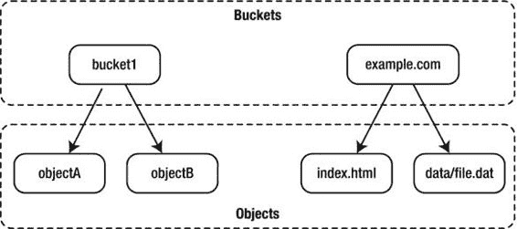
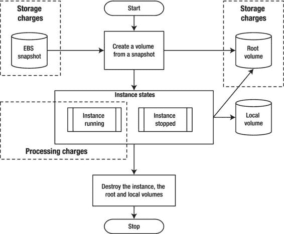

第十四章


使用亚马逊 EC2/S3 作为数据仓库解决方案

虚拟计算或云计算正变得越来越流行。有各种各样的原因，但主要是节约成本。许多大型供应商都提供云计算服务，如亚马逊、IBM、惠普、谷歌、微软和 VMWare。这些服务中的大多数都提供了 API 接口，允许控制虚拟机实例和虚拟存储设备。在本章中，我们将研究如何从您的 Python 应用程序中控制亚马逊弹性计算云(EC2)和亚马逊简单存储系统(S3)。

指定问题和解决方案

首先，我们需要了解这个解决方案在什么情况下适用。尽管按需计算是一种方便的方法，可以节省大量成本，但它并不适用所有情况。在本节中，我们将简要讨论按需计算可以成功使用的情况。

问题

让我们想象一个典型的小型网络创业公司。该公司在互联网上提供一些服务。用户群相对较小但在稳步增长，而且在地理上分布均匀，这意味着系统一天 24 小时都很忙。

该系统是典型的两层设计，由两个应用程序节点和两个数据库节点组成。应用服务器运行的是部署在 Apache Tomcat 应用服务器上的内部构建的 Java 应用程序，并使用 MySQL 数据库来存储数据。web 应用程序和数据库服务器相当繁忙，因此被认为不适合在虚拟化平台上运行。所有四台服务器都是从服务器托管公司租赁的，托管在远程数据中心。

现在，这个设置满足了当前的大部分需求，并且考虑到缓慢的用户基础增长，它应该在相当长的时间内保持不变。该公司的扩展策略是根据需要添加更多的应用程序和数据库节点。应用程序设计允许近乎线性的水平可伸缩性。

然而，随着公司的发展，所有者决定在市场研究上投入更多。为了更好地了解用户行为，更有针对性地进行销售，公司需要分析存储在数据库中的数据。然而，正如我们已经知道的，数据库服务器已经非常繁忙，运行额外的查询肯定会降低整个应用程序的速度。仅仅为了数据分析任务而添加新的数据库服务器是不划算的，因为这需要相当大的初始投资，并且会增加每月的维护成本。此外，分析很少执行，新系统大部分时间都处于闲置状态。

我们创业公司面临的第二个问题是缺乏备份策略。目前，所有数据都存储在数据库服务器上，尽管服务器是冗余的，但它们仍然位于同一场所。这些数据肯定应该在远程位置进行备份。

我们的解决方案

一种策略是使用按需计算解决方案，比如 Amazon EC2。由于该公司只是偶尔需要处理能力，因此可以在必要时创建虚拟服务器来执行计算。当计算完成后，公司可以安全地销毁虚拟服务器。在这种情况下，公司只为服务器处于活动状态的时间付费。在撰写本文时，这些虚拟实例的成本从每小时 0.02 美元到 6.82 美元不等，具体取决于使用的内存和分配的虚拟 CPU 数量。

如果每周进行一次数据分析，每次花费 8 小时，每月总成本不会超过 10 美元(假设一个超大高内存实例目前定价为每小时 0.28 美元)。这比公司决定租赁一台普通服务器的成本要低得多。

但是请记住，初创公司面临的第二个问题是缺少远程备份。Amazon 提供了一个高可用性和可伸缩性的存储解决方案:它的简单存储系统。与 EC2 类似，您只需为使用的内容付费，在 S3 上可以存储的内容没有限制。在撰写本文时，S3 的基本定价是每月每千兆字节 0.03 美元。如果你将数据上传到 S3，数据传输是免费的，但数据传出去(例如，如果你想从备份恢复)将花费你每 GB 0.12 美元。

这就是你要小心的地方，因为总价加起来可能相当大。1tb 的信息会让你每月花费 30 美元。考虑到当前的存储价格，这听起来可能是一大笔钱(1TB 外部 USB 价格为 60 美元，这是一次性费用)，但请记住，您不仅获得了存储设备，还获得了数据保护。目前，标准的亚马逊 S3 提供“给定年份内 99.999999999%的持久性和 99.99%的可用性”([http://aws.amazon.com/s3/](http://aws.amazon.com/s3/))。

设计规范

为了适应我们之前提出的所有需求和约束，我们将构建一个应用程序，该应用程序将在 EC2 中创建一个新的虚拟机实例。虚拟机将运行一个 MySQL 数据库服务器实例，并可用于接受外部连接。数据库文件将存储在一个单独的、高度可用的卷上，即弹性块存储卷。

应用程序将分三个阶段运行:初始化、处理和取消初始化。在初始化阶段，应用程序创建一个虚拟机，将卷设备连接到该虚拟机，并启动 MySQL 服务器。处理阶段取决于您的处理要求；它通常包含数据传输和数据处理任务。我们不打算详细讨论这个阶段，因为它确实取决于您自己的要求。最后，在取消初始化阶段，我们关闭远程 MySQL 实例，分离卷，创建快照，并销毁虚拟机。

创建快照的原因是为了在需要检查特定时间点的数据状态时，有一个可以恢复的参考点。你可以把它看作一个版本控制系统。显然，每个快照都会增加数据使用量，从而增加成本，因此您必须手动控制想要维护的快照映像的数量。

亚马逊 EC2 和 S3 速成班

在写这篇文章的时候，没有多少关于亚马逊 EC2 和 S3 的最新书籍。原因是这两种技术(尤其是 EC2)都在快速发展，这使它们成为快速移动的目标。有一些好书，可惜已经略显过时。

关于亚马逊网络服务的一个很好的手册是 James Murty 的《编程亚马逊网络服务:S3、EC2、SQS、FPS 和 simple db 》( O ' Reilly Media，2008)。这本书很好地概述了这些技术以及详细的 API 规范。另一个更加关注运营方面的文本是乔治·里斯(O'Reilly Media，2009)的*云应用架构:在云中构建应用和基础设施*。

您还可以在每个 web 服务的文档页面上找到大量信息:

*   亚马逊 EC2:[http://aws.amazon.com/documentation/ec2/](http://aws.amazon.com/documentation/ec2/)
*   亚马逊 S3:[http://aws.amazon.com/documentation/s3/](http://aws.amazon.com/documentation/s3/)

很难在一章中包含所有关于这些 web 服务的必要信息，所以我将描述一些基本概念。话虽如此，本章将为您提供足够的信息来开始使用 Amazon EC2 和 S3 web 服务，并且您可以在熟悉基本原则的基础上进行更多的探索。

理解这两个系统(EC2 和 S3)主要是 web 服务，并且被设计成使用标准的 web 服务协议(如 SOAP 和 REST)来控制，这一点很重要。许多工具为这些服务提供了用户友好的界面，但是它们都使用上述协议与 AWS (Amazon Web Services)进行交互。

如果你想使用这些服务，你必须在 http://aws.amazon.com/注册。您不必为每个服务创建一个帐户；事实上，你可以使用现有的亚马逊商店帐户，但你必须单独注册每项服务。

身份验证和安全性

当您使用 EC2 和 S3 服务时，您必须向 AWS 系统验证您自己。有不同的方法可以做到这一点，不同的服务需要您提供略有不同的信息。有时，这可能会造成混乱，不知道应该在哪里使用哪种方法，更重要的是，不知道从哪里获取这些信息。因此，在研究每个单独的服务之前，我将提供关于 AWS 中使用的安全性和认证机制的基本信息。

帐户标识符

每个账户都有一个唯一的 *AWS 账户 ID* 号，由 12 位数字组成，看起来像 1234-5678-9012。每个帐户还有一个指定的*规范用户 ID* ，它是一个包含 64 个字母数字字符的字符串。

AWS 帐号用于在不同帐户之间共享对象。例如，如果您想授权其他人访问您的虚拟机映像，您必须知道该人的 AWS 帐户 ID。该 ID 用于除 S3 之外的所有 AWS 服务。

规范用户 ID 仅在 S3 服务中使用。与 AWS 帐户 ID 类似，它的主要目的是控制访问。

你可以通过进入[http://aws.amazon.com/account/](http://aws.amazon.com/account/)，点击“安全证书”，并向右滚动到网页底部来获取这些信息。包含所需信息的部分称为“帐户标识符”

访问凭据

每个 REST API 调用都会用到访问凭证。这些键也在亚马逊 S3 SOAP 调用中使用。

访问凭证分为两部分。第一部分是*访问密钥 ID* ，用于识别请求者身份。第二部分是*秘密访问密钥*，它用于创建一个签名，该签名随每个 API 请求一起发送。当 AWS 收到请求时，它使用相应的秘密访问密钥(只有 AWS 知道)来验证签名。只有有效的秘密访问密钥才能创建能够被 AWS 秘密密钥对应方验证的签名。这确保了请求是从有效的请求者发出的。

这两个密钥都是长字母数字字符串，可以在“访问密钥”选项卡的访问凭据部分找到。建议定期轮换钥匙。此外，确保不要向任何人透露密钥。

最佳实践是创建新用户并生成访问密钥 id 和相应的秘密访问密钥，而不是依赖根访问密钥对。这可以通过导航到用户帐户管理控制台[https://console.aws.amazon.com/iam/home?#users](https://console.aws.amazon.com/iam/home?#users)来完成。

X.509 证书

X.509 证书主要用于 SOAP API 请求。该证书由两个文件组成。第一个文件是 X.509 证书，它包含您的*公钥*和相关元数据。公钥与请求正文一起发送，用于解密请求中包含的签名信息。

证书的第二部分是*私钥*文件。该文件用于创建数字签名，它包含在每个 SOAP 请求中。你必须保守这个密钥的秘密。

当您生成 X.509 证书时，会为您提供这两个文件。然而，密匙并不存储在亚马逊系统上；因此，如果您丢失了私钥，您必须重新生成 X.509 证书。与访问凭据密钥一样，定期轮换证书是一种很好的做法。

您可以在 X.509 证书选项卡下的“访问凭据”部分生成新闻证书或上传您自己的证书。

EC2 密钥对

EC2 密钥对允许您登录到新的虚拟机实例。每个密钥对由三部分组成。

第一部分是*密钥对名称*。创建新实例时，通过选择适当的密钥对名称来选择要在该实例上使用的密钥对。

第二部分是*私钥文件*。该文件用于建立到新虚拟机实例的 SSH(安全 Shell)会话。这个密钥在任何时候都要保密和安全，这一点非常重要。拥有此密钥的任何人都可以访问您的任何虚拟机。

最后一部分是*公钥*，保存在 AWS 系统上。您不能下载此密钥。当虚拟机实例启动时，AWS 会将这个密钥复制到正在运行的系统，这允许您使用您的私有密钥文件连接到它。

您可以生成任意多的密钥对。与其他凭证不同，EC2 密钥只能从 EC2 管理控制台访问，该控制台位于[https://console.aws.amazon.com/ec2/home](https://console.aws.amazon.com/ec2/home)。

简单的存储系统概念

从用户的角度来看，在 S3 架构中只有两个实体:数据对象和存储桶。

最重要的实体是数据对象。数据对象是实际存储在 S3 基础设施上的东西。从技术上讲，每个数据对象都由两部分组成:元数据和数据负载。元数据部分描述对象，由键值对组成。作为开发人员，您可以定义任意数量的键值对。该元数据在请求的 HTTP 头中发送。第二部分是*数据有效载荷*，它是您实际想要存储在 S3 上的内容。数据有效负载大小可以是 1 字节到 5 千兆字节。您可以为对象指定任何名称，只要它符合 URI 命名标准。基本上，如果您将名称限制为字母数字字符、点、正斜杠和连字符，应该没问题。

第二个实体是 bucket 对象。*桶*是包含数据对象的实体。这些存储桶不能包含其他存储桶。对象名称空间在每个桶内；但是，bucket 名称在全局名称空间中。这意味着一个存储桶中的对象必须有唯一的名称，但是在不同的存储桶中可以有两个同名的对象。在 S3 系统中，存储桶必须具有唯一的名称，因此您可能会尝试使用其他人已经使用的存储桶名称。

每个帐户有 100 个存储桶的限制，但是每个存储桶中存储的对象的大小没有限制。

图 14-1 展示了桶和对象之间的关系，以及每个对象的一些示例名称。



[图 14-1](#_Fig1) 。亚马逊 S3 桶和物品

可以使用以下命名方案将这些名称映射到亚马逊 S3 资源 URL:

```py
http://<bucket name>.s3.amazonaws.com/<object name>
```

因此，图 14-1 中的对象可以通过以下 URL 访问(假设启用了公共访问权限):

*   [http://bucket 1 . S3 . Amazon ws . com/object](http://bucket1.s3.amazonaws.com/objectA)
*   [http://bucket 1 . S3 . Amazon ws . com/object b](http://bucket1.s3.amazonaws.com/objectB)
*   [http://example.com.s3.amazonaws.com/index.html](http://example.com.s3.amazonaws.com/index.html)
*   [http://example.com.s3.amazonaws.com/data/file.dat](http://example.com.s3.amazonaws.com/data/file.dat)

我有意在第二个桶中显示真实的 web URLs。当您导航到任何网站时，您的浏览器都会使用 HTTP GET 请求来获取页面。这些请求与用于访问 S3 系统对象的 REST 请求相同，因此您可以在 S3 上托管完整的网站(或动态站点的静态部分)。

弹性计算云概念

Amazon EC2 WS 是一个复杂的系统，它与其他服务(如 Amazon S3)交互，为您提供完整的按需计算解决方案。如果您熟悉任何虚拟化平台，如 Xen、KVM 或 VMWare，您会发现这里描述的大多数概念都非常相似。

Amazon 机器映像和实例

亚马逊机器映像(AMI) 是可以启动的操作系统的映像。该映像包含运行您的系统所需的所有包。你需要多少阿米就有多少。例如，如果您想要复制我们前面描述的两层 web 系统，您将创建两种类型的 AMI:web 服务器 AMI 和数据库 AMI。web 服务器 AMI 安装了 Apache web 服务器和 Apache Tomcat 应用服务器包。数据库 AMI 会安装一个 MySQL 实例。

公开提供了许多不同的 ami。有几个是亚马逊和其他公司提供的。一些 ami 是免费的，但是如果你想使用它们，也有一些 ami 是需要付费的。创建您自己的 AMI 的最简单的方法是克隆一个现有的 AMI 并进行您自己的修改。确保您使用来自可信来源的 AMI！

 **注意**尽量不要将你的操作建立在公开可用的 AMIs 上。当此类 AMI 的创建者决定销毁该 AMI 时，您将无法再次使用它。如果你发现一个你认为合适的 AMI，就把它复制一份，创建一个私有 AMI。即使你不打算对它做任何修改，也要这样做。这确保了每当您需要使用 AMI 时，您总是能够找到相同的 AMI。S3 上典型的 Linux AMI 大小不到 1GB。假设标准费用为每月 0.03 美元，维护自己的 AMI 每年只需花费 0.36 美元。

您不能运行 AMI 本身；您必须创建一个想要运行的 AMI 实例。该实例是运行 AMI 中安装的软件的实际虚拟机。类似的可以是 Python 类和类实例(或对象)。该类定义了方法和属性(或操作系统术语中的软件包)。当您想要运行已定义的方法时，您可以创建该特定类的对象。类似地，AMI 是虚拟机的内容，而实例是实际运行的虚拟机。

您有两种选择来存储 ami:在亚马逊 S3 存储上或者在亚马逊弹性块存储快照上(我们将在下一节讨论)。存储 AMI 的方法决定了它是如何创建的，并影响它的行为。

表 14-1 总结了这两种储存 ami 方法之间的差异。

[表 14-1](#_Tab1) 。比较 S3 和 EBS 支持的非盟特派团

| 

方面

 | 

EBS 支持的 AMI

 | 

S3 支持的 AMI

 |
| --- | --- | --- |
| 尺寸限制 | EBS 卷限制为 1TB。这对于大型安装非常方便。 | S3 支持的根分区最大可达 10GB。如果您的根分区需要比这个大，您就不能使用这个方法。 |
| 停止正在运行的实例 | 您可以停止实例，这意味着虚拟机没有运行，您也没有被收费，但是根分区没有被释放，仍然作为 EBS 卷存在。然后，您可以从同一个实例卷重新启动该实例。 | 您不能停止实例。如果您停止实例，它将被终止，根分区也被销毁；因此，存储在该分区上的所有信息都将丢失。 |
| 数据持久性 | 本地数据存储是附加的，可用于存储临时数据。停止实例时，不会分离根分区，但会丢失本地存储。您可以连接任意数量的 EBS 卷来永久存储数据。 | 本地数据存储是附加的，可用于存储临时数据。终止实例时，根分区和本地存储中的数据都会丢失。您可以连接任意数量的 EBS 卷来永久存储数据。 |
| 启动时间 | 引导时间更快，因为根分区上的数据在 EBS 卷上立即可用。但是，虚拟机在开始时会运行得较慢，因为数据是逐渐从快照中获取的。 | 启动时间较慢，因为所有数据都需要在部署到根分区之前从 S3 中检索。 |
| 创建新的图像 | 单个 API 调用将现有运行的 AMI 克隆到一个新卷。 | 您必须创建一个包含所有必需包的操作系统映像，然后创建一个映像包并将其上传到 S3。然后用捆绑的映像注册 AMI。 |
| 充电 | 将收取以下费用:

*   卷快照(完整卷大小)的费用
*   实例处于停止状态时使用的卷空间的费用(完整卷大小)
*   对正在运行的实例收费

 | 将收取以下费用:

*   存储 AMI 图像的 S3 费用(压缩)
*   对正在运行的实例收费

 |

下图显示了 S3 支持的和 EBS 支持的实例的生命周期。

图 14-2 显示了一个典型的 S3 支持的实例的生命周期。该实例是从存储在 S3 上的 AMI 映像创建的。当实例终止时，卷将被销毁，所有数据都将丢失。您只需支付 S3 商店和虚拟机的运行成本。


[图 14-2](#_Fig2) 。S3 支持的实例生命周期

图 14-3 显示了 EBS 支持的实例的典型生命周期。初始启动时，根卷是从 EBS 快照创建的。实例可以有两种不同的状态:运行和停止。当实例运行时，您需要为处理能力和 EBS 容量付费。当实例停止时，您只需为 EBS 卷付费。如果您恢复实例，它将保留其根卷中的所有数据；所以，你买单。最后，如果您选择销毁实例，卷也会被销毁，并且您不再为卷付费。



[图 14-3](#_Fig3) 。EBS 支持的实例生命周期

从图中可以看出，无论实例类型如何，它们都有一个本地存储。这个存储称为*临时存储*，它的生命周期受限于实例处于运行状态的时间。它还可以在操作系统重新启动后继续存在(有意或无意)，但是一旦您停止实例，临时设备上的所有数据都会丢失。

弹性块存储

弹性块存储(EBS) 是一个块级设备，可用于 EC2 实例。卷完全独立于实例，当实例被终止和销毁时，数据不会丢失。EBS 卷是高度可用和可靠的存储设备。

每个 EBS 卷的大小从 1GB 到 1TB 不等。您可以将多个卷附加到一个正在运行的 EC2 实例。如果需要大于 1TB 的卷，可以使用 LVM(逻辑卷管理器)等操作系统工具将多个 EBS 卷合并成一个更大的卷。

正如我提到的，EBS 卷是块设备，所以在使用它们之前，您必须在其上创建一个文件系统。或者，您可以在支持原始设备访问的应用程序中将这些设备用作原始设备。

Amazon WS 还提供了获取卷快照的功能。A ) *卷快照*是卷内容的时间点副本。拷贝将备份到 S3 存储。您可以根据需要创建任意数量的快照。第一个快照是卷的完整副本，但顺序快照仅记录最后一个快照和当前卷状态之间的差异。

拍摄卷快照的操作可以颠倒过来，您可以从现有快照创建卷。如果您必须向多个 EC2 实例提供相同的数据，这将非常有用。您还可以在 Amazon WS 帐户之间共享快照。

其他重要且有用的 EBS 功能包括:

*   调配的 IOPS，允许您预定义特定级别的 I/O 性能。
*   EBS 卷加密，可用于加密卷和保护敏感数据。
*   性能指标监控，可通过 AWS 管理控制台获得。

安全组

使用安全组控制对实例的网络访问。安全组是一组网络访问规则，类似于 IPTables 规则集。您可以定义目的网络地址、端口号和通信协议，例如 TCP 或 UDP。

当您启动一个新实例时，您可以为其分配一个或多个安全组。例如，您可以有一个允许 TCP 访问端口 3306 (MySQL 服务端口)的数据库安全组。当您创建一个新的数据库实例时，您选择这个安全组，它允许外部访问您的 MySQL 服务器。

确保您允许管理 SSH 访问您的实例；否则，您将无法连接和管理它们。

弹性 IPs 和负载平衡器

默认情况下，每个实例都会收到一个动态分配的公共 IP 地址。显然，这不适合服务于 web 内容或提供其他公共可用服务的服务器。每次重新启动实例时，您可能会获得不同的 IP 地址。

您可以请求一个*弹性 IP* 地址，它总是附属于一个 EC2 实例。这允许您为您的服务器创建一个 DNS 条目，并且该条目不需要随着时间而改变。弹性 IP 的额外好处是您可以为它分配一个故障转移实例。这意味着，如果主实例出现故障，IP 将被重新定位到另一个能够处理请求的实例。这种方法允许您实现简单的活动-备用系统配置。

您还可以使用 Amazon EC2 负载平衡功能，将传入的请求分布在两个或更多实例之间。虚拟负载平衡器的作用类似于传统的硬件负载平衡器，如 Cisco、Citrix Netscaler 或 A10 range 负载平衡器。

创建新的负载平衡器实例相对简单。您必须选择外部可用的服务端口—例如，用于 HTTP 流量的端口 80。然后，在实例上选择服务端口。例如，假设您在 EC2 实例的端口 8080 上运行一个 Tomcat 实例，但是您想通过标准的 HTTP 端口 80 提供这个服务。在这种情况下，外部服务端口 80 将被映射到内部服务端口 8080。最后，将 EC2 实例分配给负载平衡器。

用户界面

您可以通过位于[https://console.aws.amazon.com/console/home](https://console.aws.amazon.com/console/home)的 AWM 管理控制台管理所有 AWS 服务。

创建自定义 EC2 图像

现在，您已经对 EC2 和 S3 服务有了基本的了解，让我们将这些知识付诸实践。正如您已经知道的，我们需要创建一个 AMI，用于启动我们的实例。我将向您展示如何基于现有的图像创建自定义 AMI。我们将创建一个 S3 支持的 AMI 映像，因为在我们的实例中，它将更加经济高效，并且我们不需要实例停止功能。当数据被传输和处理后，我们可以销毁实例。

重用现有图像

让我们从可用图像列表中选择一个现有图像开始。在本练习中，我将使用标准的 Amazon AWS 管理控制台。

1.  我们首先从主仪表板中选择 EC2 管理控制台。我们将看到您所有 EC2 服务的概述。
2.  在左侧菜单中，我们选择“图像”部分下的“AMIs”。
3.  The default filter is to show all images that we own. We will need to select “Public Images” from the dropdown menu. For this exercise, I am going to use a CentOS 6.5 image created by a company called RightScale. This is a well-known company, which specializes in deploying mission-critical systems in the cloud environment; therefore, the images produced by them can be trusted. The AMIs ID we are looking for is ami-2e32c646\. We can find it by using a search field in the filter.

    [图 14-4](#Fig4) 是选择了 AMI 的 AWS 管理控制台的屏幕截图。

    

    [图 14-4](#_Fig4) 。选择要克隆的 AMI

4.  找到 AMI 后，我们右键单击它并选择“Launch”来启动实例启动过程。

 **注意**确保您已经创建了安全组，并启用了端口 3306 (MySQL)和 22 (SSH)以便从所有 IP 进行访问。您还需要生成一个密钥对，并将私钥下载到您的本地机器上。安全地保存私钥，并记下它的名称。在本文中，我们将这个文件称为<密钥对名> .pem

我们可以通过单击导航菜单中的 Instances 链接来监视 EC2 实例的状态。一旦实例处于*运行*状态，我们就可以使用 SSH 来连接它。单击实例名称，详细信息将显示在单独的窗口中。记下实例的公共 DNS 名称。

我们使用以下命令连接到实例:

```py
$ ssh -i <key-pair name>.pem root@<instance public DNS>
```

进行修改

我们现在准备对图像进行修改。正如您所记得的，我们的目标是使这个映像成为一个 MySQL 数据库实例，将所有文件存储在一个专用的持久 EBS 卷上。

安装附加软件包

首先，我们需要安装额外的包——特别是 MySQL 服务器。我们首先执行这一步的原因是，在挂载新的文件系统时，我们需要 MySQL 用户帐户，它是由我们现在要安装的包创建的。

我们使用 Yum 安装程序来安装附加的包:

```py
# yum install mysql mysql-server
```

该命令将从操作系统存储库中安装默认的 MySQL 包版本。在 CentOS 6.5 的情况下，这将是 MySQL 5.1 版本。(如果需要使用更高版本的 MySQL server，就必须使用 Oracle 提供的 MySQL 存储库。)要添加存储库配置，我们在安装 MySQL 包之前运行以下命令:

```py
# yum install http://repo.mysql.com/mysql-community-release-el6-5.noarch.rpm
```

 **注意**如果你决定从源代码构建 MySQL，确保你设置好了，这样当你的机器启动时它会自动启动。如果你安装的是标准的操作系统包，你就不需要担心这个问题。

创建和设置弹性块存储卷

接下来，我们将设置一个新的 EBS 卷。我们返回并单击“Create Volume ”,然后使用弹出窗口指定新卷所需的选项。

我们确保为数据分配足够的空间。可用性区域必须与正在运行的实例的可用性区域相匹配。我们可以通过单击 Instances 部分中的实例名称来找出实例的可用性区域。

根据卷的大小，卷可能需要一段时间才能变得可用。当卷变得可用时(如卷状态列所示)，我们可以将其附加到正在运行的 EC2 实例。我们右键单击卷名并选择“附加卷”菜单项。然后，我们将看到可用的运行 EC2 实例的列表。我们选择之前创建的实例。我们还将被要求为新卷指定本地设备名称。在选择设备名称(如/dev/sdf)时，我们确保该名称没有被任何其他设备使用。

当设备可用时(在实例的文件系统上创建了设备文件/dev/xvdf)，我们可以使用以下命令在其上创建文件系统:

```py
# mke2fs -F -j /dev/xvdf
...
# e2label /dev/xvdf mysqlvol
```

 **注意**你可能想知道为什么我们创建了/dev/sdf 设备，却在实际的操作系统上使用/dev/xvdf。这是因为如果设备是虚拟磁盘，较新的内核会对其进行重命名。

现在，我们创建一个新目录，它将用于挂载新创建的文件系统并更改所有权，以便 MySQL 进程能够写入卷:

```py
# mkdir /mysql-db
# chown mysql.mysql /mysql-db
# mount LABEL=mysqlvol /mysql-db
```

配置 MySQL 实例

接下来，我们将配置 MySQL 实例。我们必须更改 MySQL 配置文件(位于/etc/my.cnf 中)的内容，以便 socket 文件和所有数据文件都存储在 EBS 卷上。这确保了数据在系统重新启动时不会丢失。MySQL 配置文件的新内容在[清单 14-1](#list1) 中给出。

[***清单 14-1***](#_list1) 。将 MySQL 数据库指向新位置

```py
[mysqld]
datadir=/mysql-db
socket=/mysql-db/mysql.sock
user=mysql
symbolic-links=0

[mysqld_safe]
log-error=/var/log/mysqld.log
pid-file=/var/run/mysqld/mysqld.pid
```

现在，让我们启动 MySQL 守护进程并设置默认密码。

 **注意**显然，你必须使用比我在这个例子中使用的更安全和不可预测的东西。

```py
# chkconfig --levels 235 mysqld on
# service mysqld start
# mysqladmin -u root -S /mysql-db/mysql.sock password 'password'
# mysql -p -S /mysql-db/mysql.sock
[...]
mysql> grant all privileges on *.* to 'root'@'%' identified by 'password' with grant option;
Query OK, 0 rows affected (0.00 sec)

mysql> flush privileges;
Query OK, 0 rows affected (0.00 sec)
```

最后，我们关闭 MySQL 守护进程并卸载卷:

```py
# service mysqld stop
# umount /mysql-db
```

捆绑新 AMI

一旦我们完成了所有的修改并且对运行的实例感到满意，我们就可以通过捆绑它来创建一个新的 AMI。

首先，我们必须在 Linux 实例上安装 AMI 工具。这些说明可能会随着时间的推移而略有变化，因此我们遵循这里描述的安装说明:[http://docs . AWS . Amazon . com/AWS C2/latest/command line reference/set-up-ami-tools . html](http://docs.aws.amazon.com/AWSEC2/latest/CommandLineReference/set-up-ami-tools.html)安装 AMI 工具包，以及[http://docs . AWS . Amazon . com/AWS C2/latest/command line reference/set-up-ec2-cli-Linux . html](http://docs.aws.amazon.com/AWSEC2/latest/CommandLineReference/set-up-ec2-cli-linux.html)安装 CLI 实用程序。

我们检查安装是否成功:

```py
# ec2-ami-tools-version
1.5.3 20071010

Copyright 2008-2014 Amazon.com, Inc. or its affiliates.  All Rights Reserved.
Licensed under the Amazon Software License (the "License").  You may not use
this file except in compliance with the License. A copy of the License is
located at http://aws.amazon.com/asl or in the "license" file accompanying this
file.  This file is distributed on an "AS IS" BASIS, WITHOUT WARRANTIES OR
CONDITIONS OF ANY KIND, either express or implied. See the License for the
specific language governing permissions and limitations under the License.

# ec2-describe-regions
REGION  eu-west-1       ec2.eu-west-1.amazonaws.com
REGION  sa-east-1       ec2.sa-east-1.amazonaws.com
REGION  us-east-1       ec2.us-east-1.amazonaws.com
REGION  ap-northeast-1  ec2.ap-northeast-1.amazonaws.com
REGION  us-west-2       ec2.us-west-2.amazonaws.com
REGION  us-west-1       ec2.us-west-1.amazonaws.com
REGION  ap-southeast-1  ec2.ap-southeast-1.amazonaws.com
REGION  ap-southeast-2  ec2.ap-southeast-2.amazonaws.com
```

然后，我们必须准备我们的 X.509 证书文件，并用访问凭证设置一些环境变量。这些将在捆绑命令中使用，因此我们确保事先做好准备，以避免在运行命令时出现任何问题。从账户管理控制台([https://console.aws.amazon.com/iam/home?#security_credential](https://console.aws.amazon.com/iam/home?#security_credential) ，我们创建一个新的 X.509 证书文件(证书文件和私钥)。我们在本地将下载的文件保存为 pk.pem(私钥)和 cert.pem(证书)。当我们拥有这两个文件时，我们将它们复制到正在运行的实例的/mnt/目录中。

我们返回到正在运行的 EC2 实例上的 shell 提示符，并将以下环境变量设置为适当的值，这些值可以从帐户管理 web 页面获得:

```py
export AWS_USER=<12 digit account ID>
export AWS_ACCESS_KEY=<REST access key>
export AWS_SECRET_KEY=<REST secret access key>
```

我们现在准备捆绑正在运行的实例。我们发出下面的命令，并等待它完成。这是一个相当漫长的过程，可能需要 10 分钟:

```py
# ec2-bundle-vol -u $AWS_USER -k /mnt/pk.pem -c /mnt/cert.crt -p CentOS-6.5-x86_64-mysql -r x86_64
Setting partition type to bundle "/" with...
Auto-detecting partition type for "/"
Partition label detected using parted: "loop"
Using partition type "none"
Copying / into the image file /tmp/CentOS-6.5-x86_64-mysql...
Excluding:
         /proc/sys/fs/binfmt_misc
         /sys
         /proc
         /dev/pts
         /dev
         /media
         /mnt
         /proc
         /sys
         /tmp/CentOS-6.5-x86_64-mysql
         /mnt/img-mnt
```

 **注意** *rsync* 似乎成功了，但退出时出现错误代码 23。这可能意味着您的 rsync 版本是针对定义了 *HAVE_LUTIMES* 的内核构建的，尽管当前的内核没有启用该选项。因此，捆绑过程将忽略该错误并继续捆绑。如果捆绑成功完成，您的图像应该完全可用。然而，我们建议您安装一个版本的 *rsync* 来更好地处理这种情况。

```py
Image file created: /tmp/CentOS-6.5-x86_64-mysql
Volume cloning done.
Bundling image file...
Splitting /tmp/CentOS-6.5-x86_64-mysql.tar.gz.enc...
Created CentOS-6.5-x86_64-mysql.part.00
Created CentOS-6.5-x86_64-mysql.part.01
[ . . . ]
Created CentOS-6.5-x86_64-mysql.part.35
Generating digests for each part...
Digests generated.
Unable to read instance meta-data for ancestor-ami-ids
Unable to read instance meta-data for ramdisk-id
Unable to read instance meta-data for product-codes
Creating bundle manifest...
Bundle manifest is /tmp/CentOS-6.5-x86_64-mysql.manifest.xml
ec2-bundle-vol complete.
```

一旦图像捆绑完成，我们必须上传到 S3 存储。以下命令中的–b 选项表示存储桶名称。如您所知，桶名在整个 S3 系统中必须是唯一的，所以我们要小心选择。我们不需要事先创建桶；如果存储桶不存在，将会为您创建一个存储桶。上传过程比捆绑过程稍微快一点，但是我们预计它也会花费相当多的时间:

```py
# ec2-upload-bundle -b pro-python-system-administration -m /tmp/CentOS-6.5-x86_64-mysql.manifest.xml -a "$AWS_ACCESS_KEY" -s "$AWS_SECRET_KEY"
Uploading bundled image parts to the S3 bucket pro-python-system-administration ...
Uploaded CentOS-6.5-x86_64-mysql.part.00
[ . . . ]
Uploaded CentOS-6.5-x86_64-mysql.part.35
Uploading manifest ...
Uploaded manifest.
Manifest uploaded to: pro-python-system-administration/CentOS-6.5-x86_64-mysql.manifest.xml
Bundle upload completed.
```

最后，我们必须注册新创建的 AMI。一旦命令执行完毕，我们将得到 AMI ID 字符串提示。我们还将在您的私人 AMI 选择屏幕中看到新 AMI:

```py
# ec2-register --name 'pro-python-system-administration/CentOS-6.5-x86_64-mysql' \
               pro-python-system-administration/CentOS-6.5-x86_64-mysql.manifest.xml \
               -K /mnt/pk.pem

IMAGE   ami-2a58a342
```

使用 Boto Python 模块控制 EC2

我们最终进入了创建代码来自动管理 EC2 实例的阶段。您可以使用 SOAP 或 REST API 来访问这些服务，但是您不必亲自动手，因为有许多不同的库可供使用。尽管缺少印刷文档，但该主题在互联网上有很好的文档记录，并且大多数流行的编程语言都可以使用这些库，如 Java、Ruby、C#、Perl，当然还有 Python。

用于访问 Amazon web 服务的最流行的 Python 库之一是 Boto 库。这个库提供了到以下 AWS 的接口:

*   简单存储服务(S3)
*   简单队列服务(SQS)
*   弹性计算云(EC2)
*   机械土耳其人
*   简单数据库(SDB)
*   内容推送服务
*   虚拟专用云(VPC)

大多数 Linux 发行版上都有这个库。例如，在 Fedora 系统上，可以使用以下命令安装库:

```py
$ sudo yum install python-boto
```

您也可以从项目主页[https://github.com/boto/boto](https://github.com/boto/boto)下载源代码。官方文件可在 http://docs.pythonboto.org/en/latest/[获得。](http://docs.pythonboto.org/en/latest/)

设置配置变量

将有两种类型的配置数据。特定于帐户的配置(REST API 访问键)并不特定于我们的应用程序，可以存储在名为。用户目录中的 boto。

该配置文件包含访问 ID 密钥和秘密访问密钥:

```py
[Credentials]
aws_access_key_id = <Access key>
aws_secret_access_key = <Secret access key>
```

我们将在 backup.cfg 文件中存储特定于应用程序的配置，并通过使用 ConfigParser 库来访问它。文件的内容在下面的代码中描述:

```py
[main]
volume_id=vol-7556353c           # the EBS volume ID which we mount to the EC2 DB instances
vol_device=/dev/sdf              # the name of the device of the attached volume
mount_dir=/mysql-db              # the name of the mount directory
image_id=ami-2a58a342            # the name of the custom created AMI image
key_name=<private key>           # the name of the key pair (and the pem file)
key_location=/home/rytis/EC2/    # the location of the key pair file
security_grp=database            # the name of the security group (with SSH and MySQL ports)
```

以编程方式初始化 EC2 实例

首先，让我们创建应用程序的框架结构。在[清单 14-2](#list2) 中，我们从创建 BackupManager 类开始。这个类将实现管理自定义 EC2 实例的方法。我们还设置了一个 logger 对象，用于记录应用程序的状态。

[***清单 14-2***](#_list2) 。应用程序的结构

```py
#!/usr/bin/env python

import sys
import logging
import time
import subprocess
import boto
import boto.ec2
from ConfigParser import SafeConfigParser
import MySQLdb
from datetime import datetime

CFG_FILE = 'backup.cfg'

class BackupManager:

    def __init__(self, cfg_file=CFG_FILE, logger=None):
        self.logger = logger
        self.config = SafeConfigParser()
        self.config.read(cfg_file)
        self.aws_access_key = boto.config.get('Credentials', 'aws_access_key_id')
        self.aws_secret_key = boto.config.get('Credentials',
                                              'aws_secret_access_key')
        self.ec2conn = boto.ec2.connection.EC2Connection(self.aws_access_key,
                                                         self.aws_secret_key)
        self.image = self.ec2conn.get_image(self.config.get('main', 'image_id'))
        self.volume = self.ec2conn.get_all_volumes([self.config.get('main',
                                                                'volume_id')])[0]
        self.reservation = None
        self.ssh_cmd = []
[...]
def main():
    console = logging.StreamHandler()
    logger = logging.getLogger('DB_Backup')
    logger.addHandler(console)
    logger.setLevel(logging.DEBUG)
    bck = BackupManager(logger=logger)

if __name__ == '__main__':
    main()
```

如您所见，在初始化过程中我们已经建立了与 AWS 的连接。EC2Connection()调用返回的结果是连接对象，我们将使用它来访问 AWS 系统。

```py
self.ec2conn = boto.ec2.connection.EC2Connection(self.aws_access_key,
                                                 self.aws_secret_key)
```

例如，以下两个调用返回 AMI 映像和卷对象:

```py
self.image = self.ec2conn.get_image(self.config.get('main', 'image_id'))
self.volume = self.ec2conn.get_all_volumes([self.config.get('main', 'volume_id')])[0]
```

这些对象中的每一个都公开了可用于控制它们的方法。例如，volume 对象实现 attach 方法，该方法可用于将特定卷附加到 EC2 实例。我们将在下面几节中发现最常用的方法。

启动 EC2 实例

我们的第一个任务是启动实例。这可以通过 run()方法来完成，该方法在我们前面创建的 image 对象中可用。

这个调用的结果是一个 reservation 对象，它列出了从这个调用开始的所有实例。目前，我们只启动了一个实例，但是您可以从同一个 AMI 映像启动多个实例。

run()方法需要设置两个参数:密钥对名称和安全组。我还指定了可选的 placement zone 参数，它指示实例需要在哪个 EC2 zone 中启动。我们并不真正关心该分区是什么，只要它是创建卷的同一个分区。您不能从不同的区域附加卷，因此实例必须在同一区域中运行。您可以通过检查卷对象的区域属性来发现卷的区域。

如您所知，该实例不会立即可用；因此，我们必须实现一个简单的循环，定期检查实例的状态，并等待直到它将状态更改为“正在运行”(见[清单 14-3](#list3) )。

[***清单 14-3***](#_list3) 。启动 EC2 实例

```py
def _start_instance(self):
    self.logger.debug('Starting new instance...')
    self.reservation = self.image.run(key_name=self.config.get('main', 'key_name'),
                           security_groups=[self.config.get('main', 'security_grp')],
                           placement=self.volume.zone)
    instance = self.reservation.instances[0]
    while instance.state != u'running':
        time.sleep(60)
        instance.update()
        self.logger.debug("instance state: %s" % instance.state)
    self.logger.debug("Instance %s is running and available at %s" % (instance.id,
instance.public_dns_name))
```

连接 EBS 卷

实例运行后，我们可以将卷连接到它。如清单 14-4 所示，只需一个方法调用就可以附加这个卷。然而，有一个警告。即使您等待卷更改其状态以指示它已成功“连接”，您仍可能会发现设备未准备好。我发现通常多等 5 秒钟就足够了，但是为了安全起见，我们会再等 10 秒钟。

[***清单 14-4***](#_list4) 。连接 EBS 卷

```py
def _attach_volume(self, volume=None):
    if not volume:
        volume_to_attach = self.volume
    else:
        volume_to_attach = volume
    instance_id = self.reservation.instances[0].id
    self.logger.debug("Attaching volume %s to instance %s as %s" %
                                              (volume_to_attach.id,
                                              instance_id,
                                              self.config.get('main', 'vol_device')))
    volume_to_attach.attach(instance_id, self.config.get('main', 'vol_device'))
    while volume_to_attach.attachment_state() != u'attached':
        time.sleep(20)
        volume_to_attach.update()
        self.logger.debug("volume status: %s", volume_to_attach.attachment_state())
    time.sleep(10) # give it some extra time
                   # aws sometimes is mis-reporting the volume state
    self.logger.debug("Finished attaching volume")
```

安装 EBS 设备

卷已连接，但文件系统对操作系统尚不可见。不幸的是，没有 API 调用来挂载文件系统，因为这是操作系统的功能，Amazon WS 对此无能为力。

因此，我们必须使用 ssh 命令远程发出 mount 命令。建立远程通信链接的 ssh 命令总是相同的，所以我们使用[清单 14-5](#list5) 中的方法构建一个，并且我们将在每次需要在远程系统上发出操作系统命令时重用它。

[***清单 14-5***](#_list5) 。构造 ssh 命令参数

```py
def _init_remote_cmd_args(self):
    key_file = "%s/%s.pem" % (self.config.get('main', 'key_location'),
                              self.config.get('main', 'key_name'))
    remote_user = 'root'
    remote_host = self.reservation.instances[0].public_dns_name
    remote_resource = "%s@%s" % (remote_user, remote_host)
    self.ssh_cmd = ['ssh',
                    '-o', 'StrictHostKeyChecking=no',
                    '-i', key_file,
                    remote_resource]
```

我们必须使用 OpenSSH 选项 StrictHostKeyChecking=no，因为我们将连接到新主机，默认情况下，OpenSSH 会警告您它接收的主机密钥以前从未出现过。它还会要求确认是否接受远程键——这是您不希望在自动化系统中看到的行为。

一旦构造了默认的 ssh 参数字符串，我们就可以向正在运行的实例发出远程卷挂载命令，如清单 14-6 所示。

[***清单 14-6***](#_list6) 。在远程主机上挂载文件系统

```py
def _mount_volume(self):
    self.logger.debug("Mounting %s on %s" % (self.config.get('main', 'vol_device'),
                                             self.config.get('main', 'mount_dir')))
    remote_command = "mount %(dev)s %(mp)s && df -h %(mp)s" %    \
                                      {'dev': self.config.get('main', 'vol_device'),
                                       'mp': self.config.get('main', 'mount_dir')}
    rc = subprocess.call(self.ssh_cmd + [remote_command])
    self.logger.debug('done')
```

启动 MySQL 实例

正如我们对 mount 命令所做的那样，我们将使用相同的机制来启动和停止远程服务器上的 MySQL 守护进程。我们将使用标准的 Red Hat distribution/sbin/service 命令来运行初始化脚本，如清单 14-7 所示。

[***清单 14-7***](#_list7) 。远程启动和停止 MySQL 守护进程

```py
def _control_mysql(self, command):
    self.logger.debug("Sending MySQL DB daemon command to: %s" % command)
    remote_command = "/sbin/service mysqld %s; pgrep mysqld" % command
    rc = subprocess.call(self.ssh_cmd + [remote_command])
    self.logger.debug('done')
```

传输数据

此时，我们已经让远程系统准备好接受 MySQL 数据库连接。正如我们之前讨论过的，实际的数据传输和处理是特定的任务，没有通用的方法。通常，所涉及的步骤如下:

5.建立到本地数据库的连接。

6.建立到运行在 EC2 实例上的远程数据库的连接。

7.找出哪些本地数据还不存在于远程数据库中。

8.从本地数据库中读取记录集，并相应地更新远程数据库。

9.如果不需要，从本地数据库中删除旧数据。

10.通过在远程 EC2 实例上使用复杂的 SQL 查询或函数来执行任何统计计算。

不过话说回来，这个过程很大程度上取决于您的需求，所以我将把这个任务的实现留给您。在我们的示例应用程序中，我们将使用一个只等待一小段时间的虚拟函数:

```py
def _copy_db(self):
    self.logger.debug('Backing up the DB...')
    time.sleep(60)
```

以编程方式销毁 EC2 实例

当我们完成远程数据库的更新和所有数据处理任务之后，我们就可以开始销毁 EC2 实例了。该实例将被销毁，但数据库卷将与其上的数据文件一起保留。作为辅助安全措施，我们还将创建该卷的快照。

关闭 MySQL 实例

我们从关闭 MySQL 数据库服务器开始。您已经熟悉了代码，如清单 14-7 中的[所示。唯一的不同是，这一次，我们将把“stop”参数传递给方法调用。](#list7)

卸载文件系统

当 MySQL 服务器没有运行时，我们可以安全地卸载文件系统。同样，我们将通过使用 ssh 连接机制发出 OS 命令来做到这一点，如清单 14-8 中的[所示。](#list8)

[***清单 14-8***](#_list8) 。卸载文件系统

```py
def _unmount_volume(self):
    self.logger.debug("Unmounting %s" % self.config.get('main', 'mount_dir'))
    remote_command = "sync; sync; umount %(mp)s; df -h %(mp)s" % \
                             {'mp':self.config.get('main', 'mount_dir')}
    rc = subprocess.call(self.ssh_cmd + [remote_command])
    self.logger.debug('done')
```

分离 EBS 卷

从技术上讲，此时不需要分离卷；一旦 EC2 实例终止，它就会自动分离。但是，我建议您首先分离这个卷(如清单 14-9 所示),因为如果 EC2 WS 行为改变，假设默认行为可能会在将来导致不必要的问题。

[***清单 14-9***](#_list9) 。分离卷

```py
def _detach_volume(self, volume=None):
    if not volume:
        volume_to_detach = self.volume
    else:
        volume_to_detach = volume
    self.logger.debug("Detaching volume %s" % volume_to_detach.id)
    volume_to_detach.detach()
    while volume_to_detach.attachment_state() == u'attached':
        time.sleep(20)
        volume_to_detach.update()
        self.logger.debug("volume status: %s", volume_to_detach.attachment_state())
    self.logger.debug('done')
```

拍摄卷的快照

分离卷后，我们将拍摄当前状态的快照。同样，它只是一个单一的方法调用。我们还将使用拍摄快照时的当前时间戳填充描述字段；参见[清单 14-10](#list10) 。

[***清单 14-10***](#_list10) 。拍摄卷快照

```py
def _create_snapshot(self, volume=None):
    if not volume:
        volume_to_snapshot = self.volume
    else:
        volume_to_snapshot = volume
    self.logger.debug("Taking a snapshot of %s" % volume_to_snapshot.id)
    volume_to_snapshot.create_snapshot(description="Snapshot created on %s" % \
                                                  datetime.isoformat(datetime.now()))
    self.logger.debug('done')
```

关闭实例

最后，我们将终止 EC2 实例。虽然没有必要，但我们将等待实例完全终止后再继续，如清单 14-11 所示。

[***清单 14-11***](#_list11) 。终止正在运行的实例

```py
def _terminate_instance(self):
        instance = self.reservation.instances[0]
        self.logger.debug("Terminating instance %s" % instance.id)
        instance.terminate()
        while instance.state != u'terminated':
            time.sleep(60)
            instance.update()
            self.logger.debug("instance state: %s" % instance.state)
        self.logger.debug('done')
```

控制序列

虽然我按照调用方法的顺序描述了这些方法，但是为了方便起见，下面是从主应用程序函数执行的方法调用的顺序:

```py
def main():
    console = logging.StreamHandler()
    logger = logging.getLogger('DB_Backup')
    logger.addHandler(console)
    logger.setLevel(logging.DEBUG)
    bck = BackupManager(logger=logger)
    bck._start_instance()
    bck._init_remote_cmd_args()
    bck._attach_volume()
    bck._mount_volume()
    bck._control_mysql('start')
    bck._copy_db()
    bck._control_mysql('stop')
    bck._unmount_volume()
    bck._detach_volume()
    bck._create_snapshot()
    bck._terminate_instance()
```

正在运行的应用程序的示例输出如下。请注意，第二个 df 命令的输出显示了不同的装载点和不同的设备，因为 EBS 卷上的文件系统已被成功卸载。

```py
# ./db_backup.py
Starting new instance...
instance state: running
Instance i-02139929 is running and available at ec2-54-90-194-188.compute-1.amazonaws.com
Attaching volume vol-7556353c to instance i-02139929 as /dev/xvdf
volume status: attached
Finished attaching volume
Mounting /dev/xvdf on /mysql-db
Warning: Permanently added 'ec2-54-90-194-188.compute-1.amazonaws.com,54.90.194.188' (RSA) to the list of known hosts.
Filesystem      Size  Used Avail Use% Mounted on
/dev/xvdf       9.9G  172M  9.2G   2% /mysql-db
done
Sending MySQL DB daemon command to: start
Starting mysqld:  [  OK  ]
1063
1165
done
Backing up the DB...
Sending MySQL DB daemon command to: stop
Stopping mysqld:  [  OK  ]
done
Unmounting /mysql-db
Filesystem      Size  Used Avail Use% Mounted on
/dev/xvda       9.9G  1.3G  8.2G  13% /
done
Detaching volume vol-7556353c
volume status: None
done
Taking a snapshot of vol-7556353c
done
Terminating instance i-02139929
instance state: terminated
done
```

摘要

在这一章中，我们研究了亚马逊网络服务(AWS ),以及如何使用简单存储系统(S3)和弹性计算云(EC2)来执行临时计算任务。除了按需计算任务之外，您还了解了如何对重要数据执行远程备份。我们在本章中构建的简单应用程序可以作为在虚拟计算云上构建您自己的数据仓库的基础。记住本章的这些要点:

*   EC2 和 S3 主要是被设计成可编程控制的 web 服务。
*   主要的 S3 组件是数据对象和包含它们的存储桶。
*   Amazon 机器映像(ami)被用作启动 EC2 实例的模板。
*   EC2 实例是实际运行的虚拟机。
*   您可以使用 Python Boto 库来控制大多数 AWS 服务。