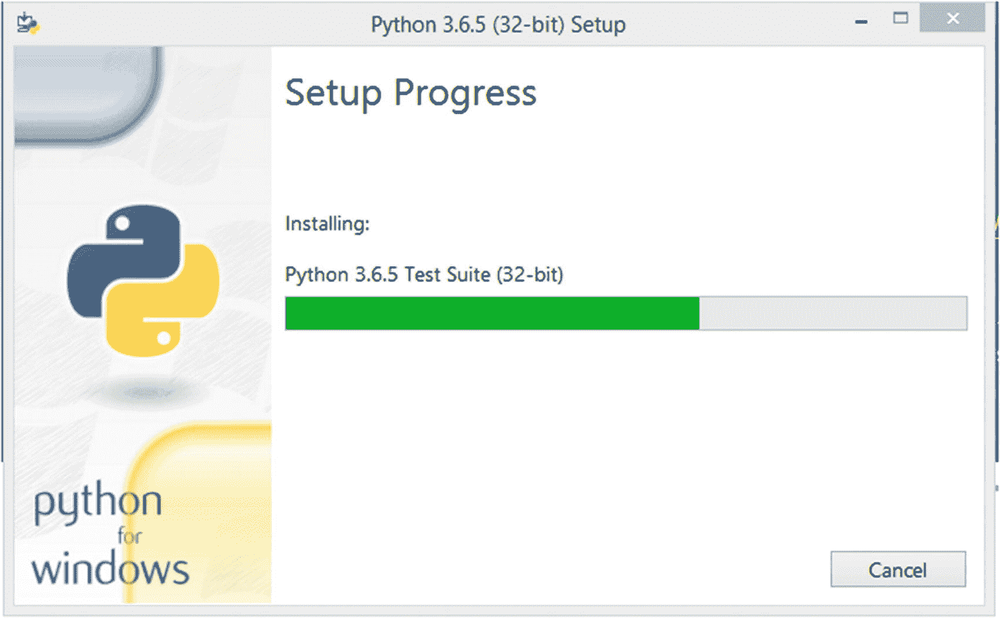
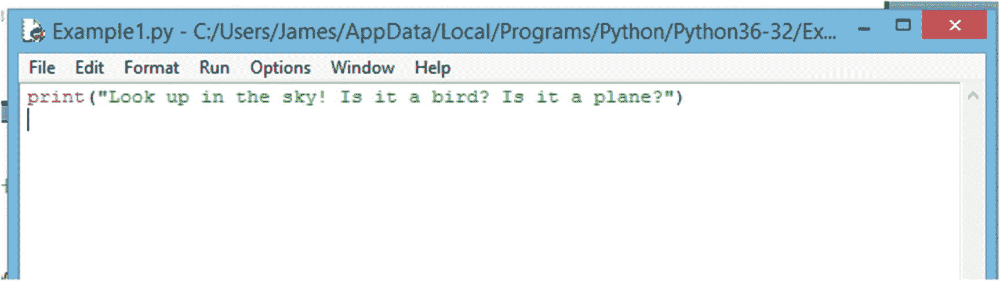
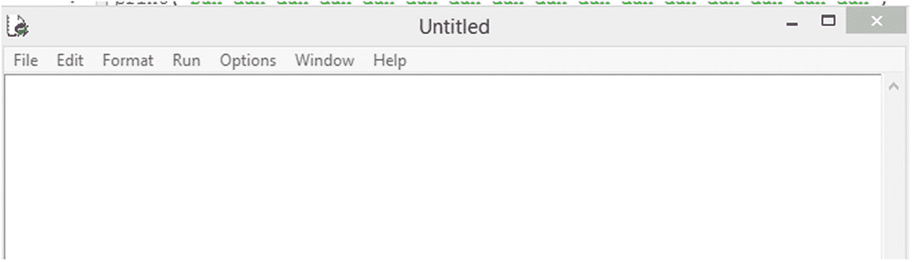
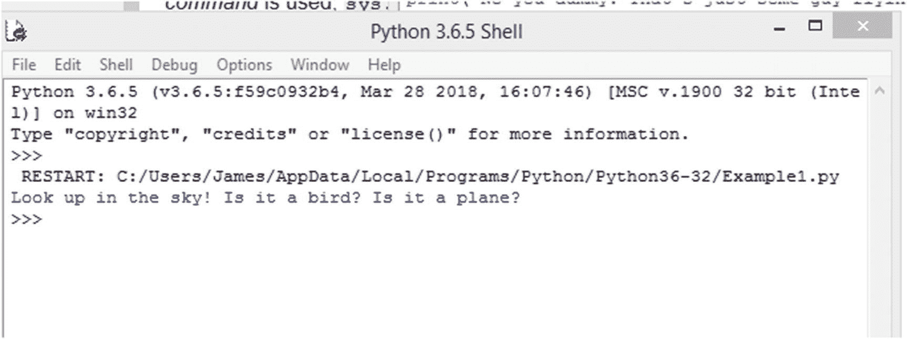
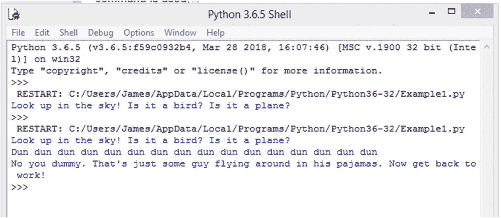

# 1.计算机编程和 Python 简介

计算机编程——通常被酷孩子称为“编码”——是创建应用程序或软件的艺术。这些程序允许我们做任何事情，从解决简单的数学问题和观看我们最喜欢的 YouTube 视频(我对跳伞牛头犬百看不厌)，到在我们最喜欢的视频游戏中摧毁成群猖獗的外星人，甚至将现实生活中的宇宙飞船发射到外太空。

我称计算机编程为“艺术”，因为它*就是*。任何时候你创造东西，你都在沉迷于一种艺术形式。当然，计算机代码，也就是我们输入到 shell 中来创建程序的单词(稍后会有更多内容！)，对于街上的普通人来说可能看起来并不漂亮——你的代码很可能永远不会看到艺术展览的内部——但是当你的程序的一部分做了你创建它的目的时……几乎没有什么比这更神奇的了。

也许那些跳伞斗牛犬。

计算机程序可以有多种形状和大小。除了在你的桌面系统上运行的应用程序或在你最喜欢的视频游戏控制台上玩的游戏，程序还以移动应用程序的形式出现在手机上。你甚至可以找到操作冰箱、你妈妈的小货车，甚至像烤面包机这样简单的东西的软件。

还有机器人。机器人大军。

但稍后会详细介绍。

现在，我们知道计算机程序是一组代码，用一种编程语言创建，告诉设备执行一组指令。

## 编程语言概述

如上所述，计算机程序是使用编程语言编写的。就像你、我和世界上其他人每天说的真正的语言一样，计算机语言有各种各样的形式和大小。虽然对于受过训练的人来说，它们中的大多数是有意义的，但如果一个代码新手试图在日常对话中使用它们，听起来就像一个疯子在胡言乱语。该对话可能看起来像这样:

```py
Normal Person: Hello, how are you?
Programmer (You): Print I am fine! Input, how are you?

```

幸运的是，对所有参与者来说，计算机在编程语言方面都很流利(这部分要感谢我们的朋友*编译器*——但稍后会有更多的介绍！)并能轻松理解您键入的最复杂的句子。

出于本书的目的，我们将坚持使用最通用、最容易学习的语言之一， *Python* 。虽然这个名字听起来很可怕，但请记住，它可能更糟:它可能被称为眼镜蛇。事实上，这种语言根本不是以一种爬行动物命名的，而是来自英国的一部古老的电视喜剧《T2:巨蟒和飞行马戏团》。

这是你的第一个任务:去问问你父母关于那个节目的事。几小时后见！

哦，你回来了。太好了。他们说的有意义吗？可能不会。不过没关系；你不需要理解英国喜剧的复杂性来学习如何使用这本书编程。你所需要的只是学习的欲望，一台电脑，和你面前的书页。

## Python 概述

Python 是一种高级的、动态的、解释的、面向对象的编程语言。虽然所有这些听起来有点吓人，但不要害怕！到本书结束时，你将能够用比上面更令人畏惧的句子来打动你的朋友！这句话的真正意思是，Python 不是一种基本的机器语言，因此，它需要一个“解释器”来将其“编译”成机器语言，以便计算机可以理解您试图告诉它的内容。

这个解释器获取你的代码，并将其转换——或*编译*—成一系列计算机能明白的 1 和 0。所有这些都是在后台发生的，所以如果你还没有完全理解，不要担心。

Python 是一种相对较新的编程语言，创建于 20 世纪 80 年代末——那时你的父亲留着很大的滑稽小胡子，你的母亲听着名字像 *Wham 这样的乐队。*和*毒*。

创造这种语言的人是一位名叫吉多·范·罗森的计算机天才，他被赋予了一个奇特而荒谬的头衔，终身仁慈的独裁者。像技术一样，编程语言也在发展，Python 也不例外。多年来，它经历了几个版本，目前被称为 Python 3。

## Python 和其他编程语言有什么不同？

Python 与其他编程语言在许多不同但重要的方面有所不同。首先，Python 通常比同类语言(如 Java 和 C++)更容易学习和使用。用 Python 创建的程序也花费更少的时间，因为它需要更少的代码(一般来说)。这部分是由于 Python 的*数据类型*——我们将在下一章详细介绍这个术语。

Python 也是极其通用的。虽然 Python *可能不是首选，但它可以用于几乎每个领域的应用，包括游戏、桌面软件、移动应用，甚至虚拟现实。它也是网络编程的必备工具，是计算机安全工具箱中的必备工具。*

## Python 的优势

Python 是当今世界上最常用的编程语言，也是发展最快的语言。有充分的理由。下面是 Python 可以让程序员受益的几个方面:

*   提高生产力:根据一些报告，Python 可以提高程序员的生产力——他们在给定时间内可以完成多少工作——十倍之多！它真的比子弹还快！

*   可扩展性:Python 的一个巨大优势是它有一个非常广泛的库。库是一组可以添加到程序中的现有代码。这些库涵盖了程序的常见特性，让您不必自己一遍又一遍地编写代码。例如，不需要编写一段代码来执行一个复杂的数学方程，你可以提供使用一个库来为自己省去一个大麻烦。

*   Python 易于阅读:作为一名程序员，一个棘手的问题是，有时你的代码无法工作。当这种情况发生时，你可能会发现自己在重读自己的代码——或者更糟，重读别人的代码——试图找出为什么你的程序没有正常运行。幸运的是，Python 易于阅读，大部分语言一看就明白。这使得发现问题比更复杂的语言容易得多。

*   可移植性:Python 可以在许多平台和系统上运行，这意味着您的程序可以面向更广泛的受众。

*   物联网(IoT):物联网可能听起来像是一个充满数字野兽的神奇世界，从某些方面来说，的确如此。物联网由智能物体组成，包括电灯开关、门把手、烤面包机、家用电器，你可以在日常生活中找到它们。这些家用电器可以通过语音命令和移动设备进行控制，使它们比原始的前辈更具交互性。我的意思是，当然，你的父母总是对着洗碗机大喊——但是它听进去了吗？现在，由于物联网和 Python 等语言，它可以做到！你仍然要把你的盘子放在里面，但是仍然！

*   Python 框架:框架就像程序的骨架——它们允许你快速地为某些类型的应用程序建立基础，而不需要编写你正在开发的软件类型中通常存在的通用元素。这节省了程序员的时间，并减少了手工编码时可能出现的错误。Python 得到了大量框架的支持，这使得启动一个新程序变得非常迅速！

*   Python 很有趣:Python 是一门有趣的学习语言；如上所述，不仅入门容易，Python 社区还举办了许多有趣的活动和挑战。例如，许多人以诗歌的形式编写他们的 Python 代码，每年都有大量的 Python“挑战”来帮助测试一个程序员的技能。

*   Python 是灵活的:因为 Python 有如此多的用途，被世界上如此多的公司使用，所以学习 Python 后找工作比学习其他语言更容易。此外，如果您不喜欢某个给定的领域，您可以随时使用您的 Python 技能尝试不同的途径。例如，如果你发现编写应用程序很无聊，你可以转到网络管理或在 IT 安全公司工作。

这些只是 Python 提供的一些好处和优势。

## 野生蟒蛇的例子

虽然很难说世界上有多少公司使用 Python，但是有许多有趣的业务依赖于这种语言。以下只是其中的一小部分:

*   韦恩企业(蝙蝠侠的另一个自我的公司):嗯，我们真的不知道，但那不是很酷吗？

*   Google:搜索引擎巨头和未来的统治者 Google 从一开始就使用 Python，部分原因是开发人员可以用它快速构建程序，也因为代码易于维护。

*   脸书和 Instagram:虽然 Python 不是这两个社交媒体平台使用的唯一语言，但它是它们最重要的语言之一。脸书使用 Python，部分原因是因为它有丰富的库。与此同时，Instagram 是 Python 的主要 web 框架之一——Django 的坚定支持者。我们将在本书的后面详细讨论 web 框架。

*   网飞:如果你是流媒体电影的粉丝，那么你对网飞一定不陌生。该公司主要将 Python 用于其数据分析功能和安全目的——以及其他领域。

*   电子游戏:《战地 2》和《文明 4》只是两款都依赖于 Python 的电子游戏。有趣的是，文明使用 Python 作为人工智能(AI)脚本。

*   政府机关和机构:政府机关和机构包括美国宇航局、国家气象局和中央情报局都使用 Python——尽管如何使用它是绝密的！带着装满钱的公文包在车库等我们，我们会告诉你一切！

## 你的第一个 Python 程序

现在，您可能想知道 Python 代码是什么样子的。别害怕！我将向您展示一个样本片段。稍后，在我们在您的计算机上安装 Python 和 IDLE(集成开发环境)之后，您可以尝试执行或运行代码来查看它的运行情况。但是现在，我认为在深入研究这种语言之前，让您体验一下是一个好主意。

传统上，当程序员编写他们的第一行代码时，他们会创建一个名为“Hello，World”的程序，作为向世界介绍自己的一种隐喻方式。然而，作为崭露头角的超级英雄——或者恶棍(这里不做评判)——我们需要一些更闪亮的东西。

看，你的第一个 Python 程序！

```py
print("Look up in the sky! Is it a bird? Is it a plane?")
print("Dun dun dun dun dun dun dun dun dun dun dun dun dun dun dun dun")
print("No you dummy. That's just some guy flying around in his pajamas. Now get back to work!")

```

如果您运行这段代码，结果将是:

```py
Look up in the sky! Is it a bird? Is it a plane?

Dun dun dun dun dun dun dun dun dun dun dun dun dun dun dun dun

No you dummy. That's some guy flying around in his pajamas. Now get back to work!

```

让我们更仔细地检查一下代码。说明 *print()* 的部分被称为*函数*，它的工作是告诉计算机——在这个例子中是—*在用户的屏幕上打印*一些东西。左括号和右括号()之间的文本是我们提供给函数的*参数*。引号" "之间的字符称为字符串。

如果这还没有完全理解，请不要担心——我们将在下一章详细讨论这个话题。现在，只要知道这就是 Python 代码的样子。很有可能，在我告诉你之前*，你能够准确地说出这个程序将做什么；这只是 Python 如此伟大的原因之一——它的可读性！*

## 安装 Python

在本节中，我们将学习如何在各种*操作系统*上安装 Python。操作系统是一种让你与计算机互动的软件。你可能很熟悉那些更受欢迎的，比如*微软 Windows* (如果你有个人电脑的话)和 *Mac OS X* (如果你有苹果电脑的话)。您安装的 Python 版本将根据您的计算机使用的版本而有所不同。此外，我们还将学习如何在 Linux 和 Ubuntu 系统上安装 Python。

### 在 Windows 上安装 Python

首先，打开 web 浏览器，导航到 Python 官方网站及其下载页面: [`www.python.org/downloads/`](http://www.python.org/downloads/) (图 [1-1](#Fig1) )。


图 1-1

[Python。org](http://python.org) 网站

Python 目前的版本是 3 . 6 . 5；等你读到这本书的时候，可能还会更高。无论是哪种情况，点击*下载 Windows 最新版本*标题下的“下载 Python”按钮。或者，您可以向下滚动并下载以前的版本(只要确保它们是版本 3。x 或更高版本，因为版本 2 之间存在不兼容问题。x 和 3。x)；但是，出于本书的目的，最好使用 3.6.5 或更高版本。

将出现一个图像，询问您是否要保存该文件。点击“保存文件”(图 [1-2](#Fig2) )，将其保存到您的桌面或易于记忆的地方。


图 1-2

Python 安装文件的保存文件对话框

导航到您的桌面(或您保存文件的位置)并双击它。它应该类似于图 [1-3](#Fig3) 中的图像。


图 1-3

Python。EXE 安装文件图标

安装程序将启动，并询问您是希望“立即安装”还是“自定义安装”为方便起见，我们将允许安装程序“立即安装”但是，在单击该按钮之前，请确保“为所有用户安装启动器”和“将 Python 3.6 添加到路径”都已选中。然后点击“立即安装”选项(图 [1-4](#Fig4) )。


图 1-4

Python 安装设置屏幕

Windows 可能会弹出一个窗口，询问您是否允许继续安装。如果是这样，请允许程序继续运行。将出现一个新的弹出窗口，显示设置进度(图 [1-5](#Fig5) ):



图 1-5

Python 安装进度屏幕

设置完成后，您将看到如下所示的屏幕。点击“关闭”按钮完成安装(图 [1-6](#Fig6) )。


图 1-6

Python 安装设置成功窗口

现在，您的计算机上应该已经安装了 Python。您可以在您的“开始”菜单中找到它，标签为 Python 3.6(或您安装的任何版本)。

当您启动 Python 时，首先看到的是 shell，它是开发环境的一部分，您可以在其中编写一行代码、测试代码、运行代码和创建 Python 文件。图 [1-7](#Fig7) 显示了 Python Shell 启动后的外观示例。


图 1-7

Python 外壳

在这个 shell 窗口的顶部，您可以看到 Python 的当前版本和一些其他信息。您还会看到三个大于号或箭头(> > >)。这些被称为命令提示符，您将在这里向 Python 输入指令。

准备好开始了吗？让我们输入一些简单的代码，看看会发生什么！在提示符下输入以下内容:

```py
print("Look up in the sky! Is it a bird? Is it a plane?")

```

完成后，按*回车*，你应该会看到如下结果(图 [1-8](#Fig8) ):


图 1-8

用 Python Shell 编写的示例代码

如果没有，请重新检查您的代码，确保拼写正确，并记住插入括号()和引号“”。

因为我们直接在 shell 中工作，所以我们的代码会被实时执行。在这个例子中，它运行了一行代码，告诉计算机在屏幕上打印一行文本。

在现实世界中，我们想要创建实际的 Python 文件，以便我们可以保存我们的程序供以后使用，并帮助我们在每次运行我们的程序时避免重新编写数千行代码。

幸运的是，Python IDLE——或开发环境——允许我们创建 Python 文件，即以扩展名结尾的文件。py，相当容易。你所要做的就是点击*文件*，然后*新文件*(见图 [1-9](#Fig9) 、 [1-10](#Fig10) 和 [1-11](#Fig11) )。


图 1-11

显示 Python 目录的保存对话框



图 1-10

用. py 文件编写的示例代码



图 1-9

新创建的。py 文件

将弹出一个新窗口。这是您可以编写代码并保存以备后用的地方。也就是说，让我们输入刚才使用的示例代码。然后点击*文件*，再*保存*。

接下来点击*文件*，然后*保存*。

输入文件名，点击*保存*按钮，完成文件创建。出于本书的目的，让我们保持简单，将我们的文件命名为 *Example1.py* 。

现在，你已经创建了你的第一个真实世界的 Python 程序。要运行该程序，请单击“运行”,然后选择“运行模块”。您的程序现在将在 Python shell 中执行！(图 [1-12](#Fig12) )。



图 1-12

的结果。py 文件在 Python Shell 中运行

现在，让我们总结一下:还记得我们在本章开始时写的第一个程序吗？让我们将它输入到 Example1.py 文件中，完成后单击*保存*。下面是代码:

```py
print("Look up in the sky! Is it a bird? Is it a plane?")
print("Dun dun dun dun dun dun dun dun dun dun dun dun dun dun dun dun")
print("No you dummy. That's just some guy flying around in his pajamas. Now get back to work!")

```

一旦你保存了文件，点击*运行*并选择*运行模块*来查看运行中的完整代码！(图 [1-13](#Fig13) )。



图 1-13

Python Shell 中运行的. py 文件的另一个例子

## 在其他操作系统上安装 Python

本书使用安装在基于 Windows 的计算机上的 Python 虽然里面的代码可以在任何一台计算机上运行，但是 Python 的实际安装会因操作系统的不同而有所不同。

要在 Mac OS X 上安装 Python，请打开 web 浏览器并导航至 [`www.python.org/downloads/mac-osx/`](http://www.python.org/downloads/mac-osx/) 。选择“最新 Python 3 版本”链接，按照说明和提示完成设置和安装过程。

要在 Unix/Linux 系统上安装 Python，打开浏览器，进入 [`www.python.org/downloads/source`](http://www.python.org/downloads/source) 。单击“最新 Python 3 版本”的链接，并按照说明完成设置和安装过程。

## 在这一集里！

我们在这一章中确实讲了很多，但与我们在下一章将要揭示的相比，这根本不算什么！这里有一个简短的列表——如果你愿意的话，是一个总结——列出了我们到目前为止所涉及的内容(嘿，我们现在是编程英雄了，我们也要说行话了！)

*   Python 是一种编程语言，可以让你对计算机、移动设备、视频游戏、人工智能系统、物联网(IoT)设备、基于网络的应用程序，甚至虚拟现实/增强现实(VR/AR)进行编程。

*   程序或应用程序是一组代码，让你给计算机或设备一组指令来执行。

*   了解 Python 的程序员可以从事编程、网络管理、IT 安全、视频游戏开发、移动应用程序创建、法医计算机科学等职业。

*   Python 可以跨多个平台工作，包括 Windows PCs、Mac 计算机、移动设备、Unix/Linux 驱动的计算机等等。

*   Python 可以通过一组被称为“道德黑客”工具的技能和模块来防止黑客攻击。

*   IDLE 代表集成开发环境；这是我们创建 Python 代码和文件的地方。

*   Python 创建的文件以文件扩展名结尾。py”。

*   在撰写本文时，Python 的当前版本是 3.6.5。如果你在读这本书，一定要用这个版本或者更新的版本。

*   `print()`功能允许您将文本打印到用户的屏幕上。例如，`print("Hello Wall!")`将打印文本:Hello Wall！对着电脑屏幕。

*   全球许多组织和公司都在使用 Python，包括脸书、谷歌、Snapchat、NASA、中情局等等！

*   Python 是世界上使用最多的——也是发展最快的——计算机编程语言。