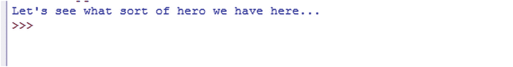
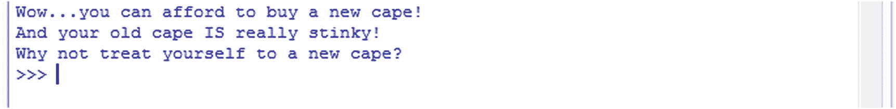

# 4.做决定

当涉及到打击犯罪和处理邪恶(商标待定！)，我们这些超级英雄经常发现自己面临岔路口:我们是应该拯救被扔下大楼的无助少女，还是让她一头扎到地上，以便我们能抓住坏人？我们今天要洗我们的斗篷吗？还是我们可以多洗一天，让它闻起来不那么臭？

归根结底，打击犯罪的大部分工作——以及为此而进行的规划——都归结为一件事:做出决策。

你可能听过这样一句话，“每一个动作都有一个反应。”嗯，在编程中尤其如此。想想看:每一次你与计算机接触，你都在强迫它做出决定。当你移动鼠标时，当你按下一个键时，当你因为你的代码不起作用而用头撞击屏幕一个小时时(好吧，也许不是最后一个)——所有这些都需要计算机解释你想要的，并希望执行一个动作。

这里有一个简单的例子:如果你按下字母“a”或字母“k ”,计算机必须知道在这两种情况下该做什么。如果您正在使用文字处理应用，这个特定的场景很简单——将这两个字母中的一个打印到屏幕上。

然而，当我们讨论与计算机编程相关的决策时，我们更多的是指多答案的突击测验。程序会给用户几个选项——例如，选择 A、B 或 C，然后根据选择的选项做出反应。

为了真正理解所有编程中最强大的功能之一，让我们戴上超级英雄的面具，召唤我们的超级大脑，挖掘我们下一个正在发展的超级能力:决策。

## 做决定

把你的生活想象成一个计算机程序。午餐时间到了，一个初出茅庐的伙伴/即将成为英雄的人需要午餐来保证他/她的肌肉增长。在你面前是一套物品:两片面包、两罐花生酱和三罐果冻。让我们把它列成一个列表，这样我们可以更好地看到它！

*   面包(两片)

*   松脆的花生酱

*   奶油花生酱

*   苹果果冻

*   葡萄果冻

*   草莓酱

正如你所看到的，在你吃午饭之前必须做出决定。我们已经想好了面包，但是我们要用什么类型的花生酱呢？果冻怎么样？

这种场景被称为决策，或者更好的说法是一个*条件语句*。也就是说，如果满足某些条件，我们/程序将如何反应？为了以编程的方式来看这个，让我们转向一个叫做*的伪代码*。

不，伪代码不是你父母在 20 世纪 80 年代用来即兴演奏的菲尔·柯林斯老歌。这是一种使用听起来像代码但*不是*的语言来规划代码的方法。如果我们对伪代码应用 or 三明治场景，它看起来会像这样:

```py
if making sandwich, get bread
Then choose peanut butter type;
if peanutButterType = "Creamy"
print "That's gross. Don't be gross."
else print "Crunchy is the correct choice! You win deliciousness!"
Next choose jelly type;
If jellyType = "Grape"
print "You really aren't good at this are you?"
else if jellyType = "Strawberry Jam"
print "Sure, if you want to ruin your peanut butter, go ahead."
else print "Apple Jelly is the only Jelly! The golden nectar of the Gods! You are so wise!"
Next put peanut butter and jelly on bread, smash together, leave the crusts on, and eat.

```

如果你把代码放到 Python 中，你会得到大量的错误，因为记住，它不是工作代码。它是伪的，意思是假的或嘲弄的。有时在真正编码之前，我们使用伪代码来设计我们的程序，这样我们可以设计出重要的部分。这有助于我们的编程逻辑，并允许我们避免编码中的错误。它可以像你的朋友写下的一套详细说明如何去漫画书店的指南。它可能并不漂亮(尽管一些伪代码很漂亮，充满了图表和图形)，但它给了你需要去哪里的想法。

## 条件语句

用最基本的术语来说，条件语句是决定一段代码是否运行的代码片段——取决于条件是否满足。从编程的角度来看，条件语句可以用在简单的示例中，例如:

如果用户选择成为超级英雄，将他/她输入“英雄”类别；否则，将它们放入反派位置。

*   如果一个超级英雄通过接触有毒废物获得了他们的超能力，把他们归类为“变异的”如果不是，把他们归类为“继承的超能力”

*   如果一个超级英雄有悲惨的背景，让他们的性格类型“黑暗和忧郁”否则，让他们的个性“机智风趣”

这些是条件语句最基本的用法。在现实世界中，要执行(或不执行)程序的某个部分，可能需要满足多个条件。我们很快就会进入更高级的类型，但是现在，让我们看看最基本的条件语句:`If`语句。

### 请看——If 语句！

前面的例子都是所谓的`if`语句的一部分。`If`语句基本陈述了*如果*某事发生，做*这个*。这也意味着，如果某件事情没有发生，程序将会做其他事情——这可能意味着程序什么也不做。

为了让事情更清楚，让我们尝试一点代码。创建一个名为`ConditionalStataments.py`的新 Python 文件，并输入以下代码:

```py
superHeroType="Dark and Brooding"

print("Let's see what sort of hero we have here...")

if superHeroType=="Dark and Brooding":
    print("Ah, it says here you are 'Dark and Brooding'.")
    print("I bet you had a tragic event in your past!")
    print("Your voice sounds pretty rough by the way...")
    print("Here, have a cough drop. Or two.")

```

这段代码中有几点需要注意。首先，我们创建了一个名为`superHeroType`的字符串变量，并用一些文本填充它。这个变量中的文本就是我们将要测试的`If`语句。

在打印一些文本后，我们用下面一行开始 if 语句:

```py
if superHeroType=="Dark and Brooding":

```

当解释器看到这一行代码时，就进入条件语句，检查是`TRUE`还是`FALSE`。如果条件满足，也就是说，结果为真，程序运行剩余的代码，即*缩进的*(因此是其中的一部分)—`if`语句。

在这种情况下，条件得到了满足:`superHeroType`中的文本*等于*“黑暗和沉思”，因此程序打印出了`print()`函数，它们是`if`语句的一部分。既然是这种情况，程序会产生(见图 [4-1](#Fig1) ):


图 4-1。

使用条件语句

另一件需要注意的事情是:`==`符号被称为*比较运算符*。在这种情况下，这意味着被比较的值必须完全等于前面引号(" ")中的值。我们在评估文本和数字时使用`==`符号。

但是如果我们的条件不满足会发生什么呢？如果`superHeroType`的值不等于“黑暗冥思”怎么办？为了找到答案，我们所要做的就是编辑我们的代码来改变它的值并再次运行程序:

```py
superHeroType="Quick-Witted and Funny"

print("Let's see what sort of hero we have here...")

if superHeroType=="Dark and Brooding":
    print("Ah, it says here you are 'Dark and Brooding'.")
    print("I bet you had a tragic event in your past!")
    print("Your voice sounds pretty rough by the way...")
    print("Here, have a cough drop. Or two.")

```

现在，当我们运行我们的代码时，返回的只是开始的`print()`函数(见图 [4-2](#Fig2) ):



图 4-2。

未被触发的 if 语句的结果

为什么会这样？因为我们改变了我们的`superHeroType`变量的值，当 Python 遇到我们的`if`语句时，它检查条件并发现它没有被满足并返回`false`。由于不满足条件，Python 跳过了`if`语句块的剩余部分，并转移到程序的下一部分。

由于没有程序的下一部分，Python 退出，程序结束。

当然，我们可以在程序中创建多个`if`语句。如果我们这样做了，Python 将评估每一条语句并执行代码块，只要满足条件。让我们打开我们的`ConditionalStatements.py`文件并修改代码，使其与下面的代码相匹配:

```py
superHeroType="Quick-Witted and Funny"

print("Let's see what sort of hero we have here...")

if superHeroType=="Dark and Brooding":
    print("Ah, it says here you are 'Dark and Brooding'.")
    print("I bet you had a tragic event in your past!")
    print("Your voice sounds pretty rough by the way...")
    print("Here, have a cough drop. Or two.")

if superHeroType=="Too Polite":
    print("It says here that you are 'Too Polite'")
    print("How are you ever going to catch that criminal if you keep holding the door?")
    print("Don't say sorry to him - he's the villain!")

if superHeroType=="Quick-Witted and Funny":
    print("Oh boy. I can tell by all the puns that you are the Quick-Witted and Funny Type.")
    print("I have a joke for you:")
    print("What has 8 fingers, two thumbs, and isn't funny?")
    print("You!")

```

使用这段修改后的代码，我们在程序中添加了三个条件 if 语句，而不是一个。程序首先打印出一些文本，然后遇到第一个 if 语句，该语句检查`superHeroType`的值是否等于“黑暗和沉思”。因为它不是，我们的程序忽略该块的缩进代码的其余部分。

每当我们有一个带有缩进文本的代码块时，Python 知道缩进的代码属于那个特定的代码组。一旦它用完了缩进的代码，它就知道特定的代码块结束了，并继续下一个代码块。

不要太纠结于代码缩进——我们很快会更详细地讨论它。现在，只需要知道代码块有一个层次结构——也就是一个结构化的顺序——它依赖于缩进(通常是四个空格或一个 tab 键)来表示代码的哪一部分属于哪一部分。

接下来，Python 运行到我们的第二个`if`语句，并再次检查标准:`superHeroType`是否等于“太客气”同样，它没有，所以解释器继续下一个代码块，这恰好是我们的第三个 if 语句。

在第三个 if 语句中，我们检查`superHeroType`的值是否等于“机智幽默”这一次，结果是`true`，所以解释器执行缩进的`print()`函数，这些函数是代码块的一部分。结果如图 [4-3](#Fig3) 所示:


图 4-3。

评估为 True 的 if 语句示例

### 布尔逻辑和比较运算符

在我们深入研究条件语句之前，我们需要定义一些有趣的词。这些有趣的话不仅可以一遍又一遍地对你的朋友和家人说，而且也是你无用腰带上的另一个便利工具。

第一个字是`Boolean`。来吧，大声说出来，让笑声远离你的系统。然后，绕着房子跑几圈，看看你能在对话中使用多少次这个词——布尔。我会在这里等。

布尔是另一种数据类型，正如您可能已经从我们之前对`ConditionalStatements.py`代码的解释中猜到的，这种特殊的数据类型可以有两个不同的值:`true`和`false`。

当我们处理像`if`这样的条件语句时，我们最终会问某个条件是`true`还是`false`。无论我们如何描述这些条件或标准，最终，答案只能是这两个选择中的一个。

当然，我们不能只是和计算机玩一个真心话大冒险的游戏，所以 Python(和其他语言)使用一种被称为比较运算符的东西来帮助我们比较数据，并确定最终结果是`true`还是`false`。

我们已经讨论过比较运算符之一——等于运算符`==`。除此之外，我们还可以使用其他五种比较运算符。它们如下:

*   ==用于查看一个值是否等于另一个值

*   ！=用于查看一个值是否不等于另一个值

*   >用于确定一个值是否大于另一个值

*   < =用于小于或等于另一个值

*   > =用于大于或等于另一个值

到目前为止，我们已经在条件语句示例中使用了字符串。为了更好地理解我们的新工具，比较运算符，让我们转而使用数字。首先，创建一个名为 MathIsHard.py 的新文件。

```py
wonderBoyAllowance = 10
newCape = 20

print("That new cape sure is shiny. I wonder if you can afford it...")

if wonderBoyAllowance > newCape:
    print("Congrats! You have enough to buy that new cape!")

if wonderBoyAllowance < newCape:
    print("Looks like you'll have to keep wearing that towel as a cape...")
    print("Maybe if you ask nicely Wonder Dad will give you a raise...")

```

让我们更仔细地检查一下这段代码，好吗？我们首先创建两个变量:wonderBoyAllowance 和 newCape。然后，我们打印一些文字说，“新的海角肯定是闪亮的。不知你能否负担得起……”

为了弄清楚神奇小子是否真的买得起那件新斗篷，我们必须比较`wonderBoyAllowance`(代表你的零花钱)和`newCape`(代表那件闪亮的新斗篷的价格)。

我们的第一个`if`语句查看`wonderBoyAllowance`是否为`>`(或*大于* ) `newCape`。如果是这样，它将打印出文本，“恭喜！你有足够的钱买那件新斗篷！”然而，由于津贴是*而不是*大于新 cape 的成本，程序跳到下一个`if`语句，看看它的值是否为真。

当评估第二个`if`语句时，程序会注意到您的津贴值小于新 cape 的成本。由于该条件得到满足并返回一个值`true`，它将执行 if 语句的剩余部分，导致(见图 [4-4](#Fig4) ):


图 4-4。

评估多个 if 语句

要了解`Boolean`逻辑是如何工作的，创建一个新的 Python 文件并将其命名为`BooleanExamples.py`。输入此代码:

```py
# Creating two variables with different values

a=10
b=20

# Compare values using the different Comparison Operators

print("Is the value of a EQUAL to b?  ", a == b)
print("Is the value of a NOT EQUAL to b?  ", a != b)
print("Is the value of a GREATER than b?  ", a > b)
print("Is the value of a LESS than b?  ", a < b)
print("Is the value of a GREATER THAN or EQUAL to b?  ", a >= b)
print("Is the value of a LESS THAN or EQUAL to b?  ", a <= b)

```

运行这个程序将显示哪些比较是`true`哪些是`false`。值`true`表示比较正确，而`false`表示不正确。

### Else 语句

现在我们已经理解了`if`语句和比较操作符，我们可以继续讨论另一种类型的条件语句:`else`。到目前为止，我们已经使用了条件语句，这些语句仅在满足给定条件时才执行一组代码。然而，如果我们想要一个结果，如果结果为真，而另一个结果为假，会发生什么呢？虽然从技术上讲，我们可以使用多个 if 语句来实现这个结果，但是有一种更好、更有效的方法来编写您的程序。让我们编辑我们的`MathIsHard.py`文件的代码，并对其进行修改，使其与下面的代码相匹配:

```py
WonderBoyAllowance = 10
NewCape = 20

print("That new cape sure is shiny. I wonder if you can afford it...")

if WonderBoyAllowance > NewCape:
    print("Congrats! You have enough to buy that new cape!")

else:
    print("Looks like you'll have to keep wearing that towel as a cape...")
    print("Maybe if you ask nicely Wonder Dad will give you a raise...")

```

在这个版本中，我们用一个`else`语句替换了第二个`if`语句。else 语句只有在`if`语句的条件不满足时才会被触发。基本上，你对程序说的是，“如果发生这种情况，做这个，否则，做那个。”

这个程序的结果和之前的一样；然而，现在涉及的代码更少了，由于没有第二个 if 语句，Python 不需要执行另一个比较。这节省了计算能力和处理。虽然这在这里看起来没什么大不了的，但是你可以想象在一个程序中，数万行代码和数百条`if`语句可以节省多少。

还有一点需要注意:当使用一个`else`语句时，Python 将总是执行你的 if 块或者你的 else 块；如果不走这两条路中的一条，你的程序将永远不会结束。

但是，如果您需要不止一个`if`和`else`选项，会发生什么呢？如果有三个选择呢？还是四个？还是 40 亿？为此，你需要比微不足道的`if`和`else`声明更有力的东西。

你准备好再次升级这些能力了吗？如果是这样(明白了——一语双关！)，准备学习——`else if`！

### Else If 语句

我知道你在想什么-`else if`不是一个真正的短语。事实上，这可能是一个整天挤牛奶、擦擦疲惫额头上汗水的农民的名字——叫他埃尔塞夫叔叔吧！

我不想告诉你这个消息，但是 else if 是一个真实的短语，它是条件语句家族中的一员。它是高度通用的，高效的，并且将会是你作为一个程序员最好的朋友之一。有了它，您可以创建任意数量的条件场景，而不是使用常规 if/else 语句的枯燥混合来创建一个或两个常规场景。

像往常一样，学习这种新力量的最好方法是穿上衣服，尝试一下。因此，记住这一点，创建一个名为`UncleElseIf.py`的全新文件，并插入以下代码:

```py
# Create our variables representing our allowance and the cost of a new cape

wonderBoyAllowance = 20
newCape = 20

print("That new cape sure is shiny. I wonder if you can afford it...")

if wonderBoyAllowance > newCape:
    print("Congrats! You have enough to buy that new cape!")
    print("And it looks like you have some money left over.")
    print("How about getting a hair cut? You hair is covering your mask!")

elif wonderBoyAllowance == newCape:
    print("You have exactly enough money to purchase the cape!")
    print("No change for you!")
    print("Eh...and no tip for me I see...")

else:
    print("Looks like you'll have to keep wearing that towel as a cape...")
    print("Maybe if you ask nicely Wonder Dad will give you a raise...")

```

这段代码可能看起来很熟悉，因为它是我们的`MathIsHard.py`文件的修改版本。首先，我们将`wonderBoyAllowance`的值改为 20(祝贺加薪！);过一会儿你就会明白为什么了。接下来，我们做介绍性的`print()`语句，接着是第一个`if`块。这第一个`if`检查看*如果*我们的津贴是*大于*新斗篷的成本。由于该比较返回一个`false`，程序跳过 print()函数并继续下一个块。

等一下。下一个块根本不是`if`或`else`。事实上，它甚至没有提到`else-if`——怎么回事？嗯，创造 Python 的大师决定让`else-if`语句在语言中混合使用 else 和 if，因此是`elif`。

当解释器看到`elif`时，它再次评估比较——在这种情况下，它检查我们的津贴*是否与新斗篷的成本*完全相同。因为它是——两个变量都保存值`20`——其余的 else-if 执行，缩进的`print()`函数施展它们的魔法。

因为 else-if 的计算结果为 true，所以程序知道没有必要再进一步查看，并从这个特定的代码块中退出。因为在 if/else/else-if 块之后没有代码，所以程序结束。

这就是事情变得有趣的地方。尽管我们将`if`、`else`和`else-if`称为它们自己的块，但实际上，它们都是同一个块*的一部分。想想看:没有`else`和`if`就没有`else-if`，对吗？好吧，你可以，但是那样你的程序可能不会按照你想要的方式运行！*

如上所述，`else-if`语句允许我们创建任意数量的选项。让我们在代码中再添加几个`elif`并检查结果。修改`UncleElseIf.py`的文本，使其与以下内容匹配:

```py
# Create our variables representing our allowance and the cost of a new cape

wonderBoyAllowance = 20
newCape = 20

print("That new cape sure is shiny. I wonder if you can afford it...")

# Check to see if allowance is greater than the cost of the new cape
if wonderBoyAllowance > newCape:
    print("Congrats! You have enough to buy that new cape!")
    print("And it looks like you have some money left over.")
    print("How about getting a hair cut? You hair is covering your mask!")

# Check to see if allowance is the same exact price as the new cape
elif wonderBoyAllowance == newCape:
    print("You have exactly enough money to purchase the cape!")
    print("No change for you!")
    print("Eh...and no tip for me I see...")

# Check to see if allowance is zero dollars
elif wonderBoyAllowance == 0:
    print("Oh boy, you are broke!")
    print("Maybe it's time to hang up the cape and grab an apron!")
    print("Time to become...Bag Boy!")

# If all other conditions fail, this else will trigger
else:
    print("Looks like you'll have to keep wearing that towel as a cape...")
    print("Maybe if you ask nicely Wonder Dad will give you a raise...")

```

在这个版本的代码中，我们在每个部分都添加了注释(#)，以使代码片段更加清晰。我们还向我们的条件块添加了第二个`elif`；它检查`wonderBoyAllowance`的值是否为 0，如果是，打印出一些文本，建议您获得一份新工作。

理论上，我们可以向这个条件块添加任意多的`elif`,只要我们满足需要的条件。例如，我们可以以 1 为增量检查 wonderBoyAllowance 的值，直到达到 20。下面是一个例子:

```py
# Create our variables representing our allowance and the cost of a new cape

wonderBoyAllowance = 20
newCape = 20

print("That new cape sure is shiny. I wonder if you can afford it...")

if wonderBoyAllowance == 0:
        print("Nope. You need 20 more dollars.")

elif wonderBoyAllowance == 1:
    print("Nope. You need 19 more dollars.")

elif wonderBoyAllowance == 2:
    print("Nope. You need 18 more dollars.")
elif wonderBoyAllowance == 3:
    print("Nope. You need 17 more dollars.")
elif wonderBoyAllowance == 4:
    print("Nope. You need 16 more dollars.")
elif wonderBoyAllowance == 5:
    print("Nope. You need 15 more dollars.")

# Keep adding elif until you reach 19
# Then use an else for if the value equals 20 or higher

else:
          print("Looks like you have just enough!")

```

在这个代码示例中，我们添加了 5 个`elseif`来覆盖你零花钱的前 5 美元。我本来可以增加总共 19 个`elseif`，但是那会占据这本书的好几页。相反，你可以自由地自己填充空白并测试这个程序。将`wonderBoyAllowance`或`newCape`的值交替几次，这样您就可以看到结果是如何根据我们测试条件的变量的值而变化的。

### 逻辑运算符

尽管`elif`语句非常强大，但你还需要学习一种能力，才能真正成为条件语句的大师*...*声明*...*声明*...(这里有回音吗？).这种能力被称为*逻辑运算符*。*

 *到目前为止，我们已经讨论了许多不同的操作符类型，包括本章前面的比较操作符。只有三个逻辑操作符，但是它们会给你的程序带来全新的能力。

像比较运算符一样，逻辑运算符只有一个目的:帮助您比较不同的值。也像比较运算符一样，逻辑运算符寻求一个布尔答案:真或假。它们主要用于确定两个或更多的比较是真还是假。与我们的其他操作符不同，逻辑操作符不是由特殊字符或符号组成的，而是由不言自明的实际单词组成的:`and`、`not`、`or`。

其中第一点可能是最容易理解的。它只是查看语句，并尝试确定“这个和那个”是否都为真。如果两者都是，则评估为`true`；如果不满足一个或多个条件，则评估为`false`。

让我们在代码中更仔细地检查一下。创建名为 LogicalOperatorsExample.py 的新文件，并输入以下代码片段:

```py
# Create a few variables to evaluate

wonderBoyAllowance = 20
newCape = 20
oldCape = 'smelly'

# Check to see if allowance is equal to the cost of a new cape AND
# that the old cape is "smelly"

if wonderBoyAllowance >= newCape and oldCape == 'smelly':
    print("Wow...you can afford to buy a new cape!")
    print("And your old cape IS really stinky!")
    print("Why not treat yourself to a new cape?")

# If the if fails, this else statement will trigger
else:
    print("Sorry kid, it just isn't time for a new cape yet.")

```

在神奇小子购买新斗篷之前，必须满足两个条件。首先，他必须有 20 美元来支付这笔费用。第二，他的旧斗篷必须有臭味——这是他能证明花毕生积蓄买一件新斗篷是合理的唯一方法！

在设置好要评估的变量后，我们弹出一个`if`语句来检查`wonderBoyAllowance`是否大于或等于`newCape`的值(`>=`)。在这种情况下，它*等于*，所以解释器继续前进，看到`and`操作符，并且知道下一部分求值必须*也是*才能使整个`if`语句求值为`true`。它检查`oldCape`的值是否等于“发臭”——事实的确如此！–由于两个条件都是`true`，它继续打印出`if`语句的剩余部分。

如果这两个条件中的任何一个不为真，那么就会触发`else`语句。

下面是结果(图 [4-5](#Fig5) ):



图 4-5。

使用 else 语句

逻辑运算符列表中的下一个是 or。当用于条件语句时，or 运算符要求至少有一个条件的计算结果为真，其他条件可以为假，但只要有一个条件为真，整个语句的计算结果为真。

下面是一个 or 运算符的例子:

```py
# Variables to check

wonderBoyAllowance = 20

newCape = 20
newShoes = 50

# Checks if you can afford a new cape OR if you can afford new shoes

if wonderBoyAllowance >= newCape or wonderBoyAllowance >= newShoes:
    print("Looks like you can either afford a new cape or new shoes.")
    print("That's good, because one of them are really stinky!")

# If both of the conditionals fail, the else below triggers
# If even one of the conditionals are true, the else does not trigger

else:
    print("That's a shame, because one of them is really stanky!")

```

该示例程序旨在检查一个或两个条件是否为`true`。如果两者都是`true`，很好——我们的`print()`功能仍然触发。如果只有一个条件是`true`——仍然很棒；我们的`print()`功能将会触发。记住:一个`or`操作符只需要一个条件为`true`。

只有当*和*条件都不满足时，程序才会触发`else`语句。

敏锐的观察者可能会注意到这些程序的一个小问题——虽然我们知道神奇男孩可以买得起一双鞋或一件新斗篷，但我们不知道他会选择哪一件。更进一步，我们不知道他是否能一起负担得起这两者；我们只是看看他是否能负担得起其中任何一个。

有几种方法可以解决这个问题并扩展我们的计划。我们可以添加一些 if 语句来解决问题。然而，现在可能是讨论所谓的*嵌套*的好时机。不，这和鸟没有任何关系！

### 筑巢——不仅仅是为了鸟类

有时，检查给定块中的一个(或两个)条件是否为真是不够的。例如，我们可能希望检查第二个或第三个(或第四个等等。)条件满足*如果*第一个评估为真。考虑一下我们的代码，它决定了神奇小子是否可以购买新的斗篷和鞋子。我们知道神奇小子可以购买其中任何一个，但我们不知道他是否有足够的钱来购买这两个。我们也不知道他更需要哪一个——斗篷还是鞋子。

我们可以通过编程来回答其中的一些问题——也就是说，我们可以使用我们的程序来解开这些答案。当我们在一个 if 中检查多个语句时，我们称之为嵌套。

到目前为止，您已经注意到当我们使用 if 语句时，代码是如何自动缩进的；在我们插入一种颜色(:)并按 enter 键后，开发环境跳过一行，然后缩进八个空格。作为程序员，这直观地告诉我们，缩进的代码是它上面的 if 语句的一部分。它也告诉解释者同样的事情。这就是所谓的代码层次结构，它表示(1)在该代码之前执行该代码，以及(2)该缩进的代码属于它上面的代码。

为了更好地理解嵌套的工作原理，让我们重新看一下前面的例子:

```py
# Variables to check
wonderBoyAllowance = 20
newCape = 20
newShoes = 50

# Checks if you can afford a new cape

if wonderBoyAllowance >= newCape:
    print("You can afford a new cape.")
    print("But how about new shoes?")

# When the if check to see if you can afford the new cape passes it does this

    if wonderBoyAllowance >= newShoes:

        print("Looks like you can afford new shoes as well.")
        print("That's good, because the old ones are really stinky!")
        print("But can you afford both together?")

#If you cannot afford the shoes, but can afford the cape

, it does this
    else:
        print("You can only afford the new cape, sorry.")

# If both of the conditionals fail, the else below triggers
# If even one of the conditionals are true, this else does not trigger

else:
    print("That's a shame, because one of them is really stanky!")

```

在更新的示例中，首先要注意的是我们的`if`语句的缩进。第一个`if`检查神奇小子是否买得起新斗篷。因为他可以(意味着`wonderBoyAllowance`大于或等于`newCape`，所以程序继续执行缩进的或者嵌套的`if`语句。程序再次检查嵌套的`if`语句的条件是否为`true`(是否`wonderBoyAllowance`等于或大于`newShoes`)。如果是，它将执行缩进的`print()`函数。

### 注意

注意，即使是嵌套的 if 语句下的 print()函数也会缩进。

在这种情况下，我们的嵌套的`if`语句不等于`true`，所以嵌套的`else`语句——缩进的语句——触发。

只有当原始的`if`语句返回一个`false`时，底部的`else`语句才会被触发。这个节目的结果？

```py
     You can afford a new cape.
But how about new shoes?
You can only afford the new cape, sorry.

```

如果有两个以上的 if 语句会发生什么？出现这种情况时，必须对每个附加的 if 语句使用 elif。让我们用一个简单的数学例子来真正说明嵌套 if 语句的威力。创建一个名为 SuperHeroQuiz.py 的新文件，并键入以下代码:

```py
# Variable representing Wonder Boy's Test Score

wonderBoyScore = 100

# Introduction text

print("Congratulations on finishing your Super-Hero Quiz Intelligence/Reasoning Test.")
print("Or, S.Q.U.I.R.T. for short.")
print("Let's see if you passed or failed your exam!")
print("A passing grade means you are licensed to be a Sidekick!")

# Comparison block to see if Wonder Boy passed his S.Q.U.I.R.T. Exam

if wonderBoyScore > 60:
    print("Here are your results: ")

    if wonderBoyScore > 60 and wonderBoyScore < 70:
        print("Well, you passed by the skin of your teeth!")

    elif wonderBoyScore >= 70 and wonderBoyScore < 80:
        print("You passed...average isn't so bad. I'm sure you'll make up for it with heart.")

    elif wonderBoyScore >= 80 and wonderBoyScore < 90:
            print("Wow, not bad at all! You are a regular B+ Plus player!")

    elif wonderBoyScore >= 90:
            print("Look at you! Top of your class. Yer a regular little S.Q.U.I.R.T. if I ever saw one!")

else:
        print("Nice try fella, but I'm sorry you didn't pass.")
        print("I hear the Burger Blitz needs a security guard - you are a shoo-in!")

```

在这种情况下，神奇小子还不是一个成熟的伙伴。为了成为其中之一，他/你必须通过 S.Q.U.I.R.T .考试。只有高于 60 分的分数才表明及格。

除了弄清楚神奇小子是否通过了考试，我们还想给他一点关于他考试成绩的反馈。对于每一个 10 分的范围，我们创建了一个`if/elif`语句，该语句将根据分数显示一些文本。

如果神奇小子没有通过考试(他的分数在 60 分或以下)，所有嵌套的`if/elif`语句将被跳过，取而代之的是`else`语句将被触发。

一个重要的注意事项:如果第一个`if`语句条件不满足，其他条件都不会被计算；相反，程序会自动跳到`else`语句。当程序运行到第一个`if`语句时，它检查`wonderBoyScore`的值，并询问它是否大于 60。如果是*而不是*，程序将结束并执行`else`语句。

但是，由于`wonderBoyScore` *是大于 60 的*，程序转到下一个`if/elif`语句对其求值。它继续这个过程，直到找到一个评估为`true`的条件。

该方案的结果是:

```py
Congratulations on finishing your Super-Hero Quiz Intelligence/Reasoning Test.
Or, S.Q.U.I.R.T. for short.
Let's see if you passed or failed your exam!
A passing grade means you are licensed to be a Sidekick!
Here are your results:
Look at you! Top of your class. Yer a regular little S.Q.U.I.R.T. if I ever saw one!

```

随意更改几次`wonderBoyScore`的值，然后重新运行程序，看看结果如何变化。

### 在这一集里！

这激动人心的一集充满了动作。在迄今为止的所有章节中，我敢说这一章提升了你的能力最多！有很多东西要塞进一集(有点像你如何把所有的果冻塞进你的 PB&J，并希望它不要溅到你的衬衫上)，但凭借你的超级大脑，敏锐的洞察力，以及阅读陈腐的超级英雄笑话的能力，我敢肯定你会吸收这个坟墓中包含的所有信息。

你会用它行善还是作恶？只有时间会证明一切！

当你的父母询问这本书的迷人之处时，你可以和他们分享一下，这本书是由了不起的作家詹姆斯·佩恩写的，为什么你不能停止阅读它！

*   决策是一个程序必须根据某些定义的标准决定选择一条或另一条道路的过程。

*   伪代码是一种用来描述程序部分的虚构语言；这是一种对程序进行布局的简写，以便更好地理解程序的布局和不同部分。

*   如果满足/不满足某些条件，条件语句允许你的程序沿着程序的一个分支或另一个分支前进。它们包括`if`、`else`和`elif`语句。

*   语句允许你在程序中创建决策。例如，如果发生了“x ”,你可以让程序执行一段代码*。*

    Example:

    ```py
    if 10 < 20:
        print("Yes, 10 is less than 20")

    ```

*   Else 语句通过添加 else 子句来增强 if 语句。例如，如果“x”发生，你可以让一个程序执行一段代码*，或者如果“x”*没有发生，你可以让它执行不同的代码块。**

    Example:

    ```py
    if 10 < 20:
        print("Yes, 10 is less than 20")
    else:
        print("Maths are hard! Numbers bad for brain!")

    ```

*   Else if/elif 语句用于向代码中添加额外的 if 条件。

    Example:

    ```py
    if 10 < 20:
       print("Yes, 10 is less than 20")
    elif 10 == 20:
       print("10 shouldn't be equal to 20, but if you say!")
    else:
        print("In our backwards world, 10 is greater than 20!")

    ```

*   比较运算符允许您比较值。分别是:等于(==)，不等于(！=)、小于()、小于或等于(<=), and greater than or equal to (> =)。

*   逻辑运算符允许您检查多个条件。分别是:`and`、`not`、`or`。*